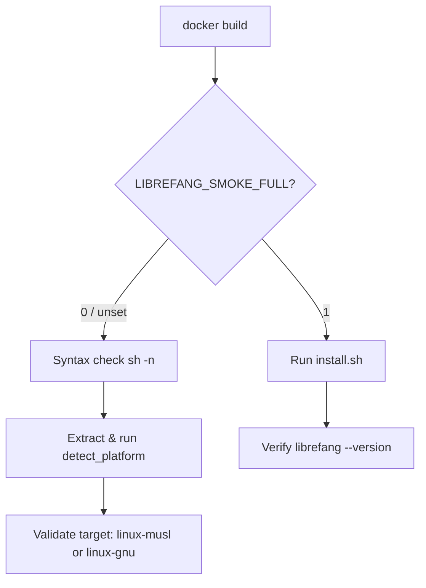

# scripts — docker

# scripts/docker — Install Smoke Test

## Purpose

This module contains a single Dockerfile (`install-smoke.Dockerfile`) that validates `web/public/install.sh` — the user-facing installer script — in a clean, reproducible environment. It serves as the CI gate for changes to the installer, ensuring the script is syntactically valid, produces a correct platform target, and (optionally) installs a working binary end-to-end.

## File Inventory

| File | Role |
|------|------|
| `install-smoke.Dockerfile` | Build definition for the smoke-test container |

## Usage

### Quick Check (default, CI gate)

Runs syntax validation and platform detection against the installer source. No network access required, no release artifact needed.

```bash
docker build -f scripts/docker/install-smoke.Dockerfile .
```

### Full End-to-End Install

Performs a real install by downloading a published release. Requires that a release exists for the current repository state.

```bash
docker build -f scripts/docker/install-smoke.Dockerfile \
  --build-arg LIBREFANG_SMOKE_FULL=1 .
```

## Test Modes

The build argument `LIBREFANG_SMOKE_FULL` selects between two execution paths:



### Default Mode (`LIBREFANG_SMOKE_FULL=0`)

Three lightweight checks that run without network or release artifacts:

1. **Syntax validation** — `sh -n` parses the script without executing it, catching shell syntax errors.
2. **Platform detection** — The `detect_platform` function is extracted from the script via `sed`, evaluated, and invoked. Success confirms the function is self-contained and runnable.
3. **Target conformance** — The detected `$PLATFORM` value is checked against the regex `linux-(musl|gnu)`, confirming it matches the release naming convention (musl preferred, gnu fallback).

Each check emits a `PASS:` line on success, making failures easy to locate in CI logs.

### Full Mode (`LIBREFANG_SMOKE_FULL=1`)

Runs the installer for real, then verifies the installed binary:

1. Executes `sh /tmp/install.sh`, which downloads and installs a release into `$HOME/.librefang/`.
2. If the binary exists at `~/.librefang/bin/librefang`, runs `--version` to confirm it executes correctly.

If no full install occurred, the verification step prints `SKIP:` rather than failing — this keeps the build from erroring on environments where the install silently no-ops.

## Environment

- **Base image:** `debian:bookworm-slim` — chosen to represent a minimal, common user environment.
- **User:** Runs as a non-root `testuser` to simulate a real user install and catch permission assumptions in the installer.
- **Dependencies:** Only `curl` and `ca-certificates` are pre-installed, matching what the installer expects to find on a target system.

## Relationship to the Codebase

This Dockerfile is a **consumer** of `web/public/install.sh`. It does not import or call any other module in the repository. The installer script is the sole artifact under test.

- **Input:** `web/public/install.sh` (copied into the image at build time via `COPY`).
- **Output:** Build success/failure in CI. No artifacts are produced.
- **Downstream expectation:** The `$PLATFORM` value produced by `detect_platform` must align with release artifact naming (`librefang-linux-musl-*`, `librefang-linux-gnu-*`) defined by the release pipeline.

## CI Integration Notes

- The default (non-full) mode is safe to run on every commit and PR — it requires no release and no network egress from the build step beyond `apt-get`.
- The full mode should be gated on release events or manually triggered, since it depends on a published release being available for download.
- Because the container runs as a non-root user, any installer path that assumes write access to system directories will fail here — this is intentional.