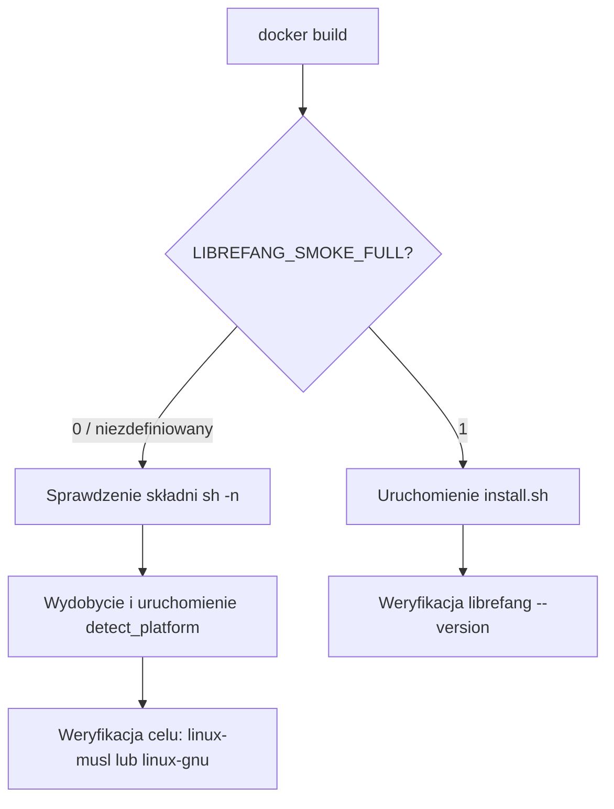

# skrypty — docker

# scripts/docker — Test dymny instalatora

## Cel

Ten moduł zawiera pojedynczy plik Dockerfile (`install-smoke.Dockerfile`), który weryfikuje `web/public/install.sh` — skrypt instalacyjny przeznaczony dla użytkownika — w czystym, powtarzalnym środowisku. Pełni rolę bramki CI dla zmian w instalatorze, zapewniając poprawność składniową skryptu, prawidłowe wygenerowanie docelowej platformy oraz (opcjonalnie) zakończenie pełnej instalacji działającego pliku binarnego.

## Spis plików

| Plik | Rola |
|------|------|
| `install-smoke.Dockerfile` | Definicja budowy kontenera testu dymnego |

## Użycie

### Szybka weryfikacja (domyślna, bramka CI)

Uruchamia weryfikację składni i wykrywanie platformy względem źródła instalatora. Nie wymaga dostępu do sieci ani artefaktu wydania.

```bash
docker build -f scripts/docker/install-smoke.Dockerfile .
```

### Pełna instalacja end-to-end

Przeprowadza rzeczywistą instalację, pobierając opublikowane wydanie. Wymaga, aby wydanie istniało dla bieżącego stanu repozytorium.

```bash
docker build -f scripts/docker/install-smoke.Dockerfile \
  --build-arg LIBREFANG_SMOKE_FULL=1 .
```

## Tryby testów

Argument budowy `LIBREFANG_SMOKE_FULL` wybiera między dwiema ścieżkami wykonania:



### Tryb domyślny (`LIBREFANG_SMOKE_FULL=0`)

Trzy lekkie weryfikacje uruchamiane bez dostępu do sieci lub artefaktów wydania:

1. **Weryfikacja składni** — `sh -n` analizuje skrypt bez jego wykonywania, wyłapując błędy składni powłoki.
2. **Wykrywanie platformy** — Funkcja `detect_platform` jest wydobywana ze skryptu za pomocą `sed`, ewaluowana i wywoływana. Powodzenie potwierdza, że funkcja jest samowystarczalna i uruchamialna.
3. **Zgodność celu** — Wykryta wartość `$PLATFORM` jest sprawdzana względem wyrażenia regularnego `linux-(musl|gnu)`, co potwierdza zgodność z konwencją nazewnictwa wydań (preferowany musl, alternatywa gnu).

Każda weryfikacja emituje linię `PASS:` w przypadku powodzenia, co ułatwia lokalizację błędów w logach CI.

### Tryb pełny (`LIBREFANG_SMOKE_FULL=1`)

Uruchamia instalator rzeczywiście, a następnie weryfikuje zainstalowany plik binarny:

1. Wykonuje `sh /tmp/install.sh`, który pobiera i instaluje wydanie do `$HOME/.librefang/`.
2. Jeśli plik binarny istnieje w `~/.librefang/bin/librefang`, uruchamia `--version`, aby potwierdzić poprawne wykonanie.

Jeśli pełna instalacja się nie odbyła, krok weryfikacji wyświetla `SKIP:` zamiast kończyć się błędem — zapobiega to błędowi budowy w środowiskach, w których instalacja po cichu nic nie robi.

## Środowisko

- **Obraz bazowy:** `debian:bookworm-slim` — wybrany jako reprezentatywny, minimalne i powszechnie spotykane środowisko użytkownika.
- **Użytkownik:** Uruchamiany jako nieuprzywilejowany `testuser`, aby symulować rzeczywistą instalację użytkownika i wyłapać założenia dotyczące uprawnień w instalatorze.
- **Zależności:** Tylko `curl` i `ca-certificates` są wstępnie zainstalowane, co odpowiada temu, czego instalator oczekuje na docelowym systemie.

## Relacja z bazą kodu

Ten plik Dockerfile jest **konsumentem** `web/public/install.sh`. Nie importuje ani nie wywołuje żadnego innego modułu w repozytorium. Skrypt instalacyjny jest jedynym artefaktem podlegającym testom.

- **Wejście:** `web/public/install.sh` (skopiowany do obrazu w czasie budowy za pomocą `COPY`).
- **Wyjście:** Powodzenie/niepowodzenie budowy w CI. Nie są generowane żadne artefakty.
- **Oczekiwanie nadrzędne:** Wartość `$PLATFORM` wygenerowana przez `detect_platform` musi być zgodna z nazewnictwem artefaktów wydania (`librefang-linux-musl-*`, `librefang-linux-gnu-*`) określonym przez potok wydawniczy.

## Uwagi dotyczące integracji z CI

- Tryb domyślny (niepełny) jest bezpieczny do uruchamiania przy każdym commicie i PR — nie wymaga wydania ani wyjścia sieciowego z kroku budowy poza `apt-get`.
- Tryb pełny powinien być powiązany ze zdarzeniami wydania lub uruchamiany ręcznie, ponieważ zależy od dostępności opublikowanego wydania do pobrania.
- Ponieważ kontener uruchamia się jako nieuprzywilejowany użytkownik, każda ścieżka w instalatorze zakładająca dostęp do zapisu w katalogach systemowych zakończy się tutaj niepowodzeniem — jest to zamierzone.
