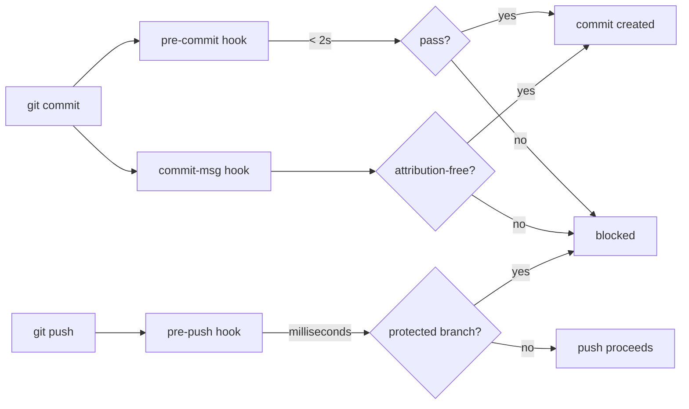

# scripts — hooks

# scripts/hooks — Git Hooks

Local Git hooks that gate commits and pushes before they leave the developer's machine. Installed once per clone via `just setup` (or `cargo xtask setup`), which runs:

```
git config core.hooksPath scripts/hooks
```

After that, every `git commit` and `git push` in the working copy is intercepted automatically.

---

## Design Philosophy

Two principles shape every hook here:

1. **Pre-commit stays fast.** The `pre-commit` hook targets an average runtime under 2 seconds. It runs only checks that are (a) quick and (b) scoped to the staged diff. Anything heavier—clippy, codegen drift, full test suites—belongs to `pre-push` or CI.

2. **Pre-push is not CI.** The previous `pre-push` hook ran `cargo clippy --workspace --all-targets` on every push, making typical pushes wait 5–25 minutes. The current version exits in milliseconds and refuses only obviously dangerous operations (direct pushes to protected branches). CI (`.github/workflows/ci.yml`) is the authoritative gate.



---

## Hook Reference

### `pre-commit` — Staged-only checks

Runs five staged-scoped checks in sequence. Each is designed to fail fast with an actionable message.

| # | Check | Scope | Soft-skip when |
|---|-------|-------|----------------|
| 1 | `rustfmt --check` on staged `*.rs` | Added/copied/modified/renamed files | `rustfmt` not on PATH |
| 2 | CHANGELOG duplicate `## [Unreleased]` guard | `CHANGELOG.md` when staged | — |
| 2b | `(@username)` attribution on changelog entries and `changelog.d/` fragments | `CHANGELOG.md` or `changelog.d/` when staged | `python3` not available |
| 3 | gitleaks secret scan of staged diff | All staged files | `gitleaks` not installed (see below) |
| 4 | `openapi.sha256` baseline auto-sync | When `openapi.json` is staged | Neither `sha256sum` nor `shasum` available |
| 5 | Sidecar-first channel adapter policy | Staged files under `crates/librefang-channels/src/` | — |

**Key implementation details:**

- **Format check** invokes `rustfmt` directly (not `cargo fmt`) because `cargo fmt --check -- <paths>` silently ignores path arguments and rescans the whole workspace. Edition is hardcoded to `2021` to match `workspace.package.edition`. Paths are passed NUL-delimited through `xargs -0` so filenames with spaces or shell metacharacters survive intact.

- **CHANGELOG guard** prevents duplicate `## [Unreleased]` sections. Release tooling (the `release.yml` awk extractor and `xtask/src/changelog.rs`) silently picks the first match and drops the rest.

- **Attribution check** delegates to `scripts/check-changelog-attribution.py --staged`. It enforces `(@your-github-login)` suffixes on both `CHANGELOG.md` [Unreleased] bullets and `changelog.d/` fragments. To audit all pending entries: `python3 scripts/check-changelog-attribution.py --all-unreleased`.

- **gitleaks** scans against rules in `.gitleaks.toml` (path/regex allowlists live there). A missing `gitleaks` binary produces a warning, not a hard error—CI's `secrets` job is the real gate. Set `LIBREFANG_SKIP_SECRETS_SCAN=1` to silence the warning on a deliberately tool-less host.

- **openapi baseline sync** recomputes `openapi.json`'s sha256 and auto-stages the updated line in `xtask/baselines/openapi.sha256`. This prevents the CI openapi-drift gate from rejecting version bumps and direct `openapi.json` edits. The hook uses a portable `sha256` shim that prefers `sha256sum` (Linux coreutils) and falls back to `shasum -a 256` (macOS).

- **Sidecar-first policy** blocks new in-process `ChannelAdapter` implementations that aren't in the allowlist at `crates/librefang-channels/src/channels-allowlist.txt`. It checks both added and modified files to prevent a stub-plus-impl split from slipping through. Grandfathering requires maintainer approval via a separate reviewed commit adding the basename. A soft note is emitted if `channel_bridge.rs` adds an `*Adapter::new` call. The authoritative tree-wide check runs in CI via `cargo xtask channel-policy`.

### `commit-msg` — Attribution guard

Rejects Claude/Anthropic attribution in two places the `.claude/hooks/guard-bash-safety.sh` hook cannot reach:

**1. Commit message body** — matches these patterns (case-insensitive):

- `Co-Authored-By:` lines mentioning Claude, Anthropic, or `noreply@anthropic.com`
- `Generated with ... Claude` (within 40 characters)
- `🤖 Claude Code` style attribution

**2. Author identity** — checked via `git var GIT_AUTHOR_IDENT` (not `git config user.*`) so `GIT_AUTHOR_NAME`/`GIT_AUTHOR_EMAIL` environment overrides are covered. Name matching:

- Separators are stripped before comparison, so `Claude Code`, `Claude-Code`, `claude_code`, and `ClaudeCode` collapse to one case.
- Matched as whole names only (not substrings) to avoid blocking contributors named Claudia, Claudio, or Claude Dubois.
- Model-name identities (`claude*opus*`, `claude*sonnet*`, `claude*haiku*`) are caught regardless of version/family ordering.

Email matching is pinned to the bot mailboxes (`noreply@anthropic.com`, `claude@anthropic.com`) only—an Anthropic employee using their own `@anthropic.com` address is not blocked.

Recovery commands are printed in the error message, including `git commit --amend --no-edit --reset-author` for already-committed cases.

### `pre-push` — Protected branch guard

The only check: refuse direct pushes to `main` or `master`. GitHub branch protection enforces this server-side too, but the local rejection saves the round-trip and the confusing post-clippy "branch is protected" error.

Branch deletions (all-zeros SHA sentinel) are allowed through; GitHub will refuse if the branch is protected.

**Skip mechanism:** `LIBREFANG_PREPUSH_SKIP=1 git push` or `git push --no-verify`. Use only for agreed-upon release/hotfix scenarios.

### `cargo-fmt-staged.sh` — Pre-commit framework helper

Not a Git hook itself—invoked by `.pre-commit-config.yaml`'s `cargo-fmt-staged` hook entry. Collects staged `.rs` files that still exist on disk (deletions are skipped), then `exec`s `cargo fmt --check -- <files>`. Exits immediately with code 0 if no Rust files are staged.

---

## Environment Variables

| Variable | Hook | Effect |
|----------|------|--------|
| `LIBREFANG_SKIP_SECRETS_SCAN=1` | `pre-commit` | Silences the "gitleaks not installed" warning |
| `LIBREFANG_PREPUSH_SKIP=1` | `pre-push` | Skips the entire hook (equivalent to `--no-verify`) |

---

## Relationship to CI

The hooks are fast-feedback guards, not enforcement boundaries. `--no-verify`, an unset `core.hooksPath`, or a missing tool can bypass any of them. The authoritative gates run in CI:

- **`quality` job:** `cargo fmt` + `cargo clippy` (selective on PRs, full on pushes to main)
- **`openapi-drift` job:** regenerates `openapi.json` + SDKs, fails on uncommitted diff
- **`security` job:** `cargo audit` + `npm audit` + license check
- **`test-*` jobs:** nextest matrix across Linux/macOS/Windows

The `channel-policy` check has an additional authoritative gate: `cargo xtask channel-policy` runs tree-wide in CI on every PR.

---

## Portability Notes

- `pre-commit`, `pre-push`, and `commit-msg` use `#!/bin/sh` (POSIX), not bash.
- The `sha256` shim in `pre-commit` handles the `sha256sum` (Linux) vs `shasum -a 256` (macOS) split.
- `pre-commit` uses NUL-delimited pipelines (`git diff -z`, `xargs -0`, `grep -zq`) throughout to handle paths with spaces or shell metacharacters.
- Soft-skip behavior is consistent: a missing optional tool (`rustfmt`, `gitleaks`, `python3`) produces a warning and continues, never a hard failure.