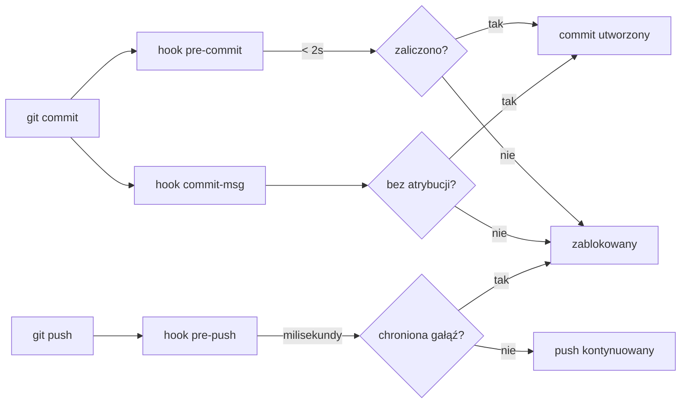

# scripts — hooks

# scripts/hooks — Git Hooks

Lokalne hooki Git, które bramkują commity i pushy zanim opuszczą maszynę dewelopera. Instalowane raz na klon przez `just setup` (lub `cargo xtask setup`), które uruchamia:

```
git config core.hooksPath scripts/hooks
```

Po tym każdy `git commit` i `git push` w roboczej kopii jest przechwytywany automatycznie.

---

## Filozofia projektowania

Dwie zasady kształtują każdy hook tutaj:

1. **Pre-commit pozostaje szybki.** Hook `pre-commit` celuje w średni czas działania poniżej 2 sekund. Uruchamia tylko sprawdzenia, które są (a) szybkie i (b) zasięgowane do przygotowanego diffa. Wszystko cięższe — clippy, dryf kodu generowanego, pełne suite testowe — należy do `pre-push` lub CI.

2. **Pre-push to nie CI.** Poprzedni hook `pre-push` uruchamiał `cargo clippy --workspace --all-targets` przy każdym pushu, zmuszając typowe pushy do czekania 5–25 minut. Obecna wersja kończy działanie w milisekundach i odrzuca jedynie ewidentnie niebezpieczne operacje (bezpośrednie pushy na chronione gałęzie). CI (`.github/workflows/ci.yml`) jest autorytatywną bramką.



---

## Odniesienie do hooków

### `pre-commit` — Sprawdzenia tylko przygotowanych plików

Uruchamia pięć sprawdzeń zasięgowanych na przygotowanych plikach po kolei. Każde jest zaprojektowane tak, aby szybko kończyć się niepowodzeniem z informacją nadającą się do działania.

| # | Sprawdzenie | Zakres | Pominięcie miękkie gdy |
|---|-------------|--------|------------------------|
| 1 | `rustfmt --check` na przygotowanych `*.rs` | Dodane/skopiowane/zmodyfikowane/przemianowane pliki | `rustfmt` nie jest w PATH |
| 2 | Strażnik duplikatu `## [Unreleased]` w CHANGELOG | `CHANGELOG.md` gdy jest przygotowany | — |
| 2b | Atrybucja `(@username)` w wpisach changeloga i fragmentach `changelog.d/` | `CHANGELOG.md` lub `changelog.d/` gdy są przygotowane | `python3` niedostępny |
| 3 | Skan sekretów gitleaks przygotowanego diffa | Wszystkie przygotowane pliki | `gitleaks` nie zainstalowany (patrz poniżej) |
| 4 | Auto-synchronizacja linii bazowej `openapi.sha256` | Gdy `openapi.json` jest przygotowany | Ani `sha256sum`, ani `shasum` niedostępne |
| 5 | Polityka adaptera kanału z priorytetem sidecar | Przygotowane pliki w `crates/librefang-channels/src/` | — |

**Kluczowe szczegóły implementacji:**

- **Sprawdzenie formatowania** wywołuje `rustfmt` bezpośrednio (nie `cargo fmt`), ponieważ `cargo fmt --check -- <ścieżki>` cicho ignoruje argumenty ścieżek i ponownie skanuje cały obszar roboczy. Edycja jest zakodowana na sztywno jako `2021`, aby pasować do `workspace.package.edition`. Ścieżki są przekazywane z rozgraniczeniem NUL przez `xargs -0`, aby nazwy plików ze spacjami lub metaznakami powłoki przetrwały nienaruszone.

- **Strażnik CHANGELOG** zapobiega duplikatom sekcji `## [Unreleased]`. Narzędzia wydawnicze (ekstraktor awk `release.yml` oraz `xtask/src/changelog.rs`) cicho wybierają pierwsze dopasowanie i odrzucają resztę.

- **Sprawdzenie atrybucji** deleguje do `scripts/check-changelog-attribution.py --staged`. Wymusza sufiksy `(@twój-login-github)` zarówno w punktach [Unreleased] w `CHANGELOG.md`, jak i w fragmentach `changelog.d/`. Aby zweryfikować wszystkie oczekujące wpisy: `python3 scripts/check-changelog-attribution.py --all-unreleased`.

- **gitleaks** skanuje wg reguł w `.gitleaks.toml` (listy dozwolonych dla ścieżek/regexów znajdują się tam). Brakujący plik binarny `gitleaks` generuje ostrzeżenie, a nie twardy błąd — zadanie `secrets` w CI jest prawdziwą bramką. Ustaw `LIBREFANG_SKIP_SECRETS_SCAN=1`, aby wyciszyć ostrzeżenie na celowo pozbawionym narzędzi hoście.

- **Synchronizacja linii bazowej openapi** przelicza sha256 `openapi.json` i automatycznie przygotowuje zaktualizowaną linię w `xtask/baselines/openapi.sha256`. Zapobiega to odrzuceniu podbijania wersji i bezpośrednich edycji `openapi.json` przez bramkę dryfu openapi w CI. Hook używa przenośnego shimu `sha256`, który preferuje `sha256sum` (Linux coreutils) i wraca do `shasum -a 256` (macOS).

- **Polityka priorytetu sidecar** blokuje nowe implementacje `ChannelAdapter` w procesie, które nie znajdują się na liście dozwolonych w `crates/librefang-channels/src/channels-allowlist.txt`. Sprawdza zarówno dodane, jak i zmodyfikowane pliki, aby zapobiec prześlizgnięciu się podziału stub-plus-impl. Wyłączenie wymaga zatwierdzenia przez opiekuna poprzez osobny zrecenzowany commit dodający basename. Uwaga miękka jest emitowana, jeśli `channel_bridge.rs` dodaje wywołanie `*Adapter::new`. Autorytatywne sprawdzenie całego drzewa uruchamia się w CI przez `cargo xtask channel-policy`.

### `commit-msg` — Strażnik atrybucji

Odrzuca atrybucję Claude/Anthropic w dwóch miejscach, których hook `.claude/hooks/guard-bash-safety.sh` nie może osiągnąć:

**1. Treść komunikatu commita** — dopasowuje te wzorce (bez uwzględniania wielkości liter):

- Linie `Co-Authored-By:` wspominające Claude, Anthropic lub `noreply@anthropic.com`
- `Generated with ... Claude` (w obrębie 40 znaków)
- Atrybucja w stylu `🤖 Claude Code`

**2. Tożsamość autora** — sprawdzana przez `git var GIT_AUTHOR_IDENT` (nie `git config user.*`), więc nadpisania środowiskowe `GIT_AUTHOR_NAME`/`GIT_AUTHOR_EMAIL` są objęte. Dopasowywanie nazwy:

- Separatory są usuwane przed porównaniem, więc `Claude Code`, `Claude-Code`, `claude_code` i `ClaudeCode` są redukowane do jednego przypadku.
- Dopasowywane jako całe nazwy (nie podciągi), aby uniknąć blokowania współtwórców o imionach Claudia, Claudio lub Claude Dubois.
- Tożsamości nazw modeli (`claude*opus*`, `claude*sonnet*`, `claude*haiku*`) są wyłapywane niezależnie od kolejności wersji/rodziny.

Dopasowywanie adresu email jest przypięte wyłącznie do skrzynek botów (`noreply@anthropic.com`, `claude@anthropic.com`) — pracownik Anthropic używający własnego adresu `@anthropic.com` nie jest blokowany.

Polecenia odzyskiwania są drukowane w komunikacie błędu, w tym `git commit --amend --no-edit --reset-author` dla przypadków już zcommitowanych.

### `pre-push` — Strażnik chronionej gałęzi

Jedyna kontrola: odmowa bezpośrednich pushów na `main` lub `master`. Ochrona gałęzi GitHub egzekwuje to również po stronie serwera, ale lokalne odrzucenie oszczędza round-trip i mylący błąd „gałąź jest chroniona” po clippy.

Usunięcia gałęzi (wartość sentinela SHA ze wszystkimi zerami) są przepuszczane; GitHub odrzuci, jeśli gałąź jest chroniona.

**Mechanizm pomijania:** `LIBREFANG_PREPUSH_SKIP=1 git push` lub `git push --no-verify`. Używaj tylko dla uzgodnionych scenariuszy wydania/hotfixa.

### `cargo-fmt-staged.sh` — Pomocnik frameworka pre-commit

Nie jest samym hookiem Git — wywoływany przez wpis hooka `cargo-fmt-staged` w `.pre-commit-config.yaml`. Zbiera przygotowane pliki `.rs`, które nadal istnieją na dysku (usunięcia są pomijane), następnie wykonuje `exec` `cargo fmt --check -- <pliki>`. Natychmiast kończy z kodem 0, jeśli nie ma przygotowanych plików Rust.

---

## Zmienne środowiskowe

| Zmienna | Hook | Efekt |
|---------|------|-------|
| `LIBREFANG_SKIP_SECRETS_SCAN=1` | `pre-commit` | Wycisza ostrzeżenie „gitleaks nie zainstalowany” |
| `LIBREFANG_PREPUSH_SKIP=1` | `pre-push` | Pomija cały hook (równoważne z `--no-verify`) |

---

## Relacja z CI

Hooki to strażnicy szybkiego sprzężenia zwrotnego, nie granice egzekwowania. `--no-verify`, nieustawiony `core.hooksPath` lub brakujące narzędzie może obejść każdy z nich. Autorytatywne bramki uruchamiają się w CI:

- **Zadanie `quality`:** `cargo fmt` + `cargo clippy` (selektywnie na PR-ach, pełne na pushach na main)
- **Zadanie `openapi-drift`:** regeneruje `openapi.json` + SDK-je, kończy się niepowodzeniem na niecommitowanym diffie
- **Zadanie `security`:** `cargo audit` + `npm audit` + sprawdzenie licencji
- **Zadania `test-*`:** macierz nextest na Linux/macOS/Windows

Sprawdzenie `channel-policy` ma dodatkową autorytatywną bramkę: `cargo xtask channel-policy` uruchamia się na całym drzewie w CI przy każdym PR.

---

## Uwagi o przenośności

- `pre-commit`, `pre-push` i `commit-msg` używają `#!/bin/sh` (POSIX), nie bash.
- Shim `sha256` w `pre-commit` obsługuje podział `sha256sum` (Linux) vs `shasum -a 256` (macOS).
- `pre-commit` używa potoków z rozgraniczeniem NUL (`git diff -z`, `xargs -0`, `grep -zq`) wszędzie, aby obsługiwać ścieżki ze spacjami lub metaznakami powłoki.
- Zachowanie miękkiego pomijania jest spójne: brakujące opcjonalne narzędzie (`rustfmt`, `gitleaks`, `python3`) generuje ostrzeżenie i kontynuuje, nigdy twardy błąd.
