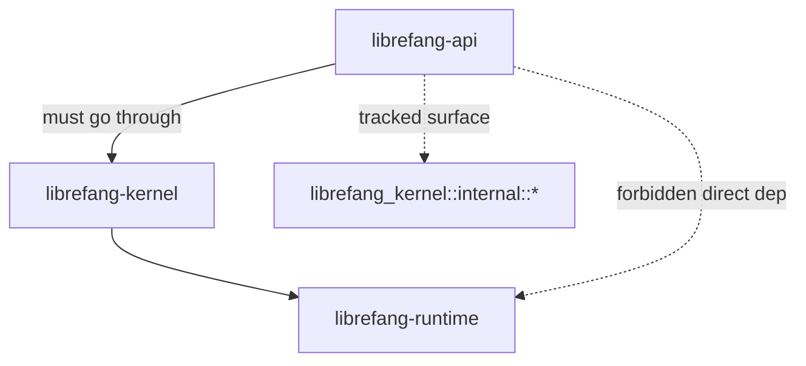

# scripts — scripts

# scripts/

Repository automation: CI lint gates, architectural invariant enforcement, release tooling, and SDK code generation. Every script here is designed to run locally by contributors and in CI without modification.

## What lives here

| Script | Language | Purpose | Issue tracking |
|--------|----------|---------|----------------|
| `changelog-to-article.sh` | Bash | Scaffolds `articles/release-<date>.md` from a CHANGELOG section | #3397 |
| `check-changelog-attribution.py` | Python | Enforces `(@user)` attribution on new CHANGELOG bullets and `changelog.d/` fragments | #3400 |
| `check-agents-claude-pair.sh` | POSIX sh | Verifies every non-root `AGENTS.md` has a sibling `CLAUDE.md` symlink | #3297 |
| `check-api-kernel-imports.sh` | Bash | Reports `librefang_kernel::<internal>` import surface; hard-gates direct `LibreFangKernel` type references | #3744 |
| `check-api-runtime-decoupling.sh` | Bash | Prevents re-introduction of direct `librefang-runtime` dependency in `librefang-api` | #3596 |
| `check-error-shape.sh` | Bash | Rejects non-canonical HTTP error envelopes in route handlers | #3505 |
| `check-no-empty-string-sentinels.sh` | Bash | Flags empty-string sentinel patterns in API responses | #3302 |
| `check-pubkey-lockstep.sh` | Bash | Ensures registry pubkey is byte-identical across daemon + workers | — |
| `check-k8s-manifests.py` | Python | Validates rendered Kubernetes manifests for safety properties | #6632, #6633 |
| `check-skills-supply-chain.py` | Python | Static audit for malicious patterns in skill/hand/extension bundles | #3305, #3333 |
| `codegen-sdks.py` | Python | Generates Python, JS, Go, Rust SDK clients from `openapi.json` | — |

## Architectural enforcement scripts

These scripts guard invariants that the compiler cannot enforce on its own — layering rules, error shape conventions, and cross-file consistency.

### API → Kernel → Runtime layering

Two scripts work together to enforce the crate dependency direction:



**`check-api-runtime-decoupling.sh`** is a hard gate. It fails CI if:
1. `crates/librefang-api/Cargo.toml` declares a `librefang-runtime` dependency line, or
2. Any `.rs` file under `crates/librefang-api/{src,tests}/` contains a `use librefang_runtime` or `librefang_runtime::` reference outside doc comments.

Runtime types must be reached through `librefang-kernel` re-exports.

**`check-api-kernel-imports.sh`** has two sections:

- **Section 1 (informational):** Counts `librefang_kernel::` references in `librefang-api/src/`. Comments are stripped; facade re-export modules are counted by design so the boundary is auditable. Output goes to `/tmp/api-kernel-imports.txt` for PR-diff visibility.
- **Section 2 (hard gate):** Scans for direct `LibreFangKernel` concrete-type references in non-test source. An allowlist permits four files where widening is still in progress:

  ```bash
  ALLOWLIST=(
      "server.rs"
      "channel_bridge.rs"
      "routes/mod.rs"
      "routes/providers.rs"
  )
  ```

  Any file outside the allowlist introducing a new `LibreFangKernel` reference fails CI. Comment stripping uses `sed 's|//.*$||'` rather than `grep -v` to catch both leading and trailing comment forms without masking production code.

### Error envelope shape (`check-error-shape.sh`)

Guards the canonical `ApiErrorResponse` shape (`{"error": "<string>"}`) against regression. Rejects two ad-hoc patterns under `crates/librefang-api/src/routes/`:

1. `json!({"detail": …})` — matched via `json!\(\{\s*"detail"\s*:` so `AuditEntry` data fields with `"detail"` keys are excluded.
2. `{"status": "error", …}` — matched as a key-value pair.

Files still carrying legacy shapes are listed in the `LEGACY_FILES` array, each with a cleanup tracking reference. New files must be clean from day one. The permanent exception is `openai_compat.rs` (OpenAI SDK contract), which lives outside `routes/` and is naturally out of scope.

### Empty-string sentinels (`check-no-empty-string-sentinels.sh`)

Informational by default (exit 0); pass `--strict` to fail on any hit. Scans four pattern categories:

| Pattern | Signal strength |
|---------|----------------|
| Textual literals (`"<unknown>"`, `"none"`, etc.) | Unambiguous offender |
| `"".to_string()` defaults | Strong signal |
| `.is_empty()` calls | High false-positive — reviewer judges |
| `.unwrap_or_default()` on `Option<String>` | Soft signal |

Suppress false positives with an inline marker: `// allow-empty-sentinel: <reason>`.

### Pubkey lockstep (`check-pubkey-lockstep.sh`)

Extracts the Ed25519 registry public key from four locations and fails if any differ:

1. `crates/librefang-runtime/src/plugin_manager.rs` — first `pubkey_b64:` field (active slot in the embedded slice)
2. `web/workers/registry-worker/wrangler.toml` — `REGISTRY_PUBLIC_KEY`
3. `web/workers/marketplace-worker/wrangler.toml` — `REGISTRY_PUBLIC_KEY`
4. `web/public/_worker.js` — `REGISTRY_PUBLIC_KEY`

Extraction uses a Perl one-liner anchored at line start with a word boundary on the constant name, capturing exactly 44 base64 characters. The daemon side uses the unique field name `pubkey_b64` to avoid matching stray literals.

### AGENTS.md / CLAUDE.md pairing (`check-agents-claude-pair.sh`)

Validates that every `AGENTS.md` outside the repo root has a sibling `CLAUDE.md` that is a symlink to `AGENTS.md`. The repo root is exempt — there, `AGENTS.md` and `CLAUDE.md` are separate files by design (the latter carries Claude-Code-specific rules).

Excludes `./target/*`, `./node_modules/*`, and `./.git/*` from the scan.

## CHANGELOG validation (`check-changelog-attribution.py`)

Enforces the `(@username)` attribution convention on CHANGELOG entries. Operates in four mutually exclusive modes:

| Mode | Flag | Scope | Used by |
|------|------|-------|---------|
| Diff (default) | — | Lines the current PR adds to `[Unreleased]` | CI |
| All unreleased | `--all-unreleased` | Every bullet in `[Unreleased]` | Pre-release audit |
| Full file | `--full` | Every bullet in CHANGELOG.md | Inventory |
| Staged | `--staged` | Lines staged in the index | Pre-commit hook |

### Attribution checking logic

The attribution regex is `\(@[A-Za-z0-9_][A-Za-z0-9_-]*\)` — at least one character, no leading dash. The `bullet_block_has_attribution` predicate checks the entire bullet block (marker line + indented continuation lines), not just the `- ` line, because the project's prose rule wraps long bullets one sentence per line:

```markdown
- First sentence.
  Second sentence.
  Third sentence. (@houko)
```

The block ends at the first blank line, new bullet, or heading. A `# pragma: no-attribution` suffix on a line exempts it.

### Fragment handling

`changelog.d/` fragments (one file = one bullet body, assembled at release time by `cargo xtask collect-fragments`) are held to the same standard in every mode. The `FRAGMENT_SECTIONS` frozenset is a cross-language contract:

```python
FRAGMENT_SECTIONS = frozenset({"added", "changed", "documentation", "fixed", "security"})
```

This must stay in sync with `FRAGMENT_SECTIONS` in `xtask/src/changelog.rs`. The xtask test `fragment_sections_match_the_python_validator` fails if they drift.

A fragment must live at `changelog.d/<section>/<name>.md`. An unrecognized section directory is flagged because assembly would silently drop the entry.

### Diff range resolution

The `resolve_diff_range` function uses this precedence:
1. CLI flags `--base` / `--head`
2. Environment variables `BASE_SHA` / `HEAD_SHA` (set by CI)
3. `git merge-base origin/main HEAD` and `HEAD`

Added lines are extracted from unified diff hunks, mapping `+`-prefixed lines to their post-image line numbers via `@@` hunk headers. Post-image line numbers are validated against the `[Unreleased]` section range found in the HEAD blob.

## Release article generation (`changelog-to-article.sh`)

Scaffolds `articles/release-<YYYY.M.D>.md` from a CHANGELOG section. The generated file is consumed by two GitHub workflows on push to main:

- `.github/workflows/devto-publish.yml` — publishes/updates the dev.to post
- `.github/workflows/release-notify.yml` — posts a GitHub Discussion using the article body

### Usage

```bash
bash scripts/changelog-to-article.sh <YYYY.M.D> [<git-tag>]
```

The date must match a `## [YYYY.M.D]` heading in CHANGELOG.md. The git tag defaults to `v<YYYY.M.D>` but CalVer tags often carry suffixes (`v2026.4.27-beta6`); pass the actual tag for an accurate `canonical_url`.

### Extraction

Uses `awk` with a literal string match (not regex) to find the heading — the dots in the date would be interpreted as wildcards otherwise. The section slice runs from the heading to the next `## [` line. Leading/trailing blank lines are trimmed.

### Output shape

The heredoc produces a dev.to-friendly format matching the most recent hand-written articles: outer `` ```markdown `` fence (stripped by `release-notify.yml`), YAML front matter between `---`, and the body below. Includes `canonical_url`, `cover_image`, and a standardized Links section.

## Kubernetes manifest validation (`check-k8s-manifests.py`)

Asserts safety properties on rendered manifests (output of `kubectl kustomize` or `kustomize build`). Properties checked:

**StatefulSet:**
- `replicas == 1` — cron, triggers, session ownership, budget enforcement, and the audit hash chain are all process-local
- Selector labels match pod template labels
- `terminationGracePeriodSeconds >= 30` for SQLite WAL checkpoint
- Exactly one `volumeClaimTemplate` with `ReadWriteOnce` access mode, mounted at `/data`
- Container has named port `http` on 4545

**Pod Security (restricted standard):**
- `runAsNonRoot: true`, `runAsUser/runAsGroup/fsGroup: 1001`
- `seccompProfile.type: RuntimeDefault`
- `fsGroupChangePolicy: OnRootMismatch`
- `allowPrivilegeEscalation: false`, `capabilities.drop: [ALL]`

**Environment:**
- `LIBREFANG_LISTEN` must be `0.0.0.0:4545` (container loopback is unreachable from kubelet)
- `LIBREFANG_HOME` must be `/data` (must match volume mount)
- Required secrets (`LIBREFANG_API_KEY`, `LIBREFANG_VAULT_KEY`, `LIBREFANG_DASHBOARD_USER`, `LIBREFANG_DASHBOARD_PASS`) must come from `secretKeyRef`, not literal values, and must not be optional
- Non-required secret refs must be `optional: true`

**Probes:**
- `startupProbe` → `/api/ready`, budget ≥ 60s
- `livenessProbe` → `/api/health` (must NOT target `/api/ready` — readiness returns 503 for recoverable outages, which would restart-loop the pod)
- `readinessProbe` → `/api/ready`
- All probes must target named port `http`

**Services:**
- Governing Service (matching `StatefulSet.spec.serviceName`) must be headless (`clusterIP: None`)
- At least one non-headless ClusterIP Service for clients
- No LoadBalancer/NodePort (cluster-external reach should be deliberate Ingress)

**Secrets:**
- No rendered `Secret` resources (credentials must be created out of band)

## Supply chain audit (`check-skills-supply-chain.py`)

Pure-stdlib Python (no third-party imports) static analysis of skill/hand/extension bundles. Scans:

- `crates/librefang-skills`, `crates/librefang-hands`, `crates/librefang-extensions`, `examples`

Excludes `tests/fixtures/supply-chain`, `target`, `.git`, `node_modules` by default (pass `--include-fixtures` to scan fixtures).

### Detection rules

| Rule | Target | Method |
|------|--------|--------|
| `pth-import-hijack` | `.pth` files | Any `.pth` file anywhere in bundle |
| `py-eval-exec` | Python | AST: direct `eval()` / `exec()` calls |
| `base64-decode-exec` | Python | AST: `eval/exec` of base64-decoded payload (walks call chain looking for `b64decode`, `b32decode`, etc.) |
| `py-compile-exec` | Python | AST: `compile(..., mode='exec')` |
| `py-syspath-mutation` | Python | AST: `sys.path.insert/append` |
| `py-importlib-spec` | Python | AST: `importlib.util.spec_from_file_location/module_from_spec` |
| `js-eval` | JS/MS/CS | Regex: `eval(` |
| `js-function-ctor` | JS/MS/CS | Regex: `new Function(...)` |
| `js-settimeout-string` | JS/MS/CS | Regex: `setTimeout('code', ...)` |
| `js-base64-decode-exec` | JS/MS/CS | Regex: `atob(...)...eval` |
| `jailbreak/*` | `.toml/.md/.prompt` | Regex against curated phrase list |

The jailbreak phrase list covers: ignore-previous-instructions, exfiltrate, post-to-webhook, system-prompt-leak, bypass-safety, override-system-prompt, disregard-rules.

Per-file opt-out: add `supply-chain-audit: allow` anywhere in the file.

### Self-test

Run `--self-test` to verify the script against embedded fixtures (clean and malicious cases). Returns exit code 2 on any fixture failure.

## SDK code generation (`codegen-sdks.py`)

Reads `openapi.json` and generates client SDKs in four languages. All are zero-dependency (Python uses only `urllib`; JS uses `fetch`; Go uses `net/http`; Rust uses `reqwest`/`serde_json`/`tokio`/`futures`/`thiserror`).

### Operation loading

The `load_ops` function reads `openapi.json`, filters to paths starting with `/api/`, skips the `openai` tag (OpenAI compat endpoints), and groups operations by tag into a `dict[str, list[Operation]]`. Each operation carries: HTTP method, path, operationId, path params, query params, whether it has a request body, and whether it's a streaming endpoint (detected via `text/event-stream` content type or `operationId` ending in `_stream`).

### Output files

| Language | Output path | Naming convention |
|----------|-------------|-------------------|
| Python | `sdk/python/librefang/librefang_client.py` | snake_case methods, `_TagPascalResource` classes |
| JavaScript | `sdk/javascript/index.js` | camelCase methods, `TagPascalResource` classes |
| Go | `sdk/go/librefang.go` | PascalCase methods, `TagPascalResource` structs |
| Rust | `sdk/rust/src/lib.rs` | snake_case methods, `TagPascalResource` structs, `Arc`-shared |

Each SDK provides:
- Synchronous request methods (Go/Python) or async (JS/Rust)
- SSE streaming via generators (Python `yield`), async iterators (JS `yield*`), channels (Go), or `tokio::sync::mpsc::UnboundedReceiver` (Rust)
- SSE line accumulation with `MAX_SSE_LINE` / `maxSSELine` cap (8 MiB) to prevent unbounded memory on misbehaving streams
- Rust specifically accumulates raw bytes before UTF-8 decode to avoid splitting multi-byte codepoints at chunk boundaries

After writing, the script removes old hand-written Rust module files (`agents.rs`, `models.rs`, `providers.rs`, `skills.rs`, `tools.rs`) and runs `rustfmt` on the generated output. Use `--dry-run` to preview without writing.

### Reserved word handling

Python and Rust generators append `_` to identifiers matching reserved word sets (`_PY_RESERVED`, `_RUST_RESERVED`). This prevents collisions like `type` becoming a Rust field name.

## Conventions

All scripts share these patterns:

- **Repo root resolution:** Either `git rev-parse --show-toplevel` or `cd "$(dirname "$0")/.."` — scripts work from any working directory.
- **Tool fallback:** Bash scripts prefer `rg` (ripgrep) when available, falling back to `grep -R` for CI containers that don't bundle it.
- **Error format:** `::error file=path::message` syntax for GitHub Actions annotation rendering.
- **Exit codes:** 0 = pass, 1 = check failed, 2 = invocation/usage error.
- **`set -euo pipefail`** on Bash scripts (except `check-no-empty-string-sentinels.sh` which omits `-e` to scan everything before reporting).