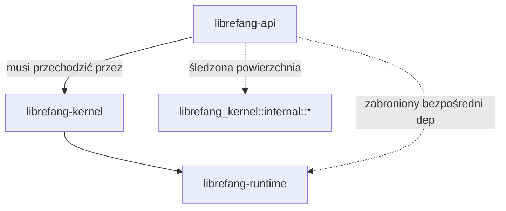

# scripts — skrypty

# scripts/

Automatyzacja repozytorium: bramki lint w CI, wymuszanie niezmienników architektonicznych, narzędzia wydawnicze i generowanie kodu SDK. Każdy skrypt jest zaprojektowany tak, aby uruchamiał się lokalnie u współtwórców oraz w CI bez modyfikacji.

## Co się tu znajduje

| Skrypt | Język | Przeznaczenie | Śledzenie zgłoszeń |
|--------|-------|---------------|---------------------|
| `changelog-to-article.sh` | Bash | Tworzy szkielet `articles/release-<data>.md` na podstawie sekcji CHANGELOG | #3397 |
| `check-changelog-attribution.py` | Python | Wymusza atrybucję `(@użytkownik)` w nowych punktach CHANGELOG i fragmentach `changelog.d/` | #3400 |
| `check-agents-claude-pair.sh` | POSIX sh | Weryfikuje, czy każdy niegłówny `AGENTS.md` ma powiązany dowiązanie symboliczne `CLAUDE.md` | #3297 |
| `check-api-kernel-imports.sh` | Bash | Raportuje powierzchnię importów `librefang_kernel::<internal>`; twardo blokuje bezpośrednie odwołania do typów `LibreFangKernel` | #3744 |
| `check-api-runtime-decoupling.sh` | Bash | Zapobiega ponownemu wprowadzeniu bezpośredniej zależności `librefang-runtime` w `librefang-api` | #3596 |
| `check-error-shape.sh` | Bash | Odrzuca niekanoniczne koperty błędów HTTP w obsłudze tras | #3505 |
| `check-no-empty-string-sentinels.sh` | Bash | Flaga dla wzorców wartowników pustych ciągów w odpowiedziach API | #3302 |
| `check-pubkey-lockstep.sh` | Bash | Zapewnia, że klucz publiczny rejestru jest identyczny bajt po bajcie w daemonie i workerach | — |
| `check-k8s-manifests.py` | Python | Waliduje wyrenderowane manifesty Kubernetes pod kątem właściwości bezpieczeństwa | #6632, #6633 |
| `check-skills-supply-chain.py` | Python | Statystyczny audyt wzorców złośliwych w pakietach skill/hand/extension | #3305, #3333 |
| `codegen-sdks.py` | Python | Generuje klienty SDK w Pythonie, JS, Go i Rust na podstawie `openapi.json` | — |

## Skrypty wymuszania architektury

Skrypty te pilnują niezmienników, których kompilator nie może wymusić samodzielnie — reguł warstwowania, konwencji kształtu błędów i spójności między plikami.

### Warstwowanie API → Kernel → Runtime

Dwa skrypty współpracują, aby wymusić kierunek zależności crate'ów:



**`check-api-runtime-decoupling.sh`** jest twardą bramką. Nie przechodzi w CI, jeśli:
1. `crates/librefang-api/Cargo.toml` deklaruje linię zależności `librefang-runtime`, lub
2. Dowolny plik `.rs` w `crates/librefang-api/{src,tests}/` zawiera odwołanie `use librefang_runtime` lub `librefang_runtime::` poza komentarzami dokumentacyjnymi.

Typy runtime'u muszą być osiągalne poprzez re-eksporty z `librefang-kernel`.

**`check-api-kernel-imports.sh`** ma dwie sekcje:

- **Sekcja 1 (informacyjna):** Zlicza odwołania `librefang_kernel::` w `librefang-api/src/`. Komentarze są usuwane; moduły fasad re-eksportujące są zliczane celowo, aby granica była audytowalna. Wynik trafia do `/tmp/api-kernel-imports.txt` dla widoczności w diffach PR-ów.
- **Sekcja 2 (twarda bramka):** Skanuje w poszukiwaniu bezpośrednich odwołań do typów konkretnych `LibreFangKernel` w kodzie źródłowym niedotyczącym testów. Lista dozwolonych dopuszcza cztery pliki, w których poszerzanie nadal trwa:

  ```bash
  ALLOWLIST=(
      "server.rs"
      "channel_bridge.rs"
      "routes/mod.rs"
      "routes/providers.rs"
  )
  ```

  Dowolny plik spoza listy dozwolonych wprowadzający nowe odwołanie `LibreFangKernel` powoduje niepowodzenie CI. Usuwanie komentarzy używa `sed 's|//.*$||'` zamiast `grep -v`, aby wyłapać zarówno komentarze wiodące, jak i końcowe bez maskowania kodu produkcyjnego.

### Kształt koperty błędu (`check-error-shape.sh`)

Chroni kanoniczny kształt `ApiErrorResponse` (`{"error": "<ciąg>"}`) przed regresją. Odrzuca dwa nieformalne wzorce w `crates/librefang-api/src/routes/`:

1. `json!({"detail": …})` — dopasowane przez `json!\(\{\s*"detail"\s*:`, aby wykluczyć pola danych `AuditEntry` z kluczami `"detail"`.
2. `{"status": "error", …}` — dopasowane jako para klucz-wartość.

Pliki nadal zawierające przestarzałe kształty są wymienione w tablicy `LEGACY_FILES`, każdy z odniesieniem do śledzenia porządkowania. Nowe pliki muszą być czyste od pierwszego dnia. Wyjątek stały to `openai_compat.rs` (kontrakt SDK OpenAI), który znajduje się poza `routes/` i jest naturalnie poza zakresem.

### Wartowniki pustych ciągów (`check-no-empty-string-sentinels.sh`)

Domyślnie informacyjne (exit 0); przekaż `--strict`, aby niepowodzenie przy każdym trafieniu. Skanuje cztery kategorie wzorców:

| Wzorzec | Siła sygnału |
|---------|-------------|
| Literały tekstowe (`"<unknown>"`, `"none"` itp.) | Niezbywalny wykroczenie |
| Domyślne `"".to_string()` | Silny sygnał |
| Wywołania `.is_empty()` | Wysoki współczynnik fałszywych alarmów — ocenia recenzent |
| `.unwrap_or_default()` na `Option<String>` | Łagodny sygnał |

Pomiń fałszywe alarmy za pomocą znacznika inline: `// allow-empty-sentinel: <powód>`.

### Synchronizacja klucza publicznego (`check-pubkey-lockstep.sh`)

Ekstrahuje klucz publiczny rejestru Ed25519 z czterech lokalizacji i kończy się niepowodzeniem, jeśli którykolwiek się różni:

1. `crates/librefang-runtime/src/plugin_manager.rs` — pierwsze pole `pubkey_b64:` (aktywny slot w osadzonym wycinku)
2. `web/workers/registry-worker/wrangler.toml` — `REGISTRY_PUBLIC_KEY`
3. `web/workers/marketplace-worker/wrangler.toml` — `REGISTRY_PUBLIC_KEY`
4. `web/public/_worker.js` — `REGISTRY_PUBLIC_KEY`

Ekstrakcja używa jednowierszowego skryptu Perla zakotwiczonego na początku linii z granicą słowa na nazwie stałej, przechwytując dokładnie 44 znaki base64. Strona daemona używa unikalnej nazwy pola `pubkey_b64`, aby uniknąć dopasowania przypadkowych literałów.

### Sparowanie AGENTS.md / CLAUDE.md (`check-agents-claude-pair.sh`)

Waliduje, że każdy `AGENTS.md` poza katalogiem głównym repozytorium ma powiązany `CLAUDE.md`, który jest dowiązaniem symbolicznym do `AGENTS.md`. Katalog główny repozytorium jest zwolniony — tam `AGENTS.md` i `CLAUDE.md` to celowo oddzielne pliki (ten drugi zawiera reguły specyficzne dla Claude Code).

Skan wyklucza `./target/*`, `./node_modules/*` i `./.git/*`.

## Walidacja CHANGELOG (`check-changelog-attribution.py`)

Wymusza konwencję atrybucji `(@nazwa-użytkownika)` na wpisach CHANGELOG. Działa w czterech wzajemnie wykluczających się trybach:

| Tryb | Flaga | Zakres | Używany przez |
|------|-------|--------|---------------|
| Diff (domyślny) | — | Linie dodane przez bieżący PR do `[Unreleased]` | CI |
| Wszystkie nieopublikowane | `--all-unreleased` | Każdy punkt w `[Unreleased]` | Audyt przed wydaniem |
| Pełny plik | `--full` | Każdy punkt w CHANGELOG.md | Inwentaryzacja |
| Zmiany w indeksie | `--staged` | Linie w indeksie | Hook pre-commit |

### Logika sprawdzania atrybucji

Wyrażenie regularne atrybucji to `\(@[A-Za-z0-9_][A-Za-z0-9_-]*\)` — co najmniej jeden znak, bez wiodącego myślnika. Predykat `bullet_block_has_attribution` sprawdza cały blok punktu (linia znacznika + kontynuacja z wcięciem), a nie tylko linię `- `, ponieważ reguła prozy projektu zawija długie punkty jedno zdanie na linię:

```markdown
- Pierwsze zdanie.
  Drugie zdanie.
  Trzecie zdanie. (@houko)
```

Blok kończy się przy pierwszej pustej linii, nowym punkcie lub nagłówku. Suffiks `# pragma: no-attribution` w linii zwalnia z obowiązku.

### Obsługa fragmentów

Fragmenty `changelog.d/` (jeden plik = treść jednego punktu, składane w czasie wydania przez `cargo xtask collect-fragments`) podlegają temu samemu standardowi w każdym trybie. `FRAGMENT_SECTIONS` typu frozenset to kontrakt między językami:

```python
FRAGMENT_SECTIONS = frozenset({"added", "changed", "documentation", "fixed", "security"})
```

Musisz utrzymywać to w synchronizacji z `FRAGMENT_SECTIONS` w `xtask/src/changelog.rs`. Test xtask `fragment_sections_match_the_python_validator` kończy się niepowodzeniem, gdy rozbiegną się.

Fragment musi znajdować się w `changelog.d/<sekcja>/<nazwa>.md`. Nierozpoznany katalog sekcji jest oflagowany, ponieważ składanie po cichu pominąłby wpis.

### Rozpoznawanie zakresu diff

Funkcja `resolve_diff_range` używa następującego priorytetu:
1. Flagi CLI `--base` / `--head`
2. Zmienne środowiskowe `BASE_SHA` / `HEAD_SHA` (ustawiane przez CI)
3. `git merge-base origin/main HEAD` oraz `HEAD`

Dodane linie są ekstrahowane z zunifikowanych bloków diff, mapując linie z prefiksem `+` na ich numery linii obrazu post przez nagłówki bloków `@@`. Numery linii obrazu post są weryfikowane względem zakresu sekcji `[Unreleased]` znalezionego w blobie HEAD.

## Generowanie artykułu wydawniczego (`changelog-to-article.sh`)

Tworzy szkielet `articles/release-<RRRR.M.D>.md` na podstawie sekcji CHANGELOG. Wygenerowany plik jest konsumowany przez dwa workflowy GitHub po wypchnięciu do main:

- `.github/workflows/devto-publish.yml` — publikuje/aktualizuje post na dev.to
- `.github/workflows/release-notify.yml` — publikuje Dyskusję GitHub używając treści artykułu

### Użycie

```bash
bash scripts/changelog-to-article.sh <RRRR.M.D> [<tag-git>]
```

Data musi odpowiadać nagłówkowi `## [RRRR.M.D]` w CHANGELOG.md. Tag git domyślnie to `v<RRRR.M.D>`, ale tagi CalVer często niosą suffiksy (`v2026.4.27-beta6`); przekaż rzeczywisty tag dla poprawnego `canonical_url`.

### Ekstrakcja

Używa `awk` z dopasowaniem dosłownego ciągu (nie wyrażenie regularne) do znalezienia nagłówka — kropki w dacie zostałyby inaczej zinterpretowane jako wieloznaczności. Wycinek sekcji biegnie od nagłówka do następnej linii `## [`. Puste linie wiodące/końcowe są usuwane.

### Kształt wyjścia

Heredoc produkuje format przyjazny dev.to, odpowiadający najnowszym ręcznie pisanym artykułom: zewnętrzna ramka `` ```markdown `` ( usuwana przez `release-notify.yml`), front matter YAML między `---`, i treść poniżej. Zawiera `canonical_url`, `cover_image` i standaryzowaną sekcję Links.

## Walidacja manifestów Kubernetes (`check-k8s-manifests.py`)

Sprawdza właściwości bezpieczeństwa na wyrenderowanych manifestach (wyjście `kubectl kustomize` lub `kustomize build`). Sprawdzane właściwości:

**StatefulSet:**
- `replicas == 1` — cron, triggery, własność sesji, wymuszanie budżetu i łańcuch skrótów audytu są wszystkie lokalne dla procesu
- Etykiety selektora odpowiadają etykietom szablonu poda
- `terminationGracePeriodSeconds >= 30` dla punktu kontrolnego SQLite WAL
- Dokładnie jeden `volumeClaimTemplate` z trybem dostępu `ReadWriteOnce`, montowany w `/data`
- Kontener ma nazwany port `http` na 4545

**Bezpieczeństwo poda (standard restricted):**
- `runAsNonRoot: true`, `runAsUser/runAsGroup/fsGroup: 1001`
- `seccompProfile.type: RuntimeDefault`
- `fsGroupChangePolicy: OnRootMismatch`
- `allowPrivilegeEscalation: false`, `capabilities.drop: [ALL]`

**Środowisko:**
- `LIBREFANG_LISTEN` musi być `0.0.0.0:4545` (pętla zwrotna kontenera jest nieosiągalna z kubelet)
- `LIBREFANG_HOME` musi być `/data` (musi odpowiadać mountowi wolumenu)
- Wymagane sekrety (`LIBREFANG_API_KEY`, `LIBREFANG_VAULT_KEY`, `LIBREFANG_DASHBOARD_USER`, `LIBREFANG_DASHBOARD_PASS`) muszą pochodzić z `secretKeyRef`, nie z wartości dosłownych, i nie mogą być opcjonalne
- Niedotyczące sekrety opcjonalne muszą mieć `optional: true`

**Sondy:**
- `startupProbe` → `/api/ready`, budżet ≥ 60s
- `livenessProbe` → `/api/health` (NIE może celować w `/api/ready` — gotowość zwraca 503 dla odzyskiwalnych przerw, co zapętliłoby restart poda)
- `readinessProbe` → `/api/ready`
- Wszystkie sondy muszą celować w nazwany port `http`

**Usługi:**
- Usługa zarządzająca (odpowiadająca `StatefulSet.spec.serviceName`) musi być bezgłowa (`clusterIP: None`)
- Co najmniej jedna niebezgłowa usługa ClusterIP dla klientów
- Brak LoadBalancer/NodePort (zasięg zewnętrzny klastra powinien być celowym Ingress)

**Sekrety:**
- Brak wyrenderowanych zasobów `Secret` (poświadczenia muszą być tworzone poza pasmem)

## Audyt łańcucha dostaw (`check-skills-supply-chain.py`)

Czysty stdlib Python (brak importów zewnętrznych) statystyczna analiza pakietów skill/hand/extension. Skanuje:

- `crates/librefang-skills`, `crates/librefang-hands`, `crates/librefang-extensions`, `examples`

Domyślnie wyklucza `tests/fixtures/supply-chain`, `target`, `.git`, `node_modules` (przekaż `--include-fixtures`, aby skanować fikstury).

### Reguły detekcji

| Reguła | Cel | Metoda |
|--------|-----|--------|
| `pth-import-hijack` | pliki `.pth` | Dowolny plik `.pth` gdziekolwiek w pakiecie |
| `py-eval-exec` | Python | AST: bezpośrednie wywołania `eval()` / `exec()` |
| `base64-decode-exec` | Python | AST: `eval/exec` ładunku zdekodowanego base64 (przechodzi łańcuch wywołań szukając `b64decode`, `b32decode` itp.) |
| `py-compile-exec` | Python | AST: `compile(..., mode='exec')` |
| `py-syspath-mutation` | Python | AST: `sys.path.insert/append` |
| `py-importlib-spec` | Python | AST: `importlib.util.spec_from_file_location/module_from_spec` |
| `js-eval` | JS/MS/CS | Regex: `eval(` |
| `js-function-ctor` | JS/MS/CS | Regex: `new Function(...)` |
| `js-settimeout-string` | JS/MS/CS | Regex: `setTimeout('code', ...)` |
| `js-base64-decode-exec` | JS/MS/CS | Regex: `atob(...)...eval` |
| `jailbreak/*` | `.toml/.md/.prompt` | Regex względem wyselekcjonowanej listy fraz |

Lista fraz jailbreak obejmuje: ignore-previous-instructions, exfiltrate, post-to-webhook, system-prompt-leak, bypass-safety, override-system-prompt, disregard-rules.

Opcja wyłączenia per plik: dodaj `supply-chain-audit: allow` gdziekolwiek w pliku.

### Samotest

Uruchom `--self-test`, aby zweryfikować skrypt względem wbudowanych fikstur (czyste i złośliwe przypadki). Zwraca kod wyjścia 2 przy każdym niepowodzeniu fikstury.

## Generowanie kodu SDK (`codegen-sdks.py`)

Czyta `openapi.json` i generuje klienty SDK w czterech językach. Wszystkie są bez zależności (Python używa wyłącznie `urllib`; JS używa `fetch`; Go używa `net/http`; Rust używa `reqwest`/`serde_json`/`tokio`/`futures`/`thiserror`).

### Ładowanie operacji

Funkcja `load_ops` czyta `openapi.json`, filtruje ścieżki zaczynające się od `/api/`, pomija tag `openai` (punkty końcowe kompatybilności OpenAI) i grupuje operacje po tagach w `dict[str, list[Operation]]`. Każda operacja niesie: metodę HTTP, ścieżkę, operationId, parametry ścieżki, parametry zapytania, czy ma ciało żądania i czy jest punktem końcowym strumieniowym (wykryte przez typ zawartości `text/event-stream` lub `operationId` kończący się na `_stream`).

### Pliki wyjściowe

| Język | Ścieżka wyjścia | Konwencja nazewnictwa |
|--------|-----------------|------------------------|
| Python | `sdk/python/librefang/librefang_client.py` | metody snake_case, klasy `_TagPascalResource` |
| JavaScript | `sdk/javascript/index.js` | metody camelCase, klasy `TagPascalResource` |
| Go | `sdk/go/librefang.go` | metody PascalCase, struktury `TagPascalResource` |
| Rust | `sdk/rust/src/lib.rs` | metody snake_case, struktury `TagPascalResource`, współdzielone przez `Arc` |

Każdy SDK dostarcza:
- Metody żądań synchronicznych (Go/Python) lub asynchronicznych (JS/Rust)
- Strumieniowanie SSE przez generatory (Python `yield`), iteratory asynchroniczne (JS `yield*`), kanały (Go) lub `tokio::sync::mpsc::UnboundedReceiver` (Rust)
- Akumulację linii SSE z limitem `MAX_SSE_LINE` / `maxSSELine` (8 MiB) aby zapobiec nieograniczonej alokacji pamięci na nieregularnych strumieniach
- Rust dodatkowo akumuluje surowe bajty przed dekodowaniem UTF-8, aby uniknąć rozdzielania wielobajtowych codepointów na granicach fragmentów

Po zapisaniu skrypt usuwa stare ręcznie pisane pliki modułów Rust (`agents.rs`, `models.rs`, `providers.rs`, `skills.rs`, `tools.rs`) i uruchamia `rustfmt` na wygenerowanym wyjściu. Użyj `--dry-run`, aby podejrzeć bez zapisywania.

### Obsługa słów zastrzeżonych

Generatory Pythona i Rusta dołączają `_` do identyfikatorów pasujących do zbiorów słów zastrzeżonych (`_PY_RESERVED`, `_RUST_RESERVED`). Zapobiega to kolizjom takim jak `type` stając się nazwą pola w Rust.

## Konwencje

Wszystkie skrypty współdzielą te wzorce:

- **Rozpoznawanie katalogu głównego repozytorium:** Albo `git rev-parse --show-toplevel`, albo `cd "$(dirname "$0")/.."` — skrypty działają z dowolnego katalogu roboczego.
- **Awaryjne narzędzia:** Skrypty Bash preferują `rg` (ripgrep), gdy dostępny, z awaryjnym powrotem do `grep -R` dla kontenerów CI, które go nie dołączają.
- **Format błędów:** Składnia `::error file=ścieżka::wiadomość` dla renderowania adnotacji GitHub Actions.
- **Kody wyjścia:** 0 = powodzenie, 1 = sprawdzenie niepowodzenie, 2 = błąd wywołania/użycia.
- **`set -euo pipefail`** w skryptach Bash (z wyjątkiem `check-no-empty-string-sentinels.sh`, który pomija `-e`, aby przeskanować wszystko przed raportowaniem).
