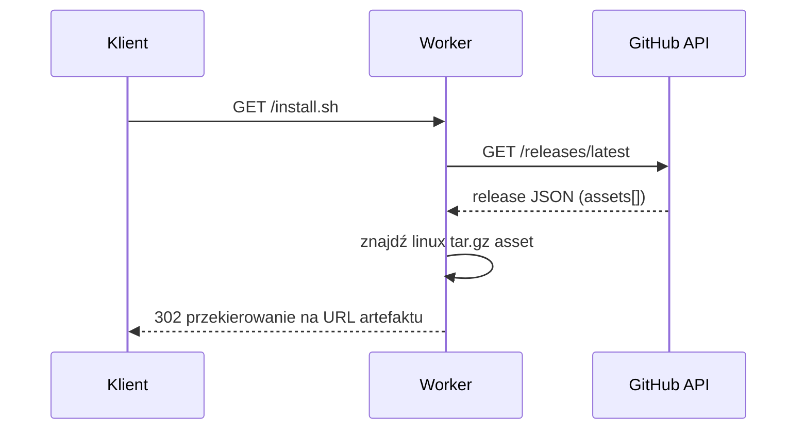

# skrypty — workers

# skrypty/workers

Funkcje Cloudflare Pages, które tłumaczą przyjazne dla użytkownika adresy instalacyjne na pasujący artefakt wydania w GitHubie. Każdy plik mapuje pojedynczą trasę na przekierowanie na podstawie najnowszego opublikowanego wydania repozytorium `librefang/librefang`.

## Trasy

| Plik | Trasa | Artefakt docelowy |
|------|-------|-------------|
| `install-ps1.ts` | `/install.ps1` | `*x86_64-pc-windows-msvc.zip` |
| `install-sh.ts` | `/install.sh` | `*x86_64-unknown-linux-gnu.tar.gz` |

Cloudflare Pages kieruje do każdego pliku na podstawie jego nazwy, więc te handlery automatycznie obsługują `/install.ps1` i `/install.sh`.

## Jak to działa

Obie funkcje działają według tego samego trójetapowego schematu:

1. **Pobierz metadane najnowszego wydania** z REST API GitHuba (`/repos/librefang/librefang/releases/latest`), przekazując nagłówek `User-Agent` (wymagany przez GitHuba) oraz standardowy nagłówek JSON `Accept`.
2. **Znajdź artefakt** poprzez dopasowanie podciągu w nazwie pliku do oczekiwanego tripletu docelowego (np. `x86_64-pc-windows-msvc.zip`). Dopasowanie odbywa się za pomocą `Array.find` na `data.assets`.
3. **Przekieruj** klienta z kodem `302 Found` na `browser_download_url` artefaktu. Jeśli żaden pasujący artefakt nie istnieje, funkcja odpowiada kodem `404 No release found`.

## Uwagi implementacyjne

- **Brak warstwy pamięci podręcznej.** Każde żądanie wywołuje bezpośrednie zapytanie do API GitHuba. Ma zastosowanie limit niezautentyfikowanych zapytań GitHuba (60 zapytań/godzinę na adres IP). Jeśli ruch wzrośnie, warto rozważyć cachowanie wyszukiwania wydania w Cache API lub KV Cloudflare.
- **Dopasowanie podciągu, a nie dokładnych nazw plików.** Matcher sprawdza tylko, czy nazwa artefaktu *zawiera* docelowy triplet, więc toleruje prefiksy wersji (np. `librefang-1.2.3-x86_64-unknown-linux-gnu.tar.gz`). Jeśli wiele artefaktów dopasuje podciąg, wygrywa pierwszy z tablicy.
- **`tag_name` jest pobierany, ale nieużywany.** Oba handlery wyciągają `data.tag_name` do lokalnej zmiennej `tag`, ale nigdy jej nie używają. Jest to nieszkodliwy martwy kod i można go bezpiecznie usunąć.
- **Brak obsługi błędów pobierania z backendu.** Odpowiedź z GitHuba z kodem innym niż 2xx spowoduje, że `.json()` rzuci wyjątek lub zwróci nieoczekiwane dane, co ostatecznie skutkuje odpowiedzią `404 No release found` zamiast odrębnego błędu.

## Rozszerzanie

Aby dodać obsługę nowej platformy (np. macOS), skopiuj dowolny z plików, zmień jego nazwę tak, aby pasowała do żądanej trasy (np. `install-macos.sh`) i zmień podciąg w wywołaniu `assets.find` na odpowiedni triplet docelowy (`aarch64-apple-darwin`, `x86_64-apple-darwin` itd.). Reszta handlera jest gotowa do ponownego użycia bez zmian.

Ponieważ dwa obecne pliki są niemal identyczne, przyszły refaktoring mógłby wyodrębnić współdzielony helper `redirectLatestAsset(substr: string)`, aby zredukować duplikację, jeśli zostaną dodane kolejne warianty platform.
