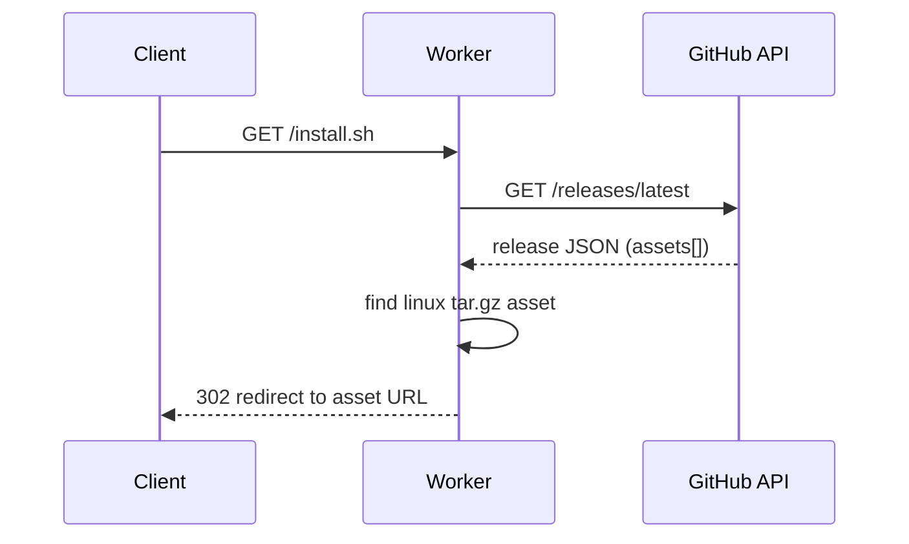

# scripts — workers

# scripts/workers

Cloudflare Pages Functions that resolve user-friendly install URLs to the matching release artifact on GitHub. Each file maps a single route to a redirect based on the latest published release of the `librefang/librefang` repository.

## Routes

| File | Route | Target Asset |
|------|-------|-------------|
| `install-ps1.ts` | `/install.ps1` | `*x86_64-pc-windows-msvc.zip` |
| `install-sh.ts` | `/install.sh` | `*x86_64-unknown-linux-gnu.tar.gz` |

Cloudflare Pages routes each file based on its name, so these handlers automatically serve `/install.ps1` and `/install.sh`.

## How It Works

Both functions follow the same three-step pattern:

1. **Fetch latest release metadata** from the GitHub REST API (`/repos/librefang/librefang/releases/latest`), passing a `User-Agent` header (required by GitHub) and the standard JSON `Accept` header.
2. **Locate the asset** by substring-matching its filename against the expected target triple (e.g., `x86_64-pc-windows-msvc.zip`). The match is done via `Array.find` on `data.assets`.
3. **Redirect** the client with a `302 Found` to the asset's `browser_download_url`. If no matching asset exists, the function responds with `404 No release found`.

## Implementation Notes

- **No caching layer.** Each request triggers a live GitHub API call. GitHub's unauthenticated rate limit (60 requests/hour per IP) applies. If traffic grows, consider caching the release lookup in Cloudflare's Cache API or KV.
- **Substring matching, not exact filenames.** The matcher only checks that the asset name *contains* the target triple, so it tolerates version prefixes (e.g., `librefang-1.2.3-x86_64-unknown-linux-gnu.tar.gz`). If multiple assets ever match the substring, the first one in the array wins.
- **`tag_name` is fetched but unused.** Both handlers extract `data.tag_name` into a local `tag` variable but never reference it. This is harmless dead code and safe to remove.
- **No error handling on the upstream fetch.** A non-2xx response from GitHub will cause `.json()` to either throw or return unexpected data, ultimately yielding the `404 No release found` fallback rather than a distinct error.

## Extending

To support a new platform (e.g., macOS), copy either file, rename it to match the desired route (e.g., `install-macos.sh`), and change the substring in the `assets.find` call to the relevant target triple (`aarch64-apple-darwin`, `x86_64-apple-darwin`, etc.). The rest of the handler is reusable as-is.

Because the two current files are near-identical, a future refactor could extract a shared `redirectLatestAsset(substr: string)` helper to reduce duplication if more platform variants are added.