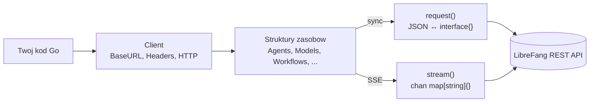

# sdk — go

# LibreFang Go SDK

Automatycznie generowany klient Go dla REST API LibreFang Agent OS. Cały SDK znajduje się w jednym pliku (`librefang.go`) i jest odtwarzany z `openapi.json` przez `scripts/codegen-sdks.py` — ręczne edycje zostaną nadpisane.

## Układ modułu

```
sdk/go/
├── go.mod              # moduł github.com/librefang/librefang/sdk/go (Go 1.21)
├── librefang.go        # wygenerowany klient — wszystkie zasoby i transporty
├── README.md           # szybki start (uwaga: niektóre nazwy metod są nieaktualne)
└── examples/
    ├── basic.go        # sprawdzenie kondycji, lista/uruchomienie agenta, wysłanie wiadomości
    ├── streaming.go    # strumieniowanie SSE przez SendMessageStream
    └── test_apis.go    # testy dymne listowania Skills/Models/Providers
```

Pliki przykładów używają `//go:build ignore`, więc nie kompilują się jako część modułu — uruchamiaj je jawnie za pomocą `go run examples/basic.go`.

## Architektura



Każda publiczna metoda w strukturze zasobu deleguje do jednego z dwóch prywatnych transportów w `Client`: `request()` dla synchronicznych wywołań JSON, lub `stream()` dla zdarzeń Server-Sent Events.

## Tworzenie klienta

```go
client := librefang.New("http://localhost:4545")
```

`New(baseURL)` wykonuje trzy czynności:

1. Usuwa ewentualny końcowy `/` z `baseURL`.
2. Inicjalizuje `Headers` z `Content-Type: application/json`.
3. Podłącza wszystkie 25 struktur zasobów (`Agents`, `Models`, `Workflows`, `System` itd.) z referencjami zwrotnymi do klienta.

Struktura `Client` udostępnia wstrzykiwalne pola do zaawansowanego użytku:

| Pole     | Przeznaczenie                                                       |
|----------|---------------------------------------------------------------------|
| `BaseURL` | Nadpisanie po utworzeniu (bez końcowego ukośnika).                 |
| `Headers` | Dodanie tokenów autoryzacyjnych lub niestandardowych nagłówków.   |
| `HTTP`    | Zastąpienie domyślnego `*http.Client` dla limitów czasowych.       |

```go
client := librefang.New(os.Getenv("LIBREFANG_URL"))
client.Headers["Authorization"] = "Bearer " + token
client.HTTP = &http.Client{Timeout: 30 * time.Second}
```

## Obsługa żądań

### Synchroniczne: `request()`

Wszystkie niestrumieniowe metody zasobów przechodzą przez `Client.request(method, path, body, query)`. Analizowanie odpowiedzi jest dynamiczne i uporządkowane:

1. Jeśli treść analizuje się jako tablica JSON → zwraca `[]json.RawMessage` (zachowuje surowe bajty do leniwego dekodowania).
2. W przeciwnym razie, jeśli analizuje się jako obiekt JSON → zwraca `map[string]interface{}`.
3. W przeciwnym razie → zwraca surową treść jako `string`.

Kody statusu HTTP `>= 400` tworzą `*LibreFangError` zawierający `Status`, `Message` i `Body`. Metody zwracają go bezpośrednio jako `error`, więc standardowe sprawdzenie `if err != nil` jest wystarczające.

### Strumieniowe: `stream()`

```go
for event := range client.Agents.SendMessageStream(agentID, payload) {
    if delta, ok := event["delta"].(string); ok {
        fmt.Print(delta)
    }
}
```

`stream()` natychmiast zwraca `<-chan map[string]interface{}` i przetwarza treść odpowiedzi w goroutine. Reguły analizowania zdarzeń:

- Ustawia `Accept: text/event-stream`.
- Czyta linie z 64 KiB `bufio.Reader`; dekodowane są tylko linie `data: …`.
- Znacznik `data: [DONE]` zamyka kanał.
- Nie-JSON ładunki `data:` są przekazywane jako `{"raw": data}`.
- Błędy (awaria transportu, HTTP >= 400) przychodzą jako pojedyncze zdarzenie `{"error": ..., "status": ...}` przed zamknięciem kanału.

**Bezpieczeństwo pamięci:** Pojedyncze linie SSE są ograniczone do `maxSSELine = 8 MiB`. Linia przekraczająca ten limit emituje zdarzenie błędu i kończy strumień, zapobiegając nieograniczonemu wzrostowi bufora z powodu zniekształconego wejścia.

Trzy endpointy obecnie udostępniają strumieniowanie:

| Zasób    | Metoda               | Endpoint                                              |
|----------|----------------------|-------------------------------------------------------|
| `Agents` | `SendMessageStream`  | `POST /api/agents/{id}/message/stream`               |
| `Agents` | `AttachSessionStream` | `GET /api/agents/{id}/sessions/{sid}/stream`       |
| `Network` | `CommsEventsStream` | `GET /api/comms/events/stream`                        |
| `System` | `LogsStream`         | `GET /api/logs/stream`                                |

## Funkcje pomocnicze odpowiedzi

Ponieważ odpowiedzi są typowane dynamicznie, SDK dostarcza dwie funkcje pomocnicze, na których przykładach silnie się opierają:

```go
// Wymusza konwersję dowolnej odpowiedzi na mapę (pusta mapa w razie niepowodzenia).
m := librefang.ToMap(resp)

// Wymusza konwersję odpowiedzi listy na []map[string]interface{}.
// Obsługuje zarówno kształty []json.RawMessage, jak i []interface{}.
agents := librefang.ToSlice(client.Agents.ListAgents(nil))
```

`ToSlice` jest ważniejsza — `request()` zwraca `[]json.RawMessage` dla tablic, co nie asertuje się bezpośrednio do `[]map[string]interface{}`. Zawsze kieruj odpowiedzi listowe przez `ToSlice`.

## Mapa zasobów

Klient udostępnia 25 struktur zasobów. Każda z nich jest cienką otoką, która buduje ścieżkę i deleguje do `Client.request` lub `Client.stream`. Konwencja nazewnictwa to czasownik + rzeczownik (np. `SpawnAgent`, `KillAgent`, `SendMessageStream`) zamiast czasowników REST — pozwala to uniknąć kolizji, gdy jeden zasób mapuje wiele endpointów z tym samym czasownikiem HTTP.

| Zasób             | Zakres                                                                |
|-------------------|-----------------------------------------------------------------------|
| `Agents`          | Największa powierzchnia — CRUD, sesje, pliki, skille, narzędzia, serwery MCP, metryki, strumieniowanie |
| `Approvals`       | Kolejka żądań human-in-the-loop, masowe rozwiązywanie, dziennik audytu |
| `Auth`            | Wywołania zwrotne OAuth, rejestracja/uwierzytelnianie passkey, logowanie do dashboardu |
| `AutoDream`       | Pętla refleksji w tle: wyzwalanie, przerywanie, włączanie dla agenta |
| `Budget`          | Limity wydatków per agent / dostawca / użytkownik; statystyki i rankingi |
| `Channels`        | Kanały boczne (WhatsApp, Telegram itd.), parowanie QR              |
| `Extensions`      | Instalacja/deinstalacja rozszerzeń                                  |
| `Goals`           | Lista szablonów celów                                               |
| `Hands`           | Komputerowe "ręce": instalacja, aktywacja, pauza, edycja manifestu |
| `Inbox`           | Status skrzynki odbiorczej                                          |
| `Mcp`             | Rejestr serwerów MCP, przepływy autoryzacji, reguły taint           |
| `Memory`          | Magazyn KV agenta oraz import/eksport                               |
| `Models`          | Katalog modeli, aliasy, modele niestandardowe, klucze dostawców, OAuth Copilot |
| `Network`         | Komunikacja peer-to-peer: topologia, zdarzenia, send/task, zaufani peerzy |
| `Pairing`         | Cykl życia parowania urządzeń                                      |
| `Plugins`         | Cykl życia wtyczek, lint, podpisywanie, rusztowanie, introspekcja silnika kontekstowego |
| `ProactiveMemory` | Pełny magazyn proaktywnej pamięci: CRUD, zanikanie, konsolidacja, relacje |
| `Sessions`        | Wyszukiwanie sesji między agentami, etykiety, czyszczenie           |
| `Skills`          | Rejestr skilli, marketplace Clawhub, ewolucja/poprawka/wycofanie    |
| `System`          | Kondycja, konfiguracja, kopie zapasowe, audyt, migracje, szablony, metryki |
| `Tools`           | Wywoływanie nazwanych narzędzi                                     |
| `Users`           | CRUD użytkowników, polityki, klucze per dostawca, rotacja kluczy  |
| `Webhooks`        | Endpointy webhooków przychodzących agent/wake                      |
| `Workflows`       | Workflows, uruchomienia, harmonogramy, wyzwalacze, cron, szablony |
| `A2A`             | Odkrywanie i komunikacja agent-do-agenta z zewnętrznymi sieciami  |

### Sygnatury metod

Większość metod podąża za jednym z czterech wzorców:

```go
// GET bez parametru ścieżki
ListX() (interface{}, error)

// GET/DELETE z parametrem ścieżki
GetX(id string) (interface{}, error)

// POST/PUT/PATCH z ładunkiem
CreateX(data map[string]interface{}) (interface{}, error)

// Warianty z łańcuchem zapytania (np. filtrowanie/paginacja)
ListX(query map[string]string) (interface{}, error)
```

Ładunki są zawsze `map[string]interface{}` — SDK nie modeluje struktur żądań. Konsultuj specyfikację OpenAPI (lub `openapi.json` w katalogu głównym repozytorium) dla oczekiwanych kluczy per endpoint.

## Obsługa błędów

`*LibreFangError` przechwytuje wszystko, czego potrzebujesz do ponowienia lub wyświetlenia użytkownikowi:

```go
reply, err := client.Agents.SendMessage(id, payload)
if err != nil {
    var lfErr *librefang.LibreFangError
    if errors.As(err, &lfErr) {
        log.Printf("status=%d body=%s", lfErr.Status, lfErr.Body)
    }
    return
}
```

Należy zauważyć, że transport `stream()` **nie** zwraca błędów przez `error` — docierają one wewnątrz kanału jako `{"error": "...", "status": N}`. Zawsze sprawdzaj klucz `error` przy iteracji zdarzeń.

## Typowe wzorce

### Uruchom, rozmawiaj, posprzątaj

Kanoniczny cykl życia agenta pokazany w `examples/basic.go`:

```go
raw, _   := client.Agents.ListAgents(nil)
agents   := librefang.ToSlice(raw)

var id string
var created bool
if len(agents) > 0 {
    id = agents[0]["id"].(string)
} else {
    a, _ := client.Agents.SpawnAgent(map[string]interface{}{"template": "assistant"})
    id = librefang.ToMap(a)["id"].(string)
    created = true
}
defer func() {
    if created {
        client.Agents.KillAgent(id, nil)
    }
}()
```

### Strumieniowanie z wykrywaniem zdarzenia końcowego

```go
for ev := range client.Agents.SendMessageStream(id, payload) {
    switch t := ev["type"].(string); t {
    case "delta":
        fmt.Print(ev["delta"])
    case "done":
        return
    }
    if e, ok := ev["error"]; ok {
        return fmt.Errorf("stream: %v", e)
    }
}
```

## Odtwarzanie

Ten plik jest generowany, nie edytowany ręcznie. Po zmianie specyfikacji OpenAPI serwera:

```bash
python3 scripts/codegen-sdks.py
```

Generator emituje jedną strukturę `XxxResource` na tag API i jedną metodę na operację, a następnie wstrzykuje pola zasobów do `Client` i konstruktory do `New()`. Jeśli potrzebujesz nowego endpointu, zaktualizuj specyfikację i wygeneruj ponownie — nie łataj `librefang.go` bezpośrednio.

## Uwaga dotycząca README

Dołączony `README.md` dokumentuje starsze, uproszczone API (`Agents.Create`, `Agents.Delete`, `Agents.Message`, `Agents.Stream`). Te nazwy nie istnieją w wygenerowanym kodzie. Autorytatywne nazwy metod to `SpawnAgent`, `KillAgent`, `SendMessage` i `SendMessageStream`; polegaj na tym dokumencie i kodzie źródłowym, a nie na README, dopóki README nie zostanie wygenerowany ponownie przy kolejnym przejściu codegen.
