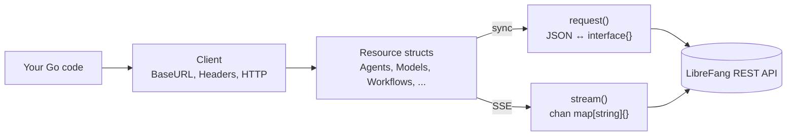

# sdk — go

# LibreFang Go SDK

Auto-generated Go client for the LibreFang Agent OS REST API. The entire SDK lives in a single file (`librefang.go`) and is regenerated from `openapi.json` by `scripts/codegen-sdks.py` — manual edits will be overwritten.

## Module Layout

```
sdk/go/
├── go.mod              # module github.com/librefang/librefang/sdk/go (Go 1.21)
├── librefang.go        # generated client — all resources and transports
├── README.md           # quick-start (note: some method names there are stale)
└── examples/
    ├── basic.go        # health check, list/spawn agent, send message
    ├── streaming.go    # SSE streaming via SendMessageStream
    └── test_apis.go    # smoke-test Skills/Models/Providers listings
```

The example files use `//go:build ignore` so they don't compile as part of the module — run them explicitly with `go run examples/basic.go`.

## Architecture



Every public method on a resource struct delegates to one of two private transports on `Client`: `request()` for synchronous JSON calls, or `stream()` for Server-Sent Events.

## Client Construction

```go
client := librefang.New("http://localhost:4545")
```

`New(baseURL)` performs three things:

1. Strips any trailing `/` from `baseURL`.
2. Initializes `Headers` with `Content-Type: application/json`.
3. Wires up all 25 resource structs (`Agents`, `Models`, `Workflows`, `System`, etc.) with back-references to the client.

The `Client` struct exposes injectable fields for advanced use:

| Field    | Purpose                                                        |
|----------|----------------------------------------------------------------|
| `BaseURL` | Override after construction (no trailing slash).              |
| `Headers` | Add auth tokens or custom headers applied to every request.  |
| `HTTP`    | Replace the default `*http.Client` for timeouts, transports. |

```go
client := librefang.New(os.Getenv("LIBREFANG_URL"))
client.Headers["Authorization"] = "Bearer " + token
client.HTTP = &http.Client{Timeout: 30 * time.Second}
```

## Request Handling

### Synchronous: `request()`

All non-streaming resource methods funnel through `Client.request(method, path, body, query)`. Response parsing is dynamic and ordered:

1. If the body parses as a JSON array → returns `[]json.RawMessage` (preserves raw bytes for lazy decoding).
2. Else if it parses as a JSON object → returns `map[string]interface{}`.
3. Otherwise → returns the raw body as `string`.

HTTP statuses `>= 400` produce a `*LibreFangError` containing `Status`, `Message`, and `Body`. Methods return it directly as `error`, so a standard `if err != nil` check is sufficient.

### Streaming: `stream()`

```go
for event := range client.Agents.SendMessageStream(agentID, payload) {
    if delta, ok := event["delta"].(string); ok {
        fmt.Print(delta)
    }
}
```

`stream()` returns `<-chan map[string]interface{}` immediately and processes the response body on a goroutine. Event parsing rules:

- Sets `Accept: text/event-stream`.
- Reads lines from a 64 KiB `bufio.Reader`; only `data: …` lines are decoded.
- A `data: [DONE]` sentinel closes the channel.
- Non-JSON `data:` payloads are forwarded as `{"raw": data}`.
- Errors (transport failure, HTTP >= 400) arrive as a single `{"error": ..., "status": ...}` event before the channel closes.

**Memory safety:** Individual SSE lines are capped at `maxSSELine = 8 MiB`. A line exceeding that emits an error event and terminates the stream, preventing unbounded buffer growth from malformed input.

Three endpoints currently expose streaming:

| Resource | Method | Endpoint |
|----------|--------|----------|
| `Agents` | `SendMessageStream` | `POST /api/agents/{id}/message/stream` |
| `Agents` | `AttachSessionStream` | `GET /api/agents/{id}/sessions/{sid}/stream` |
| `Network` | `CommsEventsStream` | `GET /api/comms/events/stream` |
| `System` | `LogsStream` | `GET /api/logs/stream` |

## Response Helpers

Because responses are dynamically typed, the SDK ships two helpers that examples rely on heavily:

```go
// Coerce any response into a map (empty map on failure).
m := librefang.ToMap(resp)

// Coerce a list response into []map[string]interface{}.
// Handles both []json.RawMessage and []interface{} shapes.
agents := librefang.ToSlice(client.Agents.ListAgents(nil))
```

`ToSlice` is the important one — `request()` returns `[]json.RawMessage` for arrays, which won't type-assert directly to `[]map[string]interface{}`. Always route list responses through `ToSlice`.

## Resource Map

The client exposes 25 resource structs. Each is a thin wrapper that builds a path and delegates to `Client.request` or `Client.stream`. The naming convention is verb + noun (e.g. `SpawnAgent`, `KillAgent`, `SendMessageStream`) rather than REST verbs — this avoids collisions when one resource maps many endpoints with the same HTTP verb.

| Resource | Coverage |
|----------|----------|
| `Agents` | Largest surface — CRUD, sessions, files, skills, tools, MCP servers, metrics, streaming |
| `Approvals` | Human-in-the-loop request queue, batch resolve, audit log |
| `Auth` | OAuth callbacks, passkey registration/authentication, dashboard login |
| `AutoDream` | Background reflection loop: trigger, abort, enable per agent |
| `Budget` | Per-agent / provider / user spend caps; usage stats and rankings |
| `Channels` | Sidecar channels (WhatsApp, Telegram, etc.), QR pairing |
| `Extensions` | Install/uninstall extensions |
| `Goals` | Goal templates listing |
| `Hands` | Computer-use "hands": install, activate, pause, manifest editing |
| `Inbox` | Inbox status |
| `Mcp` | MCP server registry, auth flows, taint rules |
| `Memory` | Agent KV store plus import/export |
| `Models` | Model catalog, aliases, custom models, provider keys, Copilot OAuth |
| `Network` | Peer-to-peer comms: topology, events, send/task, trusted peers |
| `Pairing` | Device pairing lifecycle |
| `Plugins` | Plugin lifecycle, lint, sign, scaffold, context-engine introspection |
| `ProactiveMemory` | Full proactive memory store: CRUD, decay, consolidate, relations |
| `Sessions` | Cross-agent session search, labels, cleanup |
| `Skills` | Skill registry, Clawhub marketplace, evolve/patch/rollback |
| `System` | Health, config, backups, audit, migrations, templates, metrics |
| `Tools` | Invoke named tools |
| `Users` | User CRUD, policies, per-provider keys, key rotation |
| `Webhooks` | Agent/wake inbound webhook endpoints |
| `Workflows` | Workflows, runs, schedules, triggers, cron jobs, templates |
| `A2A` | Agent-to-agent discovery and messaging with external networks |

### Method signatures

Most methods follow one of four shapes:

```go
// No-path-param GET
ListX() (interface{}, error)

// Path-param GET/DELETE
GetX(id string) (interface{}, error)

// Body payload POST/PUT/PATCH
CreateX(data map[string]interface{}) (interface{}, error)

// Query-string variants (e.g. filtering/pagination)
ListX(query map[string]string) (interface{}, error)
```

Body payloads are always `map[string]interface{}` — the SDK does not model request structs. Consult the OpenAPI spec (or `openapi.json` in the repo root) for the expected keys per endpoint.

## Error Handling

`*LibreFangError` captures everything you need to retry or surface to users:

```go
reply, err := client.Agents.SendMessage(id, payload)
if err != nil {
    var lfErr *librefang.LibreFangError
    if errors.As(err, &lfErr) {
        log.Printf("status=%d body=%s", lfErr.Status, lfErr.Body)
    }
    return
}
```

Note that the `stream()` transport does **not** return errors via `error` — they arrive inside the channel as `{"error": "...", "status": N}`. Always check for the `error` key when iterating events.

## Common Patterns

### Spawn-then-talk-then-cleanup

The canonical agent lifecycle shown in `examples/basic.go`:

```go
raw, _   := client.Agents.ListAgents(nil)
agents   := librefang.ToSlice(raw)

var id string
var created bool
if len(agents) > 0 {
    id = agents[0]["id"].(string)
} else {
    a, _ := client.Agents.SpawnAgent(map[string]interface{}{"template": "assistant"})
    id = librefang.ToMap(a)["id"].(string)
    created = true
}
defer func() {
    if created {
        client.Agents.KillAgent(id, nil)
    }
}()
```

### Streaming with terminal-event detection

```go
for ev := range client.Agents.SendMessageStream(id, payload) {
    switch t := ev["type"].(string); t {
    case "delta":
        fmt.Print(ev["delta"])
    case "done":
        return
    }
    if e, ok := ev["error"]; ok {
        return fmt.Errorf("stream: %v", e)
    }
}
```

## Regenerating

This file is generated, not hand-edited. After changing the server's OpenAPI spec:

```bash
python3 scripts/codegen-sdks.py
```

The generator emits one `XxxResource` struct per API tag and one method per operation, then injects the resource fields into `Client` and constructors into `New()`. If you need a new endpoint exposed, update the spec and regenerate — do not patch `librefang.go` directly.

## README Caveat

The bundled `README.md` documents an older, simplified API (`Agents.Create`, `Agents.Delete`, `Agents.Message`, `Agents.Stream`). Those names do not exist in the generated code. The authoritative method names are `SpawnAgent`, `KillAgent`, `SendMessage`, and `SendMessageStream`; rely on this document and the source rather than the README until the README is regenerated alongside the next codegen pass.