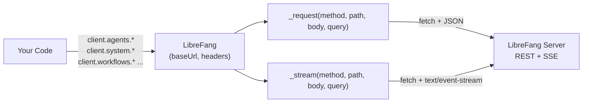

# sdk — javascript

# @librefang/sdk — JavaScript/TypeScript Client

Official client library for the LibreFang Agent OS REST API. Provides typed, Promise-based access to every endpoint in the LibreFang API surface, including streaming (SSE) support for real-time agent responses, logs, and comms events.

> **Note:** This SDK is **auto-generated** from the server's `openapi.json`. Do not edit `index.js` by hand — regenerate via `python3 scripts/codegen-sdks.py`. The rest of this document describes the generated API as it exists.

---

## Installation

```bash
npm install @librefang/sdk
```

Requires **Node.js ≥ 18** (uses the global `fetch` and `URLSearchParams`).

---

## Quick Start

```javascript
const { LibreFang } = require("@librefang/sdk");

const client = new LibreFang("http://localhost:4545");

// Health check (note: lives under client.system, not top-level)
const health = await client.system.health();

// Spawn an agent
const agent = await client.agents.spawnAgent({ template: "assistant" });

// Send a message and await the full reply
const reply = await client.agents.sendMessage(agent.id, { message: "Hello!" });

// Stream tokens as they arrive
for await (const event of client.agents.sendMessageStream(agent.id, { message: "Tell me a story" })) {
  if (event.type === "text_delta") process.stdout.write(event.delta);
}
```

---

## Architecture

The client follows a **resource pattern**: a single `LibreFang` instance owns the transport (HTTP + SSE) and exposes one property per API domain. Each resource is a thin class that delegates every call back to the shared `_request` or `_stream` methods on the client.



Key transport details:

| Mechanism | Where | Behavior |
|---|---|---|
| **JSON requests** | `_request(method, path, body, query)` | Serializes `body` to JSON, appends `query` via `_withQuery`, parses JSON response (or returns raw text for non-JSON content types). Throws `LibreFangError` on non-2xx. |
| **SSE streaming** | `_stream(method, path, body, query)` | Sets `Accept: text/event-stream`, reads the response body chunk-by-chunk, splits on newlines, and yields each `data:` payload as a parsed JSON object. Terminates on a `[DONE]` sentinel. |
| **Query building** | `_withQuery(path, query)` | Skips `null`/`undefined` values; appends with `?` or `&` depending on whether the path already contains a query string. |

All resource methods are `async` and return the parsed response directly. Streaming methods are `async function*` generators.

---

## The `LibreFang` Class

### Constructor

```javascript
new LibreFang(baseUrl, options?)
```

- **`baseUrl`** *(string)* — Server origin, e.g. `"http://localhost:4545"`. Trailing slashes are stripped.
- **`options.headers`** *(object, optional)* — Extra headers merged into every request. Defaults to `{ "Content-Type": "application/json" }`.

### Error Handling

Non-2xx responses throw a `LibreFangError` with:

| Property | Description |
|---|---|
| `message` | `HTTP {status}: {body}` |
| `status` | HTTP status code |
| `body` | Raw response text |

```javascript
const { LibreFang, LibreFangError } = require("@librefang/sdk");

try {
  await client.agents.getAgent("nonexistent-id");
} catch (err) {
  if (err instanceof LibreFangError) {
    console.error("Status:", err.status);
  }
}
```

---

## Resources

The client exposes 28 resource namespaces. Each is an instance attached at construction time.

| Property | Domain | Representative Methods |
|---|---|---|
| `client.a2a` | Agent-to-agent networking | `a2aDiscoverExternal`, `a2aSendExternal`, `a2aListExternalAgents` |
| `client.agents` | Agent lifecycle & messaging | `spawnAgent`, `sendMessage`, `sendMessageStream`, `killAgent`, `listAgentSessions` |
| `client.approvals` | Human-in-the-loop approvals | `listApprovals`, `approveRequest`, `rejectRequest`, `batchResolve` |
| `client.auth` | Authentication & passkeys | `dashboardLogin`, `authProviders`, `registrationOptions`, `authRefresh` |
| `client.auto_dream` | Autonomous dreaming | `autoDreamTrigger`, `autoDreamSetEnabled`, `autoDreamStatus` |
| `client.budget` | Budget & usage tracking | `budgetStatus`, `agentBudgetRanking`, `usageStats`, `usageByModel` |
| `client.channels` | Communication channels | `listChannels`, `configureSidecarChannel`, `getChannelQr` |
| `client.extensions` | Extension management | `installExtension`, `uninstallExtension`, `getExtension` |
| `client.goals` | Goal templates | `listGoalTemplates` |
| `client.hands` | "Hands" (action executors) | `installHand`, `activateHand`, `getHandManifest`, `setHandSecret` |
| `client.inbox` | Inbox status | `inboxStatus` |
| `client.mcp` | Model Context Protocol servers | `listMcpServers`, `addMcpServer`, `authStart`, `patchMcpServerTaint` |
| `client.memory` | Per-agent KV store | `getAgentKvKey`, `setAgentKvKey`, `memoryConfigPatch` |
| `client.models` | Models, providers, aliases | `listAllModels`, `addCustomModel`, `setProviderKey`, `testProvider` |
| `client.network` | Peer networking & comms | `commsSend`, `commsTopology`, `commsEventsStream` |
| `client.pairing` | Device pairing | `pairingRequest`, `pairingComplete`, `pairingDevices` |
| `client.plugins` | Plugin system | `installPlugin`, `reloadPlugin`, `pluginDoctor`, `scaffoldPlugin` |
| `client.proactive_memory` | Memory graph & consolidation | `memoryAdd`, `memorySearchAgent`, `memoryConsolidate`, `memoryDecay` |
| `client.sessions` | Session CRUD & search | `listSessions`, `getSession`, `setSessionLabel`, `searchSessions` |
| `client.skills` | Skills, ClawHub, tools | `createSkill`, `installSkill`, `clawhubSearch`, `evolvePatchSkill` |
| `client.system` | Health, config, audit, backups | `health`, `status`, `version`, `prometheusMetrics`, `configReload` |
| `client.tools` | Tool invocation | `invokeTool` |
| `client.users` | User & policy management | `createUser`, `updateUserPolicy`, `rotateUserKey` |
| `client.webhooks` | Inbound webhooks | `webhookAgent`, `webhookWake` |
| `client.workflows` | Workflows, schedules, triggers, cron | `createWorkflow`, `runWorkflow`, `createSchedule`, `createTrigger` |

---

## Deep-Dive: `client.agents`

The agents resource is the most feature-rich namespace. Key method groups:

### Lifecycle

```javascript
// Create
const agent = await client.agents.spawnAgent({ template: "assistant", name: "bot-1" });

// Bulk operations
await client.agents.bulkCreateAgents({ templates: [...] });
await client.agents.bulkStartAgents({ ids: [...] });

// Read / update / delete
const found = await client.agents.getAgent(agent.id);
await client.agents.patchAgent(agent.id, { name: "renamed" });
await client.agents.killAgent(agent.id);

// Clone
const copy = await client.agents.cloneAgent(agent.id, { name: "bot-1-clone" });
```

### Messaging

```javascript
// Full response (awaits completion)
const reply = await client.agents.sendMessage(agent.id, { message: "Hi" });

// Token-by-token streaming (SSE)
for await (const event of client.agents.sendMessageStream(agent.id, { message: "Hi" })) {
  switch (event.type) {
    case "text_delta": process.stdout.write(event.delta); break;
    case "tool_call":  console.log("\n[tool:", event.tool, "]"); break;
    case "done":       console.log("\n-- complete --"); break;
  }
}
```

### Sessions

Each agent can have multiple sessions. The agents resource mirrors session endpoints scoped to a specific agent:

```javascript
const sessions = await client.agents.listAgentSessions(agent.id);
await client.agents.createAgentSession(agent.id, { label: "research" });
await client.agents.switchAgentSession(agent.id, sessionId);

// Export / import
const blob = await client.agents.exportSession(agent.id, sessionId);
await client.agents.importSession(agent.id, blob);

// Live-attach to a running session stream
for await (const event of client.agents.attachSessionStream(agent.id, sessionId)) {
  console.log(event);
}
```

### Configuration

Methods like `setAgentTools`, `setAgentSkills`, `setAgentChannels`, `setAgentMcpServers`, `setModel`, and `setAgentMode` accept a `data` object whose shape is defined by the server's OpenAPI schema. Use `patchAgentConfig` for partial updates.

### Files

```javascript
await client.agents.setAgentFile(agent.id, "notes.md", { content: "..." });
const file = await client.agents.getAgentFile(agent.id, "notes.md");
await client.agents.deleteAgentFile(agent.id, "notes.md");
```

---

## Deep-Dive: `client.system`

Server-level operations. **Health, status, and version live here** — not on the top-level client:

```javascript
await client.system.health();          // GET /api/health
await client.system.healthDetail();    // GET /api/health/detail
await client.system.status();          // GET /api/status
await client.system.version();         // GET /api/version
await client.system.prometheusMetrics();// GET /api/metrics (returns text, not JSON)
await client.system.ready();           // GET /api/ready
```

Config management:

```javascript
const cfg = await client.system.getConfig();
await client.system.configSet({ key: "value" });
await client.system.configReload();
const schema = await client.system.configSchema();
```

Backups, audit, and shutdown:

```javascript
await client.system.createBackup();
const backups = await client.system.listBackups();
await client.system.deleteBackup("backup.tar.gz");
const audit = await client.system.auditRecent();
await client.system.shutdown();
```

Live log streaming:

```javascript
for await (const line of client.system.logsStream()) {
  console.log(line);
}
```

---

## Deep-Dive: `client.workflows`

Workflows, schedules, triggers, and cron jobs are all under this single resource.

```javascript
// Define and run a workflow
const wf = await client.workflows.createWorkflow({ name: "nightly", steps: [...] });
const run = await client.workflows.runWorkflow(wf.id, { input: {} });

// Inspect / control a run
await client.workflows.getWorkflowRun(run.id);
await client.workflows.pauseWorkflowRun(run.id, {});
await client.workflows.resumeWorkflowRun(run.id, {});
await client.workflows.cancelWorkflowRun(run.id);
await client.workflows.rerunWorkflowRun(run.id);

// Schedules (recurring workflow runs)
await client.workflows.createSchedule({ workflow_id: wf.id, cron: "0 * * * *" });
await client.workflows.runSchedule(scheduleId);

// Triggers (event-driven workflow activation)
await client.workflows.createTrigger({ workflow_id: wf.id, event: "inbox.message" });

// Templates
const templates = await client.workflows.listWorkflowTemplates();
await client.workflows.instantiateTemplate(templateId, { name: "my-instance" });
```

---

## Streaming Endpoints

Four endpoints use Server-Sent Events and are exposed as async generators:

| Method | Resource | SSE Endpoint |
|---|---|---|
| `sendMessageStream(id, data)` | `agents` | `POST /api/agents/:id/message/stream` |
| `attachSessionStream(id, session_id)` | `agents` | `GET /api/agents/:id/sessions/:session_id/stream` |
| `commsEventsStream()` | `network` | `GET /api/comms/events/stream` |
| `logsStream()` | `system` | `GET /api/logs/stream` |

Each yielded value is the parsed JSON from the `data:` field. If parsing fails, the raw string is yielded as `{ raw: data }`. The generator returns when the server sends `data: [DONE]` or closes the connection.

---

## TypeScript

Type definitions ship in `index.d.ts`. The package declares `"types"` in `package.json` and a `"types"` condition in `exports`, so both `import` and `require` resolve types correctly:

```typescript
import { LibreFang, LibreFangError } from "@librefang/sdk";

const client = new LibreFang("http://localhost:4545", {
  headers: { Authorization: `Bearer ${token}` },
});

const agents = await client.agents.listAgents();
```

---

## Authentication

The SDK does not manage tokens itself. Pass auth headers via the constructor and they apply to every request:

```javascript
const client = new LibreFang("https://fang.example.com", {
  headers: { Authorization: "Bearer <token>" },
});
```

For OAuth/passkey flows, use `client.auth.*` methods (`dashboardLogin`, `authRefresh`, `registrationOptions`, etc.) to obtain and refresh credentials, then reconstruct the client with the new token.

---

## Examples

Two runnable examples ship in `examples/`:

| File | Demonstrates |
|---|---|
| `basic.js` | Health check, list-or-spawn agent, send a message, clean up |
| `streaming.js` | Token-by-token streaming via `sendMessageStream`, handling `text_delta` / `tool_call` / `done` events |

Run with:

```bash
node examples/basic.js
node examples/streaming.js
```

Both examples reuse an existing agent if one exists, otherwise spawn a temporary one and delete it afterward.

---

## Regeneration

Because this module is code-generated, the source of truth is the server's OpenAPI spec. After API changes:

```bash
python3 scripts/codegen-sdks.py
```

This regenerates `index.js` (and `index.d.ts`). Resource classes, method names, and parameter orders all derive from operation IDs and path parameters in the spec — there is no hand-written per-endpoint logic to maintain.

---

## Package Metadata

| Field | Value |
|---|---|
| Name | `@librefang/sdk` |
| Module system | CommonJS (`"type": "commonjs"`) |
| Entry | `index.js` |
| Types | `index.d.ts` |
| Engine | `node >= 18.0.0` |
| License | MIT |