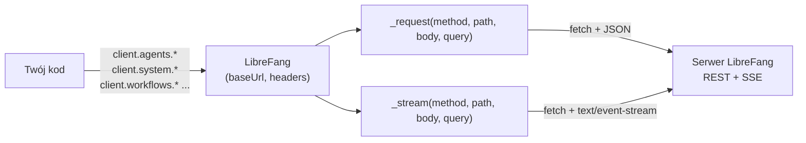

# sdk — javascript

# @librefang/sdk — Klient JavaScript/TypeScript

Oficjalna biblioteka kliencka dla REST API LibreFang Agent OS. Zapewnia typowany, oparty na Promise'ach dostęp do każdego punktu końcowego API LibreFang, w tym obsługę strumieniowania (SSE) dla odpowiedzi agentów w czasie rzeczywistym, logów i zdarzeń komunikacyjnych.

> **Uwaga:** Ten SDK jest **generowany automatycznie** z `openapi.json` serwera. Nie edytuj `index.js` ręcznie — generuj ponownie za pomocą `python3 scripts/codegen-sdks.py`. Reszta tego dokumentu opisuje wygenerowane API w jego aktualnej postaci.

---

## Instalacja

```bash
npm install @librefang/sdk
```

Wymaga **Node.js ≥ 18** (korzysta z globalnych `fetch` i `URLSearchParams`).

---

## Szybki start

```javascript
const { LibreFang } = require("@librefang/sdk");

const client = new LibreFang("http://localhost:4545");

// Sprawdzanie stanu (uwaga: znajduje się w client.system, a nie na najwyższym poziomie)
const health = await client.system.health();

// Uruchomienie agenta
const agent = await client.agents.spawnAgent({ template: "assistant" });

// Wysłanie wiadomości i oczekiwanie na pełną odpowiedź
const reply = await client.agents.sendMessage(agent.id, { message: "Hello!" });

// Strumieniowanie tokenów na bieżąco
for await (const event of client.agents.sendMessageStream(agent.id, { message: "Tell me a story" })) {
  if (event.type === "text_delta") process.stdout.write(event.delta);
}
```

---

## Architektura

Klient opiera się na **wzorcu zasobów**: pojedyncza instancja `LibreFang` zarządza transportem (HTTP + SSE) i eksponuje jedną właściwość dla każdej domeny API. Każdy zasób to cienka klasa, która deleguje każde wywołanie do współdzielonych metod `_request` lub `_stream` w kliencie.



Kluczowe szczegóły transportu:

| Mechanizm | Gdzie | Zachowanie |
|---|---|---|
| **Żądania JSON** | `_request(method, path, body, query)` | Serializuje `body` do JSON, dołącza `query` przez `_withQuery`, parsuje odpowiedź JSON (lub zwraca surowy tekst dla typów innych niż JSON). Rzuca `LibreFangError` przy odpowiedziach innych niż 2xx. |
| **Strumieniowanie SSE** | `_stream(method, path, body, query)` | Ustawia `Accept: text/event-stream`, czyta treść odpowiedzi fragment po fragmencie, dzieli po nowych liniach i przekazuje każdy ładunek `data:` jako sparsowany obiekt JSON. Kończy przy znaku końcowym `[DONE]`. |
| **Budowanie zapytań** | `_withQuery(path, query)` | Pomija wartości `null`/`undefined`; dołącza z `?` lub `&` w zależności od tego, czy ścieżka zawiera już ciąg zapytania. |

Wszystkie metody zasobów są `async` i zwracają sparsowaną odpowiedź bezpośrednio. Metody strumieniowe to asynchroniczne generatory `async function*`.

---

## Klasa `LibreFang`

### Konstruktor

```javascript
new LibreFang(baseUrl, options?)
```

- **`baseUrl`** *(string)* — Adres serwera, np. `"http://localhost:4545"`. Końcowe slashe są usuwane.
- **`options.headers`** *(object, opcjonalne)* — Dodatkowe nagłówki dołączane do każdego żądania. Domyślnie `{ "Content-Type": "application/json" }`.

### Obsługa błędów

Odpowiedzi inne niż 2xx rzucają `LibreFangError` z:

| Właściwość | Opis |
|---|---|
| `message` | `HTTP {status}: {body}` |
| `status` | Kod statusu HTTP |
| `body` | Surowy tekst odpowiedzi |

```javascript
const { LibreFang, LibreFangError } = require("@librefang/sdk");

try {
  await client.agents.getAgent("nonexistent-id");
} catch (err) {
  if (err instanceof LibreFangError) {
    console.error("Status:", err.status);
  }
}
```

---

## Zasoby

Klient eksponuje 28 przestrzeni nazw zasobów. Każda z nich to instancja dołączona podczas konstruowania klienta.

| Właściwość | Domena | Reprezentatywne metody |
|---|---|---|
| `client.a2a` | Sieć agent-do-agenta | `a2aDiscoverExternal`, `a2aSendExternal`, `a2aListExternalAgents` |
| `client.agents` | Cykl życia agentów i wiadomości | `spawnAgent`, `sendMessage`, `sendMessageStream`, `killAgent`, `listAgentSessions` |
| `client.approvals` | Zatwierdzenia z udziałem człowieka | `listApprovals`, `approveRequest`, `rejectRequest`, `batchResolve` |
| `client.auth` | Uwierzytelnianie i klucze dostępu | `dashboardLogin`, `authProviders`, `registrationOptions`, `authRefresh` |
| `client.auto_dream` | Autonomiczne marzenia | `autoDreamTrigger`, `autoDreamSetEnabled`, `autoDreamStatus` |
| `client.budget` | Budżet i śledzenie użycia | `budgetStatus`, `agentBudgetRanking`, `usageStats`, `usageByModel` |
| `client.channels` | Kanały komunikacyjne | `listChannels`, `configureSidecarChannel`, `getChannelQr` |
| `client.extensions` | Zarządzanie rozszerzeniami | `installExtension`, `uninstallExtension`, `getExtension` |
| `client.goals` | Szablony celów | `listGoalTemplates` |
| `client.hands` | „Ręce" (wykonawcze akcje) | `installHand`, `activateHand`, `getHandManifest`, `setHandSecret` |
| `client.inbox` | Status skrzynki odbiorczej | `inboxStatus` |
| `client.mcp` | Serwery Model Context Protocol | `listMcpServers`, `addMcpServer`, `authStart`, `patchMcpServerTaint` |
| `client.memory` | Magazyn KV na agenta | `getAgentKvKey`, `setAgentKvKey`, `memoryConfigPatch` |
| `client.models` | Modele, dostawcy, aliasy | `listAllModels`, `addCustomModel`, `setProviderKey`, `testProvider` |
| `client.network` | Sieć peer-to-peer i komunikacja | `commsSend`, `commsTopology`, `commsEventsStream` |
| `client.pairing` | Parowanie urządzeń | `pairingRequest`, `pairingComplete`, `pairingDevices` |
| `client.plugins` | System wtyczek | `installPlugin`, `reloadPlugin`, `pluginDoctor`, `scaffoldPlugin` |
| `client.proactive_memory` | Graf pamięci i konsolidacja | `memoryAdd`, `memorySearchAgent`, `memoryConsolidate`, `memoryDecay` |
| `client.sessions` | CRUD i wyszukiwanie sesji | `listSessions`, `getSession`, `setSessionLabel`, `searchSessions` |
| `client.skills` | Umiejętności, ClawHub, narzędzia | `createSkill`, `installSkill`, `clawhubSearch`, `evolvePatchSkill` |
| `client.system` | Zdrowie, konfiguracja, audyt, kopie zapasowe | `health`, `status`, `version`, `prometheusMetrics`, `configReload` |
| `client.tools` | Wywoływanie narzędzi | `invokeTool` |
| `client.users` | Zarządzanie użytkownikami i politykami | `createUser`, `updateUserPolicy`, `rotateUserKey` |
| `client.webhooks` | Webhooki przychodzące | `webhookAgent`, `webhookWake` |
| `client.workflows` | Workflowsy, harmonogramy, wyzwalacze, cron | `createWorkflow`, `runWorkflow`, `createSchedule`, `createTrigger` |

---

## Szczegóły: `client.agents`

Zasób agentów jest najbogatszą w funkcje przestrzenią nazw. Kluczowe grupy metod:

### Cykl życia

```javascript
// Tworzenie
const agent = await client.agents.spawnAgent({ template: "assistant", name: "bot-1" });

// Operacje masowe
await client.agents.bulkCreateAgents({ templates: [...] });
await client.agents.bulkStartAgents({ ids: [...] });

// Odczyt / aktualizacja / usuwanie
const found = await client.agents.getAgent(agent.id);
await client.agents.patchAgent(agent.id, { name: "renamed" });
await client.agents.killAgent(agent.id);

// Klonowanie
const copy = await client.agents.cloneAgent(agent.id, { name: "bot-1-clone" });
```

### Wiadomości

```javascript
// Pełna odpowiedź (czeka na zakończenie)
const reply = await client.agents.sendMessage(agent.id, { message: "Hi" });

// Strumieniowanie token po tokenie (SSE)
for await (const event of client.agents.sendMessageStream(agent.id, { message: "Hi" })) {
  switch (event.type) {
    case "text_delta": process.stdout.write(event.delta); break;
    case "tool_call":  console.log("\n[tool:", event.tool, "]"); break;
    case "done":       console.log("\n-- complete --"); break;
  }
}
```

### Sesje

Każdy agent może mieć wiele sesji. Zasób agentów odzwierciedla punkty końcowe sesji z zakresu konkretnego agenta:

```javascript
const sessions = await client.agents.listAgentSessions(agent.id);
await client.agents.createAgentSession(agent.id, { label: "research" });
await client.agents.switchAgentSession(agent.id, sessionId);

// Eksport / import
const blob = await client.agents.exportSession(agent.id, sessionId);
await client.agents.importSession(agent.id, blob);

// Dołączenie na żywo do strumienia działającej sesji
for await (const event of client.agents.attachSessionStream(agent.id, sessionId)) {
  console.log(event);
}
```

### Konfiguracja

Metody takie jak `setAgentTools`, `setAgentSkills`, `setAgentChannels`, `setAgentMcpServers`, `setModel` i `setAgentMode` przyjmują obiekt `data`, którego struktura jest określona przez schemat OpenAPI serwera. Użyj `patchAgentConfig` do częściowych aktualizacji.

### Pliki

```javascript
await client.agents.setAgentFile(agent.id, "notes.md", { content: "..." });
const file = await client.agents.getAgentFile(agent.id, "notes.md");
await client.agents.deleteAgentFile(agent.id, "notes.md");
```

---

## Szczegóły: `client.system`

Operacje na poziomie serwera. **Zdrowie, status i wersja znajdują się tutaj** — a nie na najwyższym poziomie klienta:

```javascript
await client.system.health();          // GET /api/health
await client.system.healthDetail();    // GET /api/health/detail
await client.system.status();          // GET /api/status
await client.system.version();         // GET /api/version
await client.system.prometheusMetrics();// GET /api/metrics (zwraca tekst, nie JSON)
await client.system.ready();           // GET /api/ready
```

Zarządzanie konfiguracją:

```javascript
const cfg = await client.system.getConfig();
await client.system.configSet({ key: "value" });
await client.system.configReload();
const schema = await client.system.configSchema();
```

Kopie zapasowe, audyt i wyłączenie:

```javascript
await client.system.createBackup();
const backups = await client.system.listBackups();
await client.system.deleteBackup("backup.tar.gz");
const audit = await client.system.auditRecent();
await client.system.shutdown();
```

Strumieniowanie logów na żywo:

```javascript
for await (const line of client.system.logsStream()) {
  console.log(line);
}
```

---

## Szczegóły: `client.workflows`

Workflowsy, harmonogramy, wyzwalacze i zadania cron znajdują się pod tym jednym zasobem.

```javascript
// Definicja i uruchomienie workflowu
const wf = await client.workflows.createWorkflow({ name: "nightly", steps: [...] });
const run = await client.workflows.runWorkflow(wf.id, { input: {} });

// Inspekcja / kontrola uruchomienia
await client.workflows.getWorkflowRun(run.id);
await client.workflows.pauseWorkflowRun(run.id, {});
await client.workflows.resumeWorkflowRun(run.id, {});
await client.workflows.cancelWorkflowRun(run.id);
await client.workflows.rerunWorkflowRun(run.id);

// Harmonogramy (cykliczne uruchomienia workflowów)
await client.workflows.createSchedule({ workflow_id: wf.id, cron: "0 * * * *" });
await client.workflows.runSchedule(scheduleId);

// Wyzwalacze (aktywacja workflowów sterowana zdarzeniami)
await client.workflows.createTrigger({ workflow_id: wf.id, event: "inbox.message" });

// Szablony
const templates = await client.workflows.listWorkflowTemplates();
await client.workflows.instantiateTemplate(templateId, { name: "my-instance" });
```

---

## Punkty końcowe strumieniowe

Cztery punkty końcowe wykorzystują Server-Sent Events i są eksponowane jako asynchroniczne generatory:

| Metoda | Zasób | Punkt końcowy SSE |
|---|---|---|
| `sendMessageStream(id, data)` | `agents` | `POST /api/agents/:id/message/stream` |
| `attachSessionStream(id, session_id)` | `agents` | `GET /api/agents/:id/sessions/:session_id/stream` |
| `commsEventsStream()` | `network` | `GET /api/comms/events/stream` |
| `logsStream()` | `system` | `GET /api/logs/stream` |

Każda przekazana wartość to sparsowany JSON z pola `data:`. Jeśli parsowanie się nie powiedzie, surowy ciąg jest przekazywany jako `{ raw: data }`. Generator kończy działanie, gdy serwer wyśle `data: [DONE]` lub zamknie połączenie.

---

## TypeScript

Definicje typów są dostarczane w `index.d.ts`. Pakiet deklaruje `"types"` w `package.json` oraz warunek `"types"` w `exports`, więc zarówno `import`, jak i `require` poprawnie rozdzielają typy:

```typescript
import { LibreFang, LibreFangError } from "@librefang/sdk";

const client = new LibreFang("http://localhost:4545", {
  headers: { Authorization: `Bearer ${token}` },
});

const agents = await client.agents.listAgents();
```

---

## Uwierzytelnianie

SDK nie zarządza tokenami samodzielnie. Przekaż nagłówki autoryzacji przez konstruktor — będą one stosowane do każdego żądania:

```javascript
const client = new LibreFang("https://fang.example.com", {
  headers: { Authorization: "Bearer <token>" },
});
```

Dla przepływów OAuth/passkey używaj metod `client.auth.*` (`dashboardLogin`, `authRefresh`, `registrationOptions` itp.), aby uzyskać i odświeżyć poświadczenia, a następnie odbuduj klienta z nowym tokenem.

---

## Przykłady

Dwa gotowe do uruchomienia przykłady są dołączone w katalogu `examples/`:

| Plik | Demonstruje |
|---|---|
| `basic.js` | Sprawdzanie stanu, wylistowanie lub uruchomienie agenta, wysłanie wiadomości, porządki |
| `streaming.js` | Strumieniowanie token po tokenie przez `sendMessageStream`, obsługę zdarzeń `text_delta` / `tool_call` / `done` |

Uruchomienie:

```bash
node examples/basic.js
node examples/streaming.js
```

Oba przykłady ponownie wykorzystują istniejącego agenta, jeśli taki istnieje, w przeciwnym razie uruchamiają tymczasowego i usuwają go po zakończeniu.

---

## Regeneracja

Ponieważ ten moduł jest generowany automatycznie, głównym źródłem prawdy jest specyfikacja OpenAPI serwera. Po zmianach w API:

```bash
python3 scripts/codegen-sdks.py
```

Spowoduje to ponowne wygenerowanie `index.js` (oraz `index.d.ts`). Klasy zasobów, nazwy metod i kolejność parametrów wynikają z identyfikatorów operacji i parametrów ścieżek w specyfikacji — nie ma żadnej ręcznie pisanej logiki per punkt końcowy do utrzymania.

---

## Metadane pakietu

| Pole | Wartość |
|---|---|
| Nazwa | `@librefang/sdk` |
| System modułów | CommonJS (`"type": "commonjs"`) |
| Punkt wejścia | `index.js` |
| Typy | `index.d.ts` |
| Silnik | `node >= 18.0.0` |
| Licencja | MIT |
