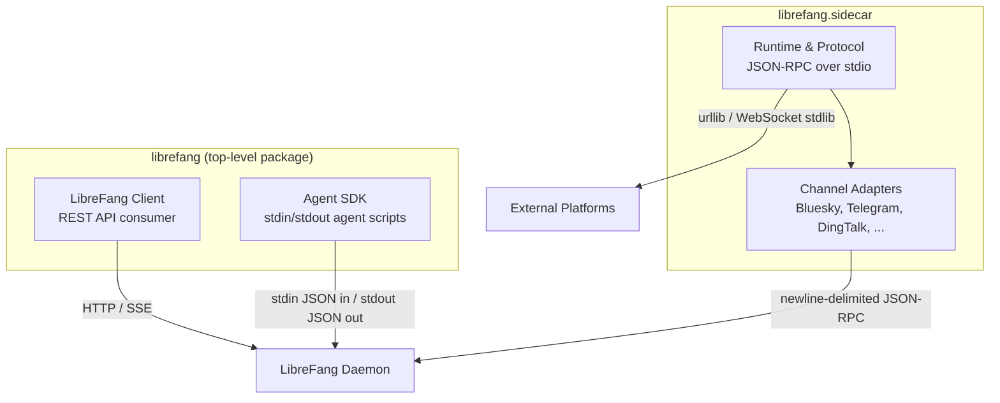

# sdk — python

# LibreFang Python SDK

A zero-dependency Python package providing three distinct interfaces to the LibreFang Agent OS. The entire stack runs on the Python standard library — no `requests`, no `aiohttp`, no `websocket-client`. This is a deliberate design constraint that lets the SDK ship inside any agent sandbox without dependency resolution.

## Architecture



The top-level `librefang/__init__.py` re-exports `Client`, `Agent`, `read_input`, `respond`, and `log`. The `sidecar` subpackage is **not** eagerly imported — pulling it in loads `asyncio` and `threading`, which would be unnecessary overhead for users who only need the REST client.

---

## Package 1: REST API Client (`librefang.librefang_client`)

### What it is

An auto-generated thin wrapper around the LibreFang REST API. Generated from `openapi.json` via `scripts/codegen-sdks.py` — do not edit `librefang_client.py` manually.

### Usage

```python
from librefang import Client

client = Client("http://localhost:4545")

# Health check
health = client.system.health()

# Create and message an agent
agent = client.agents.spawn_agent(template="assistant", name="my-bot")
reply = client.agents.send_message(agent["id"], message="Hello!")

# Stream a response token-by-token
for event in client.agents.send_message_stream(agent["id"], message="Tell me a story"):
    if event.get("type") == "text_delta":
        print(event["delta"], end="", flush=True)
```

### Resource Organization

The `LibreFang` class exposes API surfaces as attribute namespaces, each backed by a `_Resource` subclass:

| Attribute | Class | Covers |
|-----------|-------|--------|
| `client.agents` | `_AgentsResource` | Agent lifecycle, sessions, files, messaging, streaming |
| `client.sessions` | `_SessionsResource` | Cross-agent session management |
| `client.memory` | `_MemoryResource` | KV store, memory import/export |
| `client.proactive_memory` | `_ProactiveMemoryResource` | Memory items, relations, decay, search |
| `client.mcp` | `_McpResource` | MCP server registry, auth, taint rules |
| `client.skills` | `_SkillsResource` | Skills, ClawHub marketplace, evolution |
| `client.tools` | `_ToolsResource` | Tool invocation |
| `client.plugins` | `_PluginsResource` | Plugin lifecycle, context engine |
| `client.hands` | `_HandsResource` | Hand instances, marketplace, settings |
| `client.budget` | `_BudgetResource` | Per-agent / provider / user budgets, usage stats |
| `client.models` | `_ModelsResource` | Model catalog, providers, credential pools, aliases |
| `client.workflows` | `_WorkflowsResource` | Workflows, runs, schedules, triggers, cron |
| `client.channels` | `_ChannelsResource` | Channel registry, sidecar configuration |
| `client.network` | `_NetworkResource` | Comms topology, peers, event streaming |
| `client.auth` | `_AuthResource` | OAuth/passkey login, token refresh |
| `client.users` | `_UsersResource` | User CRUD, policies, provider keys |
| `client.approvals` | `_ApprovalsResource` | Approval requests, batch resolution, audit |
| `client.system` | `_SystemResource` | Health, config, backups, audit, templates |
| `client.a2a` | `_A2AResource` | Agent-to-agent discovery and messaging |
| `client.auto_dream` | `_AutoDreamResource` | Autonomous dreaming triggers |
| `client.inbox` | `_InboxResource` | Inbox status |
| `client.pairing` | `_PairingResource` | Device pairing flow |
| `client.extensions` | `_ExtensionsResource` | Extension install/uninstall |
| `client.webhooks` | `_WebhooksResource` | Agent/wake webhooks |
| `client.goals` | `_GoalsResource` | Goal templates |

### Request Mechanics

Two internal methods drive all API calls:

- **`_request(method, path, body, query)`** — synchronous HTTP via `urllib.request`. Parses JSON responses when `Content-Type` includes `application/json`; returns raw text otherwise. Query parameters with `None` values are filtered out before URL encoding.

- **`_stream(method, path, body, query)`** — SSE consumer that yields parsed JSON event dicts. Reads in 4096-byte chunks, splits on newlines, and parses `data: ` lines. Terminates on a `[DONE]` sentinel. Sets `Accept: text/event-stream`.

Both methods raise `LibreFangError` on `HTTPError`, attaching the status code and response body for diagnostics:

```python
try:
    client.agents.get_agent("nonexistent-id")
except LibreFangError as e:
    print(f"Failed: HTTP {e.status} — {e.body}")
```

### Streaming Endpoints

Several endpoints return generators instead of blocking results:

| Method | Purpose |
|--------|---------|
| `agents.send_message_stream(id, **data)` | Token-by-token agent response |
| `agents.attach_session_stream(id, session_id)` | Live session event stream |
| `network.comms_events_stream()` | Network communication events |
| `system.logs_stream()` | System log stream |

All streaming methods follow the same event-dict pattern — check `event["type"]` to discriminate between `text_delta`, `tool_call`, `done`, etc.

---

## Package 2: Agent SDK (`librefang.librefang_sdk`)

### What it is

A lightweight framework for writing Python agent scripts that execute inside the LibreFang runtime. The daemon sends a JSON message on stdin and expects a JSON response on stdout.

### Decorator-Based Agent

```python
from librefang import Agent, log

agent = Agent()

@agent.on_setup
def init():
    log("Agent starting up")

@agent.on_message
def handle(message: str, context: dict) -> str:
    agent_id = context.get("agent_id", "unknown")
    return f"Agent {agent_id} received: {message}"

@agent.on_teardown
def cleanup():
    log("Agent shutting down")

agent.run()
```

The `Agent` class manages three optional lifecycle hooks:

| Decorator | When it runs | Signature |
|-----------|-------------|-----------|
| `@agent.on_setup` | Once, before message handling | `() -> None` |
| `@agent.on_message` | Once, for the incoming message | `(message: str, context: dict) -> str \| dict` |
| `@agent.on_teardown` | Once, after response is sent (even on error) | `() -> None` |

The message handler can return:
- **`str`** — sent directly as the response text
- **`dict`** with `"text"` and optional `"metadata"` keys — both fields are forwarded
- **Any other type** — stringified via `str()`

If the handler raises, the exception message is sent as the response and the process exits with code 1. The teardown hook always runs, wrapped in its own try/except.

### Simple I/O Functions

For scripts that don't need the decorator framework:

```python
from librefang import read_input, respond, log

data = read_input()          # blocks on stdin, returns parsed dict
message = data["message"]
context = data.get("context", {})

log("Processing...")         # stderr → daemon logs
respond(f"Echo: {message}")  # stdout → daemon
```

`read_input()` reads one line from stdin. If stdin is empty (e.g., running outside the daemon), it falls back to `LIBREFANG_AGENT_ID` and `LIBREFANG_MESSAGE` environment variables, producing a synthetic event dict.

### Protocol Format

**Input** (stdin, one JSON line):
```json
{"type": "message", "agent_id": "...", "message": "Hello", "context": {}}
```

**Output** (stdout, one JSON line):
```json
{"type": "response", "text": "Hello back!", "metadata": {}}
```

### Live Progress Logging

The daemon streams every line written to stderr into its tracing subsystem under the `python_stderr` target. Enable visibility with `RUST_LOG=python_stderr=info`.

Python buffers stderr by default (~4–8 KB block buffering). To get live streaming of progress lines, use one of:

```python
# Option A: flush per-call
print("working...", file=sys.stderr, flush=True)

# Option B: line-buffered stderr
sys.stderr.reconfigure(line_buffering=True)

# Option C: run unbuffered
# python -u my_agent.py
```

The SDK's own `log()` function already flushes on every call, so prefer it over raw `print`.

---

## Package 3: Sidecar Channel Adapters (`librefang.sidecar`)

### What it is

A framework for writing out-of-process channel adapters — bridges between LibreFang and external messaging platforms (Telegram, Bluesky, Slack, DingTalk, etc.). Each adapter runs as a supervised subprocess communicating with the daemon via newline-delimited JSON-RPC over stdio.

### Why sidecar?

Previous versions of LibreFang shipped channel adapters as in-process Rust modules. The sidecar architecture moves them to supervised Python subprocesses, providing:
- Process isolation (a crash doesn't take down the daemon)
- Language flexibility (Python adapters for platforms with Python-centric ecosystems)
- Independent restart/reconnect lifecycle

### Core Abstractions

```python
from librefang.sidecar import SidecarAdapter, run_stdio, Content, protocol

class MyAdapter(SidecarAdapter):
    capabilities = ["typing"]  # optional capability flags

    async def on_send(self, cmd):
        """Deliver outbound messages to the platform."""
        # cmd.text, cmd.content, cmd.thread_id, cmd.user
        await my_platform.send(cmd.text)

    async def produce(self, emit):
        """Inbound message producer — runs for the adapter's lifetime."""
        async for msg in my_platform.poll():
            emit(protocol.message(
                user_id=msg.user_id,
                user_name=msg.user_name,
                content=Content.text(msg.text),
            ))

if __name__ == "__main__":
    run_stdio(MyAdapter())
```

**`SidecarAdapter`** — base class with overridable lifecycle methods:

| Method | Direction | Purpose |
|--------|-----------|---------|
| `produce(emit)` | Inbound | Long-running coroutine that polls/subscribes to the platform and calls `emit(event)` for each incoming message |
| `on_send(cmd)` | Outbound | Called for each `Send` command from the daemon — deliver to the platform |
| `on_shutdown()` | Lifecycle | Optional cleanup hook |

**`protocol` module** — factory functions and command types for the JSON-RPC protocol:

- `protocol.message(...)` — construct an inbound message event
- `Content.text(str)` / `Content.command(name, args)` — content variants
- Command types: `Send`, `TypingCmd`, `Reaction`, `Interactive`, `StreamStart`/`StreamDelta`/`StreamEnd`, `Shutdown`, `Heartbeat`

**`run_stdio(adapter)`** — entry point that wires the adapter to stdin/stdout, handles the `ReadyAck` handshake, and dispatches commands.

### Entry Point Pattern

Adapters expose a `run_stdio_main` entry point for `python -m` invocation:

```python
if __name__ == "__main__":
    run_stdio_main(MyAdapter)
```

This reads configuration from environment variables, instantiates the adapter, and enters the stdio event loop.

### Configuration Schema

Each adapter declares a `Schema` with typed `Field` definitions, surfaced in the LibreFang dashboard for configuration:

```python
SCHEMA = Schema(
    name="my-platform",
    display_name="My Platform",
    fields=[
        Field("MY_TOKEN", "API Token", "secret", required=True),
        Field("MY_ALLOWED_USERS", "Allowed users", "text", advanced=True),
    ],
)
```

Field types: `"text"`, `"secret"`. The `advanced=True` flag hides the field behind a disclosure in the UI.

### Runtime Responsibilities

The `runtime` module handles the split between daemon-level concerns and adapter-level concerns:

- **Daemon restart** — the daemon supervises the sidecar process and restarts it on crash
- **Platform reconnect** — the adapter handles its own reconnection to the external platform, typically with exponential backoff via `with_backoff`
- **`ProducerCrashed`** — exception type raised when the inbound producer fails unrecoverably

### Adapter Patterns

Across the first-party adapters, several patterns recur:

**Session/token management** — adapters that require authentication (Bluesky, Telegram, DingTalk) cache tokens and refresh them proactively. The Bluesky adapter, for example, refreshes its session 5 minutes before the ~90-minute expiry window and falls back to full re-authentication on refresh failure.

**Rate limiting** — all HTTP-based adapters parse `Retry-After` headers on 429 responses, sleep the indicated duration (floored at 1s, capped at 60s), and retry once before failing open. The `common.parse_retry_after` helper standardizes this.

**Message chunking** — platforms with length caps (Bluesky: 300 chars, DingTalk: 20,000 chars) use `common.split_message(text, max_len)` to break long replies into multiple sends.

**Inbound deduplication** — chat platform adapters that may replay messages on reconnect (DingTalk, QQ) use `common.SeenSet` with configurable capacity and eviction thresholds.

**Slash commands** — text starting with `/` is parsed into `Content.command(name, args)` rather than `Content.text`, enabling platform-native command routing.

**Thread context recovery** — the Bluesky adapter maintains a thread-safe LRU cache (`_LruCache`) mapping notification URIs to AT Protocol reply structs. On cache miss (sidecar restart), it recovers the reply reference via a single `getPosts` XRPC round-trip before falling back to a top-level post.

**Error visibility** — the `suppress_error_responses` class attribute controls whether internal errors are echoed back to users. Public platforms (Bluesky, Mastodon) set this to `True`; chat platforms (DingTalk, Slack) keep it `False` so users see delivery failures.

### First-Party Adapters

Available under `librefang.sidecar.adapters`:

| Module | Platform | Transport |
|--------|----------|-----------|
| `bluesky` | Bluesky / AT Protocol | HTTP polling (XRPC) |
| `telegram` | Telegram Bot API | Long-polling |
| `dingtalk` | DingTalk | WebSocket stream |
| `ntfy` | ntfy.sh | SSE inbound / HTTP outbound |
| `webhook` | Generic inbound HTTP | HTTP server |
| `slack` | Slack | WebSocket (Socket Mode) |
| `matrix` | Matrix | HTTP polling |
| `mattermost` | Mattermost | WebSocket |
| `rocketchat` | Rocket.Chat | WebSocket / REST |
| `google_chat` | Google Chat | HTTP webhook server |
| `line` | LINE Messaging | HTTP webhook |
| `feishu` | Feishu / Lark | HTTP |
| `qq` | QQ | WebSocket |
| `email` | Email | IMAP/SMTP |
| `gotify` | Gotify | WebSocket |
| `nextcloud` | Nextcloud Talk | HTTP |
| `teams` | Microsoft Teams | HTTP |

Invoke any adapter via a `[[sidecar_channels]]` config block:

```toml
[[sidecar_channels]]
name = "my-bluesky"
command = "python3"
args = ["-m", "librefang.sidecar.adapters.bluesky"]
channel_type = "bluesky"
[sidecar_channels.env]
BLUESKY_IDENTIFIER = "alice.bsky.social"
# Secrets live in ~/.librefang/secrets.env
```

### Shared Utilities (`librefang.sidecar.common`)

- `split_message(text, max_len)` — chunk text at word boundaries
- `split_csv(raw)` — parse comma-separated env var values
- `SeenSet(max_size, evict)` — bounded dedup set with FIFO eviction
- `http_request(url, method, body, headers, timeout)` — stdlib HTTP helper returning `(status, parsed_json, raw_bytes, headers)`
- `parse_retry_after(headers, default_secs)` — extract and clamp `Retry-After`
- `MAX_BACKOFF_SECS`, `RETRY_AFTER_DEFAULT_SECS` — shared constants

---

## Public API Summary

The top-level `librefang` package re-exports:

```python
from librefang import (
    Client,       # REST API client (librefang_client.LibreFang)
    Agent,        # Decorator-based agent framework (librefang_sdk.Agent)
    read_input,   # Read stdin JSON (librefang_sdk.read_input)
    respond,      # Write stdout JSON (librefang_sdk.respond)
    log,          # Structured stderr logging (librefang_sdk.log)
)
```

Import sidecar components explicitly:

```python
from librefang.sidecar import SidecarAdapter, run_stdio, Content, protocol
from librefang.sidecar.adapters.telegram import TelegramAdapter
```

---

## Requirements

- Python 3.8+
- No third-party dependencies (stdlib only)
- MIT licensed