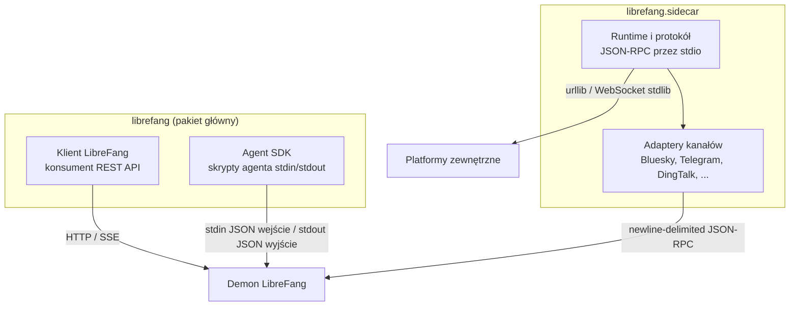

# sdk — python

# LibreFang Python SDK

Pakiet Python bez zależności zewnętrznych, udostępniający trzy oddzielne interfejsy do systemu LibreFang Agent OS. Cały stos opiera się na standardowej bibliotece Pythona — bez `requests`, bez `aiohttp`, bez `websocket-client`. Jest to celowy ograniczenie projektowe, które pozwala na uruchomienie SDK w dowolnym sandboxie agenta bez rozwiązywania zależności.

## Architektura



Główny moduł `librefang/__init__.py` re-eksportuje `Client`, `Agent`, `read_input`, `respond` i `log`. Podpakiet `sidecar` **nie** jest importowany eagerly — jego załadowanie ładuje `asyncio` i `threading`, co stanowiłoby niepotrzebny narzut dla użytkowników potrzebujących wyłącznie klienta REST.

---

## Pakiet 1: Klient REST API (`librefang.librefang_client`)

### Opis

Cienka nakładka auto-generowana na bazie LibreFang REST API. Generowana z `openapi.json` za pomocą `scripts/codegen-sdks.py` — nie edytuj `librefang_client.py` ręcznie.

### Użycie

```python
from librefang import Client

client = Client("http://localhost:4545")

# Sprawdzenie stanu (health check)
health = client.system.health()

# Utworzenie agenta i wysłanie wiadomości
agent = client.agents.spawn_agent(template="assistant", name="my-bot")
reply = client.agents.send_message(agent["id"], message="Hello!")

# Strumieniowanie odpowiedzi token po tokenie
for event in client.agents.send_message_stream(agent["id"], message="Tell me a story"):
    if event.get("type") == "text_delta":
        print(event["delta"], end="", flush=True)
```

### Organizacja zasobów

Klasa `LibreFang` eksponuje powierzchnie API jako przestrzenie nazw atrybutów, z których każda jest wspierana przez podklasę `_Resource`:

| Atrybut | Klasa | Zakres |
|-----------|-------|--------|
| `client.agents` | `_AgentsResource` | Cykl życia agentów, sesje, pliki, komunikacja, strumieniowanie |
| `client.sessions` | `_SessionsResource` | Zarządzanie sesjami międzyagentowymi |
| `client.memory` | `_MemoryResource` | Magazyn KV, import/eksport pamięci |
| `client.proactive_memory` | `_ProactiveMemoryResource` | Elementy pamięci, relacje, zanikanie, wyszukiwanie |
| `client.mcp` | `_McpResource` | Rejestr serwerów MCP, autoryzacja, reguły taint |
| `client.skills` | `_SkillsResource` | Umiejętności, marketplace ClawHub, ewolucja |
| `client.tools` | `_ToolsResource` | Wywoływanie narzędzi |
| `client.plugins` | `_PluginsResource` | Cykl życia wtyczek, silnik kontekstu |
| `client.hands` | `_HandsResource` | Instancje rąk, marketplace, ustawienia |
| `client.budget` | `_BudgetResource` | Budżety per agent / dostawca / użytkownik, statystyki użycia |
| `client.models` | `_ModelsResource` | Katalog modeli, dostawcy, pule poświadczeń, aliasy |
| `client.workflows` | `_WorkflowsResource` | Workflows, uruchomienia, harmonogramy, wyzwalacze, cron |
| `client.channels` | `_ChannelsResource` | Rejestr kanałów, konfiguracja sidecar |
| `client.network` | `_NetworkResource` | Topologia komunikacji, peery, strumieniowanie zdarzeń |
| `client.auth` | `_AuthResource` | Logowanie OAuth/passkey, odświeżanie tokenów |
| `client.users` | `_UsersResource` | CRUD użytkowników, polityki, klucze dostawców |
| `client.approvals` | `_ApprovalsResource` | Żądania zatwierdzeń, masowa resolucja, audyt |
| `client.system` | `_SystemResource` | Stan zdrowia, konfiguracja, kopie zapasowe, audyt, szablony |
| `client.a2a` | `_A2AResource` | Odkrywanie agentów i komunikacja agent-to-agent |
| `client.auto_dream` | `_AutoDreamResource` | Wyzwalacze autonomicznego śnienia |
| `client.inbox` | `_InboxResource` | Status skrzynki odbiorczej |
| `client.pairing` | `_PairingResource` | Przepływ parowania urządzeń |
| `client.extensions` | `_ExtensionsResource` | Instalacja/deinstalacja rozszerzeń |
| `client.webhooks` | `_WebhooksResource` | Webhooki agentów i wybudzania |
| `client.goals` | `_GoalsResource` | Szablony celów |

### Mechanika żądań

Dwie metody wewnętrzne napędzają wszystkie wywołania API:

- **`_request(method, path, body, query)`** — synchroniczne HTTP poprzez `urllib.request`. Analizuje odpowiedzi JSON, gdy `Content-Type` zawiera `application/json`; w przeciwnym razie zwraca surowy tekst. Parametry zapytania z wartością `None` są filtrowane przed kodowaniem URL.

- **`_stream(method, path, body, query)`** — konsument SSE, który yielduje sparsowane słowniki zdarzeń JSON. Czyta w blokach 4096 bajtów, dzieli na podstawie znaków nowej linii i analizuje linie `data: `. Kończy działanie po sygnaturze `[DONE]`. Ustawia `Accept: text/event-stream`.

Obie metody rzucają `LibreFangError` w przypadku `HTTPError`, dołączając kod statusu i treść odpowiedzi do celów diagnostycznych:

```python
try:
    client.agents.get_agent("nonexistent-id")
except LibreFangError as e:
    print(f"Błąd: HTTP {e.status} — {e.body}")
```

### Punkt końcowe strumieniowe

Kilka punktów końcowych zwraca generatory zamiast blokujących wyników:

| Metoda | Przeznaczenie |
|--------|---------|
| `agents.send_message_stream(id, **data)` | Odpowiedź agenta token po tokenie |
| `agents.attach_session_stream(id, session_id)` | Strumień zdarzeń sesji na żywo |
| `network.comms_events_stream()` | Zdarzenia komunikacji sieciowej |
| `system.logs_stream()` | Strumień logów systemowych |

Wszystkie metody strumieniowe stosują ten sam wzorzec słownika zdarzeń — sprawdzaj `event["type"]`, aby rozróżnić `text_delta`, `tool_call`, `done` itp.

---

## Pakiet 2: Agent SDK (`librefang.librefang_sdk`)

### Opis

Lekki framework do pisania skryptów agentów Pythona uruchamianych wewnątrz środowiska uruchomieniowego LibreFang. Demon wysyła komunikat JSON na stdin i oczekuje odpowiedzi JSON na stdout.

### Agent oparty na dekoratorach

```python
from librefang import Agent, log

agent = Agent()

@agent.on_setup
def init():
    log("Agent uruchamia się")

@agent.on_message
def handle(message: str, context: dict) -> str:
    agent_id = context.get("agent_id", "unknown")
    return f"Agent {agent_id} otrzymał: {message}"

@agent.on_teardown
def cleanup():
    log("Agent wyłącza się")

agent.run()
```

Klasa `Agent` zarządza trzema opcjonalnymi hookami cyklu życia:

| Dekorator | Kiedy się uruchamia | Sygnatura |
|-----------|-------------|-----------|
| `@agent.on_setup` | Raz, przed obsługą wiadomości | `() -> None` |
| `@agent.on_message` | Raz, dla nadchodzącej wiadomości | `(message: str, context: dict) -> str \| dict` |
| `@agent.on_teardown` | Raz, po wysłaniu odpowiedzi (nawet w przypadku błędu) | `() -> None` |

Procedura obsługi wiadomości może zwrócić:
- **`str`** — wysyłana bezpośrednio jako tekst odpowiedzi
- **`dict`** z kluczami `"text"` i opcjonalnym `"metadata"` — oba pola są przekazywane dalej
- **Dowolny inny typ** — konwertowany na ciąg znaków za pomocą `str()`

Jeśli procedura obsługi rzuci wyjątek, komunikat wyjątku jest wysyłany jako odpowiedź, a proces kończy się kodem 1. Hook teardown zawsze się uruchamia, owinięty we własny blok try/except.

### Proste funkcje wejścia/wyjścia

Dla skryptów, które nie potrzebują frameworka dekoratorów:

```python
from librefang import read_input, respond, log

data = read_input()          # blokuje na stdin, zwraca sparsowany słownik
message = data["message"]
context = data.get("context", {})

log("Przetwarzanie...")         # stderr → logi demona
respond(f"Echo: {message}")  # stdout → demon
```

`read_input()` czyta jedną linię ze stdin. Jeśli stdin jest pusty (np. uruchomienie poza demonem), przechodzi do zmiennych środowiskowych `LIBREFANG_AGENT_ID` i `LIBREFANG_MESSAGE`, tworząc syntetyczny słownik zdarzenia.

### Format protokołu

**Wejście** (stdin, jedna linia JSON):
```json
{"type": "message", "agent_id": "...", "message": "Hello", "context": {}}
```

**Wyjście** (stdout, jedna linia JSON):
```json
{"type": "response", "text": "Hello back!", "metadata": {}}
```

### Logowanie postępu na żywo

Demon strumieniuje każdą linię zapisaną na stderr do swojego podsystemu śledzenia pod celem `python_stderr`. Włącz widoczność za pomocą `RUST_LOG=python_stderr=info`.

Python domyślnie buforuje stderr (~4–8 KB buforowanie blokowe). Aby uzyskać strumieniowanie na żywo linii postępu, użyj jednej z opcji:

```python
# Opcja A: flush po każdym wywołaniu
print("pracuję...", file=sys.stderr, flush=True)

# Opcja B: buforowanie stderr linia po linii
sys.stderr.reconfigure(line_buffering=True)

# Opcja C: uruchomienie bez buforowania
# python -u my_agent.py
```

Wbudowana funkcja SDK `log()` już wykonuje flush przy każdym wywołaniu, więc preferuj ją nad surowym `print`.

---

## Pakiet 3: Adaptery kanałów Sidecar (`librefang.sidecar`)

### Opis

Framework do pisania adapterów kanałów spoza procesu — mostów między LibreFang a zewnętrznymi platformami komunikacyjnymi (Telegram, Bluesky, Slack, DingTalk itp.). Każdy adapter uruchamia się jako nadzorowany proces podrzędny komunikujący się z demonem za pomocą newline-delimited JSON-RPC przez stdio.

### Dlaczego sidecar?

Wcześniejsze wersje LibreFang dostarczały adaptery kanałów jako moduły Rust in-process. Architektura sidecar przenosi je do nadzorowanych procesów podrzędnych Pythona, zapewniając:
- Izolację procesów (awaria nie powoduje awarii demona)
- Elastyczność językową (adapters Pythona dla platform z ekosystemami zorientowanymi na Pythona)
- Niezależny cykl życia restartu/połączenia

### Podstawowe abstrakcje

```python
from librefang.sidecar import SidecarAdapter, run_stdio, Content, protocol

class MyAdapter(SidecarAdapter):
    capabilities = ["typing"]  # opcjonalne flagi możliwości

    async def on_send(self, cmd):
        """Dostarcza wychodzące wiadomości na platformę."""
        # cmd.text, cmd.content, cmd.thread_id, cmd.user
        await my_platform.send(cmd.text)

    async def produce(self, emit):
        """Producent wiadomości przychodzących — działa przez cały czas życia adaptera."""
        async for msg in my_platform.poll():
            emit(protocol.message(
                user_id=msg.user_id,
                user_name=msg.user_name,
                content=Content.text(msg.text),
            ))

if __name__ == "__main__":
    run_stdio(MyAdapter())
```

**`SidecarAdapter`** — klasa bazowa z nadpisywalnymi metodami cyklu życia:

| Metoda | Kierunek | Przeznaczenie |
|--------|-----------|---------|
| `produce(emit)` | Przychodzące | Długotrwała korutyna, która odpytuje/subskrybuje platformę i wywołuje `emit(event)` dla każdej nadchodzącej wiadomości |
| `on_send(cmd)` | Wychodzące | Wywoływana dla każdej komendy `Send` od demona — dostarczenie na platformę |
| `on_shutdown()` | Cykl życia | Opcjonalny hook czyszczenia |

**Moduł `protocol`** — funkcje fabrykujące i typy komend dla protokołu JSON-RPC:

- `protocol.message(...)` — konstruuje zdarzenie wiadomości przychodzącej
- `Content.text(str)` / `Content.command(name, args)` — warianty treści
- Typy komend: `Send`, `TypingCmd`, `Reaction`, `Interactive`, `StreamStart`/`StreamDelta`/`StreamEnd`, `Shutdown`, `Heartbeat`

**`run_stdio(adapter)`** — punkt wejścia, który podłącza adapter do stdin/stdout, obsługuje handshake `ReadyAck` i rozdziela komendy.

### Wzorzec punktu wejścia

Adapters eksponują punkt wejścia `run_stdio_main` do wywołania `python -m`:

```python
if __name__ == "__main__":
    run_stdio_main(MyAdapter)
```

Odczytuje konfigurację ze zmiennych środowiskowych, tworzy instancję adaptera i wchodzi w pętlę zdarzeń stdio.

### Schemat konfiguracji

Każdy adapter deklaruje `Schema` z typizowanymi definicjami `Field`, prezentowane w panelu LibreFang do konfiguracji:

```python
SCHEMA = Schema(
    name="my-platform",
    display_name="My Platform",
    fields=[
        Field("MY_TOKEN", "API Token", "secret", required=True),
        Field("MY_ALLOWED_USERS", "Dozwoleni użytkownicy", "text", advanced=True),
    ],
)
```

Typy pól: `"text"`, `"secret"`. Flaga `advanced=True` ukrywa pole za dysklożurem w interfejsie.

### Obowiązki środowiska uruchomieniowego

Moduł `runtime` obsługuje podział między kwestie na poziomie demona a kwestiami na poziomie adaptera:

- **Restart demona** — demon nadzoruje proces sidecar i restartuje go w przypadku awarii
- **Połączenie z platformą** — adapter obsługuje własne ponowne łączenie z platformą zewnętrzną, zazwyczaj z wykładniczym wycofywaniem (exponential backoff) za pomocą `with_backoff`
- **`ProducerCrashed`** — typ wyjątku rzucany, gdy producent przychodzący ulega nieodwracalnej awarii

### Wzorce adapterów

Wśród adapterów pierwszej strony kilka wzorców się powtarza:

**Zarządzanie sesją/tokenami** — adaptery wymagające autentykacji (Bluesky, Telegram, DingTalk) buforują tokeny i odświeżają je proaktywnie. Adapter Bluesky, na przykład, odświeża swoją sesję 5 minut przed oknem wygasania ~90 minut i przechodzi do pełnej ponownej autentykacji w przypadku niepowodzenia odświeżenia.

**Ograniczanie szybkości (rate limiting)** — wszystkie adaptery oparte na HTTP analizują nagłówki `Retry-After` w odpowiedziach 429, usypiają na wskazany czas (ograniczony od dołu do 1s, od góry do 60s) i próbują raz ponownie przed przejściem w tryb fail-open. Helper `common.parse_retry_after` standaryzuje to zachowanie.

**Fragmentacja wiadomości** — platformy z limitami długości (Bluesky: 300 znaków, DingTalk: 20 000 znaków) używają `common.split_message(text, max_len)` do dzielenia długich odpowiedzi na wiele wysyłek.

**Deduplikacja przychodząca** — adaptery platform czatowych, które mogą powtarzać wiadomości po ponownym połączeniu (DingTalk, QQ), używają `common.SeenSet` z konfigurowalną pojemnością i progami ewikcji.

**Komendy slash** — tekst rozpoczynający się od `/` jest parsowany do `Content.command(name, args)` zamiast `Content.text`, umożliwiając natywną obsługę komend na platformie.

**Odzyskiwanie kontekstu wątku** — adapter Bluesky utrzymuje bezpieczny dla wątków cache LRU (`_LruCache`) mapujący URI powiadomień do struktur odpowiedzi AT Protocol. Przy braku w cache (restart sidecar), odzyskuje referencję odpowiedzi poprzez pojedyncze wywołanie XRPC `getPosts`, przechodząc do publikacji najwyższego poziomu w przypadku niepowodzenia.

**Widoczność błędów** — atrybut klasowy `suppress_error_responses` kontroluje, czy błędy wewnętrzne są wyświetlane użytkownikom. Platformy publiczne (Bluesky, Mastodon) ustawiają to na `True`; platformy czatowe (DingTalk, Slack) utrzymują `False`, aby użytkownicy widzieli błędy dostarczenia.

### Adaptery pierwszej strony

Dostępne w `librefang.sidecar.adapters`:

| Moduł | Platforma | Transport |
|--------|----------|-----------|
| `bluesky` | Bluesky / AT Protocol | Odpytywanie HTTP (XRPC) |
| `telegram` | Telegram Bot API | Long-polling |
| `dingtalk` | DingTalk | Strumień WebSocket |
| `ntfy` | ntfy.sh | SSE przychodzące / HTTP wychodzące |
| `webhook` | Ogólny przychodzący HTTP | Serwer HTTP |
| `slack` | Slack | WebSocket (Socket Mode) |
| `matrix` | Matrix | Odpytywanie HTTP |
| `mattermost` | Mattermost | WebSocket |
| `rocketchat` | Rocket.Chat | WebSocket / REST |
| `google_chat` | Google Chat | Serwer webhook HTTP |
| `line` | LINE Messaging | Webhook HTTP |
| `feishu` | Feishu / Lark | HTTP |
| `qq` | QQ | WebSocket |
| `email` | Email | IMAP/SMTP |
| `gotify` | Gotify | WebSocket |
| `nextcloud` | Nextcloud Talk | HTTP |
| `teams` | Microsoft Teams | HTTP |

Wywołaj dowolny adapter za pomocą bloku konfiguracyjnego `[[sidecar_channels]]`:

```toml
[[sidecar_channels]]
name = "my-bluesky"
command = "python3"
args = ["-m", "librefang.sidecar.adapters.bluesky"]
channel_type = "bluesky"
[sidecar_channels.env]
BLUESKY_IDENTIFIER = "alice.bsky.social"
# Sekrety znajdują się w ~/.librefang/secrets.env
```

### Narzędzia współdzielone (`librefang.sidecar.common`)

- `split_message(text, max_len)` — fragmentacja tekstu na granicach słów
- `split_csv(raw)` — parsowanie wartości zmiennej środowiskowej rozdzielanej przecinkami
- `SeenSet(max_size, evict)` — ograniczony zbiór deduplikacji z ewikcją FIFO
- `http_request(url, method, body, headers, timeout)` — helper HTTP ze stdlib zwracający `(status, sparsowany_json, surowe_bajty, nagłówki)`
- `parse_retry_after(headers, default_secs)` — ekstrakcja i ograniczenie `Retry-After`
- `MAX_BACKOFF_SECS`, `RETRY_AFTER_DEFAULT_SECS` — stałe współdzielone

---

## Podsumowanie publicznego API

Główny pakiet `librefang` re-eksportuje:

```python
from librefang import (
    Client,       # Klient REST API (librefang_client.LibreFang)
    Agent,        # Framework agenta oparty na dekoratorach (librefang_sdk.Agent)
    read_input,   # Odczyt JSON ze stdin (librefang_sdk.read_input)
    respond,      # Zapis JSON na stdout (librefang_sdk.respond)
    log,          # Strukturalne logowanie stderr (librefang_sdk.log)
)
```

Importuj komponenty sidecar jawnie:

```python
from librefang.sidecar import SidecarAdapter, run_stdio, Content, protocol
from librefang.sidecar.adapters.telegram import TelegramAdapter
```

---

## Wymagania

- Python 3.8+
- Brak zależności zewnętrznych (wyłącznie stdlib)
- Licencja MIT
