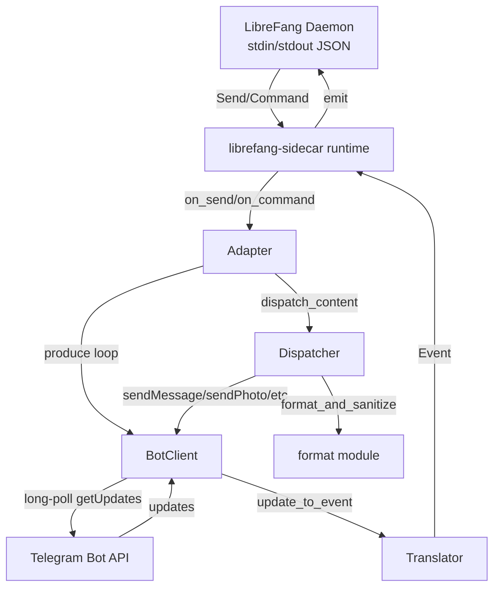

# sdk — rust

# LibreFang Rust SDK

The `sdk/rust` directory contains three crates that provide Rust integration with LibreFang Agent OS:

| Crate | Purpose |
|---|---|
| `librefang` | Async REST API client for agents, skills, models, and providers |
| `librefang-sidecar` | Framework for building channel adapters that bridge external messaging platforms to LibreFang's agent runtime |
| `librefang-sidecar-telegram` | Production Telegram adapter built on the sidecar framework |

---

## `librefang` — REST API Client

A thin async wrapper around the LibreFang REST API (default `http://localhost:4545`). Built on `reqwest` with `tokio`.

### Usage

```rust
use librefang::LibreFang;

let client = LibreFang::new("http://localhost:4545");

// Create an agent and send a message
let agent = client.agents()
    .create(librefang::agents::CreateAgentRequest {
        template: Some("assistant".to_string()),
        name: None,
    })
    .await?;

let response = client.agents()
    .message(&agent.id, "Hello!")
    .await?;
```

### Resources

Each resource is accessed via a method on the `LibreFang` client and returns deserialized types:

- **`client.agents()`** — `list()`, `get(id)`, `create(request)`, `delete(id)`, `message(id, text)`, `stream(id, text)`
- **`client.skills()`** — `list()`, `install(name)`, `uninstall(name)`
- **`client.models()`** — `list()`
- **`client.providers()`** — `list()`

Streaming responses return a `reqwest::Response` whose `bytes_stream()` can be consumed with `futures::StreamExt` for incremental SSE-style output.

---

## `librefang-sidecar` — Channel Adapter Framework

Channel adapters are external processes that translate between a messaging platform (Telegram, Discord, etc.) and LibreFang's agent runtime. The daemon launches each adapter as a subprocess and communicates over stdin/stdout using newline-delimited JSON.

### Protocol

Every adapter speaks a line-based JSON protocol. The key message types:

| Direction | Message | Purpose |
|---|---|---|
| Adapter → Daemon | `Ready` | Announces capabilities, schema; re-sent until acked |
| Adapter → Daemon | `Event` (message/callback/poll-answer) | Inbound content from the platform |
| Daemon → Adapter | `Send` | Outbound content (text, media, interactive, etc.) |
| Daemon → Adapter | `Command` | `Typing`, `Reaction`, `Interactive`, `StreamStart`/`StreamDelta`/`StreamEnd` |

### `SidecarAdapter` Trait

```rust
#[async_trait]
pub trait SidecarAdapter: Send + Sync {
    fn capabilities(&self) -> Vec<String>;
    fn header_rules(&self) -> Vec<Value>;
    async fn on_send(&self, cmd: SendCommand) -> Result<()>;
    async fn on_command(&self, cmd: Command) -> Result<()>;
    async fn produce(&self, emit: EmitFn) -> Result<()>;
}
```

- **`produce`** — Long-running loop that polls the platform and calls `emit(event)` for each inbound update. Runs on a dedicated task.
- **`on_send`** — Called when the daemon sends content to the platform (text, media, interactive keyboards, etc.).
- **`on_command`** — Called for non-content commands: typing indicators, reactions, streaming lifecycle.

### Runtime

The runtime (`librefang_sidecar::runtime`) drives the stdio loop:

1. Reads `SidecarAdapter` from stdin on start (or uses `--describe` to emit a JSON schema and exit).
2. Spawns the adapter's `produce` loop.
3. Reads newline-delimited JSON from stdin, dispatches `Send` → `on_send`, other commands → `on_command`.
4. Emits `Ready` repeatedly until the daemon acknowledges, then transitions to active event emission.
5. Malformed lines produce an error event and the loop continues — a single bad message never kills the adapter.

---

## `librefang-sidecar-telegram` — Telegram Adapter

A complete Telegram Bot API adapter implementing the `SidecarAdapter` trait. Feature-parity with the Python reference adapter (`sdk/python/librefang/sidecar/adapters/telegram.py`): same wire shape, same emoji-reaction map, same access-control semantics.

### Architecture



### Key Modules

#### `adapter.rs` — `TelegramAdapter`

Implements `SidecarAdapter`. Owns:

- **`BotClient`** — shared (`Arc`) HTTP client for all Bot API calls.
- **`AllowList`** — parsed from `ALLOWED_USERS` env var.
- **`streams`** — `Arc<Mutex<HashMap<String, StreamState>>>` tracking active streaming sessions: the placeholder `message_id`, accumulated buffer text, thread context, and last-edit timestamp for debounce throttling.

**Produce loop** (`produce`): Calls `getUpdates` with a 30-second server-side long-poll timeout and a 35-second client deadline. Handles timeouts as normal (no backoff), retries real errors with exponential backoff capped at 300 seconds. Every update is access-checked before translation.

**Streaming lifecycle**: `StreamStart` sends a `…` placeholder message and records its `message_id`. `StreamDelta` appends text to the buffer and edits the placeholder at most once per second (`STREAM_EDIT_INTERVAL_MS = 1000`). `StreamEnd` delivers the final answer as a **fresh message** (not an edit) so push notifications fire reliably, then deletes the placeholder. If the fresh send fails, falls back to editing the placeholder in place.

**HTML fallback**: Both `edit_with_fallback` and `finalize_as_new_message` attempt HTML parse mode first. If Telegram returns `"can't parse entities"`, they retry with plain text via `html_to_plain()`, which strips tags and decodes entities so the user sees readable prose instead of raw markup.

**Environment variables**:

| Variable | Default | Effect |
|---|---|---|
| `TELEGRAM_BOT_TOKEN` | (required) | Bot API token from @BotFather |
| `ALLOWED_USERS` | empty (open) | Comma-separated numeric user IDs and/or `@usernames` |
| `TELEGRAM_STREAMING` | enabled | Set to `0`/`false`/`off` to disable streaming capability |
| `TELEGRAM_CLEAR_DONE_REACTION` | false | When true, ✅ clears the reaction instead of showing 🎉 |
| `TELEGRAM_LOG` | off | One-line happy-path traces to stderr when non-empty and not `off`/`0` |

#### `api/client.rs` — `BotClient`

Reqwest wrapper around the Telegram Bot API. Key design decisions:

- **Token redaction**: `redact()` replaces the bot token with `[REDACTED]` in any string exposed via `Display` or error events. Proxies and some error paths echo the request URL (which embeds `bot<TOKEN>` in the path) back into the response body.
- **429 retry**: `call_json` and `send_multipart` retry once on `429 Too Many Requests` after sleeping for the server-supplied `retry_after` (capped at `MAX_RETRY_AFTER_SECS = 300` — a multi-hour flood-wait would stall the entire produce loop).
- **Multipart uploads**: `send_multipart` clones the byte buffer for each attempt to support retry without async-body rewinding.
- **Long-poll timeout**: `get_updates` uses a per-request timeout of `timeout_secs + LONGPOLL_CLIENT_BUFFER_SECS` (35s default) to account for Telegram's post-deadline latency.

Methods cover: `sendMessage`, `editMessageText`, `deleteMessage`, `sendChatAction`, `sendPhoto`/`Document`/`Voice`/`Audio`/`Video`/`Animation`/`Sticker`/`Location`/`MediaGroup`/`Poll`, `setMessageReaction`, `answerCallbackQuery`, `getFile`, and `send_multipart` for inline file bytes.

#### `api/types.rs` — Bot API Types

Serde structs for `Update`, `Message`, `User`, `Chat`, `CallbackQuery`, `PollAnswer`, and media types. Every struct uses `#[serde(default)]` so unknown fields from future Bot API releases don't cause deserialization failures. Response envelopes (`ApiResponse<T>`, `SendMessageResult`, `GetFileResult`, `PollResult`) are typed for the specific endpoints the adapter reads.

#### `translator.rs` — Inbound Translation

Converts Telegram `Update` objects into LibreFang `Event` values:

- **Messages** → `message` event with `Content` (Text, Image, File, Voice, Video, Audio, Animation, Sticker, Location, Command, MediaGroup)
- **`callback_query`** → `ButtonCallback` event (message_id emitted as string in both the top-level field and metadata)
- **`poll_answer`** → `PollAnswer` event

Leading `/cmd args…` text is parsed into a `Command` content variant with the `@botname` suffix stripped. Media downloads use `getFile` + `file_url()` to construct file URLs the daemon's media-fetch can retrieve (no auth header needed — the token is in the URL path).

#### `dispatcher.rs` — Outbound Dispatch

Routes externally-tagged `Content` JSON values to the appropriate Bot API call. The dispatch function:

1. Validates the content is a single-key externally-tagged object (rejects multi-key objects that could silently route to the wrong arm).
2. Matches on the tag (`Text`, `Image`, `File`, `FileData`, `Voice`, `Video`, `Audio`, `Animation`, `Sticker`, `Location`, `Command`, `Interactive`, `EditInteractive`, `DeleteMessage`, `MediaGroup`, `Poll`).
3. For text and captioned media: runs `format_and_sanitize` → sends with HTML parse mode → on `"can't parse entities"` falls back to plain text via `html_to_plain`.

Notable behaviors:

- **`FileData`**: Validates each byte-array element is an integer in `[0, 255]`; rejects malformed payloads loudly rather than silently corrupting the file. Caps at 64 MiB (`FILE_DATA_BYTE_CAP`) to prevent OOM from adversarial payloads. Detects Ogg/Opus magic bytes to route to `sendVoice` vs `sendDocument`.
- **`MediaGroup`**: Rejects nested `MediaGroup` items before recursing to prevent stack overflow. Batches into groups of 2–10 (Bot API limit); single items are dispatched individually. No per-item caption fallback — `sendMediaGroup` is atomic.
- **`Interactive`/`EditInteractive`**: Builds an inline keyboard from `buttons` array, truncating `callback_data` to 64 bytes on a UTF-8 char boundary. Falls back to plain text on parse errors so the keyboard still ships.
- **Captions**: Truncated to 1024 UTF-16 units (`CAPTION_LIMIT_UTF16`) before sending.

#### `format/markdown.rs` — Markdown → Telegram HTML

Converts a subset of Markdown to Telegram-compatible HTML. Block-level constructs: code fences (` ``` ` / ` ~~~ `), headings (`#` → `<b>`), blockquotes (`>` → `<blockquote>`), unordered lists (`-`/`*`/`+` → `•`), ordered lists (`1.` → `1.`). Inline: `**bold**`, `*italic*`, `` `code` ``, `[text](url)`.

Processing order: escape HTML → extract inline code to PUA-sentinel placeholders → bold → italic → links → restore code placeholders. The placeholder sentinels (`U+E000`/`U+E001`) are stripped by `escape_html` on input to prevent adversarial collision attacks.

#### `format/chunk.rs` — UTF-16 Message Chunking

Splits messages to respect Telegram's 4096 UTF-16 code-unit limit. Key features:

- **Tag-aware splitting**: Open HTML tags at a chunk boundary are closed with matching `</tag>` and re-opened verbatim (including attributes like `href="..."`) at the start of the next chunk.
- **Entity-boundary safety**: If a chunk ends mid-entity (`&lt` without `;`), it backs off to before the `&`. Literal ampersands followed by non-entity text are preserved.
- **Mid-tag safety**: If a chunk ends inside an HTML tag (`<` without `>`), it backs off to before the `<`.
- **Budget accounting**: Reserves space for close-tag suffixes computed from the carry-over tag stack, preventing overshoot that would trigger Telegram's `MESSAGE_TOO_LONG` error.

#### `access.rs` — `AllowList`

Parses the `ALLOWED_USERS` environment variable. Numeric entries match `user_id` exactly; `@username` entries (leading `@` optional) match case-insensitively. Empty list permits all users. Disallowed updates are silently dropped in the poll loop with no log line to avoid leaking sender identity.

#### `reaction.rs` — Emoji Reaction Map

Translates LibreFang reaction tokens to Telegram emoji:

| LibreFang | Telegram |
|---|---|
| ⏳ (working) | 👀 |
| ⚙️ (processing) | ⚡ |
| ✅ (done) | 🎉 (or cleared if `TELEGRAM_CLEAR_DONE_REACTION=true`) |
| ❌ (error) | 👎 |

---

## Configuration

Adapters are registered in `~/.librefang/config.toml`:

```toml
[[sidecar_channels]]
name = "telegram"
command = "/abs/path/to/librefang-sidecar-telegram"
args = []
restart = true

[sidecar_channels.env]
ALLOWED_USERS = "123456789, @your_username"

[sidecar_channels.secrets]
TELEGRAM_BOT_TOKEN = "123456:ABC-DEF1234ghIkl-zyx57W2v1u123ew11"
```

The `--describe` flag outputs a JSON schema for the dashboard's configure form, so adapter-specific fields are discovered automatically.

## Build

```bash
# Client SDK
cargo build -p librefang

# Telegram adapter (rustls, no system OpenSSL dependency)
cargo build --release -p librefang-sidecar-telegram
```

Binary lands at `target/release/librefang-sidecar-telegram`.

## Conformance Testing

The `librefang-sidecar` crate includes a conformance test harness (`tests/conformance.rs`) that validates adapters against a shared corpus of protocol fixtures. The Telegram adapter is feature-parity verified against the Python reference adapter — same wire shape, same `Schema`, same access-control semantics, same emoji-reaction map.