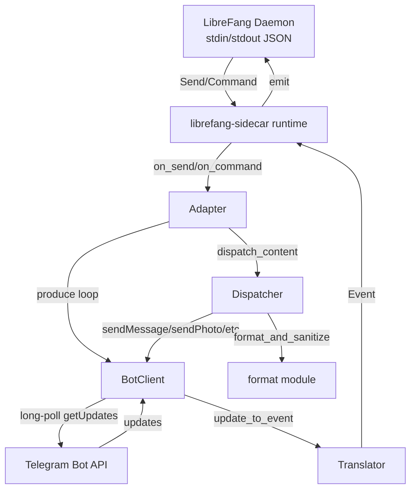

# sdk — rust

# LibreFang Rust SDK

Katalog `sdk/rust` zawiera trzy crate'y zapewniające integrację z LibreFang Agent OS w języku Rust:

| Crate | Przeznaczenie |
|---|---|
| `librefang` | Asynchroniczny klient REST API dla agentów, umiejętności, modeli i dostawców |
| `librefang-sidecar` | Szkielet do budowania adapterów kanałów, które łączą zewnętrzne platformy komunikacyjne z runtime'em agentów LibreFang |
| `librefang-sidecar-telegram` | Produkcyjny adapter Telegram zbudowany na bazie szkieletu sidecar |

---

## `librefang` — Klient REST API

Cienka, asynchroniczna nakładka na REST API LibreFang (domyślnie `http://localhost:4545`). Zbudowana na `reqwest` z `tokio`.

### Użycie

```rust
use librefang::LibreFang;

let client = LibreFang::new("http://localhost:4545");

// Utworzenie agenta i wysłanie wiadomości
let agent = client.agents()
    .create(librefang::agents::CreateAgentRequest {
        template: Some("assistant".to_string()),
        name: None,
    })
    .await?;

let response = client.agents()
    .message(&agent.id, "Hello!")
    .await?;
```

### Zasoby

Każdy zasób jest dostępny za pomocą metody na kliencie `LibreFang` i zwraca zdeserializowane typy:

- **`client.agents()`** — `list()`, `get(id)`, `create(request)`, `delete(id)`, `message(id, text)`, `stream(id, text)`
- **`client.skills()`** — `list()`, `install(name)`, `uninstall(name)`
- **`client.models()`** — `list()`
- **`client.providers()`** — `list()`

Odpowiedzi strumieniowe zwracają `reqwest::Response`, którego `bytes_stream()` można konsumować za pomocą `futures::StreamExt` w celu uzyskania przyrostowego wyjścia w stylu SSE.

---

## `librefang-sidecar` — Szkielet adapterów kanałów

Adaptery kanałów to procesy zewnętrzne, które tłumaczą między platformą komunikacyjną (Telegram, Discord itd.) a runtime'em agentów LibreFang. Demon uruchamia każdy adapter jako proces podrzędny i komunikuje się przez stdin/stdout za pomocą wierszy w formacie JSON.

### Protokół

Każdy adapter posługuje się protokołem opartym na wierszach JSON. Kluczowe typy wiadomości:

| Kierunek | Wiadomość | Przeznaczenie |
|---|---|---|
| Adapter → Demon | `Ready` | Ogłasza możliwości, schemę; wysyłana ponownie do momentu potwierdzenia |
| Adapter → Demon | `Event` (message/callback/poll-answer) | Treść przychodząca z platformy |
| Demon → Adapter | `Send` | Treść wychodząca (tekst, media, interaktywne itd.) |
| Demon → Adapter | `Command` | `Typing`, `Reaction`, `Interactive`, `StreamStart`/`StreamDelta`/`StreamEnd` |

### Cecha `SidecarAdapter`

```rust
#[async_trait]
pub trait SidecarAdapter: Send + Sync {
    fn capabilities(&self) -> Vec<String>;
    fn header_rules(&self) -> Vec<Value>;
    async fn on_send(&self, cmd: SendCommand) -> Result<()>;
    async fn on_command(&self, cmd: Command) -> Result<()>;
    async fn produce(&self, emit: EmitFn) -> Result<()>;
}
```

- **`produce`** — Długotrwała pętla odpytująca platformę i wywołująca `emit(event)` dla każdej aktualizacji przychodzącej. Uruchamiana w dedykowanym zadaniu.
- **`on_send`** — Wywoływana, gdy demon wysyła treść na platformę (tekst, media, klawiatury interaktywne itd.).
- **`on_command`** — Wywoływana dla poleceń nietreściowych: wskaźniki pisania, reakcje, cykl życia strumieniowania.

### Runtime

Runtime (`librefang_sidecar::runtime`) napędza pętlę stdio:

1. Odczytuje `SidecarAdapter` ze stdin przy starcie (lub używa `--describe`, aby wypisać schemat JSON i zakończyć).
2. Uruchamia pętlę `produce` adaptera.
3. Odczytuje wiersze JSON ze stdin, przekierowowuje `Send` → `on_send`, pozostałe polecenia → `on_command`.
4. Emituje `Ready` wielokrotnie, aż demon potwierdzi, a następnie przechodzi do aktywnego emitowania zdarzeń.
5. Nieprawidłowe wiersze generują zdarzenie błędu i pętla kontynuuje — pojedyncza zła wiadomość nigdy nie zabija adaptera.

---

## `librefang-sidecar-telegram` — Adapter Telegram

Kompletny adapter Bot API Telegram implementujący cechę `SidecarAdapter`. Pełna zgodność funkcjonalna z referencyjnym adapterem Python (`sdk/python/librefang/sidecar/adapters/telegram.py`): ten sam kształt na kablu, ta sama mapa reakcji emoji, ta sama semantyka kontroli dostępu.

### Architektura



### Kluczowe moduły

#### `adapter.rs` — `TelegramAdapter`

Implementuje `SidecarAdapter`. Posiada:

- **`BotClient`** — współdzielony (`Arc`) klient HTTP dla wszystkich wywołań Bot API.
- **`AllowList`** — parsowany ze zmiennej środowiskowej `ALLOWED_USERS`.
- **`streams`** — `Arc<Mutex<HashMap<String, StreamState>>>` śledzący aktywne sesje strumieniowania: zastępczy `message_id`, buforowany tekst, kontekst wątku i znacznik czasu ostatniej edycji do ograniczania częstotliwości.

**Pętla produce** (`produce`): Wywołuje `getUpdates` z 30-sekundowym serwerowym limitem long-poll i 35-sekundowym terminem po stronie klienta. Obsługuje limity czasu jako normalne (bez wycofania), ponawia prawdziwe błędy z wykładniczym wycofaniem skończonym na 300 sekund. Każda aktualizacja jest sprawdzana pod kątem dostępu przed translacją.

**Cykl życia strumieniowania**: `StreamStart` wysyła zastępczą wiadomość `…` i zapisuje jej `message_id`. `StreamDelta` dołącza tekst do bufora i edytuje zastępczą wiadomość co najwyżej raz na sekundę (`STREAM_EDIT_INTERVAL_MS = 1000`). `StreamEnd` dostarcza ostateczną odpowiedź jako **nową wiadomość** (nie edycję), aby powiadomienia push działały niezawodnie, a następnie usuwa zastępczą wiadomość. Jeśli wysłanie nowej wiadomości się nie powiedzie, następuje powrót do edycji zastępczej wiadomości w miejscu.

**Rezerwa HTML**: Zarówno `edit_with_fallback`, jak i `finalize_as_new_message` próbują najpierw trybu analizy HTML. Jeśli Telegram zwróci `"can't parse entities"`, ponawiają z czystym tekstem za pomocą `html_to_plain()`, która usuwa tagi i dekoduje encje, aby użytkownik widział czytelny tekst zamiast surowego znaczników.

**Zmienne środowiskowe**:

| Zmienna | Domyślnie | Efekt |
|---|---|---|
| `TELEGRAM_BOT_TOKEN` | (wymagana) | Token Bot API z @BotFather |
| `ALLOWED_USERS` | pusta (otwarta) | Rozdzielana przecinkami lista numerycznych identyfikatorów użytkowników i/lub `@usernames` |
| `TELEGRAM_STREAMING` | włączone | Ustaw na `0`/`false`/`off`, aby wyłączyć możliwość strumieniowania |
| `TELEGRAM_CLEAR_DONE_REACTION` | false | Gdy true, ✅ czyści reakcję zamiast wyświetlać 🎉 |
| `TELEGRAM_LOG` | wyłączone | Jednoliniowe ślady ścieżki optymistycznej na stderr, gdy niepuste i różne od `off`/`0` |

#### `api/client.rs` — `BotClient`

Nakładka reqwest na Bot API Telegram. Kluczowe decyzje projektowe:

- **Redakcja tokena**: `redact()` zastępuje token bota ciągiem `[REDACTED]` w dowolnym ciągu ujawnionym przez `Display` lub zdarzenia błędu. Proxy i niektóre ścieżki błędów echo'ują adres URL żądania (który zawiera `bot<TOKEN>` w ścieżce) z powrotem do treści odpowiedzi.
- **Ponowienie 429**: `call_json` i `send_multipart` ponawiają raz przy `429 Too Many Requests` po uśpieniu na czas `retry_after` podany przez serwer (maksymalnie `MAX_RETRY_AFTER_SECS = 300` — wielogodzinny flood-wait zablokowałby całą pętlę produce).
- **Wysyłanie multipart**: `send_multipart` klonuje bufor bajtów dla każdej próby, aby obsłużyć ponowienie bez przewijania async-body.
- **Limit czasu long-poll**: `get_updates` używa na żądanie limitu czasu `timeout_secs + LONGPOLL_CLIENT_BUFFER_SECS` (domyślnie 35s), aby uwzględnić opóźnienie po terminie Telegram.

Metody obejmują: `sendMessage`, `editMessageText`, `deleteMessage`, `sendChatAction`, `sendPhoto`/`Document`/`Voice`/`Audio`/`Video`/`Animation`/`Sticker`/`Location`/`MediaGroup`/`Poll`, `setMessageReaction`, `answerCallbackQuery`, `getFile` oraz `send_multipart` dla bajtów pliku inline.

#### `api/types.rs` — Typy Bot API

Struktury Serde dla `Update`, `Message`, `User`, `Chat`, `CallbackQuery`, `PollAnswer` i typów mediów. Każda struktura używa `#[serde(default)]`, aby nieznane pola z przyszłych wydań Bot API nie powodowały błędów deserializacji. Koperty odpowiedzi (`ApiResponse<T>`, `SendMessageResult`, `GetFileResult`, `PollResult`) są typowane dla konkretnych punktów końcowych, które adapter odczytuje.

#### `translator.rs` — Translacja przychodząca

Konwertuje obiekty Telegram `Update` na wartości LibreFang `Event`:

- **Wiadomości** → zdarzenie `message` z `Content` (Text, Image, File, Voice, Video, Audio, Animation, Sticker, Location, Command, MediaGroup)
- **`callback_query`** → zdarzenie `ButtonCallback` (message_id emitowany jako ciąg zarówno w polu najwyższego poziomu, jak i w metadanych)
- **`poll_answer`** → zdarzenie `PollAnswer`

Tekst zaczynający się od `/cmd args…` jest parsowany do wariantu treści `Command` z usuniętym sufiksem `@botname`. Pobieranie mediów używa `getFile` + `file_url()` do konstruowania adresów URL plików, które media-fetch demona może pobrać (nagłówek autoryzacji nie jest potrzebny — token jest w ścieżce URL).

#### `dispatcher.rs` — Wysyłanie wychodzące

Kieruje zewnętrznie otagowane wartości JSON `Content` do odpowiedniego wywołania Bot API. Funkcja wysyłania:

1. Weryfikuje, czy treść jest obiektem zewnętrznie otagowanym z jednym kluczem (odrzuca obiekty z wieloma kluczami, które mogłyby cicho skierować się do niewłaściwego wariantu).
2. Dopasowuje tag (`Text`, `Image`, `File`, `FileData`, `Voice`, `Video`, `Audio`, `Animation`, `Sticker`, `Location`, `Command`, `Interactive`, `EditInteractive`, `DeleteMessage`, `MediaGroup`, `Poll`).
3. Dla tekstu i mediów z podpisem: uruchamia `format_and_sanitize` → wysyła z trybem analizy HTML → przy `"can't parse entities"` powraca do czystego tekstu przez `html_to_plain`.

Godne uwagi zachowania:

- **`FileData`**: Weryfikuje, że każdy element tablicy bajtów jest liczbą całkowitą w `[0, 255]`; odrzuca nieprawidłowe ładunki głośno zamiast cichego uszkodzenia pliku. Ogranicza do 64 MiB (`FILE_DATA_BYTE_CAP`) aby zapobiec OOM z wrogich ładunków. Wykrywa bajty magiczne Ogg/Opus, aby kierować do `sendVoice` vs `sendDocument`.
- **`MediaGroup`**: Odrzuca zagnieżdżone elementy `MediaGroup` przed rekurencją, aby zapobiec przepełnieniu stosu. Grupuje w paczki po 2–10 (limit Bot API); pojedyncze elementy są wysyłane indywidualnie. Brak rezerwy podpisu per-element — `sendMediaGroup` jest atomowy.
- **`Interactive`/`EditInteractive`**: Buduje klawiaturę inline z tablicy `buttons`, obcinając `callback_data` do 64 bajtów na granicy znaku UTF-8. Powraca do czystego tekstu przy błędach analizy, aby klawiatura nadal została wysłana.
- **Podpisy**: Obcinane do 1024 jednostek UTF-16 (`CAPTION_LIMIT_UTF16`) przed wysłaniem.

#### `format/markdown.rs` — Markdown → HTML Telegram

Konwertuje podzbiór Markdown do kompatybilnego z Telegram HTML. Konstrukcje blokowe: bloki kodu (` ``` ` / ` ~~~ `), nagłówki (`#` → `<b>`), cytaty blokowe (`>` → `<blockquote>`), listy nieuporządkowane (`-`/`*`/`+` → `•`), listy uporządkowane (`1.` → `1.`). W linii: `**bold**`, `*italic*`, `` `code` ``, `[text](url)`.

Kolejność przetwarzania: escape HTML → wyodrębnienie kodu w linii do symboli zastępczych PUA → bold → italic → linki → przywrócenie symboli zastępczych kodu. Sybole zastępcze (`U+E000`/`U+E001`) są usuwane przez `escape_html` na wejściu, aby zapobiec atakom kolizji.

#### `format/chunk.rs` — Fragmentacja wiadomości UTF-16

Dzieli wiadomości z poszanowaniem limitu 4096 jednostek kodowych UTF-16 Telegram. Kluczowe funkcje:

- **Dzielenie z świadomością tagów**: Otwarte tagi HTML na granicy fragmentu są zamykane pasującym `</tag>` i ponownie otwierane dosłownie (w tym atrybuty takie jak `href="..."`) na początku następnego fragmentu.
- **Bezpieczeństwo granic encji**: Jeśli fragment kończy się w środku encji (`&lt` bez `;`), cofa się przed `&`. Dosłowne ampersandy następujące po tekście nienależącym do encji są zachowane.
- **Bezpieczeństwo wewnątrz tagu**: Jeśli fragment kończy się wewnątrz tagu HTML (`<` bez `>`), cofa się przed `<`.
- **Kalkulacja budżetu**: Rezerwuje miejsce na sufiksy tagów zamykających obliczone ze stosu przenoszonych tagów, zapobiegając przekroczeniu, które wywołałoby błąd `MESSAGE_TOO_LONG` Telegram.

#### `access.rs` — `AllowList`

Parsuje zmienną środowiskową `ALLOWED_USERS`. Wpisy liczbowe pasują dokładnie do `user_id`; wpisy `@username` (wiodący `@` opcjonalny) pasują bez uwzględniania wielkości liter. Pusta lista zezwala wszystkim użytkownikom. Niedozwolone aktualizacje są cicho odrzucane w pętli odpytywania bez linii logu, aby uniknąć ujawnienia tożsamości nadawcy.

#### `reaction.rs` — Mapa reakcji emoji

Tłumaczy tokeny reakcji LibreFang na emoji Telegram:

| LibreFang | Telegram |
|---|---|
| ⏳ (pracuję) | 👀 |
| ⚙️ (przetwarzam) | ⚡ |
| ✅ (gotowe) | 🎉 (lub usunięte jeśli `TELEGRAM_CLEAR_DONE_REACTION=true`) |
| ❌ (błąd) | 👎 |

---

## Konfiguracja

Adaptery są rejestrowane w `~/.librefang/config.toml`:

```toml
[[sidecar_channels]]
name = "telegram"
command = "/abs/path/to/librefang-sidecar-telegram"
args = []
restart = true

[sidecar_channels.env]
ALLOWED_USERS = "123456789, @your_username"

[sidecar_channels.secrets]
TELEGRAM_BOT_TOKEN = "123456:ABC-DEF1234ghIkl-zyx57W2v1u123ew11"
```

Flaga `--describe` wypisuje schemat JSON dla formularza konfiguracji dashboardu, więc pola specyficzne dla adaptera są odkrywane automatycznie.

## Kompilacja

```bash
# SDK klienta
cargo build -p librefang

# Adapter Telegram (rustls, bez zależności systemowego OpenSSL)
cargo build --release -p librefang-sidecar-telegram
```

Plik binarny trafia do `target/release/librefang-sidecar-telegram`.

## Testy zgodności

Crate `librefang-sidecar` zawiera strukturę testów zgodności (`tests/conformance.rs`), która weryfikuje adaptery względem współdzielonego korpusu danych testowych protokołu. Adapter Telegram jest sprawdzany pod kątem pełnej zgodności funkcjonalnej z referencyjnym adapterem Python — ten sam kształt na kablu, to samo `Schema`, ta sama semantyka kontroli dostępu, ta sama mapa reakcji emoji.