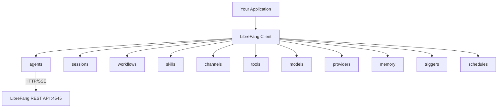

# SDKs

# LibreFang SDKs

Official client libraries for the LibreFang Agent OS REST API. Four language implementations — Go, JavaScript/TypeScript, Python, and Rust — share a common resource-oriented architecture and expose the same set of REST endpoints.

## Architecture

All SDKs follow the same structural pattern: a top-level client object holds a base URL and HTTP configuration, and exposes resource objects (agents, sessions, workflows, skills, etc.) that map 1:1 to REST API path prefixes.



Each resource delegates to a shared internal HTTP method (`doRequest` / `_request` / `_request`) that handles serialization, error wrapping, and response parsing. A separate streaming path (`doStream` / `_stream` / `_stream`) reads Server-Sent Events and yields parsed JSON objects incrementally.

## Installation

| Language | Package | Install |
|----------|---------|---------|
| Go | `github.com/librefang/librefang/sdk/go` | `go get github.com/librefang/librefang/sdk/go` |
| JavaScript | `@librefang/sdk` | `npm install @librefang/sdk` |
| Python | `librefang-sdk` | `pip install librefang-sdk` |
| Rust | `librefang` | Add to `Cargo.toml` |

### Requirements

- **Go**: 1.21+
- **JavaScript**: Node.js 18+ (uses native `fetch`)
- **Python**: 3.8+ (zero external dependencies — uses stdlib `urllib`)
- **Rust**: Edition 2021, async runtime (`tokio`), `reqwest` with `json` feature

## Client Construction

All SDKs construct a client from a base URL. The URL has its trailing slash stripped automatically.

**Go:**
```go
client := librefang.New("http://localhost:4545")
```

**JavaScript:**
```javascript
const { LibreFang } = require("@librefang/sdk");
const client = new LibreFang("http://localhost:4545", { headers: { "Authorization": "Bearer ..." } });
```

**Python:**
```python
from librefang import Client
client = Client("http://localhost:4545", headers={"Authorization": "Bearer ..."})
```

**Rust:**
```rust
let client = LibreFang::new("http://localhost:4545");
```

Custom headers can be passed at construction time in Go, JavaScript, and Python. The Go client exposes its `HTTP` field (`*http.Client`) for transport-level customization (timeouts, TLS, proxies). The Rust client uses `reqwest::Client` internally.

## Resource API Reference

Each resource below lists the method signatures across all four languages. Methods marked with 🔄 support streaming responses via SSE.

### Agents — `client.Agents` / `client.agents` / `client.agents()`

The most feature-rich resource. Manages agent lifecycle, messaging, session switching, identity, and configuration.

| Operation | Go | JavaScript | Python | Rust |
|-----------|----|-----------|--------|------|
| List | `Agents.List()` `[]map` | `agents.list()` | `agents.list()` | `agents().list()` `AgentListResponse` |
| Get | `Agents.Get(id)` | `agents.get(id)` | `agents.get(id)` | `agents().get(id)` `Agent` |
| Create | `Agents.Create(params)` | `agents.create(opts)` | `agents.create(**kwargs)` | `agents().create(req)` `Agent` |
| Delete | `Agents.Delete(id)` | `agents.delete(id)` | `agents.delete(id)` | `agents().delete(id)` |
| Stop | `Agents.Stop(id)` | `agents.stop(id)` | `agents.stop(id)` | — |
| Clone | `Agents.Clone(id)` | `agents.clone(id)` | `agents.clone(id)` | — |
| Update | `Agents.Update(id, data)` | `agents.update(id, data)` | `agents.update(id, **data)` | — |
| Set mode | `Agents.SetMode(id, mode)` | `agents.setMode(id, mode)` | `agents.set_mode(id, mode)` | — |
| Set model | `Agents.SetModel(id, model)` | `agents.setModel(id, model)` | `agents.set_model(id, model)` | — |
| Message | `Agents.Message(id, text, opts?)` | `agents.message(id, text, opts?)` | `agents.message(id, text, **opts)` | `agents().message(id, text)` `MessageResponse` |
| 🔄 Stream | `Agents.Stream(id, text, opts?)` `<-chan map` | `agents.stream(id, text, opts?)` `AsyncIterable` | `agents.stream(id, text, **opts)` `Generator[Dict]` | `agents().stream(id, text)` `reqwest::Response` |
| Get session | `Agents.Session(id)` | `agents.session(id)` | `agents.session(id)` | — |
| Reset session | `Agents.ResetSession(id)` | `agents.resetSession(id)` | `agents.reset_session(id)` | — |
| Compact session | — | `agents.compactSession(id)` | `agents.compact_session(id)` | — |
| List sessions | `Agents.ListSessions(id)` | `agents.listSessions(id)` | `agents.list_sessions(id)` | — |
| Create session | `Agents.CreateSession(id, label)` | `agents.createSession(id, label)` | `agents.create_session(id, label)` | — |
| Switch session | `Agents.SwitchSession(id, sessionID)` | `agents.switchSession(id, sessionId)` | `agents.switch_session(id, session_id)` | — |
| Get skills | `Agents.GetSkills(id)` | `agents.getSkills(id)` | `agents.get_skills(id)` | — |
| Set skills | `Agents.SetSkills(id, skills)` | `agents.setSkills(id, skills)` | `agents.set_skills(id, skills)` | — |
| Set identity | `Agents.SetIdentity(id, identity)` | `agents.setIdentity(id, identity)` | `agents.set_identity(id, **identity)` | — |
| Patch config | `Agents.PatchConfig(id, config)` | `agents.patchConfig(id, config)` | `agents.patch_config(id, **config)` | — |
| Upload file | — | `agents.upload(id, file, filename)` | — | — |

The `Message` methods accept optional extra parameters that are merged into the request body alongside the `message` field. The `Stream` methods return platform-appropriate async iterators or channels that yield SSE event objects.

### Sessions — `client.Sessions` / `client.sessions` / `client.sessions()`

| Operation | Method |
|-----------|--------|
| List | `.List()` / `.list()` |
| Delete | `.Delete(id)` / `.delete(id)` |
| Set label | `.SetLabel(id, label)` / `.setLabel(id, label)` |

### Workflows — `client.Workflows` / `client.workflows`

| Operation | Method |
|-----------|--------|
| List | `.List()` / `.list()` |
| Create | `.Create(workflow)` / `.create(workflow)` |
| Run | `.Run(id, input)` / `.run(id, input)` |
| List runs | `.Runs(id)` / `.runs(id)` |

### Skills — `client.Skills` / `client.skills`

| Operation | Method |
|-----------|--------|
| List | `.List()` / `.list()` |
| Install | `.Install(skill)` / `.install(skill)` |
| Uninstall | `.Uninstall(skill)` / `.uninstall(skill)` |
| Search marketplace | `.Search(query)` / `.search(query)` |

### Channels — `client.Channels` / `client.channels`

| Operation | Method |
|-----------|--------|
| List | `.List()` / `.list()` |
| Configure | `.Configure(name, config)` / `.configure(name, config)` |
| Remove | `.Remove(name)` / `.remove(name)` |
| Test | `.Test(name)` / `.test(name)` |

### Tools — `client.Tools` / `client.tools`

Read-only listing: `.List()` / `.list()`.

### Models — `client.Models` / `client.models`

| Operation | Method |
|-----------|--------|
| List | `.List()` / `.list()` |
| Get | `.Get(id)` / `.get(id)` |
| Aliases | `.Aliases()` / `.aliases()` |

The Rust SDK deserializes into typed `Model` structs with fields like `supports_streaming`, `context_window`, and `max_output_tokens`.

### Providers — `client.Providers` / `client.providers`

| Operation | Method |
|-----------|--------|
| List | `.List()` / `.list()` |
| Set API key | `.SetKey(name, key)` / `.setKey(name, key)` |
| Delete API key | `.DeleteKey(name)` / `.deleteKey(name)` |
| Test connection | `.Test(name)` / `.test(name)` |

### Memory — `client.Memory` / `client.memory`

Per-agent key-value store scoped under `/api/memory/agents/{agentId}/kv/`.

| Operation | Method |
|-----------|--------|
| Get all | `.GetAll(agentID)` / `.getAll(agentId)` |
| Get key | `.Get(agentID, key)` / `.get(agentId, key)` |
| Set key | `.Set(agentID, key, value)` / `.set(agentId, key, value)` |
| Delete key | `.Delete(agentID, key)` / `.delete(agentId, key)` |

### Triggers — `client.Triggers` / `client.triggers`

| Operation | Method |
|-----------|--------|
| List | `.List()` / `.list()` |
| Create | `.Create(trigger)` / `.create(trigger)` |
| Update | `.Update(id, trigger)` / `.update(id, trigger)` |
| Delete | `.Delete(id)` / `.delete(id)` |

### Schedules — `client.Schedules` / `client.schedules`

| Operation | Method |
|-----------|--------|
| List | `.List()` / `.list()` |
| Create | `.Create(schedule)` / `.create(schedule)` |
| Update | `.Update(id, schedule)` / `.update(id, schedule)` |
| Delete | `.Delete(id)` / `.delete(id)` |
| Run | `.Run(id)` / `.run(id)` |

### Server Information

These are top-level methods on the client itself, not on a sub-resource:

| Method | Description |
|--------|-------------|
| `Health()` / `health()` | Basic liveness check |
| `HealthDetail()` / `healthDetail()` | Detailed component health |
| `Status()` / `status()` | Server status overview |
| `Version()` / `version()` | Server version info |
| `Metrics()` / `metrics()` | Prometheus-format metrics (text) |
| `Usage()` / `usage()` | Usage statistics |
| `Config()` / `config()` | Current server configuration |

## Streaming

All SDKs implement SSE (Server-Sent Events) parsing for the `/api/agents/{id}/message/stream` endpoint. The stream yields JSON objects with a `type` field:

| Event type | Field | Description |
|-----------|-------|-------------|
| `text_delta` | `delta` | Incremental text token |
| `tool_call` | `tool` | Agent is invoking a tool |
| `done` | — | Stream complete |
| (terminal) | — | Server sends `data: [DONE]` |

### Go Streaming

`Agents.Stream()` returns `<-chan map[string]interface{}`. The goroutine closes the channel when the stream ends or `[DONE]` is received:

```go
for event := range client.Agents.Stream(agentID, "Hello") {
    if delta, ok := event["delta"].(string); ok {
        fmt.Print(delta)
    }
}
```

The internal `doStream` method runs in a goroutine, reads 4096-byte chunks from the response body, splits on newlines, and parses lines prefixed with `data: `.

### JavaScript Streaming

`agents.stream()` is an async generator using the Fetch API's `ReadableStream`:

```javascript
for await (const event of client.agents.stream(agentID, "Hello")) {
    if (event.type === "text_delta") process.stdout.write(event.delta);
}
```

The internal `_stream` method uses a `TextDecoder` and line buffer to handle partial SSE frames across chunk boundaries.

### Python Streaming

`agents.stream()` is a `Generator[Dict, None, None]` using stdlib `urllib`:

```python
for event in client.agents.stream(agent_id, "Hello"):
    if event.get("type") == "text_delta":
        print(event["delta"], end="", flush=True)
```

### Rust Streaming

`agents().stream()` returns the raw `reqwest::Response`. Use `futures::StreamExt` to iterate byte chunks:

```rust
let response = client.agents().stream(&agent.id, "Hello").await?;
let mut stream = response.bytes_stream();
while let Some(chunk) = stream.next().await {
    print!("{}", String::from_utf8_lossy(&chunk?));
}
```

SSE parsing is left to the caller in the Rust SDK.

## Error Handling

All SDKs wrap HTTP errors in a custom error type:

| Language | Type | Fields |
|----------|------|--------|
| Go | `*LibreFangError` | `Status int`, `Message string`, `Body string` |
| JavaScript | `LibreFangError` (extends `Error`) | `status`, `body` |
| Python | `LibreFangError` (extends `Exception`) | `status`, `body` |
| Rust | `Error::Api(String)` or `Error::Http(reqwest::Error)` | — |

Errors are raised for any HTTP status ≥ 400. The Go SDK checks this threshold in `doRequest`, JavaScript in `_request` via `res.ok`, Python via catching `HTTPError`, and Rust via `status.is_success()`.

## Python Agent SDK

The Python package includes a second, distinct interface for **writing agents that run inside LibreFang** (as opposed to controlling it remotely). This lives in `librefang_sdk.py` and is imported via the top-level `__init__.py`.

### Simple I/O Functions

For scripts that receive a single message and return a response:

```python
from librefang import read_input, respond

data = read_input()       # Reads JSON from stdin, falls back to env vars
result = process(data)
respond(result)           # Writes JSON to stdout
```

`read_input()` reads a JSON line from stdin. If stdin is empty, it falls back to `LIBREFANG_AGENT_ID` and `LIBREFANG_MESSAGE` environment variables. `respond()` writes a JSON object with `type: "response"` and an optional `metadata` field.

### Decorator-Based Agent

For structured agent lifecycle:

```python
from librefang import Agent

agent = Agent()

@agent.on_setup
def setup():
    # Called once before message handling
    pass

@agent.on_message
def handle(message: str, context: dict) -> str:
    return f"Echo: {message}"

@agent.on_teardown
def cleanup():
    # Called once after message handling (even on error)
    pass

agent.run()
```

The handler can return a `str`, a `dict` with `text` and `metadata` keys, or any value (stringified). Errors are caught, logged to stderr, and sent back as responses.

### Logging

`log(message, level="info")` writes to stderr, which appears in the LibreFang daemon logs.

## Type Safety

### Rust Typed Responses

The Rust SDK deserializes API responses into strongly-typed structs:

- `Agent` — `id`, `name`, `template`, `status`
- `Model` — `id`, `display_name`, `provider`, `supports_streaming`, `supports_tools`, `max_output_tokens`, `context_window`
- `Provider` — `id`, `display_name`, `status`, `api_key_configured`, `default_model`
- `Skill` — `name`, `description`, `author`, `version`, `enabled`, `has_prompt_context`, `tools_count`
- `MessageResponse` — `response`, `input_tokens`, `output_tokens`, `iterations`

Request structs like `CreateAgentRequest` and `SendMessageRequest` use `Option` fields for nullable parameters.

### JavaScript TypeScript Definitions

The JavaScript package ships with `index.d.ts`. Import with TypeScript works directly:

```typescript
import { LibreFang } from "@librefang/sdk";
const client: LibreFang = new LibreFang("http://localhost:4545");
```

### Go and Python

These SDKs use `map[string]interface{}` (Go) and `Dict[str, Any]` (Python) as the universal response type. Helper functions `toMap`, `toSlice`, and `getSlice` in Go handle type conversion from the JSON-decoded `interface{}` values.

## Feature Matrix

Not all resources are implemented in every language yet:

| Resource | Go | JavaScript | Python | Rust |
|----------|:--:|:----------:|:------:|:----:|
| Agents (full) | ✅ | ✅ | ✅ | ✅ (partial) |
| Sessions | ✅ | ✅ | ✅ | — |
| Workflows | ✅ | ✅ | ✅ | — |
| Skills | ✅ | ✅ | ✅ | ✅ |
| Channels | ✅ | ✅ | ✅ | — |
| Tools | ✅ | ✅ | ✅ | — |
| Models | ✅ | ✅ | ✅ | ✅ |
| Providers | ✅ | ✅ | ✅ | ✅ |
| Memory | ✅ | ✅ | ✅ | — |
| Triggers | ✅ | ✅ | ✅ | — |
| Schedules | ✅ | ✅ | ✅ | — |
| Streaming | ✅ | ✅ | ✅ | Raw response |
| File upload | — | ✅ | — | — |
| Agent SDK | — | — | ✅ | — |

## Module Structure

```
sdk/
├── go/
│   ├── librefang.go          # Client, all resource types, HTTP/SSE logic
│   ├── go.mod
│   ├── examples/
│   │   ├── basic.go           # Create agent, send message
│   │   ├── streaming.go       # Stream agent response
│   │   └── test_apis.go       # List skills/models/providers
│   └── README.md
├── javascript/
│   ├── index.js               # LibreFang class, all resources, HTTP/SSE
│   ├── index.d.ts             # TypeScript definitions
│   ├── package.json
│   ├── examples/
│   │   ├── basic.js
│   │   └── streaming.js
│   └── README.md
├── python/
│   ├── librefang/
│   │   ├── __init__.py        # Re-exports Client, Agent, read_input, respond, log
│   │   ├── librefang_client.py # REST API client (zero deps)
│   │   └── librefang_sdk.py   # In-process agent framework
│   ├── pyproject.toml
│   ├── setup.py
│   ├── examples/
│   │   ├── client_basic.py
│   │   ├── client_streaming.py
│   │   └── echo_agent.py
│   └── README.md
└── rust/
    ├── src/
    │   ├── lib.rs              # LibreFang client, Error type, re-exports
    │   ├── agents.rs           # Agent CRUD, message, stream
    │   ├── models.rs           # Model listing
    │   ├── providers.rs        # Provider listing
    │   └── skills.rs           # Skill listing, install, uninstall
    ├── Cargo.toml
    ├── examples/
    │   └── basic.rs
    └── README.md
```

## Contributing

When adding a new API endpoint, update all four SDKs in parallel. The pattern is:

1. Add a method to the relevant resource struct/class in each language
2. The method should delegate to the shared `_request` / `doRequest` / `_request` internal method with the correct HTTP verb and path
3. For list endpoints, use `toSlice`/`getSlice` (Go) or return the raw response (other languages)
4. Add an example or extend an existing one to validate the new method