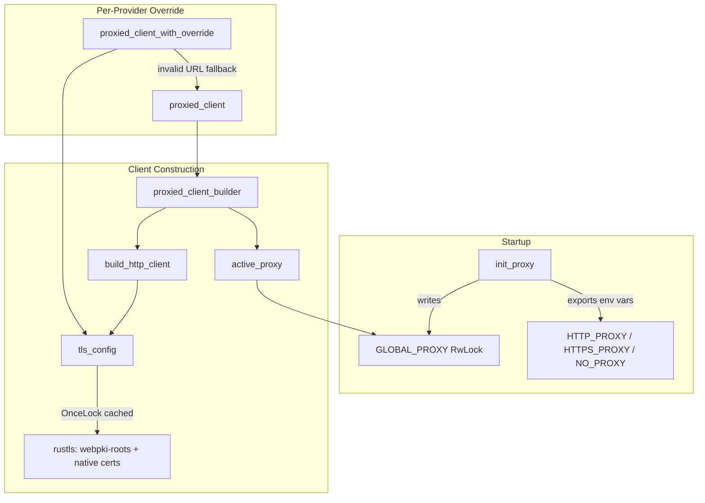

# Shared Infrastructure — librefang-http-src

# librefang-http

Centralized HTTP client construction with proxy support and portable TLS roots. Every outbound HTTP connection in the agent should go through this crate so that proxy settings and certificate trust are applied uniformly.

## Why this crate exists

Two problems arise when using a bare `reqwest::Client` across the agent:

1. **Missing system CA certificates.** On musl builds (Termux/Android), minimal Docker images, or corporate Linux with partial CA bundles, `reqwest`'s default TLS initialization panics because it cannot find a system trust store.
2. **Inconsistent proxy settings.** Different crates building their own `reqwest::Client` might or might not read `HTTP_PROXY` / `HTTPS_PROXY` env vars, leading to inconsistent routing.

`librefang-http` solves both by providing pre-configured client builders that bundle Mozilla CA roots as a fallback and apply proxy settings from a single global source of truth.

## Architecture



## Initialization sequence

At daemon startup, call [`init_proxy`] exactly once with the `[proxy]` section from `config.toml`:

```rust
let proxy_cfg: ProxyConfig = config.proxy;
librefang_http::init_proxy(proxy_cfg);
```

This does two things:

1. **Exports proxy values as environment variables** (`HTTP_PROXY`, `HTTPS_PROXY`, `NO_PROXY` and their lowercase variants). This happens only during the initial bootstrap call—before the Tokio runtime spawns worker threads—because `std::env::set_var` is racy in a multi-threaded process.
2. **Stores the config in `GLOBAL_PROXY`.** Subsequent calls (e.g. hot-reload) update only the `RwLock`-guarded global, avoiding unsound `set_var` calls from a multi-threaded context.

## TLS configuration

[`tls_config()`] returns a `rustls::ClientConfig` that combines two certificate sources:

1. **Bundled Mozilla CA roots** (`webpki_roots::TLS_SERVER_ROOTS`) — always loaded, ensuring common public CAs are trusted everywhere.
2. **System CA certificates** (`rustls_native_certs::load_native_certs`) — supplements the bundled set with org-internal and self-signed CAs.

The result is computed once and cached in a `OnceLock`. All client builders call `tls_config()` to share the same TLS configuration.

If no system certificates are found, a debug-level log message is emitted and the bundled roots are used exclusively.

## Client builder API

### Primary entry points

| Function | Returns | Use when |
|---|---|---|
| [`proxied_client_builder()`] | `reqwest::ClientBuilder` | You need to customize the client (add headers, override timeouts, etc.) |
| [`proxied_client()`] | `reqwest::Client` | You just need a ready-to-use client |

Both read the global proxy config via `active_proxy()` and apply the shared TLS config. The builder is pre-configured with:

- **User-Agent:** `librefang/<version>`
- **Connect timeout:** 30 seconds
- **Read timeout:** 300 seconds (per-read inactivity, not total request time—streaming LLM responses stay alive as long as tokens arrive)

### Per-provider proxy override

[`proxied_client_with_override(proxy_url)`] builds a client that routes **all** traffic through the given proxy URL, bypassing the global config entirely. If the URL is invalid, it logs a warning and falls back to the global proxy client.

Used by provider-specific code that needs to route through a different proxy than the global default.

### Internal builder

[`build_http_client(proxy: &ProxyConfig)`] is the core construction function. It:

1. Calls `tls_config()` for the preconfigured TLS backend.
2. Sets the user agent and default timeouts.
3. Applies explicit `ProxyConfig` values as `reqwest::Proxy` objects with an optional `NoProxy` filter.
4. When `ProxyConfig` fields are `None`, **does nothing**—reqwest's built-in env var detection handles the fallback automatically, avoiding double-application of proxy settings that `init_proxy` already exported.

### Legacy aliases

- [`client_builder()`] → `proxied_client_builder()`
- [`new_client()`] → `proxied_client()`

These exist for backward compatibility. Prefer the newer names in new code.

## Proxy resolution order

When a request is made through a client built by this crate, proxy resolution follows this precedence:

1. **Explicit config values** from `ProxyConfig` (set via `init_proxy` from `config.toml`).
2. **Environment variables** (`HTTP_PROXY`, `HTTPS_PROXY`, `NO_PROXY`) when config values are `None`. Since `init_proxy` exports config values as env vars during bootstrap, this acts as a consistent fallback.
3. **No proxy** if neither source provides a value.

### Supported proxy schemes

Validated by `is_valid_proxy_url()`:

| Scheme | Supported |
|---|---|
| `http://` | ✅ |
| `https://` | ✅ |
| `socks5://` | ✅ |
| `socks5h://` | ✅ |
| Other | ❌ (warns and skips) |

## Thread safety

| Component | Mechanism | Notes |
|---|---|---|
| `TLS_CONFIG` | `OnceLock` | Write-once, lock-free reads after initialization |
| `GLOBAL_PROXY` | `RwLock<Option<ProxyConfig>>` | Supports hot-reload via `init_proxy`; readers use `active_proxy()` |
| `std::env::set_var` | Only during bootstrap | Called before worker threads exist; never during hot-reload |

## Usage across the codebase

This crate is a shared infrastructure dependency. Downstream consumers include:

- **librefang-runtime** — provider health probes, tool execution (web fetch/search), embedding clients, image generation, TTS, media transcription, catalog sync
- **librefang-runtime-oauth** — OAuth device flows, token refresh for ChatGPT and Copilot
- **librefang-runtime-mcp** — MCP SSE and HTTP connections
- **librefang-runtime-wasm** — host network fetch from WASM guests
- **librefang-kernel** — device pairing notifications
- **librefang-cli** — CLI HTTP client construction