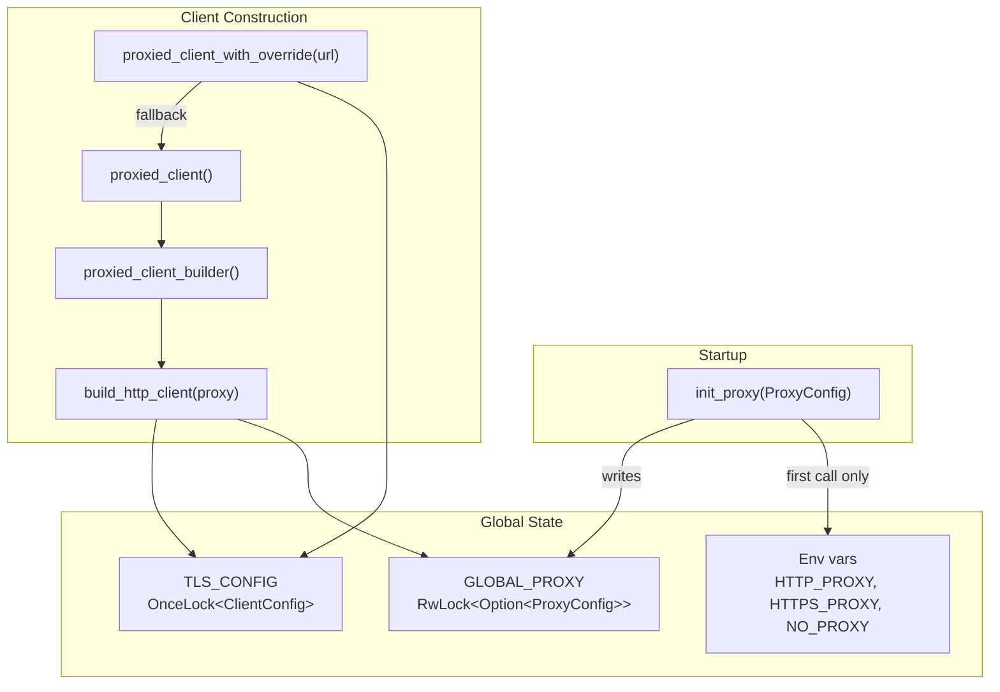

# Shared Infrastructure — librefang-http-src

# librefang-http — Centralized HTTP Client with Proxy & TLS Fallback

## Purpose

Every outbound HTTP connection in the application flows through this module. It solves two infrastructure problems that would otherwise cause silent failures:

1. **Missing system CA certificates** — minimal Docker images, musl builds on Termux/Android, and corporate Linux with partial CA bundles can cause `reqwest`'s default TLS initialization to panic. This module always seeds the trust store with bundled Mozilla CA roots and supplements with system certs when available.

2. **Inconsistent proxy settings** — without a single source of truth, different crates would read proxy configuration differently (or not at all). This module centralizes proxy configuration from `config.toml`, exports it to environment variables for compatibility, and applies it uniformly to every client.

All crates that make HTTP calls should use `proxied_client_builder()` or `proxied_client()` rather than constructing `reqwest::Client` directly.

---

## Architecture



---

## Initialization Sequence

### `init_proxy(cfg: ProxyConfig)`

Call once at daemon startup with the `[proxy]` section from `config.toml`. Can be called again for hot-reload.

**First call (bootstrap):** Writes proxy values to both `GLOBAL_PROXY` and environment variables (`HTTP_PROXY`, `HTTPS_PROXY`, `NO_PROXY`). Environment variable export happens only during this initial single-threaded phase to avoid the inherent unsafety of `std::env::set_var` in a multi-threaded Tokio runtime.

**Subsequent calls (hot-reload):** Updates `GLOBAL_PROXY` only. The env vars remain as they were set during bootstrap.

Proxy URLs are validated to have one of these schemes: `http://`, `https://`, `socks5://`, or `socks5h://`. Invalid URLs are logged (with redaction) and skipped.

```rust
// Typical startup in main
librefang_http::init_proxy(config.proxy);
```

### `tls_config() -> rustls::ClientConfig`

Returns a cached `rustls::ClientConfig`. On first access:

1. Seeds the root store with bundled Mozilla CA roots (`webpki_roots::TLS_SERVER_ROOTS`)
2. Supplements with system CA certificates via `rustls_native_certs`
3. If no system certs are found, logs a debug message and relies on the bundled roots

The result is stored in a `OnceLock` and cloned on subsequent calls.

---

## Client Builders

### Primary API

| Function | Returns | Use When |
|---|---|---|
| `proxied_client_builder()` | `reqwest::ClientBuilder` | You need to customize the builder (add headers, cookies, custom timeouts) before building |
| `proxied_client()` | `reqwest::Client` | You just need a ready-to-use client |
| `proxied_client_with_override(url)` | `reqwest::Client` | A specific provider requires routing through a different proxy than the global config |

### Backward-Compatible Aliases

- `client_builder()` → `proxied_client_builder()`
- `new_client()` → `proxied_client()`

### `build_http_client(proxy: &ProxyConfig)`

The core builder function. Prefer using `proxied_client_builder()` which reads the global config automatically; call this directly only when you have a specific `ProxyConfig` to apply.

**Defaults applied to every client:**

| Setting | Value | Rationale |
|---|---|---|
| `connect_timeout` | 30s | Caps TCP/TLS handshake; generous for slow international links to LLM providers |
| `read_timeout` | 300s | Per-read inactivity timeout, not total request time. Streaming LLM responses keep this alive as tokens arrive; a true upstream stall fires it |
| `user_agent` | `librefang/{version}` | Identifies the agent in upstream logs |

Both timeouts can be overridden by calling `.timeout()` / `.connect_timeout()` on the returned `ClientBuilder`.

**Proxy resolution logic within the builder:**

- Explicit `ProxyConfig` values (`http_proxy`, `https_proxy`, `no_proxy`) are applied directly as `reqwest::Proxy` objects.
- When a `ProxyConfig` field is `None`, nothing is set on the builder — `reqwest`'s built-in env-var detection (`HTTP_PROXY`, `HTTPS_PROXY`, `NO_PROXY`) provides the fallback.
- This avoids double-applying proxy settings that `init_proxy` already exported to the environment.

---

## Per-Provider Proxy Override

`proxied_client_with_override(proxy_url)` builds a client that routes all traffic through the given URL, bypassing global proxy config entirely. If the URL is invalid, it logs a warning and falls back to the standard `proxied_client()`.

---

## Thread Safety

| State | Mechanism | Notes |
|---|---|---|
| `TLS_CONFIG` | `OnceLock` | Write-once, lock-free reads after initialization |
| `GLOBAL_PROXY` | `RwLock` | Supports hot-reload via write lock; concurrent reads via read lock |

Environment variable writes (`std::env::set_var`) are inherently racy and restricted to the initial bootstrap call before the Tokio runtime spawns worker threads.

---

## Usage Across the Codebase

This module is consumed by nearly every subsystem that makes outbound HTTP calls:

- **LLM providers** — `probe_model`, `probe_provider`, `probe_api_key` use `proxied_client_builder()` for health checks and model discovery
- **OAuth flows** — ChatGPT and Copilot device flows use `proxied_client()` for token exchange and polling
- **Media** — Whisper/Gemini transcription, ElevenLabs TTS and synthesis, image generation
- **Networking** — MCP connections (`connect_http_compat`, `connect_sse`), web fetch/search tools, WASM host functions
- **Catalog sync** — `sync_catalog_http` pulls provider catalogs
- **Device pairing** — `notify_devices` sends push notifications
- **CLI** — Uses `tls_config()` directly for its own client construction

---

## Configuration Reference

The `[proxy]` section in `config.toml` maps to `ProxyConfig` (from `librefang_types::config`):

```toml
[proxy]
http_proxy = "http://proxy.example.com:8080"
https_proxy = "http://proxy.example.com:8443"
no_proxy = "localhost,127.0.0.1,.internal.example.com"
```

All fields are optional. When omitted, reqwest's built-in environment variable detection applies. URLs are logged with redaction via `redact_proxy_url()`.