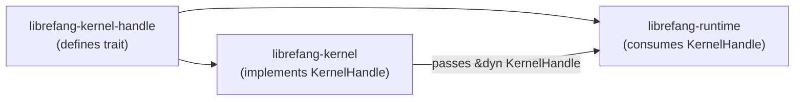

# Shared Infrastructure — librefang-kernel-handle-src

# librefang-kernel-handle

Kernel callback trait that lets the agent runtime interact with the kernel without creating a circular dependency.

## Purpose

`librefang-runtime` drives the agent loop — processing messages, executing tools, and managing turn state. Many of those tools need to call *back* into the kernel: spawning agents, reading shared memory, publishing events, posting tasks, requesting approval, and so on. But the runtime cannot depend on the kernel crate directly, because the kernel depends on the runtime.

This crate breaks the cycle by defining `KernelHandle` — an `async_trait` that the kernel implements and injects into the agent loop at startup. The runtime only knows about the trait; the kernel owns the concrete implementation.

## Architecture



The kernel constructs a concrete type implementing `KernelHandle`, then passes a reference (typically `Arc<dyn KernelHandle>`) into the agent loop entry points. Every tool that needs kernel access receives the handle and calls methods on it.

## Key Components

### `AgentInfo`

```rust
pub struct AgentInfo {
    pub id: String,
    pub name: String,
    pub state: String,
    pub model_provider: String,
    pub model_name: String,
    pub description: String,
    pub tags: Vec<String>,
    pub tools: Vec<String>,
}
```

Lightweight snapshot returned by `list_agents` and `find_agents`. Contains enough information for an agent to decide whether (and how) to interact with a peer — identity, state, model, description, tags, and available tools.

### `KernelHandle` trait

The trait is large by design — it is the single surface area through which the runtime touches kernel state. Methods fall into functional groups:

#### Agent lifecycle

| Method | Sync/Async | Description |
|---|---|---|
| `spawn_agent` | async | Spawn from a TOML manifest. Returns `(id, name)`. `parent_id` tracks lineage. |
| `spawn_agent_checked` | async | Like `spawn_agent` but validates that every capability in the child manifest is covered by `parent_caps`. Default delegates to `spawn_agent` with no enforcement — the kernel **must** override this with real checks. |
| `list_agents` | sync | Return all running agents. |
| `find_agents` | sync | Case-insensitive substring search on name, tag, or tool name. |
| `kill_agent` | sync | Terminate an agent by ID. |
| `send_to_agent` | async | Send a message to a peer and receive its response. |

#### Shared memory

| Method | Scoping | Description |
|---|---|---|
| `memory_store` | `peer_id` namespaces per-user isolation | Write a `serde_json::Value` under a key. |
| `memory_recall` | same | Read a value; returns `Ok(None)` when absent. |
| `memory_list` | same | Enumerate keys in a namespace. |

The `peer_id` parameter enables multi-user isolation: when `Some`, only keys stored under that peer are visible. When `None`, the key lives in the global namespace accessible to all.

#### Task queue

| Method | Description |
|---|---|
| `task_post` | Create a task; returns task ID. |
| `task_claim` | Atomically claim the next available task for an agent. |
| `task_complete` | Mark a claimed task done with a result string. |
| `task_list` | List tasks, optionally filtered by status. |
| `task_delete` | Delete a task by ID. |
| `task_retry` | Reset a task to pending for re-execution. |

#### Knowledge graph

| Method | Description |
|---|---|
| `knowledge_add_entity` | Add an `Entity` node. |
| `knowledge_add_relation` | Add a `Relation` edge. |
| `knowledge_query` | Match against a `GraphPattern`, return `GraphMatch` results. |

Types (`Entity`, `Relation`, `GraphPattern`, `GraphMatch`) are defined in `librefang_types::memory`.

#### Approval system

The approval flow supports two patterns:

1. **Blocking** — `request_approval` suspends until a human approves, denies, or the request times out.
2. **Deferred** — `submit_tool_approval` returns immediately with a `ToolApprovalSubmission` containing the request UUID. The tool execution is paused. Later, `resolve_tool_approval` is called (typically from an HTTP route handler) to resume or reject it.

Context-aware gating is layered:

- `requires_approval(tool_name)` → basic policy check.
- `requires_approval_with_context(tool_name, sender_id, channel)` → enriches the decision with sender and channel. Default delegates to `requires_approval`.
- `is_tool_denied_with_context(tool_name, sender_id, channel)` → hard denial before approval is even offered.

`get_approval_status` provides a non-blocking poll of a pending request's state.

#### Cron / scheduling

| Method | Default |
|---|---|
| `cron_create` | Error: "not available" |
| `cron_list` | Error: "not available" |
| `cron_cancel` | Error: "not available" |

These have stub defaults because the cron subsystem is optional. The kernel overrides them when the scheduler is enabled. Tools `tool_cron_create`, `tool_cron_list`, `tool_cron_cancel`, `tool_schedule_create`, `tool_schedule_list`, and `tool_schedule_delete` in the runtime all route through these methods.

#### Channel messaging

| Method | Description |
|---|---|
| `send_channel_message` | Text to a recipient on an adapter (e.g. "telegram", "email"). Optional `thread_id` for replies. |
| `send_channel_media` | Image or file by URL with optional caption. |
| `send_channel_file_data` | Raw bytes with MIME type — used when `file_path` is provided in the tool call. |
| `send_channel_poll` | Poll/quiz with options and optional correct-answer metadata. |

All default to errors. The kernel overrides for each configured channel adapter.

#### Hands

`hand_list`, `hand_install`, `hand_activate`, `hand_status`, `hand_deactivate` — manage "Hands", which are specialized autonomous agents. All default to "not available" errors.

#### A2A (agent-to-agent) discovery

`list_a2a_agents` returns `(name, url)` pairs of discovered external agents. `get_a2a_agent_url` looks up a single agent by name. Defaults return empty / `None`.

#### Prompt versioning & experiments

A complete prompt lifecycle surface for A/B testing and version control:

- **Versions**: `get_prompt_version`, `list_prompt_versions`, `create_prompt_version`, `delete_prompt_version`, `set_active_prompt_version`, `auto_track_prompt_version`.
- **Experiments**: `create_experiment`, `get_experiment`, `list_experiments`, `update_experiment_status`, `get_running_experiment`, `get_experiment_metrics`, `record_experiment_request`.

Most default to no-ops or "not available" errors. `auto_track_prompt_version` is called during `build_prompt_setup` in the agent loop to automatically snapshot prompt changes.

#### Goals

`goal_list_active` and `goal_update` manage long-lived objectives. Defaults return empty or error.

#### Workflows

`run_workflow` executes a workflow by ID or name, passing input to the first step. Returns `(run_id, output)`. The `tool_workflow_run` tool in the runtime calls this.

#### Agent primitives

| Method | Default | Called by |
|---|---|---|
| `touch_heartbeat` | no-op | `run_agent_loop_streaming` / `run_agent_loop` — keeps the agent alive during long LLM calls |
| `tool_timeout_secs` | `120` | `execute_single_tool_call` — enforces per-tool execution limits |
| `max_agent_call_depth` | `5` | `tool_agent_send` — prevents recursive agent-call stacks |

#### Forked agent execution

`run_forked_agent_oneshot` is the structured-output-via-fork primitive. It spawns a forked agent turn that shares the parent's `(system + tools + messages)` prefix for prompt cache alignment, runs to completion with no tool calls allowed, and returns the final assistant text. Fork semantics guarantee:

- Messages do **not** persist into the agent's canonical session.
- The turn-end hook receives `is_fork: true` so auto-dream won't recurse.

Default returns an error. The proactive memory extractor calls this through `try_forked_extract` when the kernel supports it; otherwise it falls back to a standalone driver call.

## Internal delegation

Two methods delegate to sibling methods within the trait:

- **`spawn_agent_checked`** → calls `spawn_agent` after (optionally) checking capabilities. The kernel overrides to add enforcement; the default skips it.
- **`requires_approval_with_context`** → calls `requires_approval`. The kernel overrides to add sender/channel-aware logic.

## Default method strategy

Most methods have safe defaults:

- **Query/read methods** return `Ok(None)`, `Ok(vec![])`, or `Ok(default_value)`.
- **Write/mutation methods** for optional subsystems (cron, hands, channel, approvals, workflows, prompt store, goals) return `Err("... not available")`.
- **Configuration methods** return sensible constants (`120` seconds, `5` call depth).

This lets kernel implementations override only the subsystems they support. Test harnesses and stubs can use the trait directly without implementing every method.

## Relationship to other crates

| Crate | Relationship |
|---|---|
| `librefang-kernel` | Implements `KernelHandle` for its core `Kernel` struct. Passes `Arc<dyn KernelHandle>` into the runtime. |
| `librefang-runtime` | Consumes `&dyn KernelHandle` (or `Arc`) inside the agent loop and tool runner. Never depends on the kernel crate directly. |
| `librefang-types` | Provides shared types: `Entity`, `Relation`, `GraphPattern`, `ApprovalDecision`, `DeferredToolExecution`, `Capability`, `PromptVersion`, `PromptExperiment`, etc. |