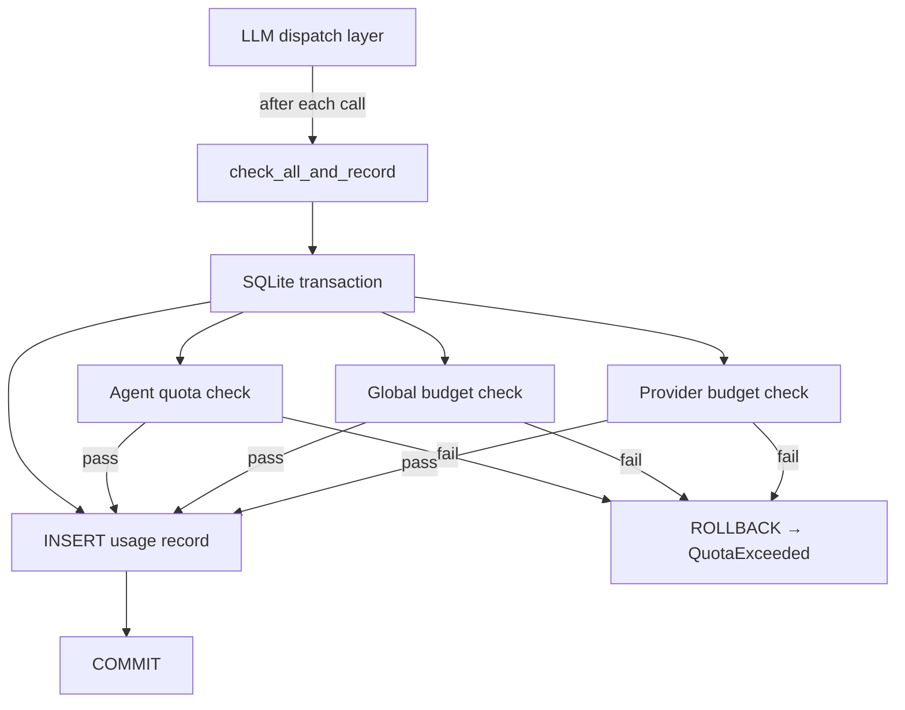

# Shared Infrastructure — librefang-kernel-metering-src

# librefang-kernel-metering

Cost tracking and spending-quota enforcement for LLM usage.

## Overview

The metering engine records every LLM call, calculates its cost, and enforces spending limits at three levels of granularity:

| Level | Scope | Time windows |
|-------|-------|--------------|
| **Per-agent** | Individual agent (by `AgentId`) | Hourly, daily, monthly (USD) |
| **Per-provider** | LLM provider (e.g. `"moonshot"`, `"litellm"`) | Hourly, daily, monthly (USD) + hourly tokens |
| **Global** | All agents across all providers | Hourly, daily, monthly (USD) |

A limit of `0.0` at any level means *unlimited* — that window is skipped during enforcement.

## Architecture



## MeteringEngine

The primary struct. It wraps an `Arc<UsageStore>` (SQLite-backed via `librefang-memory`).

```rust
let engine = MeteringEngine::new(store);
```

### Recording usage

**`record(&self, record: &UsageRecord)`** — Persists a usage event. This is the low-level insert; prefer the atomic methods below for production use.

### Atomic check-and-record methods

These run the quota check and the insert inside a single SQLite transaction, closing the TOCTOU race where concurrent requests both pass the check before either writes its row.

| Method | Checks performed |
|--------|-----------------|
| `check_quota_and_record` | Per-agent quota only |
| `check_global_budget_and_record` | Global budget only |
| `check_all_and_record` | Per-agent + global + per-provider (**preferred**) |

`check_all_and_record` resolves the per-provider budget from `BudgetConfig.providers` using the `record.provider` field. If the provider string is empty or has no configured budget, the provider-level check is skipped.

All atomic methods **do not** insert the record on failure — the transaction rolls back entirely.

### Non-atomic quota checks

For dashboards, pre-dispatch gating, or other read-only scenarios:

- **`check_quota(agent_id, quota)`** — Per-agent hourly/daily/monthly cost.
- **`check_global_budget(budget)`** — Global hourly/daily/monthly cost.
- **`check_provider_budget(provider, budget)`** — Per-provider cost + hourly token limit.

These are subject to TOCTOU races and should not be relied on for enforcement. Use the atomic variants instead.

### Reporting

| Method | Returns | Purpose |
|--------|---------|---------|
| `budget_status(budget)` | `BudgetStatus` | Current spend, limits, and percentages for all windows |
| `get_summary(agent_id)` | `UsageSummary` | Aggregate usage, optionally filtered by agent |
| `get_by_model()` | `Vec<ModelUsage>` | Usage grouped by model |

`BudgetStatus` is serializable (`serde::Serialize`) and suitable for API responses.

### Maintenance

**`cleanup(&self, days: u32)`** — Deletes usage records older than `days` days. Returns the number of rows removed.

## Cost estimation

Two methods estimate the cost of an LLM call from token counts:

### `estimate_cost` (static, no catalog)

Uses hardcoded default rates: **$1.00/M input**, **$3.00/M output**. Use this only as a fallback (e.g. unit tests).

### `estimate_cost_with_catalog` (static, catalog-aware)

Looks up per-model pricing from `ModelCatalog`. Falls back to default rates if the model isn't found.

#### Token pricing tiers

The cost formula distinguishes four categories of input tokens:

| Category | Price multiplier (relative to base input rate) |
|----------|-------------------------------------------------|
| Regular input tokens | 1.0× |
| Cache-read tokens | 0.1× (90% discount) |
| Cache-creation tokens | 1.25× (25% surcharge) |
| Output tokens | Base output rate |

Regular input is computed as `input_tokens - cache_read_input_tokens - cache_creation_input_tokens`, using saturating subtraction.

#### Special cases

- **ChatGPT session-auth models** (`provider == "chatgpt"`) with zero catalog pricing: the engine applies legacy default rates ($1/$3 per million) as a conservative budget estimate, since these models don't expose billable pricing but still consume resources.
- **Local-tier models** with zero pricing: cost is $0.00 — no fallback.
- **Subscription-based providers** (e.g. `alibaba-coding-plan`): token usage is tracked for analytics but cost reads as $0.00. Monitor usage through the provider's console instead.

### Cost calculation example

With default rates, 1M total input (400k cache-read, 100k cache-creation) and 1M output:

```
Regular input:  500k / 1M × $1.00 = $0.500
Cache read:     400k / 1M × $1.00 × 0.10 = $0.040
Cache creation: 100k / 1M × $1.00 × 1.25 = $0.125
Output:         1M   / 1M × $3.00 = $3.000
                                  ─────────
Total:                               $3.665
```

## Error handling

All enforcement methods return `LibreFangError::QuotaExceeded` on failure. The error message includes the scope (agent/provider/global), the time window, current spend, and limit — for example:

```
Agent abc123 exceeded hourly cost quota: $0.0500 / $0.0100
Provider 'moonshot' exceeded daily cost budget: $2.5000 / $2.0000
Global monthly budget exceeded: $150.0000 / $100.0000
```

## Dependencies

| Crate | What's used |
|-------|-------------|
| `librefang-memory` | `UsageStore`, `UsageRecord`, `UsageSummary`, `ModelUsage`, `MemorySubstrate` |
| `librefang-types` | `AgentId`, `ResourceQuota`, `BudgetConfig`, `ProviderBudget`, `LibreFangError`, `ModelCatalogEntry` |
| `librefang-runtime` | `ModelCatalog` (pricing lookup) |
