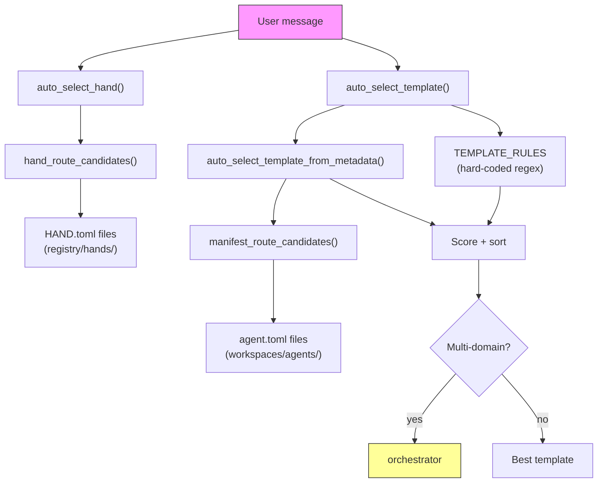

# Shared Infrastructure — librefang-kernel-router-src

# librefang-kernel-router

Message-to-agent routing engine. Given a free-text user message, this module selects the most appropriate agent template or hand by blending keyword matching with optional embedding-based semantic similarity.

## Architecture



## Two Routing Layers

The module maintains two independent routing subsystems that share the same scoring philosophy:

| Aspect | Template routing | Hand routing |
|---|---|---|
| Entry point | `auto_select_template()` | `auto_select_hand()` |
| What it selects | Agent template name (e.g. `"coder"`, `"debugger"`) | Hand ID (e.g. `"browser"`, `"collector"`) |
| Rule sources | Hard-coded `TEMPLATE_RULES` regexes **and** `agent.toml` metadata | `HAND.toml` `[routing]` sections only |
| Multi-domain fallback | Reroutes to `"orchestrator"` when multiple specialties score high | No fallback — returns `None` if below threshold |
| Data location | `<home>/workspaces/agents/<template>/agent.toml` | `<home>/registry/hands/<hand>/HAND.toml` |

## Scoring System

All routing uses a weighted scoring model that blends keyword hits with optional cosine similarity from an embedding model.

### Keyword weights

| Phrase tier | Weight constant | Points per hit |
|---|---|---|
| Explicit alias / strong pattern | `EXPLICIT_ALIAS_WEIGHT` | **6** |
| Auto-generated from metadata | `GENERATED_PHRASE_WEIGHT` | **2** |
| Weak alias / weak pattern | `WEAK_PHRASE_WEIGHT` | **1** |

### Semantic blending

When `semantic_scores` is provided (a `HashMap<String, f32>` mapping template/hand IDs to cosine similarities), each similarity value is converted to bonus points:

```
bonus = round(similarity × MAX_SEMANTIC_BONUS)   // MAX_SEMANTIC_BONUS = 5.0
```

A single high-confidence semantic match (0.9 similarity) yields 4–5 bonus points — enough to override weak keyword signals but not strong ones.

### Semantic-only fallback

When keyword scoring produces zero hits, the router falls back to pure semantic matching using the `SEMANTIC_ONLY_THRESHOLD` (0.55). Any candidate whose embedding similarity meets this threshold is considered, scored as `(similarity × 5).round()`.

### Minimum thresholds

- **Hand routing**: `MIN_HAND_SCORE = 2` — a single weak hit (score 1) is rejected as too noisy. Requires at least one strong hit or two weak hits.
- **Template routing**: no minimum — a score of 1 is accepted, and if nothing matches at all, the template defaults to `"orchestrator"`.

## Template Routing in Detail

### `auto_select_template(message, agents_dir, semantic_scores) -> TemplateSelection`

Evaluates two independent sources and picks the winner:

1. **Hard-coded rules** (`TEMPLATE_RULES`) — 28 built-in `RouteRule` entries covering bilingual (English + Chinese) regex patterns. Each rule has a `target` template name, `strong` patterns (weighted at 6), and optional `weak` patterns (weighted at 1).

2. **Manifest metadata** (`auto_select_template_from_metadata`) — scans every `agent.toml` under `agents_dir`, extracts `[metadata.routing]` aliases, and generates additional phrases from the manifest's name, description, and tags.

Both sources are scored independently. The hard-coded rules take priority unless the manifest match has a significantly higher score (≥ 2 points above the rule match and the rule score is ≤ 1).

### Multi-domain orchestration

When the top two scoring templates are different and the message contains multi-domain indicators (e.g. "同时", "协作", "multi", "together"), the router overrides the selection to `"orchestrator"` so the system can coordinate multiple specialists.

### Excluded templates

Templates listed in `ROUTING_EXCLUDED_TEMPLATES` (currently `["assistant"]`) are skipped during manifest-based routing. They can still be targeted by hard-coded rules if needed.

## Hand Routing in Detail

### `auto_select_hand(message, semantic_scores) -> HandSelection`

Scans hand definitions from `<home>/registry/hands/`, building `HandRouteCandidate` entries with:

- **Strong phrases**: explicit `aliases` from `[routing]` + description-derived phrases
- **Weak phrases**: explicit `weak_aliases` + id-derived tokens (filtered against `GENERIC_ENGLISH_WORDS`)

Returns `HandSelection { hand_id: None, .. }` when no candidate reaches `MIN_HAND_SCORE`.

### Home directory resolution

The home directory for hand route files is resolved in this order:

1. Value set via `set_hand_route_home_dir()` (programmatic override)
2. `LIBREFANG_HOME` environment variable
3. `~/.librefang` (via `dirs::home_dir()`, falling back to temp)

## Phrase Extraction Pipeline

The module extracts routing phrases from manifest metadata through a language-agnostic pipeline:

### `description_phrases(text) -> Vec<String>`

1. Splits text on phrase separators (punctuation, CJK punctuation: `、。，；：（）–—`)
2. For each chunk:
   - **ASCII chunks**: strips leading/trailing generic English words (from `GENERIC_ENGLISH_WORDS`), then generates word n-grams via `ascii_phrase_candidates()`
   - **Non-ASCII chunks**: kept as-is if 2–32 characters long (via `is_meaningful_unicode_phrase`)
3. Returns deduplicated phrases

### `tag_phrases(tags) -> Vec<String>`

Applies the same ASCII/non-ASCII logic to each tag. ASCII tags produce space-joined variants and individual content words.

### `english_variants(text) -> Vec<String>`

For hyphenated or underscored names (e.g. `"release-notes"`), generates:
- The original: `"release-notes"`
- Space-joined: `"release notes"`
- Individual parts ≥ 3 chars: `"release"`, `"notes"`

### Generic word filtering

The `GENERIC_ENGLISH_WORDS` list contains ~45 common English words (`"a"`, `"the"`, `"helper"`, `"specialist"`, etc.) that are stripped from extracted phrases to avoid false-positive matches.

## Caching

Three global caches backed by `OnceLock<Mutex<...>>` avoid redundant work on repeated calls:

| Cache | Key | Invalidated by |
|---|---|---|
| `HAND_ROUTE_CACHE` | Home directory path | `invalidate_hand_route_cache()` |
| `MANIFEST_CACHE` | `agents_dir` path | `invalidate_manifest_cache()` |
| `REGEX_CACHE` | Raw pattern string | Never (grows over process lifetime) |

Cache invalidation is called externally from the skills routes when hands are installed or uninstalled.

## Public API

### Initialization

```rust
// Set the LibreFang home directory (call once at startup)
pub fn set_hand_route_home_dir(home_dir: &Path);
```

### Cache invalidation

```rust
// Call after config hot-reload or agent changes
pub fn invalidate_manifest_cache();
pub fn invalidate_hand_route_cache();
```

### Routing

```rust
// Select the best agent template for a user message
pub fn auto_select_template(
    message: &str,
    agents_dir: &Path,
    semantic_scores: Option<&HashMap<String, f32>>,
) -> TemplateSelection;

// Select the best hand for a user message
pub fn auto_select_hand(
    message: &str,
    semantic_scores: Option<&HashMap<String, f32>>,
) -> HandSelection;
```

### Manifest loading

```rust
// Load a parsed AgentManifest from <home>/workspaces/agents/<template>/agent.toml
pub fn load_template_manifest(home_dir: &Path, template: &str) -> Result<AgentManifest, String>;
```

### Embedding support

```rust
// Returns (template_name, description_text) pairs for building semantic embeddings
pub fn all_template_descriptions(agents_dir: &Path) -> Vec<(String, String)>;
```

Use this at startup to compute embedding vectors for all routable templates. The returned description text includes the template name, description, and tags formatted for embedding.

## Return Types

```rust
pub struct HandSelection {
    pub hand_id: Option<String>,  // None when no match
    pub reason: String,           // e.g. "matched browser via open website"
    pub score: usize,
}

pub struct TemplateSelection {
    pub template: String,   // "orchestrator" when no match or multi-domain
    pub reason: String,     // Human-readable routing explanation
    pub score: usize,
}
```

## Regex Pattern Format

Hard-coded `TEMPLATE_RULES` use raw regex patterns with `(?i)` case-insensitivity applied automatically. The `regex_matches()` helper compiles each pattern once and caches it globally. Invalid patterns silently compile to a never-match sentinel `(?!x)x`.

Manifest-level phrase matching uses `phrase_matches()`, which builds word-boundary patterns for ASCII phrases and simple `contains` for non-ASCII phrases. ASCII patterns escape spaces as `[\s_-]+` to match hyphenated or underscored variants.