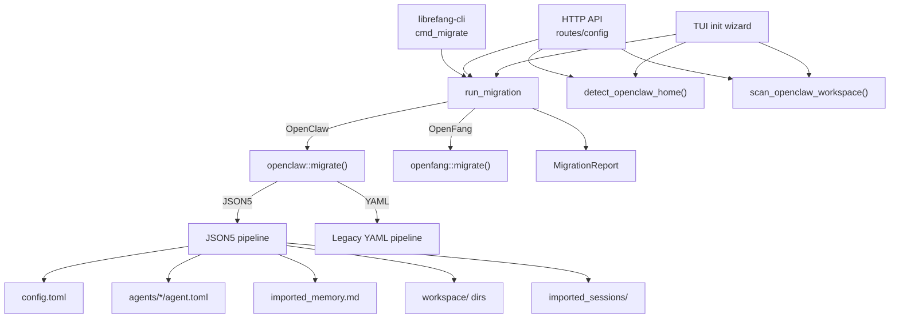

# Shared Infrastructure — librefang-migrate-src

# librefang-migrate-src — Migration Engine

## Purpose

This crate imports agents, configuration, memory, sessions, and channel setups from external agent frameworks into LibreFang's native format. It is the engine behind the `librefang migrate` CLI command, the `/api/config/migrate` HTTP endpoints, and the TUI init wizard's import flow.

Currently supported sources:

| Source | Status | Notes |
|---|---|---|
| **OpenClaw** | Fully supported | JSON5 (modern) and legacy YAML layouts |
| **OpenFang** | Fully supported | Same config format as LibreFang (community fork), schema-drift checked |
| **LangChain** | Not yet implemented | Returns `MigrateError::UnsupportedSource` |
| **AutoGPT** | Not yet implemented | Returns `MigrateError::UnsupportedSource` |

## Architecture



## Module Layout

```
librefang-migrate/src/
├── lib.rs          # Public API: run_migration, MigrateSource, MigrateOptions, MigrateError
├── openclaw.rs     # OpenClaw parser and migration (~1300 lines)
├── openfang.rs     # OpenFang migration with schema-drift warnings
└── report.rs       # MigrationReport, MigrateItem, SkippedItem, rendering
```

## Public API

### `run_migration`

```rust
pub fn run_migration(options: &MigrateOptions) -> Result<MigrationReport, MigrateError>
```

The single entry point. Dispatches to `openclaw::migrate()` or `openfang::migrate()` based on `options.source`. Returns a `MigrationReport` detailing every imported, skipped, or warned item.

### `MigrateOptions`

```rust
pub struct MigrateOptions {
    pub source: MigrateSource,    // Which framework to import from
    pub source_dir: PathBuf,      // Path to source workspace (e.g. ~/.openclaw)
    pub target_dir: PathBuf,      // Path to LibreFang home (e.g. ~/.librefang)
    pub dry_run: bool,            // If true, report only — no filesystem changes
}
```

Dry-run mode is the recommended first pass. It populates the full `MigrationReport` without writing any files, so callers can show a preview.

### `MigrateError`

Variants cover every failure mode:

| Variant | When |
|---|---|
| `SourceNotFound(PathBuf)` | Source directory doesn't exist |
| `ConfigParse(String)` | Config file couldn't be parsed |
| `AgentParse(String)` | Agent file couldn't be parsed |
| `Io(std::io::Error)` | Filesystem I/O failure |
| `Yaml(serde_yaml::Error)` | YAML deserialization failure |
| `Json5Parse(String)` | JSON5 deserialization failure |
| `TomlSerialize(toml::ser::Error)` | TOML serialization failure |
| `UnsupportedSource(String)` | Framework not yet implemented |

---

## OpenClaw Migration

The `openclaw` module handles the bulk of the work. OpenClaw has two distinct config layouts.

### Source Layout Detection

`find_config_file()` probes for config files in order:

1. **Modern JSON5** — `openclaw.json`, `clawdbot.json`, `moldbot.json`, `moltbot.json` (single file containing everything)
2. **Legacy YAML** — `config.yaml` (separate `agents/` and `messaging/` directories)

The file extension determines which migration pipeline runs.

### Auto-Detection

`detect_openclaw_home()` searches standard locations:

- `$OPENCLAW_STATE_DIR` environment override
- `~/.openclaw/`, `~/.clawdbot/`, `~/.moldbot/`, `~/.moltbot/`
- `~/openclaw/`, `~/.config/openclaw/`
- `%APPDATA%/openclaw/`, `%LOCALAPPDATA%/openclaw/` (Windows)

A candidate directory is accepted if it contains a recognized config file, or has `sessions/` or `memory/` subdirectories.

### Pre-Migration Scan

`scan_openclaw_workspace()` inspects a source directory without modifying anything and returns a `ScanResult`:

```rust
pub struct ScanResult {
    pub path: String,
    pub has_config: bool,
    pub agents: Vec<ScannedAgent>,
    pub channels: Vec<String>,
    pub skills: Vec<String>,
    pub has_memory: bool,
}
```

Each `ScannedAgent` includes its name, provider, model, tool count, and whether it has memory, sessions, and workspace data. This powers the "what will be migrated" preview in the CLI and TUI.

### JSON5 Migration Pipeline

```
openclaw.json
    │
    ├─► migrate_config_from_json()    →  config.toml + secrets.env
    ├─► migrate_agents_from_json()    →  agents/<id>/agent.toml
    ├─► migrate_memory_files()        →  agents/<id>/imported_memory.md
    ├─► migrate_workspace_dirs()      →  agents/<id>/workspace/
    └─► migrate_sessions()            →  imported_sessions/*.jsonl
```

Each step appends `MigrateItem` entries to the report. Non-migratable features (cron, hooks, auth profiles, skills, vector indexes) are recorded as `SkippedItem` entries via `report_skipped_features()`.

### Legacy YAML Migration Pipeline

```
config.yaml + agents/*/agent.yaml + messaging/*.yaml
    │
    ├─► migrate_legacy_config()       →  config.toml
    ├─► parse_legacy_channels()       →  [channels.*] sections in config.toml
    ├─► migrate_legacy_agents()       →  agents/<name>/agent.toml
    ├─► migrate_legacy_memory()       →  agents/<name>/imported_memory.md
    ├─► migrate_legacy_workspaces()   →  agents/<name>/workspace/
    └─► scan_legacy_skills()          →  SkippedItem entries (need reinstall)
```

### What Gets Mapped

#### Providers

`map_provider()` normalizes OpenClaw provider names to LibreFang conventions:

| OpenClaw | LibreFang |
|---|---|
| `anthropic`, `claude` | `anthropic` |
| `openai`, `gpt` | `openai` |
| `google`, `gemini` | `google` |
| `xai`, `grok` | `xai` |
| `deepseek` | `deepseek` |
| `ollama` | `ollama` |
| *(unknown)* | *passthrough unchanged* |

#### Model References

`split_model_ref()` handles `"provider/model"` strings. A bare model name without a slash defaults to provider `"anthropic"`.

Agent entries support both simple (`"anthropic/claude-sonnet-4"`) and detailed model references with fallbacks:

```json5
{
  model: {
    primary: "deepseek/deepseek-chat",
    fallbacks: ["groq/llama-3.3-70b-versatile"]
  }
}
```

Fallback models are written as `[[fallback_models]]` TOML array-of-tables.

#### Tools

Tool names are resolved through `librefang_types::tool_compat`:

- `is_known_librefang_tool()` — checks if a name is native to LibreFang
- `map_tool_name()` — maps OpenClaw tool names to LibreFang equivalents

Unrecognized tools are collected as warnings in the report rather than failing the migration.

Tool profiles (`"minimal"`, `"coding"`, `"research"`, `"messaging"`, `"automation"`, `"custom"`, `"full"`) are mapped via `tools_for_profile()` which delegates to `librefang_types::agent::ToolProfile`.

#### Capabilities

`derive_capabilities()` infers LibreFang capability grants from the resolved tool list:

| Tool | Capability |
|---|---|
| `*` (wildcard) | `shell = ["*"]`, `network = ["*"]`, `agent_message = ["*"]`, `agent_spawn = true` |
| `shell_exec` | `shell = ["*"]` |
| `web_fetch`, `web_search`, `browser_navigate` | `network = ["*"]` |
| `agent_send`, `agent_list` | `agent_message = ["*"]`, `agent_spawn = true` |

#### Identity / System Prompts

OpenClaw's `identity` field can be a plain string or a deeply nested JSON object. `extract_identity_prompt()` recursively searches for the prompt through a priority-ordered list of keys: `systemPrompt`, `system_prompt`, `prompt`, `instructions`, `instruction`, `content`, `text`, `value`, `persona`, `identity`, `description`. If none of those match, it recurses into nested objects and arrays. This defensive approach avoids failing the migration when OpenClaw's config shape changes.

#### Channel Policies

| OpenClaw DM Policy | LibreFang DM Policy |
|---|---|
| `open` | `respond` |
| `allowlist` / `allow_list` | `allowed_only` |
| `pairing` / `disabled` | `ignore` |

| OpenClaw Group Policy | LibreFang Group Policy |
|---|---|
| `open` / `all` | `all` |
| `mention` / `mention_only` | `mention_only` |
| `commands` / `commands_only` / `slash_only` | `commands_only` |
| `disabled` / `ignore` | `ignore` |

#### Secrets Handling

Channel tokens and passwords from the JSON5 config are written to `secrets.env` (one `KEY=value` per line) rather than embedded in `config.toml`. On Unix systems, `write_secret_env()` restricts the file to mode `0o600`. The TOML config references them via `_env` suffixed fields (e.g. `bot_token_env = "TELEGRAM_BOT_TOKEN"`).

Legacy YAML configs already use env var references, so no secret extraction is needed — they pass through directly.

#### Supported Channels (13 types)

Telegram, Discord, Slack, WhatsApp, Signal, Matrix, IRC, Mattermost, Feishu, Google Chat, Microsoft Teams, iMessage, and BlueBubbles.

Two channels are flagged during migration:

- **iMessage** — skipped with a note that it requires manual macOS setup
- **BlueBubbles** — skipped with a note that no LibreFang adapter exists

Some channels (Slack, Matrix, Teams, Mattermost, IRC) emit warnings when OpenClaw's `allow_from` (per-user allowlist) has no corresponding field in LibreFang's config structs.

### What Is Skipped

These OpenClaw features have no LibreFang equivalent and are reported as `SkippedItem`:

- **Cron jobs** — use LibreFang's `ScheduleMode::Periodic` instead
- **Webhook hooks** — use LibreFang's event system
- **Auth profiles** (`auth-profiles.json`) — security-sensitive, must be set manually as env vars
- **Skills** — must be reinstalled via `librefang skill install`
- **SQLite vector index** (`memory-search/index.db`) — not portable, LibreFang rebuilds embeddings
- **Memory backend config** — LibreFang uses SQLite with vector embeddings
- **Session scope config** — LibreFang uses per-agent sessions by default

---

## OpenFang Migration

OpenFang uses the same TOML config format as LibreFang (it's a community fork). The `openfang::migrate()` function:

1. Copies config files with field rewrites via `rewrite_content()`
2. Runs `warn_on_schema_drift()` to detect unknown fields, using `librefang_types::config::validation::detect_unknown_fields()`
3. Copies agents, memory, sessions, and workspace directories

---

## Integration Points

### From the CLI

`cmd_migrate` in `librefang-cli` calls `run_migration()` and then renders the report via `report::print_summary()`.

### From the HTTP API

Three endpoints in `src/routes/config.rs`:

- `migrate_detect` — calls `detect_openclaw_home()` to locate an existing installation
- `migrate_scan` — calls `scan_openclaw_workspace()` for a preview
- `run_migrate` — calls `run_migration()` to execute the import

### From the TUI

The init wizard (`tui/screens/init_wizard.rs`) calls `detect_openclaw_home()` and `scan_openclaw_workspace()` to offer an import option during first-time setup, then calls `run_migration()` via `handle_migration_key()`.

---

## Key Design Decisions

**Defensive parsing.** Identity fields, tool lists, and channel configs all accept multiple shapes (strings, arrays, objects). Every extraction function returns `Option` or a default rather than panicking. Structurally unfamiliar configs produce warnings, not failures.

**Dry-run first.** The `dry_run` flag is threaded through every migration step. No file is written unless `dry_run == false`. This lets callers present a complete preview before committing.

**Secret separation.** Raw tokens from JSON5 configs are never written into `config.toml`. They go to `secrets.env` with restricted permissions, and the TOML references them by env var name.

**Tool compatibility bridge.** The `librefang_types::tool_compat` module provides `is_known_librefang_tool()` and `map_tool_name()`, ensuring both the migration engine and the running kernel use identical tool-name mappings.

**Idempotent output.** Running the migration twice over the same target is safe. File writes are simple overwrites, and `copy_dir_recursive()` replaces existing files.