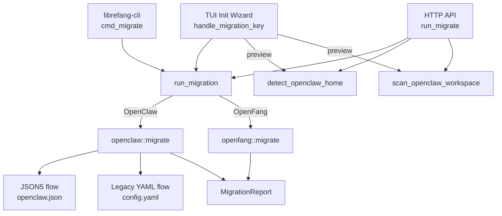

# Shared Infrastructure — librefang-migrate-src

# librefang-migrate

Migration engine for importing agents, configuration, memory, sessions, and channel setups from other agent frameworks into LibreFang.

## Overview

This crate converts workspace layouts and configuration formats from external agent frameworks (OpenClaw, OpenFang) into LibreFang's native TOML-based structure. It handles two distinct OpenClaw generations—modern JSON5 monolithic configs and legacy YAML scattered files—as well as OpenFang's nearly identical format. A scan-only mode lets callers preview what would be imported before committing.

The module is consumed by the CLI (`librefang migrate`), the HTTP API (`/api/config/migrate`), and the TUI init wizard.

## Architecture



## Entry Point

```rust
pub fn run_migration(options: &MigrateOptions) -> Result<MigrationReport, MigrateError>
```

`MigrateOptions` specifies the source framework, source directory, target LibreFang home directory, and whether to run in dry-run mode. `run_migration` dispatches to the appropriate sub-module:

| `MigrateSource` | Handler | Status |
|---|---|---|
| `OpenClaw` | `openclaw::migrate` | Fully supported |
| `OpenFang` | `openfang::migrate` | Fully supported |
| `LangChain` | — | Returns `UnsupportedSource` |
| `AutoGpt` | — | Returns `UnsupportedSource` |

## OpenClaw Migration

The OpenClaw importer handles two generations of workspace layout.

### Modern JSON5 (primary)

A single `openclaw.json` at the workspace root contains everything. The file is located by `find_config_file`, which checks for `openclaw.json`, `clawdbot.json`, `moldbot.json`, and `moltbot.json` in order.

```
~/.openclaw/
├── openclaw.json          # JSON5 — global config, agents, channels, models, tools
├── auth-profiles.json     # (skipped — security)
├── sessions/              # JSONL conversation logs
├── memory/<agent>/MEMORY.md
├── workspaces/<agent>/
├── memory-search/         # SQLite vector index (skipped)
├── skills/                # (skipped — reinstall required)
├── cron/                  # (skipped)
└── hooks/                 # (skipped)
```

### Legacy YAML (fallback)

Very old installations use scattered YAML files. Detected when no JSON5 config is found but a `config.yaml` exists.

```
~/.openclaw/
├── config.yaml            # Provider, model, API key
├── agents/<name>/
│   ├── agent.yaml
│   ├── MEMORY.md
│   └── workspace/
├── messaging/<channel>.yaml
└── skills/
    ├── community/
    └── custom/
```

### Migration pipeline

Both flows follow the same ordered steps inside `migrate_from_json5` / `migrate_from_legacy_yaml`:

1. **Config** → `config.toml` with version, default model, memory settings
2. **Agents** → `agents/<id>/agent.toml` per agent
3. **Memory** → `agents/<id>/imported_memory.md`
4. **Workspaces** → `agents/<id>/workspace/` (recursive copy)
5. **Sessions** → `imported_sessions/*.jsonl` (raw copy)
6. **Skipped features** → reported (cron, hooks, auth profiles, vector indexes, skills)

### Agent conversion

Each agent is converted by `convert_agent_from_json` (or `convert_legacy_agent`). The output is a TOML manifest with these sections:

- **Top-level**: `name`, `version`, `description`, `module` (`"builtin:chat"`), `profile`, `skills`, `tool_blocklist`, `workspace`
- **`[model]`**: `provider`, `model`, `system_prompt`, `api_key_env`
- **`[[fallback_models]]`**: one entry per fallback model (JSON5 only)
- **`[capabilities]`**: `tools`, `memory_read`, `memory_write`, `network`, `shell`, `agent_message`, `agent_spawn`

Key fields preserved from OpenClaw that were previously silently dropped during migration:
- `tools.deny` → `tool_blocklist`
- `workspace` path
- `skills` allowlist

### Tool and profile mapping

Tools are resolved in this priority order per agent:

1. `tools.allow` + `tools.also_allow` explicit lists → mapped through `librefang_types::tool_compat::map_tool_name`
2. `tools.profile` → resolved via `ToolProfile::tools()` (profiles: `minimal`, `coding`, `research`, `messaging`, `automation`, `full`)
3. Agent defaults → same resolution
4. Fallback: `["file_read", "file_list", "web_fetch"]`

Unmappable tools are collected and reported as warnings rather than failing the migration.

### Provider mapping

`split_model_ref` parses `"provider/model"` strings. `map_provider` normalizes known provider names:

| OpenClaw name | LibreFang provider |
|---|---|
| `anthropic`, `claude` | `anthropic` |
| `openai`, `gpt` | `openai` |
| `google`, `gemini` | `google` |
| `xai`, `grok` | `xai` |
| `ollama` | `ollama` |
| (unknown) | passed through unchanged |

`default_api_key_env` derives the standard env var name for each provider (e.g. `"anthropic"` → `"ANTHROPIC_API_KEY"`).

### Channel migration

13 channel types are recognized from the `OpenClawChannels` struct. Each is converted to a TOML table under `[channels.<name>]` with policy overrides mapped through `map_dm_policy` and `map_group_policy`:

| OpenClaw DM policy | LibreFang `dm_policy` |
|---|---|
| `open` | `respond` |
| `allowlist`, `allow_list` | `allowed_only` |
| `pairing`, `disabled` | `ignore` |
| (other) | `respond` |

| OpenClaw group policy | LibreFang `group_policy` |
|---|---|
| `open`, `all` | `all` |
| `mention`, `mention_only` | `mention_only` |
| `commands`, `commands_only`, `slash_only` | `commands_only` |
| `disabled`, `ignore` | `ignore` |
| (other) | `mention_only` |

**Supported channels**: telegram, discord, slack, whatsapp, signal, matrix, google_chat, teams, irc, mattermost, feishu

**Skipped channels**:
- `imessage` — macOS-only, requires manual setup
- `bluebubbles` — no LibreFang adapter
- Any unknown channel from the `#[serde(flatten)]` catch-all

**Secrets handling**: Tokens and passwords from the JSON5 config are extracted and written to `secrets.env` in the target directory. The file is created with mode `0o600` on Unix. The TOML config references them via `_env` keys (e.g. `bot_token_env = "TELEGRAM_BOT_TOKEN"`). Credential files (WhatsApp Baileys auth dir, Google Chat service account JSON) are copied to `credentials/` in the target.

**Policy limitation warnings**: When `allow_from` cannot be mapped to the LibreFang channel struct (e.g. Slack has no per-user allowlist, only `allowed_channels`), a warning is added to the report rather than silently dropping the restriction.

## Auto-Detection and Scanning

### `detect_openclaw_home()`

Searches for an existing OpenClaw installation directory. Checks in order:

1. `OPENCLAW_STATE_DIR` environment variable
2. `~/.openclaw/`, `~/.clawdbot/`, `~/.moldbot/`, `~/.moltbot/`
3. `~/openclaw/`, `~/.config/openclaw/`
4. `%APPDATA%/openclaw/`, `%LOCALAPPDATA%/openclaw/` (Windows)

Returns only directories that contain a recognized config file or `sessions/`/`memory/` subdirectories.

### `scan_openclaw_workspace(path)`

Read-only scan that returns a `ScanResult` containing:
- Whether a config file was found
- List of agents with their provider, model, tool count, and whether they have memory/sessions/workspace
- List of configured channel types
- List of installed skills
- Whether memory data exists

Used by the TUI init wizard and API routes to preview migrations.

## Dry Run Mode

When `MigrateOptions::dry_run` is `true`, the migration pipeline runs all parsing and conversion logic but skips all filesystem writes. The returned `MigrationReport` still contains full `imported` and `skipped` lists showing what would happen, but no files are created.

## Report Generation

`MigrationReport` tracks:

| Field | Contents |
|---|---|
| `imported` | `Vec<MigrateItem>` — each successfully migrated item with kind, name, destination path |
| `skipped` | `Vec<SkippedItem>` — items that cannot be migrated, with reasons |
| `warnings` | `Vec<String>` — non-fatal issues (unmapped tools, policy mapping limitations) |
| `source` | Human-readable source framework name |
| `dry_run` | Whether the report reflects a dry run |

`ItemKind` variants: `Config`, `Agent`, `Channel`, `Memory`, `Session`, `Secret`, `Skill`.

The report is serialized to `migration_report.md` in the target directory (skipped in dry-run mode). The CLI additionally calls `print_summary` for terminal output and `to_markdown` for the file.

## Error Handling

`MigrateError` covers all failure modes:

```rust
pub enum MigrateError {
    SourceNotFound(PathBuf),     // source_dir doesn't exist
    ConfigParse(String),         // malformed config
    AgentParse(String),          // malformed agent definition
    Io(std::io::Error),          // filesystem errors
    Yaml(serde_yaml::Error),     // legacy YAML parse failures
    Json5Parse(String),          // JSON5 parse failures
    TomlSerialize(toml::ser::Error), // output serialization
    UnsupportedSource(String),   // LangChain, AutoGPT, etc.
}
```

Individual agent failures are reported as `SkippedItem` entries rather than aborting the entire migration.

## Integration Points

| Consumer | Functions used |
|---|---|
| `librefang-cli/src/main.rs` (`cmd_migrate`) | `run_migration`, `MigrationReport::to_markdown`, `MigrationReport::print_summary` |
| `src/routes/config.rs` (`migrate_detect`) | `detect_openclaw_home`, `scan_openclaw_workspace` |
| `src/routes/config.rs` (`run_migrate`) | `run_migration` |
| `tui/screens/init_wizard.rs` | `detect_openclaw_home`, `scan_openclaw_workspace` (preview), `run_migration` (execute) |

## Adding a New Source Framework

1. Add a variant to `MigrateSource` in `lib.rs` and update `Display`.
2. Create a new submodule (e.g. `pub mod langchain;`).
3. Implement `pub fn migrate(options: &MigrateOptions) -> Result<MigrationReport, MigrateError>`.
4. Wire it into the `match` in `run_migration`.
5. Optionally add `detect_<source>_home()` and `scan_<source>_workspace()` functions for the TUI/API preview flow.