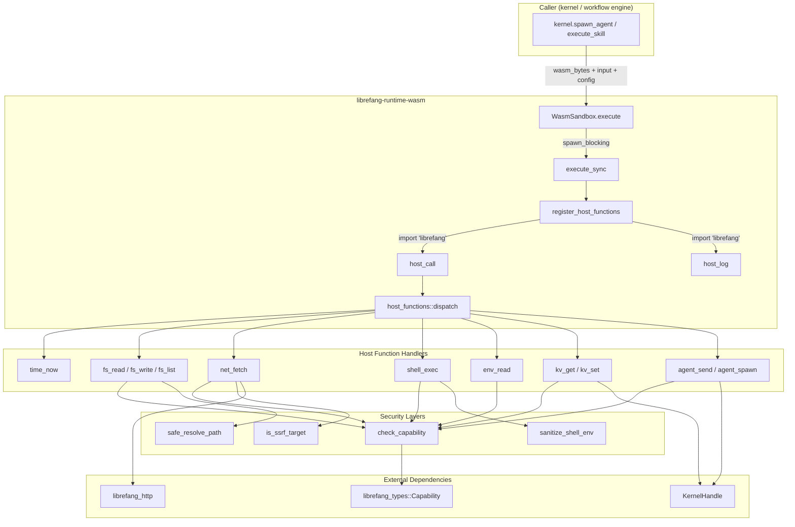

# Shared Infrastructure — librefang-runtime-wasm-src

# librefang-runtime-wasm

WASM skill sandbox and host function dispatch for LibreFang. Executes untrusted WASM modules inside a Wasmtime sandbox with deny-by-default capability enforcement, deterministic fuel metering, and epoch-based wall-clock timeouts.

## Architecture



## Module Structure

| File | Responsibility |
|------|---------------|
| `sandbox.rs` | Wasmtime engine, guest lifecycle, memory marshalling, watchdog timeouts, host function registration |
| `host_functions.rs` | Capability-gated host call dispatch, SSRF protection, path traversal prevention, shell environment sanitisation |

## Sandbox Engine (`sandbox.rs`)

### `WasmSandbox`

The top-level type. Create once per kernel and reuse across skill invocations — the Wasmtime `Engine` is expensive to initialise but cheap to reuse.

```rust
let sandbox = WasmSandbox::new()?;
let result = sandbox.execute(
    &wasm_bytes,          // compiled .wasm or .wat text
    json!({"prompt": "…"}),
    config,               // SandboxConfig
    Some(kernel_handle),  // Arc<dyn KernelHandle>
    "agent-42",           // calling agent ID
).await?;
```

`execute` is `async` but internally offloads to `spawn_blocking` because WASM compilation and execution are CPU-bound and must not run on the Tokio executor.

### `SandboxConfig`

| Field | Default | Purpose |
|-------|---------|---------|
| `fuel_limit` | `1_000_000` | Maximum Wasmtime fuel (instruction-level budget). `0` = unlimited. |
| `max_memory_bytes` | 16 MiB | Reserved for future linear memory enforcement. |
| `capabilities` | `[]` | `Vec<Capability>` — deny-by-default. No host call succeeds unless a matching capability is present. |
| `timeout_secs` | `None` (→ 30s) | Wall-clock deadline enforced by epoch interruption. |

### `GuestState`

Carried inside the Wasmtime `Store<GuestState>`. Accessible to every host function via `Caller<GuestState>`:

- **`capabilities`** — the capability list for this invocation, checked before every host call.
- **`kernel`** — `Option<Arc<dyn KernelHandle>>`. Required for `kv_get`, `kv_set`, `agent_send`, `agent_spawn`.
- **`agent_id`** — identifies the calling agent in logs and capability inheritance checks.
- **`tokio_handle`** — allows synchronous host functions to `.block_on` async kernel operations.

### `ExecutionResult`

| Field | Type | Description |
|-------|------|-------------|
| `output` | `serde_json::Value` | JSON the guest returned from `execute`. |
| `fuel_consumed` | `u64` | Fuel units consumed (`config.fuel_limit − remaining`). |

### `SandboxError`

| Variant | When |
|---------|------|
| `Compilation` | Wasmtime module compilation failure. |
| `Instantiation` | Linker/instantiation failure (missing imports, etc.). |
| `Execution` | Runtime trap (not fuel/timeout). |
| `FuelExhausted` | Guest consumed all allocated fuel. |
| `AbiError` | Missing `memory`/`alloc`/`execute` exports, bounds check failure, invalid JSON. |

## Watchdog / Epoch Timeout

The old implementation used fire-and-forget sleeping threads that leaked and caused false cross-store interrupts. The current design:

1. Before calling guest `execute`, a watchdog thread starts and blocks in `park_timeout(deadline − now)`.
2. The main thread sets `epoch_deadline(1)` so the next epoch tick will trap the guest.
3. On the happy path, an RAII `WatchdogGuard` fires on drop: sets an `AtomicBool`, calls `Thread::unpark`, and joins the watchdog thread. The watchdog observes the flag and exits without touching the epoch.
4. On timeout, the watchdog's `park_timeout` expires, it calls `Engine::increment_epoch`, and the running guest traps with `Trap::Interrupt`.

This guarantees one OS thread per invocation (joined on every return path) and eliminates false interrupts on concurrent stores sharing the same `Engine`.

## Guest ABI

WASM modules that run in this sandbox **must export**:

| Export | Signature | Description |
|--------|-----------|-------------|
| `memory` | `(memory N)` | Linear memory, at least 1 page. |
| `alloc` | `(func (param i32) → (result i32))` | Bump allocator. Guest receives `size` bytes, returns a pointer. |
| `execute` | `(func (param i32 i32) → (result i64))` | Entry point. Params: `(input_ptr, input_len)`. Returns packed `i64`: `(ptr << 32) \| len`. |

Modules **may import** from the `"librefang"` module:

| Import | Signature | Description |
|--------|-----------|-------------|
| `host_call` | `(func (param i32 i32) → (result i64))` | RPC: reads JSON request from guest memory, returns packed pointer to JSON response. |
| `host_log` | `(func (param i32 i32 i32))` | Log a message. Params: `(level, msg_ptr, msg_len)`. Levels: 0=trace, 1=debug, 2=info, 3=warn, 4+=error. |

### Data flow for a host call

```
Guest                  Host
─────────────────────────────────────────────────────
alloc(size)  ──────►  (bump allocator runs in guest)
write bytes to ptr
host_call(ptr, len) ─► read_guest_bytes
                       serde_json::from_slice
                       dispatch(state, method, params)
                       write_guest_json(response)
                  ◄────  returns (ptr << 32) | len
read response from ptr
```

All pointer arithmetic uses `checked_add` to prevent overflow on 32-bit hosts. Bounds checks reject any pointer+length that exceeds the guest's linear memory.

## Host Function Dispatch (`host_functions.rs`)

### `dispatch(state, method, params) → Value`

Single entry point called from `sandbox::host_call`. Returns `{"ok": …}` on success or `{"error": "…"}` on failure.

| Method | Required Capability | Notes |
|--------|-------------------|-------|
| `time_now` | *(none — always allowed)* | Returns `{"ok": unix_seconds}`. |
| `fs_read` | `FileRead(path)` | Reads file contents to string. |
| `fs_write` | `FileWrite(path)` | Writes string to file. |
| `fs_list` | `FileRead(path)` | Lists directory entries. |
| `net_fetch` | `NetConnect(host)` | HTTP GET/POST/PUT/DELETE with SSRF protection. |
| `shell_exec` | `ShellExec(command)` | Spawns a subprocess (no shell). |
| `env_read` | `EnvRead(name)` | Reads one environment variable. |
| `kv_get` | `MemoryRead(key)` | Kernel memory recall. Requires kernel handle. |
| `kv_set` | `MemoryWrite(key)` | Kernel memory store. Requires kernel handle. |
| `agent_send` | `AgentMessage(target)` | Send message to another agent via kernel. |
| `agent_spawn` | `AgentSpawn` | Spawn a child agent with capped capabilities. |

### Capability checking

`check_capability(capabilities, required)` iterates the granted list and calls `librefang_types::capability::capability_matches` for each entry. If no match is found, the call is rejected with an error. Wildcard capabilities (e.g. `FileRead("*")`) are handled by the `capability_matches` function in `librefang-types`.

### Path traversal protection

Two functions guard filesystem operations:

- **`safe_resolve_path`** — for reads and directory listings where the target must exist. Rejects any path containing `..` components, then `canonicalize`s to resolve symlinks.
- **`safe_resolve_parent`** — for writes where the file may not exist yet. Canonicalises the parent directory and validates the filename separately. Includes a belt-and-suspenders check for `..` in the filename itself.

Both are called **after** the capability gate so the capability check sees the raw path the guest requested, while the actual I/O uses the resolved canonical path.

### SSRF protection (`is_ssrf_target`)

Called by `host_net_fetch` before any HTTP request. The check:

1. Rejects non-http/https schemes (`file://`, `gopher://`, `ftp://`).
2. Blocks a hostname allowlist (`localhost`, `metadata.google.internal`, `169.254.169.254`, etc.).
3. Resolves DNS and checks **every** returned IP:
   - Canonicalises IPv4-mapped IPv6 (`::ffff:X.X.X.X` → IPv4) via `canonical_ip`.
   - Rejects loopback, unspecified, and private IPs (RFC 1918, link-local, IPv6 ULA/LL).
4. Returns the resolved `Vec<SocketAddr>` to the caller.

The resolved addresses are pinned into the HTTP client via `reqwest::ClientBuilder::resolve`, preventing DNS-rebinding / TOCTOU attacks between validation and connection.

`librefang_http::proxied_client_builder()` provides the base client builder (proxy configuration, TLS settings, etc.).

### Shell environment sanitisation

`host_shell_exec` uses `std::process::Command::new` directly (no shell, so no shell injection). After the capability gate, `sanitize_shell_env` clears the child environment and re-adds only a hard-coded allowlist:

```rust
const WASM_SHELL_SAFE_ENV_VARS: &[&str] = &[
    "PATH", "HOME", "TMPDIR", "TMP", "TEMP", "LANG", "LC_ALL", "TERM",
];
```

On Windows, additional system variables (`SYSTEMROOT`, `COMSPEC`, etc.) are preserved. This prevents a WASM guest with `ShellExec` from exfiltrating daemon secrets (LLM API keys, vault tokens, cloud metadata).

### Agent interaction

- **`host_agent_send`** — calls `kernel.send_to_agent(target, message)` via `tokio_handle.block_on`. Requires `AgentMessage(target)` capability.
- **`host_agent_spawn`** — calls `kernel.spawn_agent_checked(manifest, parent_id, &capabilities)`. The kernel enforces capability inheritance: the child's capabilities must be a subset of the parent's. Returns `{"ok": {"id": ..., "name": ...}}`.

## Relationships to Other Crates

| Crate | Relationship |
|-------|-------------|
| `librefang-types` | Provides `Capability` enum and `capability_matches`. |
| `librefang-kernel-handle` | `KernelHandle` trait — inter-agent messaging, memory KV, agent spawning. |
| `librefang-http` | `proxied_client_builder()` for HTTP client construction in `net_fetch`. |

No crates depend on `librefang-runtime-wasm` directly from within this workspace — it is consumed by the kernel/workflow engine at the integration layer.

## Testing Notes

The test suite uses inline `.wat` modules:

- **`ECHO_WAT`** — returns input JSON unchanged; validates the full execute path.
- **`INFINITE_LOOP_WAT`** — triggers `FuelExhausted` with a low `fuel_limit`.
- **`HOST_CALL_PROXY_WAT`** — forwards input to `host_call`; tests capability denial, `time_now`, and unknown method errors.

Host function tests in `host_functions.rs` construct `GuestState` directly with `test_state()` (no kernel handle) and verify capability denial, environment stripping, SSRF blocking, path traversal rejection, and IP classification including IPv4-mapped IPv6 edge cases.