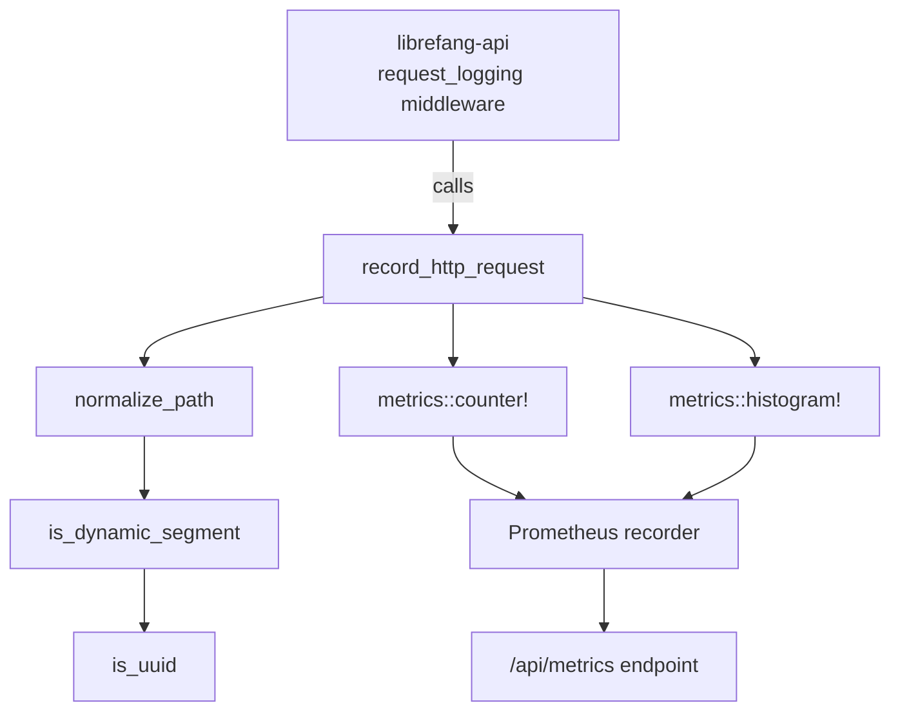

# Shared Infrastructure — librefang-telemetry-src

# librefang-telemetry

Centralized telemetry (metrics + tracing) for the LibreFang Agent OS. This crate provides HTTP metrics instrumentation backed by the `metrics` crate facade, with a Prometheus exporter installed at runtime by `librefang-api`.

## Architecture



The crate itself is a thin utility layer. It does **not** own the metrics recorder — that lifecycle is managed by `crates/librefang-api/src/telemetry.rs`, which installs a `PrometheusHandle` into the global `metrics` recorder at startup.

## Module Layout

| Module | Purpose |
|--------|---------|
| `config` | Re-exports `TelemetryConfig` from `librefang-types` for convenience |
| `metrics` | HTTP request recording and path normalization |

## Public API

### `record_http_request`

```rust
pub fn record_http_request(path: &str, method: &str, status: u16, duration: Duration)
```

The primary entry point. Called by the `request_logging` middleware in `librefang-api` after every HTTP response. It:

1. Normalizes the request path to collapse high-cardinality segments.
2. Emits a `librefang_http_requests_total` counter with labels `method`, `path`, and `status`.
3. Emits a `librefang_http_request_duration_seconds` histogram with labels `method` and `path`.

Both metrics flow through whichever `metrics::Recorder` is installed globally. In production, this is the Prometheus exporter.

### `normalize_path`

```rust
pub fn normalize_path(path: &str) -> String
```

Replaces dynamic path segments (UUIDs, hex IDs) with the literal token `{id}`. This prevents metric label explosion when paths contain per-request identifiers.

**How it works:**

1. Splits the path on `/`.
2. Preserves structural segments — `api`, `v1`, `v2`, `a2a` — verbatim.
3. For every other segment, peeks at the *next* segment. If the next segment looks like a dynamic identifier (UUID or hex string of 8–64 characters), it is replaced with `{id}`.

**Normalization examples:**

| Input | Output |
|-------|--------|
| `/api/health` | `/api/health` |
| `/api/agents/550e8400-e29b-41d4-a716-446655440000/message` | `/api/agents/{id}/message` |
| `/api/agents/deadbeef01234567/message` | `/api/agents/{id}/message` |
| `/.well-known/agent.json` | `/.well-known/agent.json` |
| `/api/my-agent/status` | `/api/my-agent/status` |

Note that hyphenated words like `well-known` and `my-agent` are intentionally **not** treated as dynamic segments — only strings matching the UUID pattern (8-4-4-4-12 hex groups) or pure hex strings of 8–64 characters are collapsed.

### `get_http_metrics_summary`

```rust
pub fn get_http_metrics_summary() -> String
```

A backward-compatibility stub. The actual Prometheus text output is rendered directly from the `PrometheusHandle` in `librefang-api`'s `/api/metrics` route handler. This function returns an explanatory comment string. New code should use the handle directly.

### `config::TelemetryConfig`

Re-exported from `librefang-types::config::TelemetryConfig`. Importing from `librefang_telemetry::config` works identically to importing from the types crate.

## Integration Points

**Where this crate is used:**

- `librefang-api/src/middleware.rs` — the `request_logging` middleware calls `record_http_request` on every completed HTTP request.

**Where the recorder is installed:**

- `librefang-api/src/telemetry.rs` — creates and installs the `PrometheusHandle` into the global `metrics` recorder at application startup. Without this step, calls to `metrics::counter!` and `metrics::histogram!` are no-ops.

## Adding New Metrics

To instrument additional subsystems:

1. Use the `metrics` crate macros directly (`metrics::counter!`, `metrics::histogram!`, `metrics::gauge!`) with a `librefang_` prefixed name.
2. Keep label cardinality low — reuse `normalize_path` or a similar strategy for any user-supplied strings.
3. The Prometheus recorder installed by `librefang-api` will automatically collect them. No additional wiring is needed.