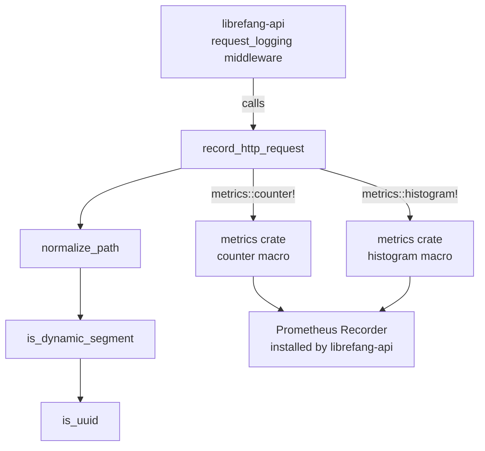

# Shared Infrastructure — librefang-telemetry-src

# librefang-telemetry

OpenTelemetry + Prometheus metrics instrumentation for LibreFang. This crate provides centralized telemetry (metrics and tracing) used across all LibreFang crates.

## Architecture



## Module Structure

| Path | Purpose |
|---|---|
| `config` | Re-exports `TelemetryConfig` from `librefang-types::config` for convenient access |
| `metrics` | HTTP metrics recording and path normalization |

## Public API

Three items are re-exported at the crate root:

```rust
pub use metrics::{get_http_metrics_summary, normalize_path, record_http_request};
```

### `record_http_request`

```rust
pub fn record_http_request(path: &str, method: &str, status: u16, duration: Duration)
```

The main entry point for HTTP telemetry. Called by the `request_logging` middleware in `librefang-api` on every incoming request. It:

1. Normalizes the request path via `normalize_path` (collapsing dynamic segments).
2. Increments the `librefang_http_requests_total` counter with labels `method`, `path`, and `status`.
3. Records `duration` into the `librefang_http_request_duration_seconds` histogram with labels `method` and `path`.

Both recordings use the standard `metrics` crate macros (`metrics::counter!`, `metrics::histogram!`). Data flows to whichever recorder has been installed — typically the Prometheus exporter set up in `librefang-api/src/telemetry.rs`.

### `normalize_path`

```rust
pub fn normalize_path(path: &str) -> String
```

Reduces metric label cardinality by replacing dynamic path segments with `{id}`. This prevents every unique UUID or hash from creating a new metric series.

**How it works:**

1. Splits the path on `/`.
2. Preserves known structural segments: `api`, `v1`, `v2`, `a2a`.
3. Looks ahead at each segment: if the *next* segment is dynamic (UUID or hex), the dynamic segment is replaced with `{id}`.
4. Joins the result back with `/`.

**Examples:**

| Input | Output |
|---|---|
| `/api/health` | `/api/health` |
| `/api/agents/550e8400-e29b-41d4-a716-446655440000/message` | `/api/agents/{id}/message` |
| `/api/agents/deadbeef01234567/message` | `/api/agents/{id}/message` |
| `/.well-known/agent.json` | `/.well-known/agent.json` |
| `/api/my-agent/status` | `/api/my-agent/status` |

### `get_http_metrics_summary`

```rust
pub fn get_http_metrics_summary() -> String
```

A backward-compatibility stub. Full Prometheus output is now rendered directly from the `PrometheusHandle` in the `/api/metrics` route handler in `librefang-api`. This function returns a comment explaining that.

## Dynamic Segment Detection

Path segments are classified as dynamic by `is_dynamic_segment` (private). A segment matches as dynamic if it is either:

- **A UUID** — exactly five hyphen-separated groups of hex digits with lengths 8-4-4-4-12 (checked by `is_uuid`).
- **A hex string** — 8 to 64 ASCII hex characters with no hyphens.

Importantly, hyphenated words like `well-known` or `my-agent` are **not** treated as dynamic. The UUID check requires the specific 8-4-4-4-12 structure, and the hex check rejects strings containing hyphens. This prevents false positives on human-readable slugs.

## Prometheus Metrics Reference

Two metrics are emitted by this crate:

| Metric | Type | Labels | Description |
|---|---|---|---|
| `librefang_http_requests_total` | counter | `method`, `path`, `status` | Total HTTP requests processed |
| `librefang_http_request_duration_seconds` | histogram | `method`, `path` | Request latency in seconds |

## Integration Points

**Consumer:** The `request_logging` middleware in `librefang-api/src/middleware.rs` calls `record_http_request` directly.

**Recorder installation:** This crate emits metrics but does not install a recorder. The Prometheus recorder is set up in `librefang-api/src/telemetry.rs`, which means telemetry is a no-op until that initialization runs.

**Configuration:** `TelemetryConfig` (defined in `librefang-types::config::types`) controls telemetry behavior and is re-exported from the `config` submodule.