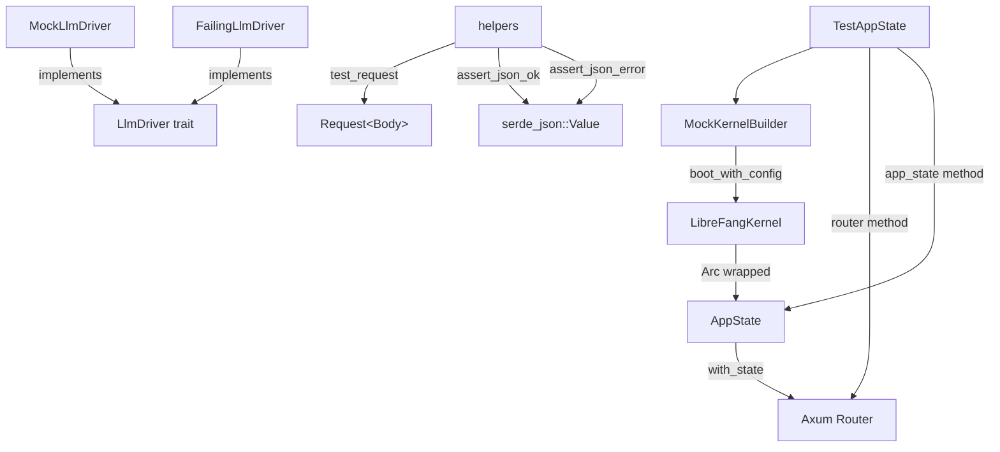

# Shared Infrastructure — librefang-testing-src

# librefang-testing — Shared Test Infrastructure

## Purpose

`librefang-testing` provides reusable mock infrastructure for testing the LibreFang codebase. It enables unit and integration tests of API routes, runtime components, and kernel-dependent logic without starting a full daemon or requiring external services.

The crate is consumed across the entire workspace — CLI commands, runtime modules (OAuth, MCP, web fetch, plugin manager, provider health), HTTP client construction, and skill registries all use `MockKernelBuilder` to obtain a lightweight kernel for their tests.

## Architecture



## Key Components

### MockKernelBuilder

Constructs a real `LibreFangKernel` instance with minimal configuration: an in-memory SQLite database (file-backed under a temp directory), networking disabled, and no heavy subsystem initialization (OFP, cron jobs, etc.).

**Important:** `build()` returns `(LibreFangKernel, TempDir)`. The caller must hold the `TempDir` for the entire lifetime of the kernel — dropping it deletes the temp directory and invalidates all file paths the kernel references.

```rust
// Basic usage
let (kernel, _tmp) = MockKernelBuilder::new().build();

// With custom configuration
let (kernel, _tmp) = MockKernelBuilder::new()
    .with_config(|cfg| {
        cfg.language = "zh".into();
        cfg.default_model.provider = "test".into();
    })
    .build();

// Convenience function — equivalent to MockKernelBuilder::new().build()
let (kernel, _tmp) = test_kernel();
```

The builder creates the following directory structure under the temp directory:
- `data/` — SQLite database and persistent storage
- `skills/` — skill definitions
- `workspaces/agents/` — agent workspace directories
- `workspaces/hands/` — hand workspace directories

`with_config` accepts a closure that mutates the `KernelConfig` after defaults are applied but before `boot_with_config` is called, allowing tests to override any configuration field.

### MockLlmDriver

A configurable fake LLM provider that implements the `LlmDriver` trait. It serves two purposes: returning controlled responses and recording all calls for test assertions.

**Response behavior:** The driver holds a list of canned response strings. It returns them in order. Once exhausted, all subsequent calls receive the last response in the list (it does not wrap around to the beginning).

```rust
// Returns "first", then "second", then "second" forever after
let driver = MockLlmDriver::new(vec!["first".into(), "second".into()]);

// Single fixed response — most common pattern
let driver = MockLlmDriver::with_response("Hello!");

// Customize token usage and stop reason
let driver = MockLlmDriver::with_response("ok")
    .with_tokens(200, 100)
    .with_stop_reason(StopReason::MaxTokens);
```

**Call recording:** Every call to `complete` is recorded as a `RecordedCall` containing the model name, message count, tool count, and system prompt. Access recordings via `recorded_calls()` or `call_count()`.

```rust
let calls = driver.recorded_calls();
assert_eq!(calls[0].model, "test-model");
assert_eq!(calls[0].system, Some("system prompt".into()));
assert_eq!(driver.call_count(), 2);
```

**Streaming support:** The `stream` implementation sends the response text as a `TextDelta` event followed by a `ContentComplete` event, simulating a basic streaming response.

### FailingLlmDriver

A simpler mock that always returns an `LlmError::Api` with a configurable message. Used for testing error-handling paths.

```rust
let driver = FailingLlmDriver::new("API rate limit exceeded");
let result = driver.complete(request).await;
assert!(result.is_err());
assert!(!driver.is_configured()); // always returns false
```

### TestAppState

The highest-level test fixture. It wraps a `MockKernelBuilder` and produces a fully wired `AppState` and axum `Router` suitable for integration testing of API routes.

```rust
let test = TestAppState::new();
let router = test.router();

// Send a request through the full axum pipeline
let req = test_request(Method::GET, "/api/health", None);
let resp = router.oneshot(req).await.unwrap();
let json = assert_json_ok(resp).await;
```

**Construction variants:**
- `TestAppState::new()` — default mock kernel
- `TestAppState::with_builder(builder)` — custom kernel configuration
- `TestAppState::from_kernel(kernel, tmp)` — pre-built kernel (caller manages temp dir)

The `router()` method returns an axum `Router` with all production API routes nested under `/api`, including agents CRUD, skills, config, memory, budget, tools, models, providers, and sessions.

The internal `build_state` method constructs a production-equivalent `AppState` with sensible test defaults: no peer registry, no bridge manager, no Prometheus handle, and empty caches.

### Helpers

Three functions that reduce boilerplate in route tests:

- **`test_request(method, path, body)`** — Builds an `axum::http::Request<Body>`. Automatically sets `content-type: application/json` when a body is provided. The body parameter accepts `Option<&str>`.

- **`assert_json_ok(response)`** — Asserts status 200, parses the body as JSON, and returns `serde_json::Value`. Panics with the response body on failure.

- **`assert_json_error(response, expected_status)`** — Same as `assert_json_ok` but checks against an arbitrary expected status code. Returns the parsed JSON for error-body assertions.

All three are re-exported at the crate root.

## Usage Patterns

### Testing API Routes

The primary workflow: construct a `TestAppState`, get its router, build requests with `test_request`, call `router.oneshot(req)`, then assert with `assert_json_ok` or `assert_json_error`.

```rust
#[tokio::test(flavor = "multi_thread")]
async fn test_my_endpoint() {
    let test = TestAppState::new();
    let router = test.router();

    let body = serde_json::json!({"key": "value"}).to_string();
    let req = test_request(Method::POST, "/api/agents", Some(&body));
    let resp = router.oneshot(req).await.unwrap();
    let json = assert_json_ok(resp).await;

    assert_eq!(json["status"], "created");
}
```

Tests must use `#[tokio::test(flavor = "multi_thread")]` because kernel boot spawns blocking tasks that require a multi-threaded runtime.

### Testing with a Custom Kernel

When tests need specific configuration (language, model settings, etc.):

```rust
let test = TestAppState::with_builder(
    MockKernelBuilder::new().with_config(|cfg| {
        cfg.language = "zh".into();
    })
);
// Assertions can inspect the kernel directly
assert_eq!(test.state.kernel.config_ref().language, "zh");
```

### Using MockKernelBuilder Outside This Crate

`MockKernelBuilder::build()` is the standard way to create a kernel for tests across the workspace. It's used in modules like:
- `librefang-runtime-oauth` — OAuth device flow tests
- `librefang-runtime-mcp` — MCP connection and OAuth metadata discovery
- `librefang-http` — HTTP client construction with proxy configs
- `librefang-skills` — skillhub and marketplace initialization
- `librefang-cli` — daemon discovery and client construction
- `librefang-runtime` — web fetch, plugin management, provider health probing, model catalog

### Testing LLM-Dependent Code

Inject `MockLlmDriver` wherever an `LlmDriver` trait object is expected:

```rust
let driver = MockLlmDriver::new(vec!["response 1".into(), "response 2".into()]);
// Pass to agent runtime, tool execution, etc.
// After execution:
assert_eq!(driver.call_count(), 2);
let calls = driver.recorded_calls();
assert_eq!(calls[0].message_count, 3);
```

For error-path testing, swap in `FailingLlmDriver`:

```rust
let driver = FailingLlmDriver::new("rate limited");
```

## Crate Layout

| File | Exports |
|---|---|
| `src/lib.rs` | Re-exports from submodules, module declarations |
| `src/helpers.rs` | `test_request`, `assert_json_ok`, `assert_json_error` |
| `src/mock_driver.rs` | `MockLlmDriver`, `FailingLlmDriver`, `RecordedCall` |
| `src/mock_kernel.rs` | `MockKernelBuilder`, `test_kernel` |
| `src/test_app.rs` | `TestAppState` |
| `src/tests.rs` | Integration tests demonstrating all components |

## Dependencies

The crate depends on:
- `librefang-kernel` — for `LibreFangKernel` and `KernelConfig`
- `librefang-api` — for `AppState` and route handlers
- `librefang-runtime` — for `LlmDriver` trait, `CompletionRequest`, `CompletionResponse`
- `librefang-types` — for `TokenUsage`, `StopReason`, `ContentBlock`
- `axum`, `tower` — HTTP testing infrastructure
- `tempfile` — temp directory management
- `serde_json` — response body parsing