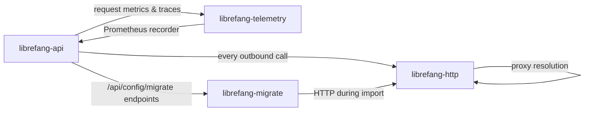

# Shared Infrastructure

# Shared Infrastructure

Cross-cutting infrastructure concerns that every other LibreFang module depends on: outbound HTTP, observability, and data migration.

## Sub-Modules

| Module | Role |
|---|---|
| [librefang-http](librefang-http-src.md) | Single source of truth for outbound HTTP — seeds Mozilla CA roots, supplements with system certs, and centralizes proxy configuration |
| [librefang-telemetry](librefang-telemetry-src.md) | OpenTelemetry + Prometheus metrics and tracing used across all crates |
| [librefang-migrate](librefang-migrate-src.md) | Imports agents, config, sessions, and memory from external frameworks (OpenClaw, OpenFang) into LibreFang's native format |

## How They Fit Together

**librefang-http** is the foundation — every outbound HTTP connection in the application flows through it, regardless of which crate initiates the request. **librefang-telemetry** instruments those calls (and everything else) via the `metrics` crate, with the Prometheus recorder installed at the API layer. **librefang-migrate** is primarily a data-pipeline tool but relies on the shared HTTP client when migration involves network fetches.

## Key Cross-Module Workflows

**Outbound requests with proxy & TLS fallback** — API routes like `comms_send` and `catalog_update` both flow through `proxied_client_builder` → `build_http_client` → `tls_config` + `active_proxy`. This ensures consistent proxy resolution and CA trust across provider catalog syncs, agent URL attachment resolution, and comms delivery.

**Migration pipeline** — The `librefang migrate` CLI command, `/api/config/migrate` HTTP endpoints, and the TUI init wizard all drive into `librefang-migrate`. The engine scans external workspaces (OpenClaw JSON5/legacy YAML, OpenFang configs), produces a `MigrationReport` with `MigrateItem` and `SkippedItem` entries, and writes LibreFang-native output — with dry-run support via `MigrateOptions`.

**Request observability** — The API's request-logging middleware calls into `librefang-telemetry`'s `record_http_request`, which normalizes paths (detecting UUIDs and dynamic segments via `is_dynamic_segment` / `is_uuid`) before emitting `metrics::counter!` and `metrics::histogram!` readings to the shared Prometheus recorder.