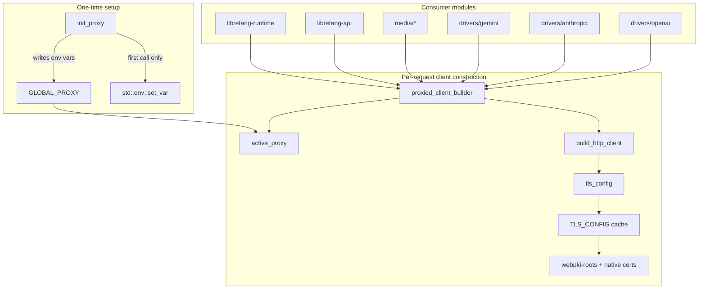

# Shared Libraries — librefang-http-src

# Shared Libraries — `librefang-http-src`

## Purpose

This module provides a single, centralized factory for all outbound HTTP clients in the application. Every HTTP connection — whether to LLM providers, media APIs, MCP OAuth endpoints, or push-notification services — is built through this module so that proxy settings and TLS trust anchors are applied uniformly.

It solves two specific problems that arise in production deployments:

1. **Missing system CA certificates.** On musl builds (Termux/Android), minimal Docker images, or corporate Linux with partial CA bundles, the default `reqwest` TLS initialization panics. This module always seeds the trust store with bundled Mozilla CA roots from `webpki-roots`, then supplements with system certificates when available.

2. **Proxy configuration consistency.** Proxy settings from `config.toml` are propagated both to the `reqwest` builders here *and* as environment variables, ensuring that crates which build their own clients independently (e.g. `librefang-channels`) still respect the same proxy settings.

## Architecture



## Initialization

At daemon startup, call [`init_proxy`] once with the `[proxy]` section from `config.toml`. This stores the configuration in a process-global `RwLock<Option<ProxyConfig>>` and exports the values as environment variables (`HTTP_PROXY`, `HTTPS_PROXY`, `NO_PROXY` and their lowercase equivalents).

```rust
let proxy_config: ProxyConfig = config.proxy;
librefang_http::init_proxy(proxy_config);
```

After initialization, all subsequent calls to [`proxied_client_builder`] or [`proxied_client`] will include the configured proxy settings automatically.

## TLS Certificate Handling

The function [`tls_config`] returns a `rustls::ClientConfig` that combines two certificate sources:

1. **Bundled Mozilla CA roots** (`webpki_roots::TLS_SERVER_ROOTS`) — always loaded. This ensures common public CAs are trusted even on systems with no system cert store at all.

2. **System CA certificates** (`rustls_native_certs::load_native_certs`) — loaded as a supplement. This adds organization-internal / self-signed CAs and keeps trust anchors up-to-date without a new release.

The resulting `ClientConfig` is computed once and cached in a `OnceLock`. Every client builder call clones the cached config, avoiding repeated certificate parsing.

If no system certificates are found, a debug-level log is emitted and the module proceeds with the bundled roots alone.

## Proxy Configuration

### Resolution order

When [`build_http_client`] constructs a client, proxy settings are resolved as follows:

| Source | When applied |
|---|---|
| Explicit `ProxyConfig` fields | When the field is `Some` and non-empty — set directly on the `reqwest` builder |
| Environment variables | When the field is `None` — `reqwest` reads `HTTP_PROXY` / `HTTPS_PROXY` / `NO_PROXY` automatically |

This avoids double-applying proxy settings: `init_proxy` exports the config values as env vars, but explicit config values on the builder take precedence. When config fields are `None`, reqwest's built-in env-var detection provides the fallback.

### Supported proxy schemes

The function [`is_valid_proxy_url`] accepts URLs with the following schemes:

- `http://`
- `https://`
- `socks5://`
- `socks5h://` (DNS resolution through the proxy)

Invalid schemes are logged with a warning and the URL is skipped.

### Hot-reload

[`init_proxy`] can be called multiple times. On the first call (when `GLOBAL_PROXY` is `None`), environment variables are exported. On subsequent calls (hot-reload), only the in-memory config is updated — environment variables are *not* re-set because `std::env::set_var` is unsound in a multi-threaded tokio runtime. The updated config takes effect for all clients built after the reload.

## Client Builder Functions

### Primary entry points

| Function | Returns | Use when |
|---|---|---|
| [`proxied_client_builder`] | `reqwest::ClientBuilder` | You need to customize the client further (add headers, timeouts, etc.) |
| [`proxied_client`] | `reqwest::Client` | You just need a ready-to-use client immediately |

Both read the global proxy config via [`active_proxy`] and apply TLS + proxy settings.

### Per-provider proxy overrides

[`proxied_client_with_override`] builds a client that routes *all* traffic through a specific proxy URL, ignoring the global config. This is used by drivers that support per-provider proxy settings (e.g., individual OpenAI Azure endpoints, Anthropic, Gemini).

Returns `Err` if the proxy URL is invalid or the client cannot be built. Callers are expected to handle the error explicitly — typically by falling back to [`proxied_client`] and logging a warning.

### Fallback client

[`proxied_client_fallback`] is identical to [`proxied_client`] but enforces a total per-request timeout of 300 seconds on top of the connect/read timeouts. This prevents a stuck upstream from wedging the agent loop. Used by drivers that detect an invalid per-provider proxy override at runtime.

### Backward-compatible aliases

- [`client_builder`] → [`proxied_client_builder`]
- [`new_client`] → [`proxied_client`]

These exist for compatibility with older call sites.

### Default timeouts

All clients built through [`build_http_client`] have these defaults:

| Timeout | Duration | Rationale |
|---|---|---|
| `connect_timeout` | 30s | Caps TCP/TLS handshake; generous for slow international links to LLM providers |
| `read_timeout` | 300s | Per-read inactivity timeout, not total request time. Streaming LLM responses keep this alive as long as tokens arrive; a true upstream stall fires it. |

Callers may override these by calling `.timeout()`, `.connect_timeout()`, etc. on the returned builder.

## Usage Across the Codebase

This module is consumed extensively. Key callers include:

- **LLM drivers**: `drivers/openai`, `drivers/anthropic`, `drivers/gemini`, `drivers/copilot`, `drivers/chatgpt`, `drivers/bedrock`, `drivers/vertex_ai` — all use [`proxied_client`], [`proxied_client_builder`], [`proxied_client_with_override`], or [`proxied_client_fallback`] depending on their proxy override needs.
- **Media generators**: `media/openai`, `media/minimax`, `media/gemini`, `media/google_tts`, `media/elevenlabs` — use [`proxied_client`] for image generation, speech synthesis, music generation, and video polling.
- **API layer**: `librefang-api` uses [`proxied_client_builder`] for webchat dashboard sync.
- **Runtime**: `librefang-runtime` uses [`proxied_client_builder`] for A2A client construction.
- **Kernel**: `librefang-kernel` uses [`proxied_client`] for device pairing notifications.
- **CLI**: `librefang-cli` accesses [`tls_config`] directly for its HTTP client.

## Thread Safety

| Component | Mechanism | Notes |
|---|---|---|
| `TLS_CONFIG` | `OnceLock` | Written once on first call to [`tls_config`]; all subsequent calls clone the cached value |
| `GLOBAL_PROXY` | `RwLock` | Read on every client build; written on [`init_proxy`] calls (startup + hot-reload) |
| Environment variables | `unsafe std::env::set_var` | Only called during the initial bootstrap when no other threads exist yet; never called during hot-reload |

The `User-Agent` header is set to `librefang/<version>` using the crate's `CARGO_PKG_VERSION`.