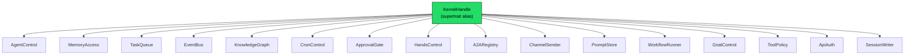

# Shared Libraries — librefang-kernel-handle-src

# librefang-kernel-handle

Role traits that define the seam between the LibreFang agent runtime and the kernel implementation. Every kernel operation the runtime needs — agent lifecycle, memory, task queues, approvals, channel I/O, and more — is expressed as one of sixteen focused role traits. A single supertrait alias, `KernelHandle`, composes them all for backward compatibility.

## Architecture

The crate replaced a monolithic 50+ method `KernelHandle` god-trait (issue #3746) with granular role traits so that:

1. Callers express narrow bounds — `T: ApprovalGate` instead of the full kernel surface.
2. Mock implementations group fakes by capability; a missing capability becomes a compile error, not a silent runtime `Err("not available")`.
3. Each role's contract can be tightened independently in follow-up PRs without touching unrelated domains.



Any concrete type that implements all sixteen role traits automatically satisfies `KernelHandle` through a blanket impl. Existing `Arc<dyn KernelHandle>` call sites continue to work unchanged.

## Error Model

```rust
pub use librefang_types::error::LibreFangError as KernelOpError;
pub type KernelResult<T> = Result<T, KernelOpError>;
```

`KernelOpError` is a re-export of `LibreFangError` — the canonical structured error enum shared across the workspace (issue #3541). This gives callers pattern-matchable variants (`AgentNotFound`, `CapabilityDenied`, `Unavailable`, etc.) instead of the old `Result<_, String>` that required substring matching.

Use `KernelResult<T>` in all new method signatures for consistency.

## Role Traits

### AgentControl

Agent lifecycle, inter-agent messaging, discovery, heartbeats, and forked one-shot calls.

| Method | Description |
|---|---|
| `spawn_agent` | Create an agent from a TOML manifest. Returns `(agent_id, agent_name)`. |
| `spawn_agent_checked` | Like `spawn_agent` but enforces that the child's capabilities are a subset of `parent_caps`. Default delegates to `spawn_agent` without enforcement. |
| `send_to_agent` | Send a message to an agent and await the response. |
| `send_to_agent_as` | Like `send_to_agent` but records the call as made on behalf of a parent agent, enabling cancel cascading on `/stop` (#3044). Default delegates to `send_to_agent` with a trace log. |
| `list_agents` / `find_agents` | Enumerate running agents; search by name, tag, or tool name. |
| `kill_agent` | Terminate an agent by ID. |
| `touch_heartbeat` | Refresh `last_active` during long LLM calls to prevent heartbeat false-positives. Called by the agent loop on each iteration. |
| `fire_agent_step` | Emit an `agent:step` hook event at the start of each loop iteration. |
| `run_forked_agent_oneshot` | Execute a forked agent turn sharing the parent's prompt prefix for cache alignment. Returns final assistant text. Default returns `Err(Unavailable)`. |
| `max_agent_call_depth` | Configured inter-agent call depth limit. Default: `5`. |

### MemoryAccess

Cross-agent shared memory with optional per-user namespace isolation.

| Method | Description |
|---|---|
| `memory_store` | Write a key-value pair. `peer_id` scopes to a per-user namespace. |
| `memory_recall` | Read a value. Respects `peer_id` scoping. |
| `memory_list` | List keys. Respects `peer_id` scoping. |
| `memory_acl_for_sender` | Resolve per-user memory ACL for RBAC (#3054 Phase 2). Default returns `None` (no per-user restriction). |

### TaskQueue

Full CRUD lifecycle for the shared task queue. All methods are async.

`task_post`, `task_claim`, `task_complete`, `task_list`, `task_delete`, `task_retry`, `task_get`, `task_update_status`.

### EventBus

Single-method trait for fire-and-forget event publishing.

`publish_event(event_type, payload)` — triggers proactive agents listening for that event type.

### KnowledgeGraph

Entity/relation insertion and pattern queries against the knowledge graph.

| Method | Description |
|---|---|
| `knowledge_add_entity` | Insert an entity. Takes `&Entity` by reference to avoid forced caller clones (#3553). |
| `knowledge_add_relation` | Insert a relation. Takes `&Relation` by reference for the same reason. |
| `knowledge_query` | Query with a `GraphPattern`, returns `Vec<GraphMatch>`. |

### CronControl

Agent-owned scheduled jobs. All methods default to `Err(Unavailable("Cron scheduler"))`.

`cron_create`, `cron_list`, `cron_cancel`.

### ApprovalGate

Tool approval policy, RBAC user-gate resolution, and the approval lifecycle (submit → resolve → query).

| Method | Description |
|---|---|
| `requires_approval` | Check if a tool needs approval. Default: `false`. |
| `requires_approval_with_context` | Context-aware approval check (sender + channel). Delegates to `requires_approval` by default. |
| `is_tool_denied_with_context` | Hard-deny check for a tool given sender/channel. Default: `false`. |
| `resolve_user_tool_decision` | Combines `UserToolPolicy`, channel rules, and role-based escalation into `Allow`/`Deny`/`NeedsApproval`. Default: `Allow`. |
| `request_approval` | Blocking approval request. Default: auto-approve. |
| `submit_tool_approval` | Non-blocking submission, returns request UUID. Default: `Err(Unavailable)`. |
| `resolve_tool_approval` | Resolve a pending request, returns decision + deferred payload. Used by the API approval routes. Default: `Err(Unavailable)`. |
| `get_approval_status` | Poll status of a request. Default: `Ok(None)`. |

### HandsControl

Lifecycle for Hands — specialized autonomous agents. All methods default to `Err(Unavailable("Hands system"))`.

`hand_list`, `hand_install`, `hand_activate`, `hand_status`, `hand_deactivate`.

### A2ARegistry

Read-only directory of discovered external A2A agents.

`list_a2a_agents` returns `(name, url)` pairs. `get_a2a_agent_url` looks up a single agent by name. Both default to empty/`None`.

### ChannelSender

Outbound channel adapters — text, media, file uploads, polls, and group roster management.

| Method | Description |
|---|---|
| `send_channel_message` | Text message. Supports `thread_id` and `account_id` routing. |
| `send_channel_media` | Image/file by URL. |
| `send_channel_file_data` | Raw bytes upload. Takes `bytes::Bytes` for zero-copy cloning across wrapping layers (#3514, #3553). |
| `send_channel_poll` | Poll/quiz creation. |
| `roster_upsert` / `roster_members` / `roster_remove_member` | Group roster persistence for channel bridges. Default: no-op / empty / no-op. |

### PromptStore

Prompt version management, A/B experiments, and auto-tracking.

Operations include CRUD for prompt versions, experiment lifecycle (`create_experiment`, `update_experiment_status`, `get_experiment_metrics`), and `auto_track_prompt_version` which records a new version when the system prompt changes. Write methods default to `Err(Unavailable)`; read methods default to `None`/empty. Takes `&PromptVersion` and `&PromptExperiment` by reference (#3553).

### WorkflowRunner

Single-method trait: `run_workflow(workflow_id, input) → (run_id, output)`. Default: `Err(Unavailable)`.

### GoalControl

Agent goal listing and status updates.

`goal_list_active` returns pending/in-progress goals. `goal_update` changes status and progress. Defaults: empty vec / `Err(Unavailable)`.

### ToolPolicy

Read-only configuration surface for tool execution parameters.

| Method | Description |
|---|---|
| `tool_timeout_secs` | Global tool timeout. Default: `120`. |
| `tool_timeout_secs_for` | Per-tool override with exact and glob-match resolution. Delegates to `tool_timeout_secs` by default. |
| `skill_env_passthrough_policy` | Operator gate on skill environment variable requests. Default: `None`. |
| `readonly_workspace_prefixes` | Paths declared read-only for the agent. Default: none. |
| `named_workspace_prefixes` | All declared workspaces with access modes. Used by file tools to widen the sandbox accept-list. |
| `channel_file_download_dir` | Directory bridges write attachments to (#4434). Default: `None`. |
| `effective_upload_dir` | Directory for runtime-generated uploads. Default: `<tmp>/librefang_uploads` (#4435). |

### ApiAuth

Atomic snapshot of auth-relevant config fields, consumed by the HTTP server middleware layer at startup.

```rust
fn auth_snapshot(&self) -> ApiAuthSnapshot;
```

`ApiAuthSnapshot` contains the raw API key, dashboard credentials (`DashboardRawConfig`), home directory path, device API keys, and per-user config entries. Implementations must acquire all fields from a single config snapshot so callers see a consistent view across hot-reload boundaries.

### SessionWriter

Pre-injects content blocks into an agent session before the next LLM turn. Used by the HTTP attachment upload path (#3744).

```rust
fn inject_attachment_blocks(&self, agent_id: AgentId, blocks: Vec<ContentBlock>);
```

**Blocking I/O caveat:** The production `LibreFangKernel` implementation calls `MemorySubstrate::save_session` synchronously (SQLite write). Async callers should wrap in `tokio::task::spawn_blocking`. This will be resolved when the substrate moves to async I/O (#3579).

## Data Types

### AgentInfo

```rust
pub struct AgentInfo {
    pub id: String,
    pub name: String,
    pub state: String,
    pub model_provider: String,
    pub model_name: String,
    pub description: String,
    pub tags: Vec<String>,
    pub tools: Vec<String>,
}
```

Returned by `list_agents` and `find_agents`.

### ApiAuthSnapshot / ApiUserConfigSnapshot / DashboardRawConfig

Owned snapshots of auth configuration. Returned atomically by `ApiAuth::auth_snapshot` to prevent middleware from mixing pre-reload and post-reload config values during hot-reload races.

## Default Implementations

Default method bodies follow a consistent pattern established during the god-trait refactor (zero behavior change):

- **Read-side queries** return empty values (`None`, `vec![]`, `false`, `Allow`).
- **Write-side / capability methods** return `Err(KernelOpError::unavailable(...))`.
- **Config lookups** return sensible constants (`5`, `120`, temp dir paths).

This preserves backward compatibility so stub kernels and tests that don't exercise a particular subsystem continue working. Follow-up PRs can tighten individual role contracts by removing defaults, making previously silent failures into compile errors.

## Internal Delegations

Several methods delegate to sibling methods within the same trait, forming a layered default chain:

```
requires_approval_with_context  →  requires_approval
spawn_agent_checked             →  spawn_agent
send_to_agent_as                →  send_to_agent
tool_timeout_secs_for           →  tool_timeout_secs
```

The real kernel overrides the outer method (e.g., `spawn_agent_checked` enforces capability checks), while stubs that don't need the extra semantics get correct behavior for free through the default delegation.

## Usage Patterns

### Import everything

```rust
use librefang_kernel_handle::prelude::*;
```

This brings in `KernelHandle` and all 16 role traits so method calls like `kernel.send_channel_message(...)` resolve.

### Narrow bounds for new code

```rust
async fn approve_and_run<T: ApprovalGate + ToolPolicy + Send + Sync>(
    kernel: &T,
    tool: &str,
) -> KernelResult<()> {
    if kernel.requires_approval(tool) {
        // ...
    }
    let timeout = kernel.tool_timeout_secs_for(tool);
    // ...
}
```

### Trait-object construction

```rust
let handle: Arc<dyn KernelHandle> = Arc::new(MyKernel::new(config));
let approval_only: Arc<dyn ApprovalGate> = Arc::new(MyKernel::new(config));
```

## Integration Points

The call graph shows this crate sits at the center of the system:

- **`librefang-runtime`** is the primary consumer — the agent loop calls `touch_heartbeat`, `fire_agent_step`, `memory_acl_for_sender`, `tool_timeout_secs_for`, `auto_track_prompt_version`, and `get_prompt_version`. The tool runner calls `send_to_agent_as`, `max_agent_call_depth`, `skill_env_passthrough_policy`, `effective_upload_dir`, and `goal_update`.
- **`librefang-api`** routes use `resolve_tool_approval` (approval routes), `set_active_prompt_version` (prompt routes), and `SessionWriter` (attachment uploads).
- **`librefang-kernel`** provides the concrete `LibreFangKernel` implementation and the integration tests that validate the trait contracts (`kernel_handle_contract_rbac`, `kernel_handle_contract_broader`, `kernel_handle_contract_cron_spawn`, `workflow_integration_test`).