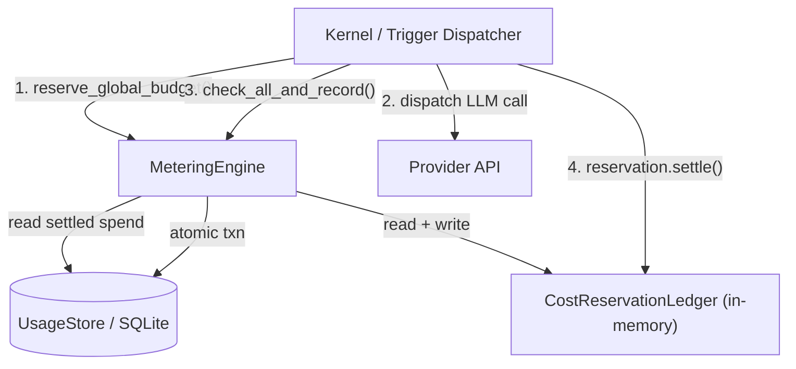

# Shared Libraries — librefang-kernel-metering-src

# librefang-kernel-metering

LLM cost metering engine — tracks token usage, estimates USD cost, and enforces multi-layer spending quotas.

## Purpose

Every LLM call costs money. This module provides the central budget enforcement layer that prevents runaway spending across four independent axes:

| Axis | Scope | Config |
|------|-------|--------|
| Per-agent | Individual agent spend | `ResourceQuota` |
| Global | All agents combined | `BudgetConfig` |
| Per-provider | Spend through a single provider (e.g. moonshot) | `ProviderBudget` |
| Per-user | Spend by a single human user (RBAC) | `UserBudgetConfig` |

Each axis enforces hourly, daily, and monthly USD windows. Per-provider additionally supports an hourly token cap. A zero-valued limit means "unlimited" — no enforcement for that window.

## Architecture



The engine wraps a SQLite-backed `UsageStore` (from `librefang-memory`) and an in-process `CostReservationLedger`. The two-phase reserve → call → settle flow prevents concurrent budget overshoot (issue #3616).

## Key Types

### `MeteringEngine`

The primary entry point. Constructed with `MeteringEngine::new(store: Arc<UsageStore>)`.

Provides two categories of methods:

**Pre-call budget gates** (non-atomic, fast):
- `reserve_global_budget` — reserves estimated USD against the in-memory ledger before dispatching an LLM call. Returns a `MeteringReservation`.
- `check_quota` — checks per-agent limits.
- `check_global_budget` — checks global limits, including pending reservations.
- `check_provider_budget` — checks per-provider limits.
- `check_user_budget` — checks per-user limits (post-call only).

**Post-call recording** (atomic, transactional):
- `check_all_and_record` — the preferred recording method. Checks per-agent, global, and per-provider budgets in a single SQLite transaction, then inserts the usage record. Prevents TOCTOU races between concurrent requests.
- `check_quota_and_record` — atomic per-agent check + record.
- `check_global_budget_and_record` — atomic global check + record.
- `record` — raw insert, no quota checks.

### `MeteringReservation`

```rust,no_run
#[must_use = "a budget reservation must be settled or released"]
pub struct MeteringReservation { /* ... */ }
```

RAII guard returned by `reserve_global_budget`. Three lifecycle paths:

1. **Happy path**: call `settle()` after the LLM response is recorded. The in-memory reservation is released so it doesn't double-count against the now-settled SQLite row.
2. **Failure path**: call `release()` if the dispatch failed before any cost was incurred.
3. **Panic path**: `Drop` implementation releases the reservation automatically as a safety net.

The `settled` flag prevents double-release.

### `CostReservationLedger`

Internal type. Holds a `Mutex<f64>` tracking total reserved-but-not-settled USD. `add` charges a reservation, `release` subtracts it (clamped at 0 to handle floating-point drift).

### `BudgetStatus`

Serializable snapshot of current spend vs. limits across hourly/daily/monthly windows. Produced by `MeteringEngine::budget_status`. Exposed to dashboards and alerting.

## Budget Enforcement Semantics

### Comparison operators differ between pre-call and post-call

- `reserve_global_budget` and `check_global_budget` use **`>` (strictly greater)** for the projected total. This allows a single call that lands exactly at the cap through.
- `check_all_and_record` and the post-call `check_global_budget` use **`>=` (greater or equal)**. Once the cap is fully consumed, no further calls are dispatched.

This asymmetry is intentional: a fresh kernel should not reject its very first call that happens to equal the limit, but once the limit is hit, subsequent calls must be blocked.

### Atomicity guarantees

`check_all_and_record` delegates to `UsageStore::check_all_with_provider_and_record`, which wraps all reads and the final insert in a single SQLite transaction. This eliminates the race where two concurrent requests both pass their quota check before either writes its record.

`reserve_global_budget` only synchronizes in-process callers. Two separate processes (or an out-of-process SQL writer) can still race. For single-process deployments this is sufficient.

### Per-provider budgets in `check_all_and_record`

When the `UsageRecord` has a non-empty `provider` field, `check_all_and_record` looks up `budget.providers[provider]` and includes per-provider hourly/daily/monthly cost limits and hourly token limits in the same atomic transaction. If the provider has no entry in the budget map, its limits are skipped (treated as unlimited).

## Cost Estimation

Two methods estimate USD cost from token counts:

### `estimate_cost` (catalog-free fallback)

Uses flat default rates: **$1.00/M input, $3.00/M output**. Accepts the model name as a parameter but ignores it. Used in unit tests and when no catalog is available.

### `estimate_cost_with_catalog` (preferred)

Looks up the model in the `ModelCatalog` to get provider-specific pricing. Falls back to default rates for unknown models. Special handling:

- **Zero-priced ChatGPT models**: When a model has `provider == "chatgpt"` and both `input_cost_per_m` and `output_cost_per_m` are zero, it falls back to default rates. This gives conservative budget estimates for session-authenticated models that don't expose billable pricing.
- **Zero-priced local models**: Local-tier models with zero pricing stay at $0. No fallback.
- **Subscription-based providers** (e.g., `alibaba-coding-plan`): Cost reads as $0.00 in metering. Users must monitor usage via the provider's console.

### Cache token pricing

`estimate_cost_from_rates` (the shared core) splits input tokens into three buckets:

| Token type | Pricing |
|------------|---------|
| Regular input (total minus cache tokens) | 100% of `input_per_m` |
| Cache-read tokens | 10% of `input_per_m` |
| Cache-creation tokens | 125% of `input_per_m` |
| Output tokens | 100% of `output_per_m` |

The formula: `regular_input = input_tokens - cache_read - cache_creation`.

## Querying Usage

- `get_summary(agent_id: Option<AgentId>)` — aggregated usage summary, optionally filtered to one agent.
- `get_by_model()` — usage grouped by model.
- `budget_status(budget: &BudgetConfig)` — current spend and percentage-of-limit for all windows.
- `pending_reserved_usd()` — diagnostic: total in-flight reservation amount.

## Data Cleanup

`cleanup(days: u32)` deletes usage records older than the specified number of days. Returns the count of deleted rows.

## Dependencies

| Crate | Usage |
|-------|-------|
| `librefang-memory` | `UsageStore`, `UsageRecord`, `UsageSummary`, `ModelUsage` — SQLite persistence layer |
| `librefang-types` | `AgentId`, `UserId`, `ResourceQuota`, `BudgetConfig`, `ProviderBudget`, `UserBudgetConfig`, `LibreFangError`, `ModelCatalogEntry` |
| `librefang-runtime` | `ModelCatalog` — runtime model catalog for pricing lookups |

## Typical Call Flow

```rust,no_run
use librefang_kernel_metering::MeteringEngine;
use std::sync::Arc;

let engine = MeteringEngine::new(store);

// Pre-call: reserve budget
let reservation = engine.reserve_global_budget(&budget, estimated_usd)?;

// ... dispatch LLM call ...

// Post-call: atomically verify all quotas and persist
let result = engine.check_all_and_record(&usage_record, &quota, &budget);
if let Err(e) = &result {
    // Optional: check_user_budget for RBAC enforcement
}

// Release the in-memory reservation (settled cost is now in SQLite)
reservation.settle();
```

If the LLM dispatch fails before receiving a response, call `reservation.release()` instead of `settle()`. If neither is called, `Drop` releases the reservation automatically.