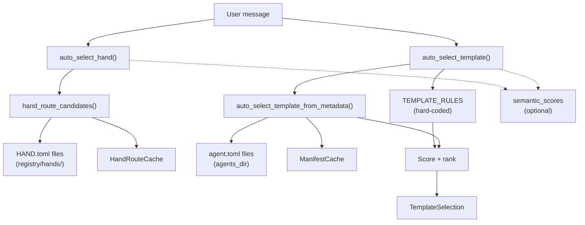

# Shared Libraries — librefang-kernel-router-src

# librefang-kernel-router

Message routing engine that selects the best agent template or hand for an incoming user message. The router blends keyword matching, manifest metadata, and optional embedding-based semantic similarity to produce a scored selection.

## Architecture Overview



## Core Concepts

### Routing Layers

The router evaluates messages against three signal sources, blended by weighted scoring:

| Layer | Weight per hit | Source |
|---|---|---|
| Explicit aliases | 6 (`EXPLICIT_ALIAS_WEIGHT`) | `aliases` / `strong_aliases` from HAND.toml `[routing]` or agent.toml `[metadata.routing]` |
| Generated phrases | 2 (`GENERATED_PHRASE_WEIGHT`) | Auto-derived from name, description, and tags |
| Weak phrases | 1 (`WEAK_PHRASE_WEIGHT`) | `weak_aliases` config + id-derived tokens |
| Semantic bonus | up to 5 (`MAX_SEMANTIC_BONUS`) | External embedding cosine similarity, passed in by caller |

A match must reach `MIN_HAND_SCORE` (2) to be accepted. This prevents a single weak keyword from triggering a route.

### Multi-Domain Detection

When `auto_select_template` detects two different templates scoring above zero and the message contains multi-domain tokens (`同时`, `分别`, `协作`, `多个`, `multi`, `together`), it routes to `orchestrator` instead of picking a single specialist.

### Fallback Chain

If no keyword or semantic match is found, `auto_select_template` defaults to `orchestrator`. `auto_select_hand` returns `HandSelection { hand_id: None, score: 0 }`.

## Public API

### Hand Selection

```rust
pub fn auto_select_hand(
    message: &str,
    semantic_scores: Option<&HashMap<String, f32>>,
) -> HandSelection
```

Selects the best hand for `message`. Returns a `HandSelection`:

```rust
pub struct HandSelection {
    pub hand_id: Option<String>,  // None = no match
    pub reason: String,            // human-readable explanation
    pub score: usize,              // total weighted score
}
```

Keyword candidates are loaded from `HAND.toml` `[routing]` sections under `<home>/registry/hands/<hand-id>/HAND.toml`. When `semantic_scores` is provided, cosine similarity values (0.0–1.0) are scaled by `MAX_SEMANTIC_BONUS` and added to the keyword score.

### Template Selection

```rust
pub fn auto_select_template(
    message: &str,
    agents_dir: &Path,
    semantic_scores: Option<&HashMap<String, f32>>,
) -> TemplateSelection
```

Selects the best agent template. Evaluates in order:

1. **Hard-coded `TEMPLATE_RULES`** — curated bilingual regex patterns for ~30 built-in templates (coder, debugger, security-auditor, etc.)
2. **Manifest metadata** — `[metadata.routing]` from each template's `agent.toml` in `agents_dir`
3. **Semantic-only fallback** — when keyword matching finds nothing but `semantic_scores` has entries above `SEMANTIC_ONLY_THRESHOLD` (0.55)

Returns a `TemplateSelection`:

```rust
pub struct TemplateSelection {
    pub template: String,  // template name (e.g. "coder")
    pub reason: String,    // explanation
    pub score: usize,      // total weighted score
}
```

Manifest metadata wins over `TEMPLATE_RULES` when its score exceeds the rule score by at least 2 points.

### Manifest Loading

```rust
pub fn load_template_manifest(
    home_dir: &Path,
    template: &str,
) -> Result<AgentManifest, String>
```

Loads `<home_dir>/workspaces/agents/<template>/agent.toml`. Template names are validated by `is_safe_template_name` — only ASCII alphanumeric, `-`, and `_` characters are permitted.

### Description Export

```rust
pub fn all_template_descriptions(agents_dir: &Path) -> Vec<(String, String)>
```

Returns `(template_name, embed_text)` pairs for all routable templates (excluding `"assistant"`). The `embed_text` combines name, description, and tags — designed for generating embedding vectors for semantic routing.

### Configuration & Cache Invalidation

```rust
pub fn set_hand_route_home_dir(home_dir: &Path)
pub fn invalidate_hand_route_cache()
pub fn invalidate_manifest_cache()
```

- `set_hand_route_home_dir` — sets the LibreFang home directory used to locate hand definitions. Falls back to `$LIBREFANG_HOME`, then `~/.librefang`.
- `invalidate_hand_route_cache` / `invalidate_manifest_cache` — clear the respective caches. Call after config hot-reload, or after installing/uninstalling hands (the skills routes call these automatically).

## Internal Flow

### Hand Candidate Building

1. `hand_route_candidates()` checks the global `HAND_ROUTE_CACHE` (keyed by home directory path)
2. On miss, calls `build_hand_route_candidates()` → `load_hand_route_candidates()`
3. Scans `<home>/registry/hands/*/HAND.toml`, parsing each via `librefang_hands::registry::parse_hand_toml_with_agents_dir()`
4. `hand_route_candidate_from_definition()` converts each `HandDefinition` into a `HandRouteCandidate`:
   - **Strong phrases**: explicit `aliases` + description-derived phrases
   - **Weak phrases**: explicit `weak_aliases` + id-derived tokens (splitting on `-` and `_`, filtering generic English words and tokens shorter than 3 chars)

### Manifest Candidate Building

1. `manifest_route_candidates()` checks the global `MANIFEST_CACHE` (keyed by `agents_dir` path)
2. On miss, calls `build_manifest_route_candidates()`
3. For each template directory containing an `agent.toml`:
   - Reads `[metadata.routing]` for `aliases`, `strong_aliases`, `weak_aliases`, `exclude_generated`
   - Generates phrases from template name (via `english_variants`), tags (via `tag_phrases`), and description (via `description_phrases`) unless `exclude_generated = true`

### Phrase Extraction Pipeline

```
description / tags
  → split_phrase_chunks()    (split on CJK/ASCII punctuation)
    → normalize_phrase_chunk()  (strip generic English words at edges)
      → ascii_phrase_candidates()  (whole phrase + individual content words + bigrams)
        → english_variants()         (normalized form + space-separated form + parts)
          → dedupe()
```

CJK text passes through as-is (checked by `is_meaningful_unicode_phrase`: 2–32 chars). ASCII text is decomposed into content words and bigrams, filtering out entries in `GENERIC_ENGLISH_WORDS`.

### Regex Matching

All pattern matching goes through `regex_matches()`, which uses a global `REGEX_CACHE` (`HashMap<String, Regex>`) to avoid recompiling the same patterns across messages. Hand-curated `TEMPLATE_RULES` use explicit regex patterns; manifest-derived phrases are escaped and wrapped in word-boundary patterns via `phrase_matches()`.

## Integration Points

| Caller | What it calls | When |
|---|---|---|
| `src/routes/skills.rs` `install_hand` | `invalidate_hand_route_cache()` | After a new hand is installed |
| `src/routes/skills.rs` `uninstall_hand` | `invalidate_hand_route_cache()` | After a hand is removed |
| Kernel message dispatch | `auto_select_hand()` / `auto_select_template()` | On every inbound user message |
| Embedding pipeline | `all_template_descriptions()` | To compute vectors for semantic routing |

## Key Constants

| Constant | Value | Purpose |
|---|---|---|
| `EXPLICIT_ALIAS_WEIGHT` | 6 | Weight for user-configured aliases and strong pattern matches |
| `GENERATED_PHRASE_WEIGHT` | 2 | Weight for auto-derived phrases from name/description/tags |
| `WEAK_PHRASE_WEIGHT` | 1 | Weight for weak aliases and id-derived tokens |
| `MAX_SEMANTIC_BONUS` | 5.0 | Maximum bonus points from embedding similarity |
| `SEMANTIC_ONLY_THRESHOLD` | 0.55 | Minimum cosine similarity for a semantic-only match |
| `MIN_HAND_SCORE` | 2 | Minimum score for a hand match to be accepted |
| `ROUTING_EXCLUDED_TEMPLATES` | `["assistant"]` | Templates excluded from routing consideration |