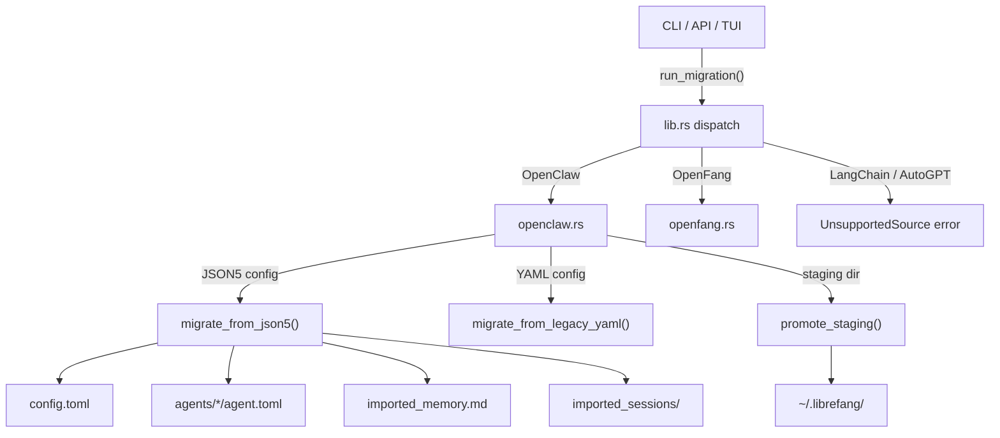

# Shared Libraries — librefang-migrate-src

# librefang-migrate

Migration engine for importing agent configurations from other frameworks into LibreFang's workspace format.

## Architecture



## Module Structure

| File | Purpose |
|------|---------|
| `lib.rs` | Public API: `MigrateSource`, `MigrateOptions`, `run_migration()`, `MigrateError` |
| `openclaw.rs` | Full OpenClaw importer (JSON5 + legacy YAML) |
| `openfang.rs` | OpenFang importer (format-compatible fork) |
| `report.rs` | `MigrationReport`, `MigrateItem`, `SkippedItem` — structured result |

## Public API

### `run_migration(options: &MigrateOptions) -> Result<MigrationReport, MigrateError>`

Entry point. Dispatches to the appropriate migrator based on `options.source`. Returns a detailed report of what was imported, skipped, and any warnings.

```rust
let report = run_migration(&MigrateOptions {
    source: MigrateSource::OpenClaw,
    source_dir: PathBuf::from("/home/user/.openclaw"),
    target_dir: PathBuf::from("/home/user/.librefang"),
    dry_run: false,
})?;
println!("{}", report.to_markdown());
```

### `MigrateSource`

```rust
pub enum MigrateSource {
    OpenClaw,   // Fully supported
    OpenFang,   // Supported (same-format fork)
    LangChain,  // Future — returns UnsupportedSource
    AutoGpt,    // Future — returns UnsupportedSource
}
```

### `MigrateOptions`

| Field | Type | Description |
|-------|------|-------------|
| `source` | `MigrateSource` | Framework to import from |
| `source_dir` | `PathBuf` | Path to the source workspace (e.g. `~/.openclaw`) |
| `target_dir` | `PathBuf` | Path to the LibreFang home directory |
| `dry_run` | `bool` | If true, report what would happen without writing files |

### `MigrateError`

All error variants and what they mean:

| Variant | Condition |
|---------|-----------|
| `SourceNotFound(PathBuf)` | Source directory does not exist |
| `ConfigParse(String)` | Config file could not be parsed |
| `AgentParse(String)` | Agent definition could not be parsed |
| `Io(std::io::Error)` | Filesystem I/O failure |
| `Yaml(serde_yaml::Error)` | Legacy YAML parse failure |
| `Json5Parse(String)` | JSON5 parse failure |
| `TomlSerialize(toml::ser::Error)` | TOML serialization failure |
| `UnsupportedSource(String)` | Requested source has no migrator yet |
| `InvalidId(String)` | Agent ID contains path traversal (#3794) |
| `UnsupportedVersion(u32)` | Config schema version not recognized (#3797) |
| `StagingExists(PathBuf)` | Stale staging directory from a previous failed run (#3798) |

## OpenClaw Migration

### Source Layout

The migrator handles two OpenClaw config formats:

**Modern (JSON5)** — single `openclaw.json` containing everything:
```
~/.openclaw/
├── openclaw.json          # JSON5 — agents, channels, models, tools, skills
├── auth-profiles.json     # Credentials (not migrated)
├── sessions/              # JSONL conversation logs
├── memory/                # Per-agent MEMORY.md files
├── skills/                # Installed skills
└── workspaces/            # Per-agent working directories
```

Also recognizes legacy directory names: `~/.clawdbot`, `~/.moldbot`, `~/.moltbot`.

**Legacy (YAML)** — separate `config.yaml` + per-agent directories:
```
~/.openclaw/
├── config.yaml            # Global config
├── agents/
│   └── coder/
│       ├── agent.yaml     # Agent definition
│       ├── MEMORY.md
│       └── workspace/
└── messaging/
    ├── telegram.yaml
    └── discord.yaml
```

### Detection & Scanning

Before migration, callers typically detect and scan:

```rust
// Auto-detect OpenClaw home directory
if let Some(home) = openclaw::detect_openclaw_home() {
    // Scan to see what's available
    let scan = openclaw::scan_openclaw_workspace(&home);
    // scan.agents, scan.channels, scan.skills, scan.has_memory
}
```

`detect_openclaw_home()` checks, in order:
1. `OPENCLAW_STATE_DIR` environment variable
2. `~/.openclaw`, `~/.clawdbot`, `~/.moldbot`, `~/.moltbot`, `~/openclaw`, `~/.config/openclaw`
3. Windows: `%APPDATA%\openclaw`, `%LOCALAPPDATA%\openclaw`

A directory is considered valid if it contains a recognized config file **or** has `sessions/` or `memory/` subdirectories.

### Migration Flow

1. **Validate** — Check source directory exists, reject if migration marker `.openclaw_migrated` already present
2. **Stage** — All writes go to a sibling `.migrate-staging` directory (#3798)
3. **Parse** — Detect config format (JSON5 vs YAML) and parse
4. **Convert** — Transform each component:
   - Config → `config.toml`
   - Agents → `agents/<id>/agent.toml`
   - Memory → `agents/<id>/imported_memory.md`
   - Workspaces → `agents/<id>/workspace/`
   - Sessions → `imported_sessions/*.jsonl`
5. **Promote** — Atomically move staging into the real target, never overwriting existing files
6. **Mark** — Write `.openclaw_migrated` marker to prevent accidental re-import

### Idempotency

Running migration twice is safe:
- The marker file `.openclang_migrated` causes an immediate return with a warning
- Existing files in the target are **never overwritten** (#3795) — staged copies are dropped if the destination already exists
- Any file that *would* be overwritten is backed up to a `.bak.<timestamp>` sibling before writing

### Atomicity & Crash Safety

All file writes use `atomic_write()` (write to `.tmp`, then rename). For workspace-level atomicity, all writes target a staging directory first. If the process crashes:
- The staging directory is left in place for inspection
- The real `~/.librefang` is untouched
- Re-running detects the stale staging and returns `MigrateError::StagingExists` — the user must explicitly remove it

### Security

**Path traversal protection (#3794):** `validate_migration_id()` rejects agent IDs containing `..`, absolute paths, or NUL bytes. Only single normal path components are accepted.

**Schema version gate (#3797):** If `openclaw.json` declares a `version` field, only versions 1 and 2 are accepted. Unknown versions return `MigrateError::UnsupportedVersion`.

**Secret handling:** Tokens and credentials are written to `secrets.env` with restricted permissions (`0600` on Unix). Auth profiles and credential files are explicitly skipped and reported.

### Channel Migration

13 channel types are recognized:

| Channel | Status | Notes |
|---------|--------|-------|
| Telegram | ✅ Imported | Token → `secrets.env`, allow-lists mapped |
| Discord | ✅ Imported | Token → `secrets.env` |
| Slack | ✅ Imported | Bot + app tokens; `allow_from` cannot be mapped (channel-based, not user-based) |
| WhatsApp | ✅ Imported | Baileys credential dir copied; user warned re-auth may be needed |
| Signal | ✅ Imported | API URL reconstructed from host+port |
| Matrix | ✅ Imported | Access token → `secrets.env`, rooms mapped |
| Google Chat | ✅ Imported | Service account file copied |
| Teams | ✅ Imported | App password → `secrets.env`; warns about `signature_required` default |
| IRC | ✅ Imported | Server, port, TLS, nick, channels mapped |
| Mattermost | ✅ Imported | Token → `secrets.env` |
| Feishu | ✅ Imported | Domain mapped to `region` ("cn" / "intl") |
| iMessage | ⏭ Skipped | macOS-only, requires manual setup |
| BlueBubbles | ⏭ Skipped | No LibreFang adapter |

Policy mapping:

| OpenClaw DM Policy | LibreFang DM Policy |
|--------------------|---------------------|
| `open` | `respond` |
| `allowlist` / `allow_list` | `allowed_only` |
| `pairing` / `disabled` | `ignore` |

| OpenClaw Group Policy | LibreFang Group Policy |
|-----------------------|------------------------|
| `open` / `all` | `all` |
| `mention` / `mention_only` | `mention_only` |
| `commands` / `commands_only` / `slash_only` | `commands_only` |
| `disabled` / `ignore` | `ignore` |

### Agent Migration

Each OpenClaw agent is converted to a LibreFang `agent.toml` manifest:

- **Model:** `provider/model` strings are split and provider names are normalized (e.g. `claude` → `anthropic`, `grok` → `xai`)
- **Tools:** Mapped via `librefang_types::tool_compat` — known LibreFang tools are kept, OpenClaw tool names are mapped, unknown tools are reported as warnings
- **Tool profiles:** OpenClaw profile names (`minimal`, `coding`, `research`, etc.) are mapped to LibreFang `ToolProfile` variants
- **Capabilities:** Derived from the tool list (`shell_exec` → shell capability, `web_fetch` → network, etc.)
- **Identity/System prompt:** Extracted from OpenClaw's `identity` field which may be a raw string or a nested object with keys like `systemPrompt`, `instructions`, `persona`, etc.
- **Tool blocklist:** OpenClaw's `tools.deny` list is preserved as `tool_blocklist` in the agent manifest
- **Skills:** Per-agent skill allowlists are preserved
- **Fallback models:** Written as `[[fallback_models]]` TOML array

### What Gets Skipped

These OpenClaw features have no LibreFang equivalent and are reported as skipped items:

- **Cron jobs** — use LibreFang's `ScheduleMode::Periodic`
- **Webhook hooks** — use LibreFang's event system
- **Auth profiles** — security-sensitive, set env vars manually
- **Skill entries** — reinstall via `librefang skill install`
- **SQLite vector index** (`memory-search/index.db`) — not portable, rebuilt automatically
- **Session scope config** — LibreFang uses per-agent sessions
- **Memory backend config** — LibreFang uses SQLite with vector embeddings

## Integration Points

The migration module is called from three surfaces:

- **CLI:** `cmd_migrate` in `librefang-cli` — parses arguments, calls `run_migration()`, prints the report
- **API:** `run_migrate` and `migrate_scan` routes in `src/routes/config.rs` — HTTP endpoints for triggering migration and scanning
- **TUI:** Init wizard in `tui/screens/init_wizard.rs` — auto-detects OpenClaw during first-time setup, offers to import