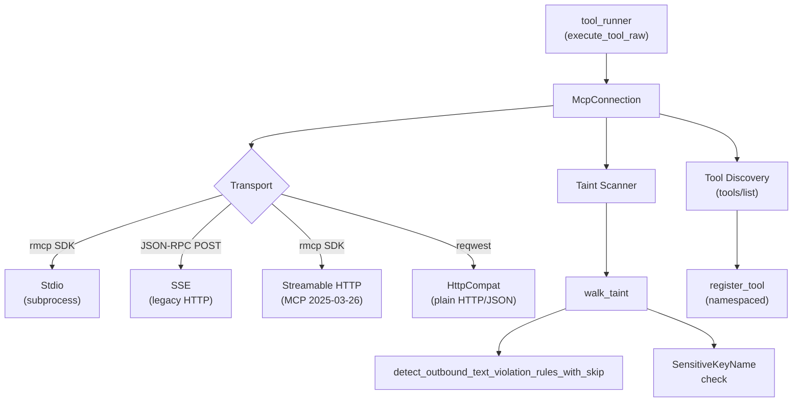

# Shared Libraries — librefang-runtime-mcp-src

# librefang-runtime-mcp — MCP Client Library

Client-side implementation of the Model Context Protocol (MCP). Connects to external MCP servers over multiple transports, discovers their tools, and executes tool calls with outbound taint scanning to prevent credential exfiltration.

## Architecture



## Transports

Four transport modes are supported via the `McpTransport` enum:

| Transport | Protocol | Tool Discovery | Use Case |
|-----------|----------|----------------|----------|
| `Stdio` | MCP over stdin/stdout via rmcp | rmcp `list_all_tools` | Local MCP servers (npx, python, etc.) |
| `Sse` | JSON-RPC 2.0 over HTTP POST | Manual `tools/list` | Legacy SSE-based servers |
| `Http` | Streamable HTTP (rmcp) | rmcp `list_all_tools` | MCP 2025-03-26+ servers |
| `HttpCompat` | Plain HTTP/JSON | Static config | Non-MCP HTTP backends |

### Stdio Transport

Spawns a subprocess and communicates via the rmcp SDK. Key security measures:

- **Shell blocking**: `bash`, `sh`, `powershell`, etc. are rejected — operators must specify a concrete runtime (`npx`, `node`, `python`)
- **Environment sandboxing**: The child does NOT inherit the parent environment. Only `SAFE_ENV_VARS` (PATH, HOME, NODE_PATH, etc.) and explicitly declared `env` entries are passed through
- **Environment expansion**: `$VAR` and `${VAR}` in command arguments are expanded, but only for variables in the operator-declared allowlist — prevents reading undeclared secrets like `ANTHROPIC_API_KEY`
- **Path traversal rejection**: Commands containing `..` are rejected
- **stderr draining**: Child stderr is read line-by-line in a background task, truncated to 256 bytes/line, capped at 100 lines. The pipe continues to be drained past the log cap to prevent pipe stalls
- **Kill on drop**: `kill_on_drop(true)` ensures the subprocess is terminated when the transport is dropped

### SSE Transport

Legacy unidirectional transport using JSON-RPC 2.0 over HTTP POST. Performs manual `initialize` handshake and `tools/list` discovery. Does not declare `roots` capability since the server has no channel to send `roots/list` back.

### Streamable HTTP Transport

Uses the rmcp SDK's `StreamableHttpClientTransport` for MCP 2025-03-26+ servers. Handles Accept headers, `Mcp-Session-Id` tracking, and content-type negotiation. On 401 responses, attempts OAuth metadata discovery and returns `OAUTH_NEEDS_AUTH` to defer PKCE flow to the API layer.

### HttpCompat Transport

Built-in adapter for plain HTTP/JSON backends that don't speak MCP. Tools are statically declared in config with:
- Path templates with `{param}` placeholders (URL-encoded automatically)
- Configurable HTTP methods (GET, POST, PUT, PATCH, DELETE)
- Request modes: `JsonBody`, `Query`, or `None`
- Response modes: `Text` or `Json` (pretty-printed)
- Static or environment-variable-sourced headers

## Tool Namespacing

All MCP tools are namespaced to prevent collisions across servers:

```
mcp_{server}_{tool}
```

Where `server` and `tool` are normalized to lowercase with hyphens replaced by underscores.

### Resolution Functions

- **`format_mcp_tool_name(server, tool)`** — Build the namespaced name
- **`is_mcp_tool(name)`** — Check if a name starts with `mcp_`
- **`resolve_mcp_server_from_known(tool_name, server_names)`** — Reverse lookup using known server names (handles multi-word server names correctly)
- **`extract_mcp_server(tool_name)`** — Heuristic extraction (unreliable for server names containing underscores; prefer `resolve_mcp_server_from_known`)

### Integration Point

`execute_tool_raw` in `librefang-runtime/src/tool_runner.rs` uses `is_mcp_tool` to detect MCP calls, `resolve_mcp_server_from_known` to route to the correct server, and `McpConnection::call_tool` to execute.

## Outbound Taint Scanning

Before every tool call, the scanner walks every string leaf in the argument JSON tree and checks for credentials/PII. This prevents a compromised LLM from smuggling secrets to external MCP servers.

### Scanning Pipeline

```
scan_mcp_arguments_for_taint_with_policy(arguments, policy, rule_sets, tool_name)
  ├── Check tool-level default=skip → bypass entirely
  ├── walk_taint(value, sink, "$", 0, policy, rule_sets, tool_name)
  │   ├── String leaf → detect_outbound_text_violation_rules_with_skip()
  │   │   └── For each fired rule → apply_rule_set_action()
  │   │       ├── Block → return violation
  │   │       └── Warn/Log → emit trace, continue
  │   ├── Object key → is_sensitive_key_name() check
  │   │   └── Matches "authorization", "api_key", "secret", etc.
  │   ├── Array → recurse with path[i]
  │   └── Object → recurse with path.key
  └── Depth cap: MCP_TAINT_SCAN_MAX_DEPTH (64)
```

### Two Detection Layers

1. **Content-based**: `detect_outbound_text_violation_rules_with_skip` from `librefang-types::taint` checks string values against regex patterns for tokens, API keys, emails, phone numbers, etc.

2. **Key-name-based**: Object keys matching `MCP_SENSITIVE_KEY_NAMES` (`authorization`, `api_key`, `secret`, `password`, `bearer`, etc.) with non-empty string values are blocked regardless of the value's appearance. This catches patterns like `{"Authorization": "Bearer sk-..."}` where the value contains whitespace that evades the text heuristic.

### Per-Tool Policy Configuration

The `McpTaintPolicy` provides fine-grained control:

**Path-level skip rules** — Disable specific taint rules for specific argument paths:
```toml
[taint_policy.tools.navigate.paths."$.tabId"]
skip_rules = ["OpaqueToken"]
```

**Tool-level kill switch** — Bypass all scanning for a tool:
```toml
[taint_policy.tools.navigate]
default = "skip"
```

**Named rule sets** — Downgrade `Block` to `Warn` or `Log` for rules covered by referenced sets:
```toml
[taint_policy.tools.navigate]
rule_sets = ["browser_handles"]

[[taint_rules]]
name = "browser_handles"
action = "warn"
rules = ["OpaqueToken"]
```

When multiple rule sets cover the same rule, the most permissive action wins: `Log` > `Warn` > `Block`.

### JSONPath Matching

The policy uses a minimal JSONPath matcher supporting:
- `$.a.b` — exact nested property
- `$.a.*` — any direct child
- `$.a[*]` — any array element
- `$.*` — any top-level property

**Limitation**: Object keys containing `.` or `[` cannot be addressed precisely. Use broader patterns as a workaround.

### Hot-Reload Contract

`TaintRuleSetsHandle` (an `Arc<ArcSwap<Vec<NamedTaintRuleSet>>>`) is shared across all servers. The kernel owns a single swap and clones it into each `McpServerConfig`. On config reload, the kernel calls `.store(Arc::new(new_rules))`. Each scan takes a `.load()` snapshot that stays stable for the entire walk.

### Security Guarantees

- Error messages are **redacted** — they contain only the JSON path, never the offending value, since they flow back to the LLM and into logs
- Every fired rule is checked independently — a `Warn` downgrade for rule A does not mask a `Block` from rule B
- Non-string leaves (numbers, bools, null) are skipped
- Recursion is hard-capped at 64 levels

## MCP Roots Capability

`RootsClientHandler` implements the rmcp `ClientHandler` trait and responds to `roots/list` requests with configured root directories. Roots are converted to `file://` URIs and declared during the MCP `initialize` handshake.

- Only advertised to **local** servers (Stdio and local-URL HTTP transports)
- Remote servers (GitHub, Slack, etc.) receive empty roots — they don't operate on the local filesystem
- `is_local_url` uses proper `url` crate parsing to prevent SSRF via domains like `127.0.0.1.evil.com`

## OAuth Authentication

The `mcp_oauth` submodule handles OAuth 2.0 + PKCE for MCP servers requiring authentication. Key functions:

- **`discover_oauth_metadata`** — Three-tier resolution: `WWW-Authenticate` header → `.well-known/oauth-authorization-server` → config fallback
- **`generate_pkce`** / **`generate_state`** — PKCE challenge/verifier and state parameter generation
- **`is_ssrf_blocked_url`** / **`is_ssrf_blocked_host`** — Prevents OAuth redirects to metadata endpoints, link-local addresses, and loopback

The flow is: server returns 401 → daemon discovers OAuth metadata → returns `OAUTH_NEEDS_AUTH` → API layer drives browser-based PKCE via the dashboard → tokens stored in vault → subsequent connections inject `Authorization: Bearer` header.

## SSRF Protection

`check_ssrf` blocks URLs targeting cloud metadata endpoints (`169.254.169.254`, `metadata.google`). The OAuth module adds deeper protection via `is_ssrf_blocked_host` which blocks loopback, link-local, and private IPv4/IPv6 ranges.

## Response Body Bounding

`read_response_bytes_capped` limits HTTP response bodies to 16 MiB (`MAX_RESPONSE_BYTES`). It checks `Content-Length` first (fast path), then streams chunks with a running counter. This prevents OOM from malicious servers returning unbounded responses.

## Connection Lifecycle

```
McpConnection::connect(config)
  → Transport-specific connect + handshake
  → Tool discovery (tools/list or static config)
  → Register namespaced tools

McpConnection::call_tool(name, arguments)
  → Resolve raw tool name from namespaced name
  → Taint scan arguments
  → Transport-specific execution
  → Return text content or error

McpConnection::close(self)
  → For Stdio: cancel rmcp service, wait up to 10s, kill subprocess
  → For SSE/HttpCompat: no persistent connection to close
```

### Drop Behavior

`Drop for McpConnection` spawns a best-effort async close on the current tokio runtime. This is a safety net — callers performing hot-reload should prefer the explicit `close()` method which awaits completion and guarantees subprocess cleanup.

## Protocol Version Negotiation

`SUPPORTED_MCP_VERSIONS` lists `["2024-11-05", "2025-03-26"]`. The first is advertised in `initialize`; both are accepted from the server. Unknown versions trigger a warning but do not abort the connection.

## MCP Annotations

`inject_annotation_class` translates MCP tool annotations (`readOnlyHint`, `destructiveHint`) into a `metadata.tool_class` field on the tool's JSON Schema:
- `readOnlyHint=true, destructiveHint=false` → `"readonly_search"`
- All other combinations → `"mutating"`

This allows the runtime tool classifier to identify safe parallel candidates without maintaining a separate annotation mapping.

## Key Types

| Type | Description |
|------|-------------|
| `McpServerConfig` | Full server configuration (name, transport, taint policy, OAuth, roots) |
| `McpTransport` | Transport variant: `Stdio`, `Sse`, `Http`, `HttpCompat` |
| `McpConnection` | Active connection with discovered tools and transport handle |
| `McpInner` | Transport-specific state: `Rmcp(DynRmcpClient)`, `Sse{client, url, next_id}`, `HttpCompat{client}` |
| `TaintRuleSetsHandle` | `Arc<ArcSwap<Vec<NamedTaintRuleSet>>>` for hot-reloadable rule sets |
| `RootsClientHandler` | rmcp `ClientHandler` implementing `list_roots` and declaring roots capability |

## Submodule: mcp_oauth

Provides OAuth 2.0 with PKCE support for MCP server authentication. Called from the API layer (`src/routes/mcp_auth.rs`) for auth start/callback flows and from the kernel (`librefang-kernel/src/mcp_oauth_provider.rs`) for token storage and refresh.