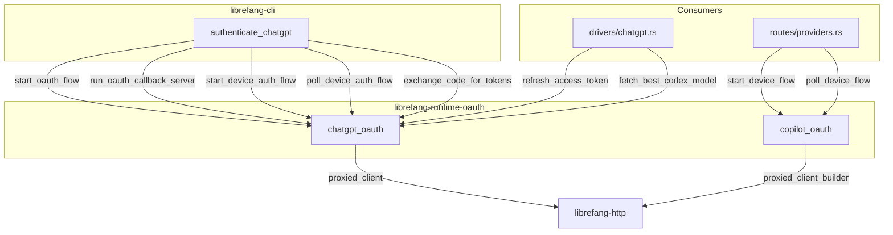

# Shared Libraries — librefang-runtime-oauth-src

# librefang-runtime-oauth

OAuth 2.0 authentication runtime for LibreFang. This crate provides authentication helpers for two providers: **OpenAI ChatGPT** (via browser callback or device authorization flow) and **GitHub Copilot** (via device flow). All sensitive token material is wrapped in `Zeroizing<String>` to minimize in-memory exposure.

## Architecture

---

## Module: `chatgpt_oauth`

Implements OpenAI Codex OAuth 2.0 with PKCE for ChatGPT backend API access. Two flows are supported:

- **Browser flow** — opens the user's browser, listens on `127.0.0.1:1455` for the redirect callback, exchanges the authorization code for tokens.
- **Device flow** — for headless environments; requests a one-time code from OpenAI, polls until the user enters it on a verification page.

The CLI entry point `authenticate_chatgpt` tries the device flow first; if OpenAI returns `BrowserFallback`, it falls back to the browser flow.

### Constants

| Constant | Value | Purpose |
|---|---|---|
| `CHATGPT_BASE_URL` | `https://chatgpt.com/backend-api` | ChatGPT backend API base URL for token-authenticated requests |
| `CLIENT_ID` | `app_EMoamEEZ73f0CkXaXp7hrann` | OpenAI Codex CLI OAuth client ID |
| `AUTHORIZE_URL` | `https://auth.openai.com/oauth/authorize` | Authorization endpoint |
| `TOKEN_URL` | `https://auth.openai.com/oauth/token` | Token exchange and refresh endpoint |
| `DEVICE_AUTH_URL` | `https://auth.openai.com/codex/device` | User-facing verification page for device flow |
| `SCOPE` | `openid profile email offline_access api.connectors.read api.connectors.invoke` | Requested OAuth scopes |
| `CALLBACK_BIND` | `127.0.0.1:1455` | Local callback server bind address (matches OpenAI's registered redirect URI) |
| `AUTH_TIMEOUT_SECS` | `300` | Browser callback timeout (5 minutes) |
| `DEVICE_AUTH_TIMEOUT_SECS` | `900` | Device flow polling timeout (15 minutes) |

### Core Types

#### `ChatGptAuthResult`

Result of a successful OAuth flow. All string fields use `Zeroizing<String>`.

| Field | Type | Description |
|---|---|---|
| `access_token` | `Zeroizing<String>` | Bearer access token |
| `refresh_token` | `Option<Zeroizing<String>>` | Refresh token for obtaining new access tokens |
| `expires_in` | `Option<u64>` | Seconds until access token expires |

#### `DeviceAuthPrompt`

Device auth details to present to the user before polling begins.

| Field | Type | Description |
|---|---|---|
| `device_auth_id` | `String` | Server-issued identifier used in polling requests |
| `user_code` | `String` | One-time code the user enters at `DEVICE_AUTH_URL` |
| `interval_secs` | `u64` | Recommended poll interval from the server |

#### `DeviceAuthFlowError`

Errors specific to the device auth flow.

| Variant | When |
|---|---|
| `BrowserFallback { message }` | HTTP 404 — device auth not enabled for the account/workspace; caller should fall back to browser flow |
| `Fatal(String)` | Unrecoverable error — should not silently fall back |

#### `PkceChallenge`

PKCE code verifier and S256 challenge pair, produced by `generate_pkce()`.

| Field | Description |
|---|---|
| `verifier` | 64 random bytes, base64url-encoded (86 characters, no padding) |
| `challenge` | SHA-256 hash of the verifier, base64url-encoded |

### Browser Flow Functions

#### `start_oauth_flow() -> Result<(String, u16, String, String), String>`

Entry point for browser-based OAuth. Binds a TCP listener on `CALLBACK_BIND` to reserve port 1455, generates a PKCE challenge, creates a random state parameter, and builds the authorization URL.

**Returns:** A tuple of `(auth_url, port, pkce_verifier, state)`.

The caller should open `auth_url` in the user's browser, then call `run_oauth_callback_server` to wait for the redirect.

#### `run_oauth_callback_server(port, expected_state) -> Result<String, String>`

Starts an async HTTP server on the given port that handles `GET /auth/callback?code=...&state=...`. Validates the `state` parameter against `expected_state` to prevent CSRF. Serves a styled HTML success or error page to the browser. Times out after `AUTH_TIMEOUT_SECS`.

**Returns:** The authorization code from the callback query parameters.

#### `build_authorization_url(port, code_challenge, state) -> String`

Constructs the full authorization URL with query parameters including `response_type=code`, PKCE challenge, scope, and OpenAI-specific flags (`codex_cli_simplified_flow`, `originator=codex_cli_rs`).

### Device Flow Functions

#### `start_device_auth_flow() -> Result<DeviceAuthPrompt, DeviceAuthFlowError>`

POSTs to `DEVICE_AUTH_USERCODE_URL` with the client ID. Parses the response to extract `device_auth_id`, `user_code`, and `interval`. Returns `BrowserFallback` on HTTP 404 (device auth not enabled).

#### `poll_device_auth_flow(prompt: &DeviceAuthPrompt) -> Result<ChatGptAuthResult, String>`

Polls `DEVICE_AUTH_TOKEN_URL` at the interval specified in `prompt.interval_secs`. HTTP 403 and 404 are treated as "authorization pending." On HTTP 200, extracts the `authorization_code` and `code_verifier` from the response and exchanges them via `exchange_code_for_tokens_with_redirect_uri` using `DEVICE_AUTH_REDIRECT_URI`.

Times out after `DEVICE_AUTH_TIMEOUT_SECS` (15 minutes).

### Token Functions

#### `exchange_code_for_tokens(code, code_verifier, port) -> Result<ChatGptAuthResult, String>`

Exchanges an authorization code for tokens, constructing the redirect URI from the port number (`http://localhost:{port}/auth/callback`). Delegates to `exchange_code_for_tokens_with_redirect_uri`.

#### `exchange_code_for_tokens_with_redirect_uri(code, code_verifier, redirect_uri) -> Result<ChatGptAuthResult, String>`

POSTs to `TOKEN_URL` with `grant_type=authorization_code`, the code, PKCE verifier, and redirect URI. Parses the JSON response into `ChatGptAuthResult`.

#### `refresh_access_token(refresh_token) -> Result<ChatGptAuthResult, String>`

POSTs to `TOKEN_URL` with `grant_type=refresh_token`. Returns a new `ChatGptAuthResult` with fresh tokens. Called by `src/drivers/chatgpt.rs` when the access token expires.

### Model Discovery

#### `fetch_best_codex_model(access_token) -> String`

Calls `GET {CHATGPT_BASE_URL}/codex/models?client_version={VERSION}` with the bearer token. The response contains a `models` array with `slug` and `priority` fields. Returns the slug with the highest priority. Falls back to `gpt-5.1-codex-mini` on any failure.

Called by `persist_chatgpt_auth` in the CLI after successful authentication.

### Utility Functions

#### `generate_pkce() -> PkceChallenge`

Generates a cryptographically random PKCE code verifier (64 bytes, base64url-encoded) and its S256 challenge (SHA-256 of the verifier, base64url-encoded).

#### `create_state() -> String`

Generates a random state parameter (16 bytes, hex-encoded to 32 characters).

#### `chatgpt_session_available() -> bool`

Returns `true` if the `CHATGPT_SESSION_TOKEN` environment variable is set and non-empty. Used to check whether session-based auth is available as an alternative to OAuth.

---

## Module: `copilot_oauth`

Implements the OAuth 2.0 Device Authorization Grant (RFC 8628) against GitHub's device flow endpoints. Uses the same public client ID as the VSCode Copilot extension (`Iv1.b507a08c87ecfe98`).

### Core Types

#### `DeviceCodeResponse`

Parsed response from the device code initiation request.

| Field | Type | Description |
|---|---|---|
| `device_code` | `String` | Internal device code for polling |
| `user_code` | `String` | Short code the user enters at the verification URI |
| `verification_uri` | `String` | URL the user visits to enter the code |
| `expires_in` | `u64` | Seconds until the device code expires |
| `interval` | `u64` | Minimum polling interval in seconds |

#### `DeviceFlowStatus`

Result of each polling attempt. The caller is expected to match on this and act accordingly:

| Variant | Meaning | Action |
|---|---|---|
| `Pending` | User hasn't completed verification yet | Wait and poll again |
| `Complete { access_token }` | Authorization succeeded | Store the token |
| `SlowDown { new_interval }` | Server requests slower polling | Increase interval and continue |
| `Expired` | Device code has expired | Restart the entire flow |
| `AccessDenied` | User explicitly denied access | Abort with user-facing message |
| `Error(String)` | Unexpected error | Log and handle |

### Functions

#### `start_device_flow() -> Result<DeviceCodeResponse, String>`

POSTs to `https://github.com/login/device/code` with `client_id` and `scope=read:user`. Returns the parsed `DeviceCodeResponse` containing the device code, user code, and verification URI.

Called by `copilot_oauth_start` in `src/routes/providers.rs`.

#### `poll_device_flow(device_code) -> DeviceFlowStatus`

POSTs to `https://github.com/login/oauth/access_token` with `grant_type=urn:ietf:params:oauth:grant-type:device_code`. GitHub returns HTTP 200 with an `error` field while authorization is pending (not an HTTP error code). Maps the response to the appropriate `DeviceFlowStatus` variant.

Called by `copilot_oauth_poll` in `src/routes/providers.rs`.

---

## Integration Points

### Inbound (who calls this crate)

| Caller | Function | Purpose |
|---|---|---|
| `librefang-cli::authenticate_chatgpt` | `start_oauth_flow`, `run_oauth_callback_server`, `exchange_code_for_tokens` | Browser-based ChatGPT login |
| `librefang-cli::authenticate_chatgpt` | `start_device_auth_flow`, `poll_device_auth_flow` | Device-based ChatGPT login (headless) |
| `librefang-cli::persist_chatgpt_auth` | `fetch_best_codex_model` | Resolve the best Codex model after auth |
| `src/drivers/chatgpt.rs` | `refresh_access_token` | Refresh expired ChatGPT access tokens |
| `src/routes/providers.rs` | `start_device_flow` | Initiate Copilot OAuth from web UI |
| `src/routes/providers.rs` | `poll_device_flow` | Poll Copilot device flow from web UI |

### Outbound (what this crate depends on)

| Dependency | Usage |
|---|---|
| `librefang-http` | `proxied_client()` and `proxied_client_builder()` for HTTP requests with proxy support |
| `librefang-types` | `VERSION` constant for model discovery API calls |
| `zeroize` | `Zeroizing<String>` wrapper for all sensitive token material |
| `tokio` | Async runtime, TCP listener, oneshot channels, timeouts |
| `reqwest` | HTTP client (via `librefang-http`) |

---

## Security Considerations

- **PKCE (Proof Key for Code Exchange):** Every browser-based ChatGPT OAuth flow uses S256 PKCE. The code verifier is generated from 64 random bytes and never sent to the browser — only the SHA-256 challenge appears in the authorization URL.
- **State parameter:** A random 16-byte hex string validates the callback's origin, preventing CSRF attacks during the browser flow.
- **Zeroizing tokens:** Both `ChatGptAuthResult` and `DeviceFlowStatus::Complete` wrap tokens in `Zeroizing<String>`, which zeroes memory on drop.
- **Timeouts:** Browser callbacks time out after 5 minutes; device auth polling times out after 15 minutes. Both prevent indefinite hanging.
- **No token logging:** Access tokens and refresh tokens are never logged at any level.