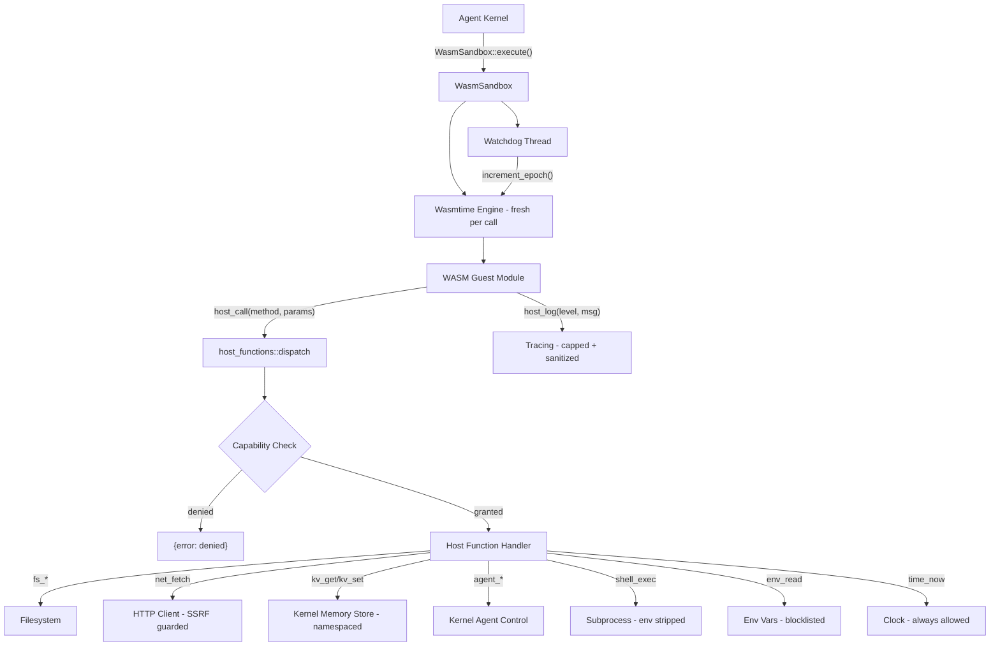

# Shared Libraries — librefang-runtime-wasm-src

# librefang-runtime-wasm — WASM Skill Sandbox

## Purpose

This crate provides a secure sandboxed runtime for executing untrusted WASM skill/plugin modules. It uses Wasmtime as the execution engine with a deny-by-default capability model: no filesystem, network, credential, or inter-agent access is permitted unless explicitly granted through the `SandboxConfig`.

The crate is the bridge between LibreFang's agent kernel and third-party (or user-authored) WASM skills. Every host function a guest can invoke passes through capability checks, size caps, and security guards before reaching any real resource.

## Architecture



## Files

### `sandbox.rs` — Sandbox Engine

The `WasmSandbox` struct manages the lifecycle of a WASM execution:

**Creation**: `WasmSandbox::new()` validates the Wasmtime engine config eagerly so config errors surface at startup rather than first use.

**Execution flow** (`execute` / `execute_sync`):
1. Creates a **fresh `Engine`** per invocation for epoch isolation (Bug #3864 — a shared engine would let one guest's watchdog interrupt all concurrent guests).
2. Compiles the WASM module (accepts `.wasm` binary and `.wat` text).
3. Builds a `Store<GuestState>` with fuel, epoch deadline, memory limiter, and wall-clock timeout.
4. Spawns a **watchdog thread** that calls `engine.increment_epoch()` when the wall-clock budget expires. An RAII guard (`WatchdogGuard`) ensures the thread is joined on every exit path.
5. Links host function imports under the `"librefang"` module namespace.
6. Calls the guest's `execute(input_ptr, input_len) -> i64` entry point.

**Guest ABI requirements** — WASM modules must export:
- `memory` — linear memory
- `alloc(size: i32) -> i32` — bump allocator
- `execute(input_ptr: i32, input_len: i32) -> i64` — entry point returning packed `(ptr << 32) | len`

**Host ABI provided** — the host imports under `"librefang"`:
- `host_call(request_ptr: i32, request_len: i32) -> i64` — RPC dispatch, returns packed pointer to JSON response
- `host_log(level: i32, msg_ptr: i32, msg_len: i32)` — structured logging

**Resource limits enforced at the sandbox level**:

| Resource | Mechanism | Default |
|----------|-----------|---------|
| CPU instructions | Wasmtime fuel metering | 1,000,000 |
| Wall-clock time | Epoch interruption + watchdog thread | 30s |
| Linear memory growth | `MemoryLimiter` via `ResourceLimiter` trait | 16 MiB |
| Host call request size | `MAX_HOST_CALL_REQUEST_BYTES` | 1 MiB |
| Guest result size | `MAX_GUEST_RESULT_BYTES` | 1 MiB |
| Log message size | `MAX_LOG_BYTES` | 4 KiB |

**Denial-of-wallet protection** (`host_call_fuel_cost`): Host-side fuel reservations are charged *before* dispatching to expensive host functions. This prevents a guest from burning real money (LLM tokens, outbound HTTP) while consuming near-zero WASM fuel:

| Method | Fuel cost | Rationale |
|--------|-----------|-----------|
| `agent_spawn` | 200,000 | Registers + may immediately run a child agent |
| `agent_send` | 100,000 | Triggers downstream LLM-bearing agent loop |
| `net_fetch` | 5,000 | Outbound HTTP bandwidth |
| `shell_exec` | 5,000 | Subprocess spawn + audit volume |
| All others | 0 | Pure-host, no external cost |

**Epoch / timeout system**: Each `Store` gets an `epoch_deadline_callback` that checks whether *this specific guest* has exceeded its wall-clock budget. Even on a shared engine (defense-in-depth), a guest whose budget hasn't elapsed silently resumes. On timeout, the callback returns a typed `WallClockTimeout` error that the trap handler detects via `downcast_ref` — no string matching against Wasmtime internals.

### `host_functions.rs` — Host Function Implementations

The `dispatch` function routes `host_call` requests by method name to individual handler functions. Each handler receives `&GuestState` (immutable) and returns a `serde_json::Value` — either `{"ok": ...}` or `{"error": "..."}`.

#### Capability System

`check_capability` iterates the guest's granted capabilities and matches against the required one using `capability_matches` from `librefang-types`. On macOS, it additionally strips `/private/` prefixes introduced by firmlink canonicalization so that operator grants written against user-facing paths (`/tmp/*`, `/var/log/*`) still match.

#### Filesystem Operations

Three methods: `fs_read`, `fs_write`, `fs_list`. All share the same security pipeline:

1. **Path traversal rejection**: `safe_resolve_path` / `safe_resolve_parent` reject any path containing `..` components, then `canonicalize` to resolve symlinks.
2. **Capability check against the canonical path**: Prevents symlink escape attacks (Bug #3457) — a symlink inside a granted workspace that points outside is caught because the capability check sees the real target.
3. **Symlink-leaf protection** (writes only): `fs_write` uses `symlink_metadata` to detect if the leaf is a symlink, and on Unix passes `O_NOFOLLOW` (platform-specific values for Linux and BSD) to the kernel so the `open` atomically rejects symlink targets, closing the TOCTOU window between `lstat` and `open`.

#### Network Operations

`net_fetch` provides outbound HTTP with layered SSRF protection:

1. **Scheme validation**: Only `http://` and `https://` allowed.
2. **Userinfo rejection** (Bug #3527): URLs containing `@` in the authority are blocked to prevent host-confusion bypasses like `http://allowed.com:80@169.254.169.254/`.
3. **Hostname blocklist**: `localhost`, cloud metadata endpoints (`metadata.google.internal`, `169.254.169.254`), etc.
4. **DNS resolution + IP validation**: All resolved IPs are checked for private ranges (RFC 1918, link-local). IPv4-mapped IPv6 addresses (`::ffff:X.X.X.X`) are canonicalized to IPv4 before checking.
5. **DNS pinning**: The resolved addresses are pinned to the HTTP client via `reqwest::ClientBuilder::resolve`, preventing DNS-rebinding TOCTOU attacks.

Network operations use `tokio::task::block_in_place` (not `spawn_blocking` + `block_on`) so the epoch watchdog can continue making progress while the HTTP call is in flight.

#### Shell Execution

`shell_exec` spawns a subprocess with several security layers:

- **Environment sanitization**: `env_clear()` + allowlist of safe vars (`PATH`, `HOME`, `LANG`, etc.). Prevents secret exfiltration through the child's environment.
- **No shell**: Uses `Command::new` directly (not `sh -c`), eliminating shell injection.
- **Wall-clock timeout**: 30-second hard limit via `tokio::time::timeout`.
- **Output cap**: 1 MiB per stream (stdout/stderr). Drains both pipes concurrently with `tokio::select!`; kills the child immediately when either stream exceeds the cap.
- **`kill_on_drop`**: Ensures the subprocess is reaped even if the future is cancelled.

#### Environment Variable Access

`env_read` has a two-layer defense:

1. **Capability gate**: Requires `EnvRead` grant.
2. **Blocklist**: Even with wildcard `EnvRead("*")`, variables matching secret patterns are silently suppressed (return `null` — indistinguishable from "not set"). Uses word-boundary-aware substring matching to avoid false positives like `MONKEYHOUSE` or `KEYBOARD_LAYOUT` while still catching `OPENAI_API_KEY`, `MY_PASSWORD`, etc.

The blocklist has two components:
- **Substring patterns** (`KEY`, `SECRET`, `TOKEN`, `PASSWORD`, `CREDENTIAL`, `PRIVATE`) — matched with word boundaries on both sides
- **Exact names** (`LIBREFANG_VAULT_KEY`, `AWS_SECRET_ACCESS_KEY`, etc.) — always blocked

#### Memory KV Store

`kv_get` / `kv_set` interact with the kernel's memory store through `KernelHandle`:

- **Namespace isolation** (Bug #3837): All keys are prefixed with `{agent_id}:` so agents cannot read or overwrite each other's entries.
- **Size caps** (Bug #3866): Keys limited to 1024 bytes, values limited to `MAX_GUEST_RESULT_BYTES` (1 MiB). Checked before serialization to prevent unbounded host memory/CPU consumption.
- **Capability check before deserialization**: On `kv_set`, the capability gate runs before the value is serialized for the size check, so a guest without `MemoryWrite` cannot force the host to process a large blob.

#### Agent Interaction

- **`agent_send`**: Sends a message to another agent via `kernel.send_to_agent`. Uses `block_in_place` for the async kernel call.
- **`agent_spawn`**: Spawns a child agent via `kernel.spawn_agent_checked`, which enforces capability inheritance (child capabilities must be a subset of parent's). Returns the new agent's ID and name.

#### Always-Allowed

`time_now` returns the current Unix timestamp. No capability check required — reading the clock is inherently safe.

## Key Types

**`SandboxConfig`** — Configuration for a single execution:
```rust
pub struct SandboxConfig {
    pub fuel_limit: u64,           // Default: 1_000_000
    pub max_memory_bytes: usize,   // Default: 16 MiB
    pub capabilities: Vec<Capability>,
    pub timeout_secs: Option<u64>, // Default: 30s
}
```

**`GuestState`** — Per-store state accessible to host functions:
- `capabilities: Vec<Capability>` — granted permissions
- `kernel: Option<Arc<dyn KernelHandle>>` — kernel access (None if no kernel available)
- `agent_id: String` — calling agent's identity
- `tokio_handle: tokio::runtime::Handle` — for bridging sync host calls to async operations
- `limiter: MemoryLimiter` — enforces memory growth cap
- `start: Instant` / `timeout: Duration` — wall-clock budget tracking

**`ExecutionResult`** — Returned from `execute`:
- `output: serde_json::Value` — JSON result from guest
- `fuel_consumed: u64` — actual fuel used

**`SandboxError`** — Error enum covering compilation, instantiation, execution failures, fuel exhaustion, and ABI violations.

## Security Model Summary

The sandbox implements a **deny-by-default** model with multiple independent defense layers:

1. **Capability gates** — every host function checks grants before execution
2. **Canonical path resolution** — filesystem paths are resolved before capability matching to prevent symlink traversal
3. **SSRF protection** — DNS resolution, IP validation, scheme restrictions, userinfo rejection
4. **Resource caps** — fuel, memory, wall-clock time, output sizes, log sizes
5. **Secret suppression** — environment variable blocklist with word-boundary matching
6. **Namespace isolation** — KV keys prefixed with agent ID
7. **Environment stripping** — shell exec children receive only a safe allowlist
8. **Log injection prevention** — newlines replaced with visible pilcrow, messages capped and truncated

## Integration with the Rest of the Codebase

- **`librefang-types`**: Provides `Capability` enum and `capability_matches` for permission checking.
- **`librefang-kernel-handle`**: The `KernelHandle` trait provides `AgentControl`, `MemoryAccess`, and other kernel operations used by `agent_send`, `agent_spawn`, `kv_get`, `kv_set`.
- **`librefang-http`**: `proxied_client_builder()` constructs the HTTP client used by `net_fetch`, with DNS pinning for SSRF prevention.
- **`librefang-runtime`**: The top-level runtime crate calls `WasmSandbox::execute` when a WASM skill needs to run. The shell environment allowlist mirrors the one in `librefang-runtime/src/subprocess_sandbox.rs` (kept inlined to avoid a crate cycle).

## Adding a New Host Function

1. Add a `host_*` function in `host_functions.rs` following the pattern: extract params → check capability → perform operation → return `json!({"ok": ...})` or `json!({"error": "..."})`.
2. Add a new variant to the `Capability` enum in `librefang-types` if needed.
3. Wire the method name into `dispatch`.
4. If the function touches external resources (LLM, HTTP, subprocess), add a fuel reservation in `host_call_fuel_cost` to cap denial-of-wallet risk.
5. Add comprehensive tests covering: denied without capability, granted with exact capability, granted with wildcard, and any domain-specific security properties.