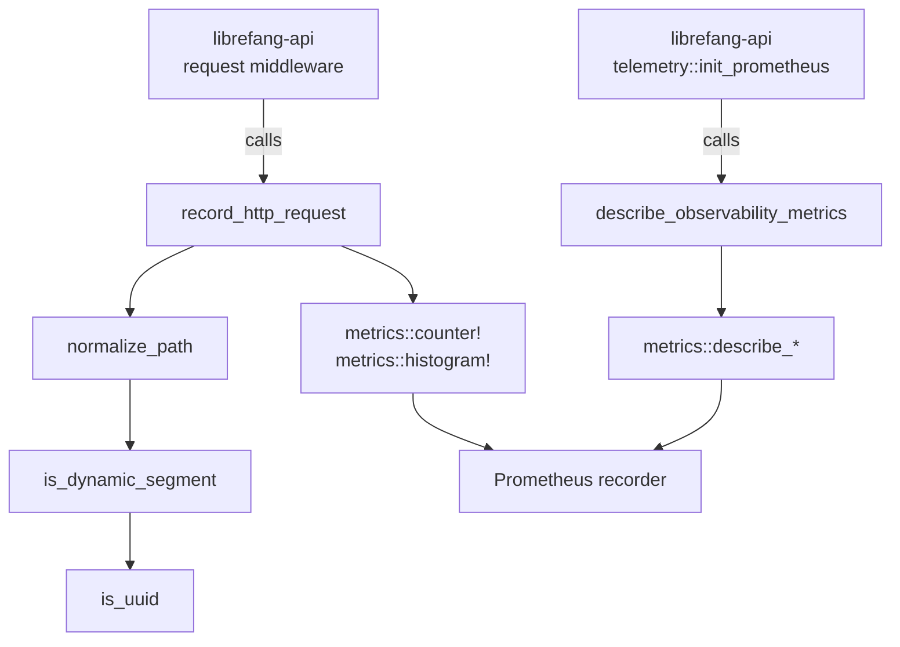

# Shared Libraries — librefang-telemetry-src

# librefang-telemetry

OpenTelemetry + Prometheus metrics instrumentation for the LibreFang Agent OS.

This crate provides a centralized telemetry layer—metrics and HTTP observability—shared across all LibreFang crates. It wraps the standard `metrics` crate macros and exposes a small, stable public API that the rest of the codebase consumes.

## Architecture



The crate itself does **not** install a metrics recorder. That responsibility belongs to `librefang-api::telemetry::init_prometheus`, which sets up the `PrometheusHandle`. This crate provides the recording functions and metric descriptions that flow through whichever recorder is active.

## Module Structure

### `config`

Re-exports `TelemetryConfig` from `librefang_types::config`. This is a convenience alias so that existing imports from `librefang_telemetry::config` continue to resolve without changes.

```rust
pub use librefang_types::config::TelemetryConfig;
```

### `metrics`

Core HTTP metrics utilities. All metric recording delegates to the `metrics` crate macros (`metrics::counter!`, `metrics::histogram!`), meaning data flows through whichever recorder has been installed at runtime.

## Public API

### `normalize_path(path: &str) -> String`

Collapses dynamic path segments into `{id}` to prevent high-cardinality metric labels. This is critical for Prometheus—without normalization, every unique UUID or hash in a URL path would create a new time series.

**What gets collapsed:**

| Pattern | Example | Result |
|---|---|---|
| Standard UUIDs (8-4-4-4-12 hex) | `550e8400-e29b-41d4-a716-446655440000` | `{id}` |
| Pure hex strings (8–64 chars, no hyphens) | `deadbeef01234567` | `{id}` |

**What is preserved:**

- Literal segments like `api`, `v1`, `v2`, `a2a` are always kept as-is.
- Hyphenated words like `well-known` or `my-agent` are **not** collapsed (they fail both the UUID check and the pure-hex check).

The normalization strategy is lookahead-based: when a segment is followed by a dynamic segment, the pair is emitted as `segment/{id}`. This preserves the resource-type part of the path (e.g., `agents/{id}` rather than just `{id}`).

```rust
normalize_path("/api/agents/550e8400-e29b-41d4-a716-446655440000/message")
// → "/api/agents/{id}/message"

normalize_path("/.well-known/agent.json")
// → "/.well-known/agent.json"  (unchanged)
```

### `record_http_request(path: &str, method: &str, status: u16, duration: Duration)`

Primary entry point called by the request-logging middleware in `librefang-api`. Records two metrics:

1. **`librefang_http_requests_total`** — a counter labeled by `method`, `path` (normalized), and `status`.
2. **`librefang_http_request_duration_seconds`** — a histogram labeled by `method` and `path` (normalized).

The path is normalized internally before recording.

### `describe_observability_metrics()`

Registers `# HELP` and `# TYPE` metadata with the installed recorder so that the Prometheus exporter emits proper metric documentation. Call once after the recorder is installed—idempotent, since the recorder deduplicates descriptions.

Registers descriptions for six metrics:

| Metric | Type | Unit | Purpose |
|---|---|---|---|
| `librefang_http_requests_total` | counter | — | Total HTTP requests by method/path/status |
| `librefang_http_request_duration_seconds` | histogram | seconds | HTTP request wall-clock latency |
| `librefang_queue_wait_seconds` | histogram | seconds | CommandQueue lane permit wait time |
| `librefang_mcp_reconnect_total` | counter | — | MCP server reconnect attempts by server/outcome |
| `librefang_llm_provider_errors_total` | counter | — | LLM provider errors by provider/status |
| `librefang_tool_call_total` | counter | — | Agent loop tool invocations by name/outcome |

### `get_http_metrics_summary() -> String`

Legacy compatibility function. The actual Prometheus output is now rendered directly from the `PrometheusHandle` in `librefang-api::telemetry`. This function returns a comment string explaining that callers should use the `/api/metrics` endpoint or the handle directly. Kept to avoid breaking existing imports.

## Integration Points

### Incoming calls (who calls this crate)

- **`librefang-api::middleware::request_logging`** — calls `record_http_request` on every HTTP request passing through the middleware layer.
- **`librefang-api::telemetry::init_prometheus`** — calls `describe_observability_metrics` once during startup, after installing the Prometheus recorder.

### Outbound dependencies

- **`metrics` crate** — all recording and description registration goes through `metrics::counter!`, `metrics::histogram!`, and `metrics::describe_*` macros.
- **`librefang-types`** — provides the canonical `TelemetryConfig` struct.

## Metric Naming Convention

All metrics follow the `librefang_` prefix convention. When adding new metrics to this crate, use the same prefix and register descriptions in `describe_observability_metrics()` so they appear in Prometheus scrapes with proper metadata.

## Adding a New Metric

1. Choose a name with the `librefang_` prefix.
2. Record it using the appropriate `metrics::counter!` or `metrics::histogram!` macro at the call site.
3. Add a corresponding `metrics::describe_counter!` or `metrics::describe_histogram!` call inside `describe_observability_metrics()`.
4. Ensure the recorder is installed before any recording occurs (guaranteed by the startup order in `librefang-api::telemetry`).