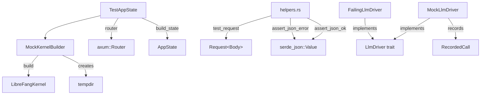

# Shared Libraries — librefang-testing-src

# librefang-testing — Test Infrastructure

## Purpose

`librefang-testing` provides reusable test infrastructure for unit and integration tests across the LibreFang workspace. It lets you test API routes, kernel behavior, and LLM interactions **without** starting a full daemon, opening network ports, or depending on external services.

The crate is a dev-dependency consumed by integration tests in `librefang-kernel`, `librefang-http`, `librefang-cli`, `librefang-runtime`, and `librefang-memory`, as well as by its own internal test suite.

## Architecture



---

## Public API

The crate re-exports its core types from `lib.rs`:

```rust
pub use helpers::{assert_json_error, assert_json_ok, test_request};
pub use mock_driver::{FailingLlmDriver, MockLlmDriver};
pub use mock_kernel::MockKernelBuilder;
pub use test_app::TestAppState;
```

---

## Components

### MockKernelBuilder

**File:** `mock_kernel.rs`

Builds a real `LibreFangKernel` instance configured for test isolation:

- **In-memory SQLite** via a file path under a temporary directory (`test.db`).
- **Temp directory** for all filesystem paths (`home_dir`, `data_dir`, `skills`, `workspaces`).
- **Networking disabled** (`network_enabled = false`), so no HTTP server or outbound connections.
- **Deterministic vault key** — a process-wide `Once` guard sets `LIBREFANG_VAULT_KEY` to a fixed base64 value before the first kernel boot. This prevents a race condition where parallel tests overwrite each other's credential vault master key, causing decryption failures (historically seen as TOTP test flake on CI).

```rust
let (kernel, _tmp) = MockKernelBuilder::new()
    .with_config(|cfg| {
        cfg.language = "zh".into();
    })
    .build();
```

**Critical:** The returned `TempDir` must remain alive for the duration of the test. Dropping it deletes the underlying directory and invalidates all kernel file paths.

The builder calls `kernel.set_self_handle()` after construction so that internal `kernel_handle()` lookups (used by `send_message_*`, agent forking, etc.) work the same way as in production.

**Convenience function:** `test_kernel()` is equivalent to `MockKernelBuilder::new().build()`.

### MockLlmDriver

**File:** `mock_driver.rs`

A configurable fake LLM provider implementing the `LlmDriver` trait. Two variants:

#### `MockLlmDriver` — canned responses with call recording

```rust
let driver = MockLlmDriver::new(vec!["First response".into(), "Second response".into()])
    .with_tokens(200, 100)
    .with_stop_reason(StopReason::MaxTokens);
```

Behavior:
- Returns canned responses in order. When exhausted, repeats the **last** response indefinitely.
- Records every call into `RecordedCall` entries accessible via `recorded_calls()` or `call_count()`.
- `stream()` simulates streaming by sending `TextDelta` followed by `ContentComplete` events.
- `is_configured()` always returns `true`.

`RecordedCall` captures: `model`, `message_count`, `tool_count`, and `system` prompt.

#### `FailingLlmDriver` — always errors

```rust
let driver = FailingLlmDriver::new("simulated API failure");
```

Returns `LlmError::Api { status: 500, ... }` on every call. `is_configured()` returns `false`. Use this to test error-handling paths in agent loops and retry logic.

### TestAppState

**File:** `test_app.rs`

Wraps `MockKernelBuilder` output into a production-equivalent `AppState`, then exposes an axum `Router` for HTTP-level testing.

```rust
let app = TestAppState::new();
let router = app.router();

let req = test_request(Method::GET, "/api/health", None);
let resp = router.oneshot(req).await.unwrap();
let json = assert_json_ok(resp).await;
```

Key methods:

| Method | Description |
|---|---|
| `new()` | Default mock kernel + AppState |
| `with_builder(builder)` | Custom `MockKernelBuilder` |
| `from_kernel(kernel, tmp)` | Wrap an existing kernel |
| `router()` | axum `Router` with all `/api/*` routes |
| `with_api_key(key)` | Set the global API key for auth middleware |
| `with_user_api_keys(keys)` | Pre-populate per-user API key list |
| `with_config_path(path)` | Serialize kernel config to TOML on disk (for config-reload tests) |
| `into_parts()` | Destructure into `(Arc<AppState>, TempDir, Option<PathBuf>)` |
| `tmp_path()` | Path to the temp directory |
| `app_state()` | Clone of the `Arc<AppState>` |

The `router()` method nests all API routes under `/api`, matching the production path layout: agents CRUD, skills, config, memory, budget, system, tools, models, providers, sessions, and webhooks.

`build_state()` constructs a full `AppState` including idempotency store (backed by the kernel's SQLite connection), rate limiters, webhook store, media driver cache, and all other production fields. This ensures tests exercise the same code paths as real requests.

### Helpers

**File:** `helpers.rs`

Three functions for building requests and asserting responses:

#### `test_request(method, path, body) -> Request<Body>`

Builds an axum-compatible HTTP request. Automatically sets `content-type: application/json` when a body is provided.

```rust
let get_req = test_request(Method::GET, "/api/health", None);
let post_req = test_request(
    Method::POST,
    "/api/agents",
    Some(r#"{"manifest_toml": "..."}"#),
);
```

#### `assert_json_ok(response) -> serde_json::Value`

Asserts status `200 OK`, parses the body as JSON, and returns it. Panics with a descriptive message on failure including the raw response body.

#### `assert_json_error(response, expected_status) -> serde_json::Value`

Same as `assert_json_ok` but validates against a caller-specified status code. Used for testing error responses:

```rust
let json = assert_json_error(resp, StatusCode::NOT_FOUND).await;
assert!(json.get("error").is_some());
```

---

## Usage Patterns

### Testing an API endpoint

```rust
#[tokio::test(flavor = "multi_thread")]
async fn test_my_endpoint() {
    let app = TestAppState::new();
    let router = app.router();

    let req = test_request(Method::GET, "/api/agents", None);
    let resp = router.oneshot(req).await.unwrap();
    let json = assert_json_ok(resp).await;

    assert!(json["items"].is_array());
}
```

Use `flavor = "multi_thread"` — the kernel boot requires a multi-threaded runtime.

### Testing with a custom kernel config

```rust
let app = TestAppState::with_builder(
    MockKernelBuilder::new().with_config(|cfg| {
        cfg.language = "zh".into();
    })
);
```

### Testing LLM driver behavior in isolation

```rust
let driver = MockLlmDriver::new(vec!["response 1".into(), "response 2".into()]);
let result = driver.complete(request).await.unwrap();

assert_eq!(driver.call_count(), 1);
assert_eq!(driver.recorded_calls()[0].model, "test-model");
```

### Testing error handling with FailingLlmDriver

```rust
let driver = FailingLlmDriver::new("API overloaded");
let result = driver.complete(request).await;
assert!(result.is_err());
```

### Testing with authentication

```rust
let app = TestAppState::new()
    .with_api_key("test-secret-key");

let router = app.router();
// Requests with Authorization: Bearer test-secret-key will pass auth middleware
```

---

## Design Decisions

**Process-shared vault key.** The `ensure_test_vault_key()` function uses `std::sync::Once` to set a deterministic `LIBREFANG_VAULT_KEY` environment variable exactly once per process. Without this, parallel test processes race on the shared keyring file, causing intermittent decryption failures.

**TempDir lifetime.** Both `MockKernelBuilder::build()` and `TestAppState` return/persist the `TempDir`. Dropping it while the kernel is live causes filesystem errors. The API makes this explicit through the return type.

**Idempotent DELETE.** The test suite validates that `DELETE /api/agents/{valid-but-nonexistent-uuid}` returns `200 OK` with `{"status": "already-deleted"}` rather than `404`. This supports retry-safe dashboard operations where a network blip could cause a double-delete.