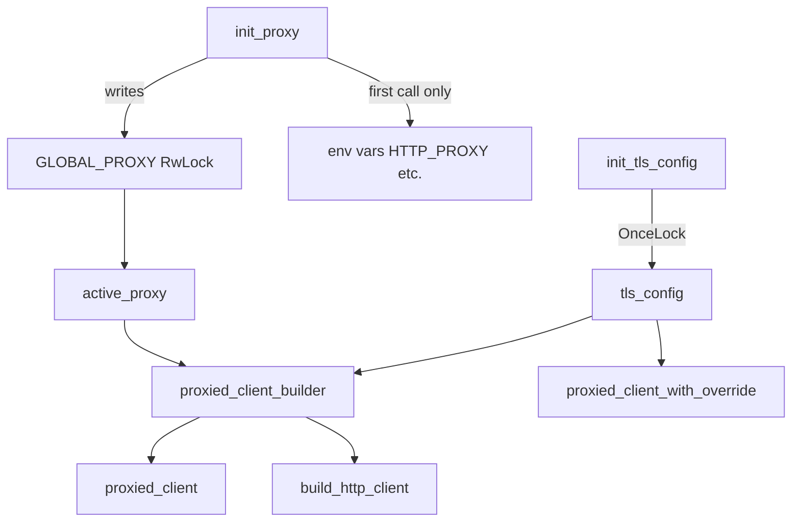

# Shared Types & Configuration — librefang-http-src

# librefang-http — Centralized HTTP Client with Proxy & TLS Fallback

## Purpose

Every outbound HTTP request in librefang flows through this module. It solves two practical problems that would otherwise cause silent failures or panics:

1. **Missing CA certificates** — On musl-based systems (Termux, minimal Docker images), `reqwest`'s default TLS initialization panics when it can't find system cert bundles. This module seeds the trust store with bundled Mozilla CA roots first, then supplements with whatever system certs exist.

2. **Uniform proxy settings** — Proxy configuration from `config.toml` must reach every HTTP client, including those built by crates that construct their own `reqwest::Client`. This module centralizes that config, exports it to environment variables, and provides pre-configured builders.

## Architecture



## Initialization Sequence

At daemon startup, call `init_proxy` once with the `[proxy]` section from `config.toml`. This does three things:

- Validates proxy URL schemes (only `http://`, `https://`, `socks5://`, `socks5h://` are accepted)
- Exports config values as `HTTP_PROXY` / `HTTPS_PROXY` / `NO_PROXY` environment variables (only on the first call, while still single-threaded)
- Stores the config in `GLOBAL_PROXY` for later reads

After that, any call to `proxied_client_builder()` or `proxied_client()` picks up both the proxy settings and the TLS config automatically.

## TLS Configuration

The trust store is assembled in `init_tls_config` and cached in a `OnceLock`:

1. **Mozilla CA roots** (`webpki_roots::TLS_SERVER_ROOTS`) are loaded first — guarantees that common public CAs are trusted even on stripped-down systems.
2. **System certificates** (`rustls_native_certs::load_native_certs()`) are added on top — brings in org-internal/self-signed CAs and keeps trust anchors current without a librefang release.

If zero system certs are found, a debug-level log is emitted and the module proceeds with just the bundled roots.

`tls_config()` returns a cloned `rustls::ClientConfig`. The `aws_lc_rs` crypto provider is used.

## Proxy Configuration

`GLOBAL_PROXY` is an `RwLock<Option<ProxyConfig>>` that supports hot-reload — `init_proxy` can be called again later (e.g. on config file change) to update the stored config.

### Proxy Resolution Order

When building a client via `build_http_client`:

| Config field | Value present | Value `None` or empty |
|---|---|---|
| `http_proxy` | Applied directly as `Proxy::http(url)` | reqwest reads `HTTP_PROXY` env var |
| `https_proxy` | Applied directly as `Proxy::https(url)` | reqwest reads `HTTPS_PROXY` env var |
| `no_proxy` | Parsed into `reqwest::NoProxy` filter | No filter applied |

Invalid proxy URLs are logged at warn level (with the URL redacted) and skipped — the client is still built, just without that proxy entry.

### Thread Safety of Environment Variables

`std::env::set_var` is unsound in a multi-threaded process. The module avoids this by only exporting env vars during the initial bootstrap call (when `GLOBAL_PROXY` is still `None`), which happens before the Tokio runtime spawns worker threads. Subsequent hot-reload calls update `GLOBAL_PROXY` only.

### Per-Provider Overrides

`proxied_client_with_override(proxy_url)` builds a client that routes all traffic through a specific proxy URL, bypassing the global config entirely. If the URL is invalid, it logs a warning and falls back to `proxied_client()`.

## Client Builder API

### Recommended entry points

```rust
// Pre-configured ClientBuilder — add your own .timeout(), headers, etc.
let builder = librefang_http::proxied_client_builder();
let client = builder.timeout(Duration::from_secs(60)).build().unwrap();

// Fully-built client with defaults
let client = librefang_http::proxied_client();
```

### Default timeouts

Every client comes with sensible per-request defaults (issue #2340):

- **connect_timeout**: 30 seconds — caps TCP/TLS handshake, generous for slow international links to LLM providers.
- **read_timeout**: 300 seconds — per-read inactivity timeout, not total request time. Streaming LLM responses keep this alive as long as tokens arrive.

Both can be overridden on the builder returned by `proxied_client_builder()`.

### User-Agent

All clients send `User-Agent: librefang/<version>` where `<version>` comes from `CARGO_PKG_VERSION`.

### All public functions

| Function | Returns | Description |
|---|---|---|
| `init_proxy(cfg)` | `()` | Store global proxy config; export env vars on first call |
| `tls_config()` | `rustls::ClientConfig` | Cached TLS config with fallback roots |
| `proxied_client_builder()` | `reqwest::ClientBuilder` | Builder with global proxy + TLS applied |
| `proxied_client()` | `reqwest::Client` | Ready-to-use client from the above builder |
| `proxied_client_with_override(url)` | `reqwest::Client` | Client with a specific proxy, ignoring global config |
| `build_http_client(proxy)` | `reqwest::ClientBuilder` | Lower-level builder accepting an explicit `ProxyConfig` |
| `client_builder()` | `reqwest::ClientBuilder` | Backward-compatible alias for `proxied_client_builder` |
| `new_client()` | `reqwest::Client` | Backward-compatible alias for `proxied_client` |

## Usage Across the Codebase

This module is imported by nearly every crate that makes HTTP calls:

- **librefang-runtime** — LLM provider health checks, web search, web fetch, embeddings, image generation, TTS, media transcription, tool execution, catalog sync, A2A
- **librefang-runtime-oauth** — ChatGPT and Copilot OAuth device flows, token refresh
- **librefang-runtime-mcp** — MCP HTTP/SSE transport, compatibility connections
- **librefang-runtime-wasm** — Host-side network fetch for WASM guests
- **librefang-kernel** — Device pairing notifications
- **librefang-cli** — Direct `tls_config()` usage for its own client builder

Crates that need only a ready-made client call `proxied_client()`. Crates that need to customize timeouts, add headers, or attach middleware call `proxied_client_builder()` and then chain their modifications before `.build()`.