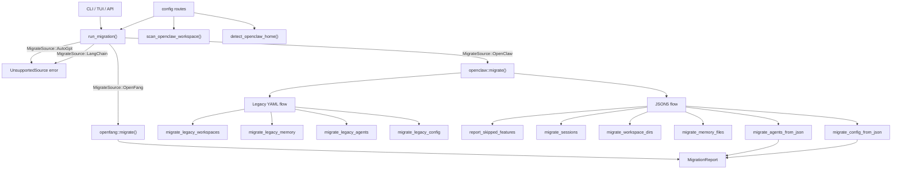

# Shared Types & Configuration — librefang-migrate-src

# librefang-migrate

Migration engine for importing agent workspaces from other frameworks into LibreFang. Currently supports **OpenClaw** (modern JSON5 and legacy YAML) and **OpenFang** (same-format fork). LangChain and AutoGPT are reserved for future implementation.

## Architecture



## Entry Point

### `run_migration`

```rust
pub fn run_migration(options: &MigrateOptions) -> Result<MigrationReport, MigrateError>
```

Dispatches to the appropriate migration backend based on `MigrateOptions::source`. Returns a `MigrationReport` listing every imported item, skipped feature, and warning. On dry-run, no files are written but the report is still populated.

Called from:
- `cmd_migrate` in the CLI
- `handle_migration_key` in the TUI init wizard
- `run_migrate` in the HTTP API (`/api/config/migrate`)

### `MigrateSource`

```rust
pub enum MigrateSource {
    OpenClaw,
    LangChain,  // future
    AutoGpt,    // future
    OpenFang,
}
```

### `MigrateOptions`

| Field | Type | Description |
|---|---|---|
| `source` | `MigrateSource` | Which framework to import from |
| `source_dir` | `PathBuf` | Path to the source workspace root |
| `target_dir` | `PathBuf` | LibreFang home directory to write into |
| `dry_run` | `bool` | If true, report only — no filesystem changes |

### `MigrateError`

All errors use `thiserror`. Variants:

| Variant | Meaning |
|---|---|
| `SourceNotFound(PathBuf)` | Source directory does not exist |
| `ConfigParse(String)` | Failed to parse source config |
| `AgentParse(String)` | Failed to parse an agent definition |
| `Io(std::io::Error)` | Filesystem I/O failure |
| `Yaml(serde_yaml::Error)` | YAML deserialization error |
| `Json5Parse(String)` | JSON5 deserialization error |
| `TomlSerialize(toml::ser::Error)` | TOML serialization failure |
| `UnsupportedSource(String)` | Source framework not yet implemented |

## OpenClaw Migration (`openclaw` module)

The largest migration backend. Handles two OpenClaw workspace formats.

### Supported Workspace Layouts

**Modern JSON5** — a single `openclaw.json` containing everything:

```
~/.openclaw/
├── openclaw.json          # JSON5 — global config, agents, channels, models, tools, cron, hooks
├── auth-profiles.json     # Credentials (not migrated)
├── sessions/*.jsonl       # Conversation logs
├── memory/<agent>/MEMORY.md
├── workspaces/<agent>/    # Per-agent working directories
└── skills/
```

Also recognizes legacy config file names: `clawdbot.json`, `moldbot.json`, `moltbot.json`.

**Legacy YAML** — scattered YAML files:

```
~/.openclaw/
├── config.yaml
├── agents/<name>/agent.yaml
├── messaging/<channel>.yaml
└── skills/{community,custom}/
```

Format detection happens in `find_config_file`, which prefers JSON5 and falls back to `config.yaml`.

### Auto-Detection

#### `detect_openclaw_home() -> Option<PathBuf>`

Searches standard locations for an existing OpenClaw installation. Checks:

1. `$OPENCLAW_STATE_DIR` environment variable
2. `~/.openclaw`, `~/.clawdbot`, `~/.moldbot`, `~/.moltbot`, `~/openclaw`, `~/.config/openclaw`
3. `%APPDATA%\openclaw` and `%LOCALAPPDATA%\openclaw` on Windows

Returns `Some(path)` only if the directory contains a recognizable config file or `sessions/`/`memory/` subdirectories.

Called from the TUI init wizard and the `/api/config/migrate/detect` route.

#### `scan_openclaw_workspace(path) -> ScanResult`

Read-only scan that returns `ScanResult` with lists of discovered agents, channels, skills, and memory availability. Used for pre-migration UI previews (`/api/config/migrate/scan`).

### Migration Pipeline

For JSON5 workspaces, `migrate()` calls `migrate_from_json5`, which runs six phases in order:

1. **Config** (`migrate_config_from_json`) — Extracts default model, provider, channels from `openclaw.json` and writes `config.toml`.
2. **Agents** (`migrate_agents_from_json`) — Converts each agent entry to `agents/<id>/agent.toml`.
3. **Memory** (`migrate_memory_files`) — Copies `memory/<agent>/MEMORY.md` to `agents/<agent>/imported_memory.md`.
4. **Workspaces** (`migrate_workspace_dirs`) — Copies `workspaces/<agent>/` to `agents/<agent>/workspace/`.
5. **Sessions** (`migrate_sessions`) — Copies `sessions/*.jsonl` to `imported_sessions/`.
6. **Skipped features** (`report_skipped_features`) — Records cron, hooks, auth profiles, skills, vector index as skipped.

For legacy YAML, `migrate_from_legacy_yaml` runs an analogous pipeline reading from scattered YAML files.

### Provider Mapping

`map_provider()` normalizes OpenClaw provider names to LibreFang conventions:

| OpenClaw | LibreFang |
|---|---|
| `anthropic`, `claude` | `anthropic` |
| `openai`, `gpt` | `openai` |
| `google`, `gemini` | `google` |
| `xai`, `grok` | `xai` |
| Others | Lowercase passthrough |

`default_api_key_env()` derives the expected environment variable name (e.g., `"anthropic"` → `"ANTHROPIC_API_KEY"`, `"ollama"` → empty string).

### Tool Mapping

Tools are resolved through `librefang_types::tool_compat`:

- `is_known_librefang_tool(name)` — checks if a name is already a valid LibreFang tool
- `map_tool_name(name)` — attempts to translate an OpenClaw tool name to LibreFang
- Unrecognized tools are collected as warnings in the report

Tool profiles (`"minimal"`, `"coding"`, `"research"`, `"messaging"`, `"automation"`, `"full"`) delegate to `librefang_types::agent::ToolProfile::tools()`.

`derive_capabilities()` inspects the resolved tool list to grant corresponding `shell`, `network`, `agent_message`, and `agent_spawn` capabilities.

### Channel Migration

13 channel types are parsed from the `channels` section:

| Channel | TOML section | Notes |
|---|---|---|
| Telegram | `[channels.telegram]` | Token → secrets.env |
| Discord | `[channels.discord]` | Token → secrets.env |
| Slack | `[channels.slack]` | Bot + app tokens → secrets.env. `allow_from` cannot map (channel-based only). |
| WhatsApp | `[channels.whatsapp]` | Baileys credentials copied to `credentials/whatsapp/`. May need re-auth. |
| Signal | `[channels.signal]` | API URL constructed from `httpHost` + `httpPort`. |
| Matrix | `[channels.matrix]` | Access token → secrets.env. Rooms mapped to `allowed_rooms`. |
| Google Chat | `[channels.google_chat]` | Service account file copied to `credentials/`. |
| Teams | `[channels.teams]` | App password → secrets.env. Tenant → `allowed_tenants`. |
| IRC | `[channels.irc]` | Password → secrets.env. Channels array mapped directly. |
| Mattermost | `[channels.mattermost]` | Token → secrets.env. |
| Feishu | `[channels.feishu]` | Domain mapped to `region` (`"cn"` or `"intl"`). |
| iMessage | Skipped | macOS-only, requires manual setup. |
| BlueBubbles | Skipped | No LibreFang adapter. |

Policy mapping via `map_dm_policy` and `map_group_policy`:

| OpenClaw DM | LibreFang DM |
|---|---|
| `open` | `respond` |
| `allowlist` / `allow_list` | `allowed_only` |
| `pairing` / `disabled` | `ignore` |

| OpenClaw Group | LibreFang Group |
|---|---|
| `open` / `all` | `all` |
| `mention` | `mention_only` |
| `commands` / `slash_only` | `commands_only` |
| `disabled` | `ignore` |

### Secrets Handling

Channel tokens and passwords are extracted from the JSON5 config (which stores them as plaintext) and written to `secrets.env` via `write_secret_env`. This function:

- Upserts `KEY=value` lines (preserves other keys)
- Creates parent directories as needed
- Sets `0o600` permissions on Unix

The generated `config.toml` references these via `_env` fields (e.g., `bot_token_env = "TELEGRAM_BOT_TOKEN"`).

### Agent TOML Output

Each agent is written to `agents/<id>/agent.toml` with this structure:

```toml
name = "Coder"
version = "0.1.0"
description = "Migrated from OpenClaw agent 'coder'"
author = "librefang"
module = "builtin:chat"
profile = "coding"                    # if tools.profile was set
skills = ["web-scraper"]              # if skills were listed
tool_blocklist = ["dangerous_tool"]   # from tools.deny
workspace = "/path/to/workspace"      # custom workspace path

[model]
provider = "deepseek"
model = "deepseek-chat"
system_prompt = """
You are an expert software engineer.
"""
api_key_env = "DEEPSEEK_API_KEY"

[[fallback_models]]
provider = "groq"
model = "llama-3.3-70b-versatile"
api_key_env = "GROQ_API_KEY"

[capabilities]
tools = ["file_read", "file_write", "shell_exec", "web_search"]
memory_read = ["*"]
memory_write = ["self.*"]
network = ["*"]
shell = ["*"]
agent_message = ["*"]
agent_spawn = true
```

### Identity Prompt Extraction

OpenClaw's `identity` field can be a plain string or an arbitrarily-nested JSON object. `extract_identity_prompt` handles both, searching nested objects for keys like `systemPrompt`, `instructions`, `persona`, `description`, and recursing into sub-objects and arrays.

### Skipped Features

The following OpenClaw features have no LibreFang equivalent and are reported as skipped:

- **Cron jobs** — use LibreFang's `ScheduleMode::Periodic` instead
- **Hooks** — use LibreFang's event system
- **Auth profiles** — set environment variables manually for security
- **Skills** — reinstall via `librefang skill install`
- **Vector search index** (`memory-search/index.db`) — LibreFang rebuilds embeddings from content
- **Session config** — LibreFang uses per-agent sessions by default
- **Memory backend config** — LibreFang uses SQLite with vector embeddings

## OpenFang Migration (`openfang` module)

OpenFang uses the same TOML format as LibreFang (it's a community fork), so migration is primarily a file-copy with content rewriting and schema drift warnings. See the `openfang` module for details.

## Migration Report (`report` module)

`MigrationReport` tracks:

- `imported: Vec<MigrateItem>` — successfully migrated items (kind, name, destination path)
- `skipped: Vec<SkippedItem>` — features not migrated (kind, name, reason)
- `warnings: Vec<String>` — non-fatal issues (unmapped tools, policy mapping failures)
- `dry_run: bool` — whether this was a dry run
- `source: String` — human-readable source framework name

`ItemKind` variants: `Config`, `Agent`, `Channel`, `Secret`, `Memory`, `Session`, `Skill`.

`to_markdown()` generates a human-readable summary. `print_summary()` writes a condensed version to stdout. The report is also persisted as `migration_report.md` in the target directory.

## Integration Points

| Consumer | Module | Functions Used |
|---|---|---|
| CLI | `librefang-cli/src/main.rs` | `run_migration`, `MigrationReport::print_summary`, `to_markdown` |
| TUI Init Wizard | `tui/screens/init_wizard.rs` | `detect_openclaw_home`, `scan_openclaw_workspace`, `run_migration` |
| HTTP API | `src/routes/config.rs` | `detect_openclaw_home`, `scan_openclaw_workspace`, `run_migration` |

### Type Dependencies

- `librefang_types::config::{CONFIG_VERSION, DEFAULT_API_LISTEN}` — version stamp and defaults for generated config
- `librefang_types::agent::ToolProfile` — tool profile resolution
- `librefang_types::tool_compat::{is_known_librefang_tool, map_tool_name}` — tool name translation
- `librefang_types::VERSION` — agent manifest version field