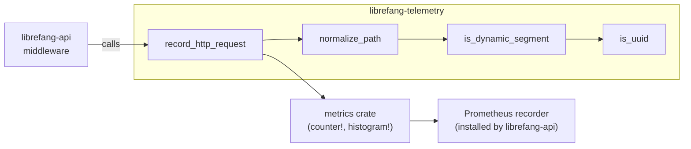

# Shared Types & Configuration — librefang-telemetry-src

# librefang-telemetry

OpenTelemetry + Prometheus metrics instrumentation for LibreFang.

This crate provides centralized telemetry (metrics + tracing) for monitoring the LibreFang Agent OS. It wraps the `metrics` crate ecosystem, offering a small public API that the rest of the workspace consumes to record HTTP request metrics without coupling to a specific metrics backend.

## Architecture



The recorder itself is not installed here. `librefang-api/src/telemetry.rs` owns the `PrometheusHandle` setup. This crate only emits data through the `metrics` crate macros; whichever recorder is globally installed at runtime determines where that data lands.

## Module Structure

| Path | Purpose |
|---|---|
| `config` | Re-exports [`TelemetryConfig`](#telemetryconfig) from `librefang-types`. |
| `metrics` | HTTP metrics recording, path normalization, and summary rendering. |

The crate root re-exports the three primary functions for convenience:

```rust
pub use metrics::{get_http_metrics_summary, normalize_path, record_http_request};
```

---

## TelemetryConfig

Defined in `librefang-types::config::types` and re-exported here:

```rust
// Either import path works:
use librefang_telemetry::config::TelemetryConfig;
use librefang_types::config::TelemetryConfig;
```

This keeps telemetry configuration co-located with all other kernel configuration structs while allowing import from either crate.

---

## Metrics Module

### `record_http_request`

```rust
pub fn record_http_request(path: &str, method: &str, status: u16, duration: Duration)
```

The main entry point for HTTP telemetry. Called by the request-logging middleware in `librefang-api` (`request_logging` middleware function).

**What it does:**

1. Normalizes `path` via [`normalize_path`](#normalize_path) to collapse high-cardinality segments.
2. Emits a `librefang_http_requests_total` counter increment with labels `method`, `path`, and `status`.
3. Emits a `librefang_http_request_duration_seconds` histogram observation with labels `method` and `path`.

**Metric names:**

| Metric | Type | Labels |
|---|---|---|
| `librefang_http_requests_total` | counter | `method`, `path`, `status` |
| `librefang_http_request_duration_seconds` | histogram | `method`, `path` |

Both delegate to `metrics::counter!` and `metrics::histogram!` respectively, so data flows through whichever recorder is installed (typically the Prometheus exporter set up in `librefang-api`).

---

### `normalize_path`

```rust
pub fn normalize_path(path: &str) -> String
```

Replaces dynamic path segments (UUIDs, hex identifiers) with the literal `{id}` token to prevent metric label cardinality explosions.

**How it works:**

The function splits the path on `/` and iterates through segments. For each segment, it looks ahead to the next segment. If that next segment is a dynamic identifier (as determined by `is_dynamic_segment`), the next segment is replaced with `{id}`.

Certain segments are always preserved verbatim regardless of what follows: `api`, `v1`, `v2`, `a2a`.

**Examples:**

| Input | Output |
|---|---|
| `/api/health` | `/api/health` |
| `/api/agents/550e8400-e29b-41d4-a716-446655440000/message` | `/api/agents/{id}/message` |
| `/api/agents/deadbeef01234567/message` | `/api/agents/{id}/message` |
| `/.well-known/agent.json` | `/.well-known/agent.json` |
| `/api/my-agent/status` | `/api/my-agent/status` |

Notice that hyphenated words like `well-known` and `my-agent` are **not** treated as dynamic — only UUID-formatted strings and pure hex strings trigger replacement.

---

### `is_dynamic_segment` (internal)

```rust
fn is_dynamic_segment(s: &str) -> bool
```

Returns `true` when a segment matches one of two patterns:

1. **UUID format** — five hyphen-separated hex groups with lengths 8-4-4-4-12 (e.g., `550e8400-e29b-41d4-a716-446655440000`). Checked by `is_uuid`.
2. **Pure hex string** — length 8–64, no hyphens, all ASCII hex digits (e.g., `deadbeef01234567`). Covers SHA-256 hashes and short hex IDs.

Words containing hyphens that don't match the UUID pattern (like `well-known` or `my-agent`) are **not** classified as dynamic.

---

### `get_http_metrics_summary`

```rust
pub fn get_http_metrics_summary() -> String
```

Legacy function retained for backward compatibility. Returns a static comment string explaining that metrics are now exported through the Prometheus recorder directly. Callers that need the full Prometheus text output should use the `/api/metrics` endpoint or the `PrometheusHandle` from `librefang-api::telemetry`.

---

## Integration with the Rest of the Workspace

**Inbound:** The `request_logging` middleware in `librefang-api/src/middleware.rs` calls `record_http_request` for every HTTP request passing through the API layer.

**Outbound:** This crate has no direct outbound calls. It emits data through the `metrics` crate's global recorder, which `librefang-api/src/telemetry.rs` configures as a Prometheus exporter.

**Configuration:** `TelemetryConfig` is defined in `librefang-types` alongside all other kernel configuration, ensuring a single source of truth for telemetry settings.