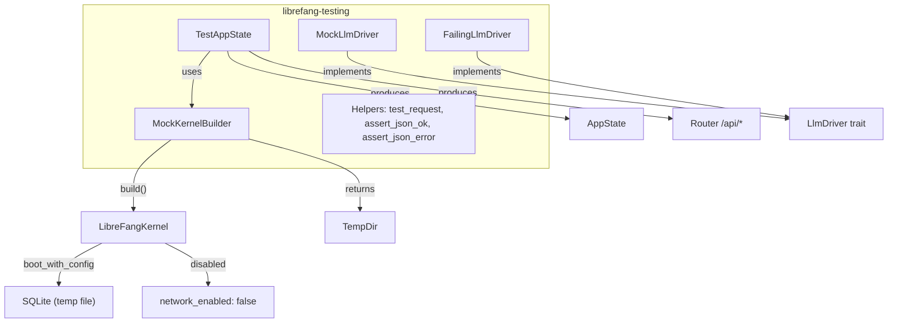

# Shared Types & Configuration — librefang-testing-src

# librefang-testing — Test Infrastructure

## Purpose

`librefang-testing` provides reusable mock infrastructure for unit and integration tests across the entire codebase. It eliminates the need to start a full daemon or connect to real external services by offering:

- A **real kernel instance** booted with minimal configuration (in-memory SQLite, temp directory, networking disabled)
- **Mock LLM drivers** that return canned responses and record calls for assertions
- A **pre-wired axum `AppState` and `Router`** matching production route structure
- **HTTP test helpers** for building requests and asserting on JSON responses

Over 20 modules across the codebase depend on this crate — including runtime components (web fetch, MCP, OAuth, plugin manager), CLI commands, desktop builds, and skill registries.

---

## Architecture



---

## Components

### MockKernelBuilder

Constructs a real `LibreFangKernel` instance with a fully isolated environment. The kernel is booted via `LibreFangKernel::boot_with_config`, meaning all internal subsystems initialize normally — just with lightweight defaults.

**What it configures:**

| Setting | Value |
|---|---|
| `home_dir` | Temp directory path |
| `data_dir` | `{home_dir}/data` |
| `network_enabled` | `false` |
| `memory.sqlite_path` | `{data_dir}/test.db` |
| Directory scaffolding | `data/`, `skills/`, `workspaces/agents/`, `workspaces/hands/` |

**Critical:** `build()` returns `(LibreFangKernel, TempDir)`. The caller **must hold onto `TempDir`** for the lifetime of the kernel — dropping it deletes the temp directory and invalidates all file paths the kernel references.

```rust
use librefang_testing::MockKernelBuilder;

// Default minimal kernel
let (kernel, _tmp) = MockKernelBuilder::new().build();

// With custom configuration
let (kernel, _tmp) = MockKernelBuilder::new()
    .with_config(|cfg| {
        cfg.default_model.provider = "test".into();
    })
    .build();
```

**Convenience function:** `test_kernel()` is equivalent to `MockKernelBuilder::new().build()`.

### TestAppState

Wraps `MockKernelBuilder` output into an `Arc<AppState>` — the same type used in production — and provides a fully-routed axum `Router`.

```rust
use librefang_testing::TestAppState;

let test = TestAppState::new();
let router = test.router();

// Use with tower::ServiceExt
use tower::ServiceExt;
let response = router
    .oneshot(test_request(Method::GET, "/api/health", None))
    .await
    .unwrap();
```

**Construction paths:**

| Method | When to use |
|---|---|
| `TestAppState::new()` | Default configuration, most common |
| `TestAppState::with_builder(builder)` | Custom kernel config needed |
| `TestAppState::from_kernel(kernel, tmp)` | Pre-built kernel (e.g., with injected LLM driver) |

**Router coverage** — `router()` mounts all production API routes under `/api`:

- **System:** `/health`, `/health/detail`, `/status`, `/version`, `/metrics`
- **Agents CRUD:** `/agents`, `/agents/{id}`, `/agents/{id}/message`, `/agents/{id}/stop`, `/agents/{id}/model`, `/agents/{id}/mode`, `/agents/{id}/session`, `/agents/{id}/sessions`, `/agents/{id}/session/reset`, `/agents/{id}/tools`, `/agents/{id}/skills`, `/agents/{id}/logs`
- **Profiles:** `/profiles`, `/profiles/{name}`
- **Skills:** `/skills`, `/skills/create`
- **Config:** `/config`, `/config/schema`, `/config/set`, `/config/reload`
- **Memory:** `/memory/search`, `/memory/stats`
- **Usage:** `/usage`, `/usage/summary`
- **Tools & Commands:** `/tools`, `/tools/{name}`, `/commands`
- **Models & Providers:** `/models`, `/providers`
- **Sessions:** `/sessions`

### MockLlmDriver

A configurable fake LLM provider implementing the `LlmDriver` trait. It returns canned responses in sequence and records every call for post-test assertions.

**Features:**

- **Canned responses:** Provide a `Vec<String>` on construction; responses are returned in order. When exhausted, the driver repeats the last response.
- **Call recording:** Every `complete()` and `stream()` call is captured as a `RecordedCall`.
- **Configurable token usage and stop reason** via builder methods.

```rust
use librefang_testing::MockLlmDriver;
use librefang_types::message::StopReason;

let driver = MockLlmDriver::new(vec![
    "First response".into(),
    "Second response".into(),
])
.with_tokens(100, 50)
.with_stop_reason(StopReason::EndTurn);

// ... use driver in test ...

let calls = driver.recorded_calls();
assert_eq!(calls.len(), 2);
assert_eq!(calls[0].model, "test-model");
assert_eq!(calls[0].message_count, 3);
```

**RecordedCall fields:**

| Field | Description |
|---|---|
| `model` | Model name from the request |
| `message_count` | Number of messages in the request |
| `tool_count` | Number of tool definitions |
| `system` | System prompt, if provided |

**Streaming behavior:** `stream()` calls `complete()` internally, then emits `TextDelta` and `ContentComplete` events on the provided channel — simulating a real streaming response.

**Default values:**

| Property | Default |
|---|---|
| `input_tokens` | 10 |
| `output_tokens` | 5 |
| `stop_reason` | `StopReason::EndTurn` |

### FailingLlmDriver

A specialization that always returns an `LlmError::Api` with status 500. Use it to test error-handling paths in agent logic, retry mechanisms, and error responses.

```rust
use librefang_testing::FailingLlmDriver;

let driver = FailingLlmDriver::new("API rate limit exceeded");
// driver.complete(...) always returns Err(LlmError::Api { status: 500, message: "..." })
```

`is_configured()` returns `false`, simulating an unconfigured provider.

### Helpers

Low-level utilities for building requests and asserting on responses.

**`test_request(method, path, body)`** — Constructs an `axum::http::Request<Body>`. Automatically sets `Content-Type: application/json` when a body is provided.

```rust
use axum::http::Method;

let get_req = test_request(Method::GET, "/api/health", None);
let post_req = test_request(
    Method::POST,
    "/api/agents",
    Some(r#"{"name":"test","model":"gpt-4"}"#),
);
```

**`assert_json_ok(response)`** — Asserts status 200, parses the body as JSON, returns `serde_json::Value`. Panics with the raw response body on failure.

**`assert_json_error(response, expected_status)`** — Same, but asserts a specific error status code instead of 200.

---

## Usage Patterns

### Testing an API endpoint

```rust
#[tokio::test]
async fn test_health_endpoint() {
    let test = TestAppState::new();
    let app = test.router();

    let response = app
        .oneshot(test_request(Method::GET, "/api/health", None))
        .await
        .unwrap();

    let body = assert_json_ok(response).await;
    assert_eq!(body["status"], "ok");
}
```

### Testing with a custom kernel config

```rust
#[tokio::test]
async fn test_with_custom_config() {
    let builder = MockKernelBuilder::new()
        .with_config(|cfg| {
            cfg.default_model.provider = "ollama".into();
        });

    let test = TestAppState::with_builder(builder);
    // ... run tests against test.router()
}
```

### Testing LLM-driven behavior

```rust
#[tokio::test]
async fn test_agent_with_mock_llm() {
    let driver = Arc::new(MockLlmDriver::with_response("I am a test agent."));
    let (kernel, _tmp) = MockKernelBuilder::new().build();

    // Inject mock driver into kernel's provider...
    // (exact injection mechanism depends on kernel internals)

    let test = TestAppState::from_kernel(kernel, _tmp);
    // ... exercise agent routes, then assert on driver.recorded_calls()
}
```

### Testing error responses

```rust
#[tokio::test]
async fn test_invalid_agent_id() {
    let test = TestAppState::new();
    let app = test.router();

    let response = app
        .oneshot(test_request(Method::GET, "/api/agents/nonexistent", None))
        .await
        .unwrap();

    let body = assert_json_error(response, StatusCode::NOT_FOUND).await;
    assert!(body["error"].as_str().unwrap().contains("not found"));
}
```

---

## Relationship to the Codebase

`MockKernelBuilder::build()` is the most widely-used entry point, called by over 20 modules for their own test setups:

- **Runtime:** web fetch, web search, MCP connections (HTTP and SSE), OAuth flows, plugin management, model catalog sync, provider health probes, A2A
- **CLI:** daemon discovery, status rendering, uninstall commands
- **Skills:** ClawHub client, SkillHub, marketplace
- **Desktop:** build script initialization

`TestAppState` and the helper functions are used primarily by the internal `tests.rs` integration tests for API route validation.

---

## Caveats

1. **TempDir lifetime:** Always keep the `TempDir` return value alive as long as the kernel is in use.
2. **SQLite is file-based, not in-memory:** The builder uses a file path under the temp directory (`test.db`), not `:memory:`. This is a `boot_with_config` limitation. The file is cleaned up when `TempDir` drops.
3. **No networking:** `network_enabled` is set to `false`. Tests that need HTTP client behavior must mock at the driver/provider level.
4. **Router does not include WebSocket routes:** Only standard HTTP routes are mounted. WebSocket-based endpoints (e.g., agent streaming) require separate test setup.
5. **`AppState` fields are test-defaults:** Some fields like `peer_registry`, `bridge_manager`, and `prometheus_handle` are initialized to `None` or empty defaults. Tests touching those subsystems need additional setup.