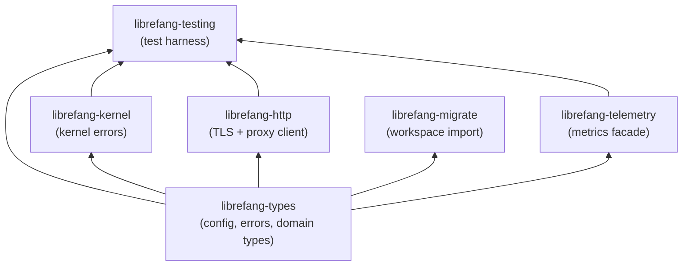

# Shared Types & Configuration

# Shared Types & Configuration

This module group forms the foundational layer of LibreFang — the shared vocabulary, infrastructure, and tooling that every other module builds on. It contains no business logic itself; instead, it provides the types, clients, observability hooks, test harnesses, and migration tooling that make the rest of the system consistent and testable.

## Sub-modules at a glance

| Sub-module | Role |
|---|---|
| [librefang-types](librefang-types-src.md) | Single source of truth for all shared data structures — config shape, error taxonomy, agent/event/message types, memory models, tool policies, scheduler definitions, webhook payloads, and i18n helpers. Every crate in the workspace depends on this. |
| [librefang-http](librefang-http-src.md) | Centralized HTTP client factory. Solves TLS cert panics on musl-based systems by seeding bundled Mozilla CA roots, and ensures every outbound request (including from crates that build their own `reqwest::Client`) respects the proxy settings defined in `config.toml`. |
| [librefang-telemetry](librefang-telemetry-src.md) | OpenTelemetry + Prometheus metrics facade. Exposes a small API (e.g. `record_http_request`, `normalize_path`) that the API middleware layer calls to record request latencies and counts without coupling to a specific metrics backend. |
| [librefang-testing](librefang-testing-src.md) | Reusable test infrastructure — a real kernel instance booted with minimal config, mock LLM drivers, a pre-wired axum `Router`, and HTTP assertion helpers. Over 20 modules across the codebase depend on this to avoid starting a full daemon or hitting real services. |
| [librefang-migrate](librefang-migrate-src.md) | Workspace import engine. Currently migrates agents from **OpenClaw** (JSON5 and legacy YAML) and **OpenFang** via `run_migration()`, with `scan_openclaw_workspace()` and `detect_openclaw_home()` exposed through config routes. LangChain and AutoGPT are reserved for future support. |
| [librefang-kernel](librefang-kernel-src.md) | Kernel-specific error types that extend the shared `LibreFangError` from `librefang-types` with boot-sequence and initialization failure variants, keeping domain-specific errors out of the shared type library. |

## How they fit together

`librefang-types` sits at the bottom of the dependency graph. Configuration defined there (proxy settings, credential structures, i18n message catalogs) flows upward:

- **`librefang-http`** reads proxy and TLS configuration to build a uniformly-configured `reqwest::Client`.
- **`librefang-telemetry`** consumes request-path data and records metrics through the `metrics` crate, which the API layer's Prometheus recorder exports.
- **`librefang-kernel`** wraps the shared `LibreFangError` in a `KernelError` enum, adding boot-specific failure context.
- **`librefang-migrate`** uses type definitions for migration options (`MigrateOptions`), source enums (`MigrateSource`), and report structures (`MigrationReport`), with format-specific parsing in `openclaw::migrate()` and `openfang::migrate()`.
- **`librefang-testing`** ties them together — booting a kernel, wiring an HTTP client, and attaching the telemetry recorder — to give integration tests a production-like stack without external dependencies.

## Key cross-cutting workflows

**Configuration → HTTP client**: Settings from `config.toml` (proxy URLs, CA paths) defined in `librefang-types` are consumed by `librefang-http`'s client factory, ensuring every HTTP call — whether from the API layer, channel adapters, or tool execution — uses the same TLS trust store and proxy routing.

**Inbound request → metrics**: The API middleware calls `record_http_request()` from `librefang-telemetry`, which normalizes the path (collapsing UUIDs and dynamic segments via `normalize_path`, `is_dynamic_segment`, `is_uuid`) and emits counters and histograms to the Prometheus recorder.

**Workspace import**: The CLI, TUI, or API config routes call `run_migration()` with a `MigrateSource` variant. For OpenClaw workspaces, `scan_openclaw_workspace()` locates the config file, parses JSON5, extracts model references and tool profiles, then migrates them into LibreFang's agent schema.

**Testing any module**: Tests import `librefang-testing` to get a booted kernel, mock LLM driver, and axum router — then make HTTP requests against the test router and assert on JSON responses, without needing real network access or external services.