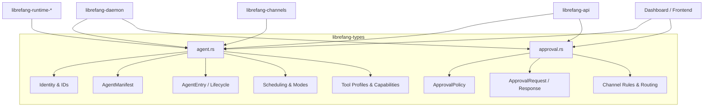
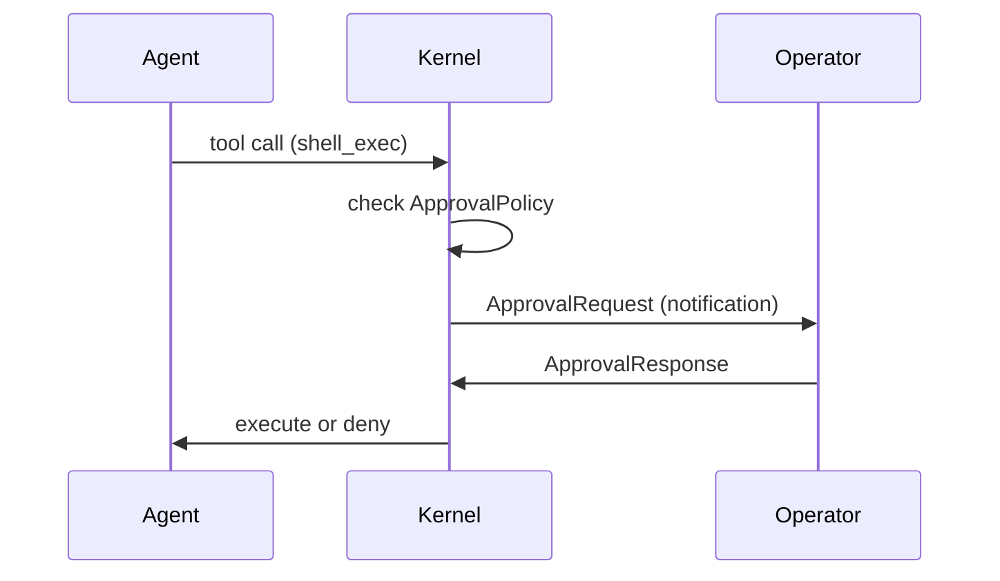

# Shared Types & Configuration

# Shared Types & Configuration (`librefang-types`)

The `librefang-types` crate is the central type library shared across the entire LibreFang agent OS. It defines every data structure that crosses crate boundaries — agent identities, manifests, approval workflows, session state, scheduling, model configuration, and experiment tracking. Because the daemon, runtime, API layer, channel adapters, and front-end dashboard all depend on this crate, changes here ripple everywhere; treat it as a contract.

## Architecture



---

## Identity & ID Types

All entity identifiers are newtype wrappers around `Uuid` with `Copy`/`Eq`/`Hash` semantics, making them cheap to pass by value and safe to use as hashmap keys.

### `AgentId`

The primary identifier for every agent instance.

| Constructor | Determinism | Use Case |
|---|---|---|
| `AgentId::new()` | Random (UUID v4) | Fresh agents spawned at runtime |
| `AgentId::from_name(name)` | Deterministic (UUID v5) | Named agents that must keep their identity across daemon restarts |
| `AgentId::from_hand_id(hand_id)` | Deterministic (UUID v5) | Hand-instantiated agents |
| `AgentId::from_hand_agent(hand, role, instance_id)` | Deterministic (UUID v5) | Multi-agent hands — each role gets a unique ID |

All deterministic derivation uses a single fixed namespace UUID with typed prefixes (`"agent:"`, bare hand ID, or `"{hand}:{role}:{instance}"`) to avoid cross-type collisions.

**Backward compatibility note**: `from_hand_agent` with `instance_id: None` uses the legacy format `"{hand_id}:{role}"` so existing single-instance hands retain their original IDs (no orphaned cron jobs or memory keys).

### `SessionId`

Represents a conversation session. Two constructors:

- **`SessionId::new()`** — random UUID v4 for ad-hoc sessions.
- **`SessionId::for_channel(agent_id, channel)`** — deterministic UUID v5 derived from `(agent_id, channel_name_lowercased)`. The same agent–channel pair always maps to the same session, even across process restarts. This is how persistent per-channel conversation state works.

A dedicated namespace UUID (`CHANNEL_SESSION_NAMESPACE`) isolates session derivation from agent ID derivation.

### `UserId`

Simple UUID v4 wrapper for human operator identity. No deterministic derivation.

---

## Agent Manifest (`AgentManifest`)

The manifest is the complete declarative blueprint for an agent — typically authored in TOML (`agent.toml`) and loaded at startup or via the dashboard wizard. It has ~50 fields organized into functional groups:

### Core Identity

| Field | Type | Default | Purpose |
|---|---|---|---|
| `name` | `String` | `"unnamed"` | Human-readable name |
| `version` | `String` | crate `VERSION` | Semantic version |
| `description` | `String` | `""` | What this agent does |
| `author` | `String` | `""` | Author identifier |
| `module` | `String` | `"builtin:chat"` | WASM/Python module path |
| `enabled` | `bool` | `true` | Disabled agents are not spawned on startup |
| `is_hand` | `bool` | `false` | Set by the kernel when spawned by a Hand |

### Model Configuration

```toml
[model]
provider = "anthropic"
model = "claude-sonnet-4-20250514"     # also accepts `name` alias
max_tokens = 4096
temperature = 0.7
system_prompt = """..."""
api_key_env = "ANTHROPIC_API_KEY"       # optional env var name
base_url = "https://..."                # optional provider URL override
```

The `ModelConfig.extra_params` field (via `#[serde(flatten)]`) injects arbitrary key-value pairs directly into the LLM API request body. This supports provider-specific features like Qwen's `enable_memory` without schema changes. **Warning**: `extra_params` keys that conflict with standard fields (e.g. `temperature`) take precedence because they serialize last.

### Fallback Models

`fallback_models` is an ordered list of `FallbackModel` entries. If the primary model call fails, the runtime tries each fallback in sequence. Each entry has the same shape as `ModelConfig` minus `system_prompt`.

### Model Routing (`ModelRoutingConfig`)

When `routing` is set, the agent loop auto-selects between `simple_model`, `medium_model`, and `complex_model` based on token count thresholds:

- Below `simple_threshold` (default: 100) → `simple_model`
- Above `complex_threshold` (default: 500) → `complex_model`
- In between → `medium_model`

### Autonomous Mode (`AutonomousConfig`)

Guardrails for 24/7 unattended agents:

| Field | Default | Purpose |
|---|---|---|
| `max_iterations` | 50 | Cap on LLM iterations per loop invocation. Policy constant shared with `librefang-runtime` |
| `max_restarts` | 10 | Maximum automatic restarts before permanent stop |
| `heartbeat_interval_secs` | 30 | How often the agent sends heartbeat signals |
| `heartbeat_timeout_secs` | `None` | Override for unresponsive detection (default: `interval * 2`) |
| `heartbeat_keep_recent` | `None` | How many NO_REPLY heartbeat turns to keep in context |
| `heartbeat_channel` | `None` | Where to send heartbeat status (e.g. "telegram") |
| `quiet_hours` | `None` | Cron expression for suppression windows |

### Scheduling (`ScheduleMode`)

```rust
pub enum ScheduleMode {
    Reactive,                                           // wake on message/event (default)
    Periodic { cron: String },                          // cron schedule
    Proactive { conditions: Vec<String> },              // condition monitoring
    Continuous { check_interval_secs: u64 },            // persistent loop (default: 300s)
}
```

### Session Behavior

- **`session_mode`** (`SessionMode`): Controls whether automated invocations (cron, triggers, `agent_send`) reuse the persistent session (`Persistent`, default) or create a fresh one each time (`New`).
- **`web_search_augmentation`** (`WebSearchAugmentationMode`): Automatically searches the web before LLM calls. `Auto` (default) activates only for models without tool support. Useful for Ollama/local models.

### Tool Access Control

Three layers, applied in order:

1. **`profile`** (`ToolProfile`): Named presets that expand to tool lists + derived capabilities.
2. **`tool_allowlist`** / **`tool_blocklist`**: Explicit inclusion/exclusion applied after profile expansion.
3. **`tools_disabled`**: Nuclear option — disables all tools regardless of other settings.
4. **`mode`** (`AgentMode` on `AgentEntry`): Runtime permission level — `Observe` (no tools), `Assist` (read-only only), `Full` (all granted tools).

The `AgentMode::filter_tools()` method applies the final runtime filter.

### Tool Profiles

| Profile | Tools | Key Implications |
|---|---|---|
| `Minimal` | `file_read`, `file_list` | No network, no shell, no agent comms |
| `Coding` | file R/W, `shell_exec`, `web_fetch` | Network + shell capabilities implied |
| `Research` | `web_fetch`, `web_search`, file R/W | Network capability implied |
| `Messaging` | `agent_send`, `channel_send`, memory R/W | Agent spawn + messaging implied |
| `Automation` | All 12 standard tools | Full capabilities |
| `Full` / `Custom` | `"*"` (all tools) | Everything implied |

`ToolProfile::implied_capabilities()` derives a `ManifestCapabilities` struct from the tool list — network access is inferred from `web_*` tools, shell from `shell_exec`, agent comms from `agent_*` tools, and memory from `memory_*` tools.

### Workspaces

Agents get a private workspace (default: `{workspaces_dir}/{name}-{id_prefix}/`) and can declare named shared workspaces:

```toml
[workspaces]
library = { path = "shared/library", mode = "rw" }
archive = { path = "shared/archive", mode = "r" }
```

`WorkspaceMode::ReadOnly` causes the kernel to reject write tool calls targeting that workspace. Identity files (SOUL.md, USER.md) live in the agent's private `.identity/` directory, never in shared workspaces, so multiple agents sharing a path don't collide.

### Resource Quotas (`ResourceQuota`)

| Resource | Default |
|---|---|
| `max_memory_bytes` | 256 MB |
| `max_cpu_time_ms` | 30 s |
| `max_tool_calls_per_minute` | 60 |
| `max_llm_tokens_per_hour` | `None` (inherit global) |
| `max_network_bytes_per_hour` | 100 MB |
| `max_cost_per_hour/day/month_usd` | 0.0 (unlimited) |

`effective_token_limit()` normalizes `None` and `Some(0)` both to `0` (unlimited), while `Some(n)` yields `n`. Enforcement code should skip when the result is `0`.

### Other Notable Fields

| Field | Purpose |
|---|---|
| `exec_policy` | Per-agent shell execution policy override |
| `response_format` | Structured LLM output format |
| `thinking` | Per-agent extended thinking config (overrides global) |
| `context_injection` | Merged with global injections at session start |
| `channel_overrides` | Per-agent DM/group policy overrides |
| `allowed_plugins` | Restrict which plugins load for this agent |
| `inherit_parent_context` | Whether subagents see parent workflow context |
| `auto_dream_enabled` | Opt-in to background memory consolidation |
| `auto_evolve` | Background skill evolution after each turn (default: true) |
| `show_progress` | Surface `🔧 tool_name` markers in channel replies (default: true) |
| `generate_identity_files` | Auto-create SOUL.md etc. on spawn (default: true) |

---

## Agent Entry (`AgentEntry`)

The runtime representation of a registered agent in the kernel's registry. Wraps the manifest with live state:

- **`state`** (`AgentState`): `Created` → `Running` → `Suspended`/`Terminated`/`Crashed`
- **`mode`** (`AgentMode`): Permission level — `Observe`, `Assist`, `Full`
- **`session_id`**: Active session
- **`parent`/`children`**: Agent hierarchy
- **`identity`** (`AgentIdentity`): Visual identity — emoji, avatar, color, archetype, vibe, greeting style
- **`force_session_wipe`**: Hard reset flag — clears message history on next invocation while keeping the session ID. Takes priority over `resume_pending`.
- **`resume_pending`**: Set on restart/shutdown interruption; cleared after successful turn. Preserves session continuity.
- **`reset_reason`**: Why the last automatic session reset occurred.
- **`onboarding_completed` / `onboarding_completed_at`**: Bootstrap state tracking.

---

## Approval System (`approval.rs`)

The approval system gates dangerous agent operations behind human-in-the-loop review. When an agent attempts a tool listed in `require_approval`, the kernel creates an `ApprovalRequest`, notifies operators, and pauses the agent until an `ApprovalResponse` arrives.

### Approval Flow



### `ApprovalPolicy`

Configuration loaded from TOML:

```toml
[approval]
require_approval = ["shell_exec", "file_write", "file_delete", "apply_patch", "skill_evolve_*"]
timeout_secs = 60
auto_approve = false
auto_approve_autonomous = false
timeout_fallback = "deny"

trusted_senders = ["admin_123"]

[[approval.channel_rules]]
channel = "telegram"
allowed_tools = ["file_read"]
denied_tools = ["shell_exec"]

[approval.second_factor]
# Options: none, totp, login, both
[approval.timeout_fallback]
type = "escalate"
extra_timeout_secs = 120
```

**Key behaviors**:

- **`require_approval`** accepts a list of tool names (with glob patterns like `"skill_evolve_*"`) or a boolean shorthand (`true` = default set, `false` = empty).
- **`auto_approve = true`** is a shorthand that clears the require list at boot.
- **`trusted_senders`** bypasses the approval gate entirely for listed user IDs.
- **`channel_rules`** (`ChannelToolRule`): Per-channel allow/deny lists evaluated before the global policy. Deny always wins over allow.
- **`timeout_fallback`**: What happens when no one responds — `Deny` (default), `Skip` (agent continues without the tool), or `Escalate` (extend timeout and re-notify).

### `ApprovalDecision`

Five outcomes:

| Decision | Terminal? | Effect |
|---|---|---|
| `Approved` | Yes | Execute the tool |
| `Denied` | Yes | Reject the tool call |
| `TimedOut` | Yes | Determined by `timeout_fallback` |
| `Skipped` | Yes | Agent continues without executing |
| `ModifyAndRetry { feedback }` | **No** | Agent receives feedback and retries |

Serialization is backward-compatible: simple variants are plain strings (`"approved"`), while `ModifyAndRetry` serializes as `{"type": "modify_and_retry", "feedback": "..."}`.

### Second-Factor Authentication (`SecondFactor`)

| Mode | Login TOTP | Approval TOTP |
|---|---|---|
| `None` (default) | No | No |
| `Totp` | No | Yes |
| `Login` | Yes | No |
| `Both` | Yes | Yes |

`tool_requires_totp(tool_name)` checks whether a specific tool needs TOTP verification. When `totp_tools` is empty, all gated tools require TOTP. When non-empty, only listed tools (with glob support) require it. A grace period (`totp_grace_period_secs`, default 300s) skips re-verification for subsequent approvals.

### Notification Routing

`ApprovalRoutingRule` maps tool patterns to specific `NotificationTarget` channels. `NotificationConfig` provides global defaults (`approval_channels`, `alert_channels`) plus per-agent overrides (`agent_rules`).

### Validation

Both `ApprovalRequest::validate()` and `ApprovalPolicy::validate()` enforce size and character constraints:

- Tool names: 1–64 chars, alphanumeric + underscore + `*` (single wildcard)
- Description: ≤ 1024 chars
- Action summary: ≤ 512 chars
- Timeout: 10–300 seconds
- Trusted senders: ≤ 100 entries
- Channel rules: ≤ 50 rules, ≤ 50 tools per rule

### Audit Trail

`ApprovalAuditEntry` records every decision with request details, the decision, who made it, timestamps, feedback, and whether TOTP was used.

---

## Hook System (`HookEvent`)

Interceptable lifecycle events for plugin/middleware integration:

| Event | Timing | Use Case |
|---|---|---|
| `BeforeToolCall` | Before tool execution | Block or modify tool calls |
| `AfterToolCall` | After tool completes | Logging, post-processing |
| `TransformToolResult` | After execution | Rewrite result strings (first `Ok(Some(s))` wins) |
| `BeforePromptBuild` | Before system prompt | Dynamic prompt modification |
| `AgentLoopEnd` | After loop completes | Cleanup, metrics |

---

## Experiment System

A/B testing framework for prompt optimization:

- **`PromptExperiment`**: Named experiment with traffic split percentages and success criteria
- **`ExperimentVariant`**: Named variant bound to a `PromptVersion`
- **`SuccessCriteria`**: Configurable thresholds (user helpfulness, tool errors, non-empty response, custom score)
- **`ExperimentVariantMetrics`**: Aggregated stats (success rate, latency, cost)

Status lifecycle: `Draft` → `Running` → `Paused` → `Completed`.

---

## Serde & Serialization Patterns

The crate uses several patterns worth knowing when authoring TOML manifests:

- **`#[serde(default)]`** on nearly every struct: omitting a field uses its default rather than causing a parse error.
- **`#[serde(alias = "name")]`** on `ModelConfig.model`: accepts both `model` and `name` keys.
- **`#[serde(flatten)]`** on `ModelConfig.extra_params`: unknown TOML keys flow into the extension map.
- **Lenient deserializers** (`crate::serde_compat::vec_lenient`, `map_lenient`, `exec_policy_lenient`): gracefully handle type mismatches (e.g., a string where a list is expected) by falling back to defaults instead of failing.
- **`deserialize_require_approval`**: custom visitor accepting either a list of strings or a boolean.
- **`ApprovalDecision`**: custom serializer/deserializer handling both string and object representations.

---

## Constants & Policy Values

| Constant | Value | Location |
|---|---|---|
| `AutonomousConfig::DEFAULT_MAX_ITERATIONS` | 50 | `agent.rs` |
| `STABLE_PREFIX_MODE_METADATA_KEY` | `"stable_prefix_mode"` | `agent.rs` |
| Default `ResourceQuota::max_memory_bytes` | 256 MB | `agent.rs` |
| Default `ApprovalPolicy::timeout_secs` | 60 | `approval.rs` |
| Default `ApprovalPolicy::require_approval` | 5 entries (incl. `skill_evolve_*`) | `approval.rs` |
| Approval timeout range | 10–300 s | `approval.rs` |
| `MAX_ACTION_SUMMARY_LEN` | 512 | `approval.rs` |
| `MAX_APPROVAL_FEEDBACK_LEN` | 4096 | `approval.rs` |
| Default TOTP grace period | 300 s (5 min) | `approval.rs` |
| Max TOTP grace period | 3600 s (1 hour) | `approval.rs` |

The `DEFAULT_MAX_ITERATIONS` value is a policy constant shared between `librefang-types` and `librefang-runtime` — changing it in one place requires updating the other to keep the runtime's fallback path in lockstep.