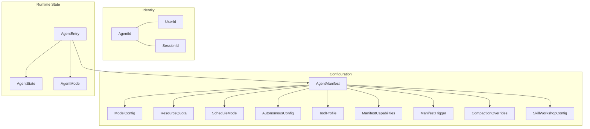

# Shared Types & Configuration

# Agent Types (`librefang-types/src/agent.rs`)

This module defines the shared type system for agent identity, manifests, lifecycle state, scheduling, resource quotas, and session resolution. It is the single source of truth used by the kernel, runtime, API layer, and CLI — any crate that needs to reason about what an agent *is* or *does* depends on these types.

## Architecture Overview



## Identifiers

All identifiers are newtype wrappers around `Uuid` with deterministic derivation via UUID v5 (SHA-1 + namespace). This ensures the same logical entity always maps to the same UUID across daemon restarts, preserving session history, audit logs, and cron-job associations.

### `AgentId`

| Constructor | Determinism | Use Case |
|---|---|---|
| `AgentId::new()` | Random (v4) | One-off agents |
| `AgentId::from_name(name)` | Deterministic (v5, `agent:{name}`) | Named agents in config |
| `AgentId::from_hand_id(hand_id)` | Deterministic (v5, bare `hand_id`) | Hand instances (backward compat) |
| `AgentId::from_hand_agent(hand_id, role, instance_id)` | Deterministic (v5) | Multi-agent hand roles |

All deterministic derivation uses a single `AgentId::NAMESPACE` with typed prefixes (`agent:`, `hand:`) to prevent collisions between agents and hands that share the same name.

**Backward compatibility note**: `from_hand_agent` with `instance_id: None` produces `"{hand_id}:{role}"` (legacy format). With `Some(id)`, it produces `"{hand_id}:{role}:{id}"`. Existing single-instance hands must pass `None` to keep their original IDs.

### `UserId`

Same pattern: `UserId::new()` for random, `UserId::from_name(name)` for deterministic v5 derivation using `LIBREFANG_USER_NAMESPACE`. The namespace constant is frozen — changing it would rotate every existing `UserId` and break audit-log correlation.

### `SessionId`

Session IDs have multiple derivation paths, each using a distinct UUID v5 namespace to prevent collisions:

| Method | Namespace | Input | Purpose |
|---|---|---|---|
| `SessionId::new()` | — (v4) | — | Fresh random session |
| `SessionId::for_channel(agent_id, channel)` | `CHANNEL_SESSION_NAMESPACE` | `"{agent_id}:{channel}"` | Per-channel persistent session |
| `SessionId::for_sender_scope(agent_id, channel, chat_id)` | `CHANNEL_SESSION_NAMESPACE` | `"{channel}:{chat_id}"` or `"{channel}"` | Canonical scope (single source of truth for #4868) |
| `SessionId::for_cron_run(agent_id, run_key)` | `CRON_RUN_SESSION_NAMESPACE` | `"{agent_id}:{run_key}"` | Per-fire cron isolation |
| `SessionId::from_route_key(agent_id, channel, account, conversation)` | `CHANNEL_SESSION_NAMESPACE` | v2 format when account non-empty | Multi-tenant routing |

**Session resolution precedence** (documented on `AgentManifest::session_mode`):

1. Explicit `session_id_override` from dispatch caller — always wins
2. Per-trigger `session_mode` override
3. Channel branch — always uses `for_channel`, overrides manifest when `SenderContext.channel` is present
4. Cron — synthesizes channel `"cron"` or uses per-job override
5. Manifest `session_mode` — final fallback

`for_sender_scope` is the canonical scope formula shared by the kernel's inbound resolver, channel-bridge commands, and the agent-execution path. Do not inline the scope construction — call this method to avoid drift.

`from_route_key` is backward-compatible: when `account` is empty, it falls through to `for_channel` semantics. When `account` is non-empty, it uses a `v2:` prefix to produce IDs in a disjoint hash space.

## Agent Manifest (`AgentManifest`)

The complete declarative configuration for an agent, typically loaded from `agent.toml`. Key field groups:

### Core Identity
- `name`, `version`, `description`, `author` — metadata
- `module` — path to agent code (`"builtin:chat"`, WASM file, Python file)
- `enabled` — disabled agents are not spawned on startup

### Model Configuration
- `model: ModelConfig` — provider, model name, temperature, system prompt, context window overrides, provider-specific `extra_params` (flattened into API request body via `#[serde(flatten)]`)
- `fallback_models: Vec<FallbackModel>` — chain tried in order on primary failure
- `routing: Option<ModelRoutingConfig>` — auto-select cheap/mid/expensive models by token-count thresholds
- `pinned_model: Option<String>` — override for Stable mode
- `thinking: Option<ThinkingConfig>` — per-agent extended thinking budget override

`ModelConfig.model` accepts a `#[serde(alias = "name")]` so both `model = "..."` and `name = "..."` work in TOML.

### Scheduling
- `schedule: ScheduleMode` — `Reactive` (event-driven), `Periodic { cron }`, `Proactive { conditions }`, or `Continuous { check_interval_secs }`
- `session_mode: SessionMode` — `Persistent` (reuse session) or `New` (fresh session per invocation)

### Resource Limits (`ResourceQuota`)

| Field | Default | Notes |
|---|---|---|
| `max_memory_bytes` | 256 MB | WASM memory |
| `max_cpu_time_ms` | 30,000 | Per invocation |
| `max_tool_calls_per_minute` | 60 | — |
| `max_llm_tokens_per_hour` | `None` (inherit global) | `Some(0)` = unlimited |
| `burst_ratio` | `None` (→ 0.2) | Fraction of hourly budget per minute, clamped `[0.01, 1.0]` |
| `max_cost_per_hour_usd` | 0.0 (unlimited) | — |
| `max_cost_per_day_usd` | 0.0 | — |
| `max_cost_per_month_usd` | 0.0 | — |

Use `effective_token_limit()` and `effective_burst_ratio(global_default)` to resolve `None` into concrete values at enforcement time.

### Tool Access Control

Tools are resolved through a multi-layer filter pipeline:

1. **`tools_disabled: bool`** — master kill switch, overrides everything
2. **`profile: Option<ToolProfile>`** — named preset expands to tool list + capabilities
3. **`tool_allowlist`** — if non-empty, only these tools pass
4. **`tool_blocklist`** — applied after allowlist
5. **`mode: AgentMode`** — runtime permission filter (`Observe` = no tools, `Assist` = read-only, `Full` = all)

Tool profiles expand via `ToolProfile::tools()` and `ToolProfile::implied_capabilities()`:

| Profile | Tool Count | Capabilities |
|---|---|---|
| `Minimal` | 2 | No network, no shell |
| `Coding` | 5 | Network + shell |
| `Research` | 4 | Network, no shell |
| `Messaging` | 6 | Agent spawn + memory |
| `Automation` | 12 | All capabilities |
| `Full` / `Custom` | `["*"]` | All capabilities |

### Autonomous Agent Guardrails (`AutonomousConfig`)

For 24/7 agents:
- `quiet_hours` — cron expression for downtime
- `max_iterations` — cap on LLM iterations per invocation (default 50, policy constant `DEFAULT_MAX_ITERATIONS`)
- `max_restarts` — before permanent stop
- `heartbeat_interval_secs` / `heartbeat_timeout_secs` — health monitoring
- `heartbeat_channel` — where to send heartbeat status

### Declarative Triggers (`ManifestTrigger`)

Triggers in `agent.toml` are reconciled against the runtime trigger store on spawn/reload:
- Missing entries are created
- Drifted entries are updated (TOML wins)
- Runtime-only triggers follow `reconcile_orphans` policy (`Keep` / `Warn` / `Delete`)

The `pattern` field is a raw `serde_json::Value` — it's deserialized at reconcile time using the same `preprocess_pattern_json` normalization as the API route, so new `TriggerPattern` variants don't require coordinated crate edits.

### Per-Agent Overrides

Several fields override kernel-global settings:

| Field | Global Config Section | Scope |
|---|---|---|
| `compaction` | `[compaction]` | `CompactionOverrides.resolve(global)` |
| `thinking` | `[thinking]` | Direct replacement |
| `exec_policy` | `[tool_exec]` | Direct replacement |
| `tool_exec_backend` | `[tool_exec]` | `BackendKind` selection |
| `channel_overrides` | Per-channel config | `ChannelOverrides` |
| `max_history_messages` | `max_history_messages` | Trim cap |
| `max_concurrent_invocations` | `queue.concurrency.default_per_agent` | Per-agent semaphore (NOT hot-reloaded) |
| `proactive_memory` | `[proactive_memory]` | Per-field opt-out |

`CompactionOverrides.resolve()` merges per-agent `Some(_)` values on top of the global `CompactionTomlConfig`, returning a fresh config without mutating the global. `token_threshold_ratio` is clamped to `[0.0, 1.0]` during resolution.

### Skill Workshop (`SkillWorkshopConfig`)

Opt-in passive capture of reusable workflows from successful interactions. Default is `enabled: false`. When enabled:
- `review_mode: Heuristic` — pattern match only, no LLM cost
- `approval_policy: Pending` — candidates wait for human review in `~/.librefang/skills/pending/`
- `max_pending: 20` — LRU eviction

### Workspaces

```toml
[workspaces]
library = { path = "shared/library", mode = "rw" }
vault   = { mount = "/Users/me/Obsidian", mode = "r" }
```

`WorkspaceDecl` supports two mutually exclusive modes:
- **`path`** — relative to `workspaces_dir`, auto-created
- **`mount`** — absolute host path, must be in `allowed_mount_roots`

### Concurrency Control

`max_concurrent_invocations` scopes to trigger-dispatch fan-out only. Channel messages, cron jobs, and `agent_send` are not throttled by this knob. Caps > 1 require `session_mode = "new"` on the manifest — parallel writes to a single persistent session are undefined and auto-clamped to 1 with a `WARN` log.

**Hot-reload caveat**: the per-agent semaphore is sized on first dispatch and is not invalidated by manifest swap. To pick up a new cap, kill and respawn the agent.

## Runtime State (`AgentEntry`)

The kernel's registry entry for a live agent:

- `id`, `name`, `manifest` — identity and configuration
- `state: AgentState` — lifecycle (`Created` → `Running` → `Suspended` / `Terminated` / `Crashed`)
- `mode: AgentMode` — permission filter (`Observe` / `Assist` / `Full`)
- `session_id` — active session
- `parent` / `children` — spawn hierarchy
- `force_session_wipe` — next invocation clears message history (priority over `resume_pending`)
- `resume_pending` — agent interrupted by restart, will resume on same transcript
- `has_processed_message` — sticky flag for heartbeat monitor; distinguishes "never received work" from "genuinely hanging"

## Agent Name Validation

`validate_agent_name(name)` rejects names starting with `_operator:` — this prefix is reserved for synthetic workflow-engine node names (Wait / Gate / Approval / Transform / Branch) that appear in run history. A user-supplied name collision would make the dashboard ambiguous.

## Session Labels (`SessionLabel`)

Validated human-readable labels (1–128 chars, alphanumeric + spaces + hyphens + underscores). Created via `SessionLabel::new(label)` which returns `Err(InvalidInput)` on validation failure.

## A/B Prompt Experiments

`PromptExperiment` and `ExperimentVariant` support controlled prompt testing with:
- Traffic splitting
- Success criteria (user helpfulness, tool error presence, non-empty output, custom score)
- Per-variant metrics (`ExperimentVariantMetrics`)

## Key Design Decisions

1. **Deterministic IDs everywhere** — UUID v5 with typed prefixes ensures the same config always produces the same ID. This is critical for audit-log correlation across restarts and for session history preservation.

2. **Separate namespaces per ID type** — `AgentId::NAMESPACE`, `LIBREFANG_USER_NAMESPACE`, `CHANNEL_SESSION_NAMESPACE`, and `CRON_RUN_SESSION_NAMESPACE` are all distinct. Even if input strings coincide, different entity types cannot collide.

3. **`for_sender_scope` as single source of truth** — The scope formula lives in one method called by the kernel inbound resolver, channel-bridge commands, and agent-execution paths. Inlining it would re-introduce #4868 (channel `/new` deleting the wrong session).

4. **Per-agent overrides as `Option<_>`** — Each override field defaults to `None` (inherit global). The `resolve()` pattern (e.g., `CompactionOverrides::resolve`) merges `Some(_)` on top of the global without mutating it, so different agents can produce different merged configs from the same global snapshot.

5. **Tool profile → capabilities expansion** — `ToolProfile::implied_capabilities()` derives network, shell, agent-spawn, and memory capabilities from the tool list so operators don't have to manually keep capabilities in sync with their tool selections.