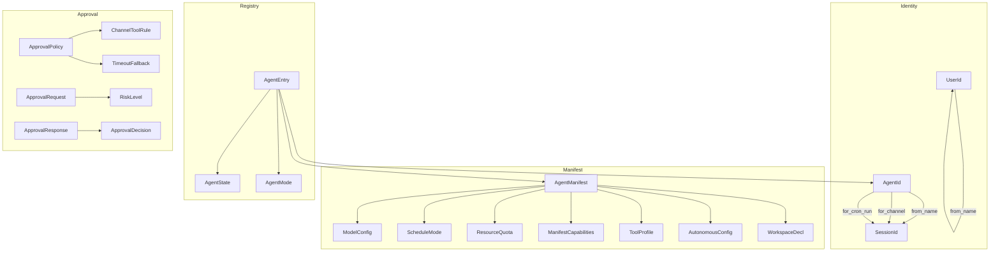

# Shared Types & Configuration

# Shared Types & Configuration (`librefang-types`)

The `librefang-types` crate defines the canonical data structures shared across the LibreFang agent OS — every other crate (runtime, API, drivers, channels) depends on it. Types here are **serialization-stable**: they round-trip cleanly through JSON and TOML, and deterministic ID derivation guarantees that the same logical entity (agent, user, session) always maps to the same UUID across daemon restarts.

## Architecture Overview



---

## Deterministic Identity (`AgentId`, `UserId`, `SessionId`)

All three ID types wrap a `Uuid` and offer two construction paths: **random** (`::new()` → UUID v4) and **deterministic** (`::from_name()` → UUID v5). Deterministic IDs are the default for anything that originates from configuration, because they survive daemon restarts and preserve audit-log continuity.

### `AgentId`

```rust
// Random (one-shot agents, tests)
let id = AgentId::new();

// Deterministic — same name always produces the same UUID
let id = AgentId::from_name("brand-guardian");
```

All deterministic derivation uses a single internal namespace with **typed prefixes** to prevent collisions:

| Method | UUID v5 input | Purpose |
|--------|--------------|---------|
| `from_name(name)` | `"agent:{name}"` | Top-level named agents |
| `from_hand_id(hand_id)` | `hand_id` (bare, backward compat) | Hand instances |
| `from_hand_agent(hand, role, None)` | `"{hand}:{role}"` | Single-instance hand roles |
| `from_hand_agent(hand, role, Some(id))` | `"{hand}:{role}:{id}"` | Multi-instance hand roles |

The `from_hand_agent` overload with `instance_id: None` preserves the legacy hash format so existing single-instance hands keep their original agent IDs (no orphaned cron jobs or memory keys).

### `UserId`

```rust
// Deterministic — uses the frozen LIBREFANG_USER_NAMESPACE
let uid = UserId::from_name("Alice");  // always same UUID for "Alice"
```

`LIBREFANG_USER_NAMESPACE` is a constant that **must never be changed** — rotating it rehashes every user ID and breaks fleet-wide audit correlation.

### `SessionId`

Session IDs use **disjoint UUID v5 namespaces** to prevent cross-category collisions:

| Factory method | Namespace | Input format | Use case |
|---------------|-----------|-------------|----------|
| `for_channel(agent, channel)` | `CHANNEL_SESSION_NS` | `"{agent_uuid}:{channel}"` | Persistent channel sessions |
| `for_cron_run(agent, run_key)` | `CRON_RUN_SESSION_NS` | `"{agent_uuid}:{run_key}"` | Isolated per-fire cron sessions |
| `from_route_key(agent, ch, acct, conv)` | `CHANNEL_SESSION_NS` | Varies (see below) | Multi-tenant channel routing |

`from_route_key` is backward-compatible with `for_channel`:

- When `account` is empty → delegates to `for_channel` (same ID as before).
- When `account` is non-empty → uses a `"v2:"` prefix to produce IDs in a disjoint hash space, preventing accidental collisions with legacy sessions.

All channel/account/conversation inputs are lowercased before hashing for case-insensitive matching.

---

## Agent Manifest (`AgentManifest`)

The manifest is the complete declarative specification of an agent — what model it uses, what tools it can access, how it's scheduled, and every tunable parameter. It deserializes from `agent.toml` files and JSON API payloads.

### Key Fields

#### Model Configuration (`ModelConfig`)

```toml
[model]
provider = "groq"
model = "llama-3.3-70b-versatile"   # or `name = "..."` (alias)
max_tokens = 4096
temperature = 0.7
system_prompt = """
You are a helpful coding assistant.
Always explain your reasoning.
"""
context_window = 32768              # optional override
max_output_tokens = 2048            # optional override
```

The `model` field accepts an `#[serde(alias = "name")]` so both `model` and `name` keys work in TOML. Provider-specific extension parameters go in `extra_params`, which is flattened directly into the API request body:

```toml
[model]
provider = "qwen"
model = "qwen3.6"
enable_memory = true                # → extra_params
memory_max_window = 50              # → extra_params
```

#### Fallback Models

An ordered chain of fallback models tried when the primary fails:

```toml
[[fallback_models]]
provider = "groq"
model = "llama-3.3-70b-versatile"

[[fallback_models]]
provider = "ollama"
model = "gemma3:12b"
base_url = "http://localhost:11434"
```

#### Tool Access Control

Tool availability is resolved through multiple layers, evaluated in this order:

1. **`tools_disabled`** — hard kill switch, no tools at all.
2. **`tool_blocklist`** — specific exclusions (applied last).
3. **`tool_allowlist`** — if non-empty, only these tools pass (empty = all).
4. **`profile`** — named preset expanding to a tool list + derived capabilities.
5. **`AgentMode`** — runtime filter applied by the kernel (`Observe` drops everything, `Assist` keeps read-only tools, `Full` passes all).

#### Profiles (`ToolProfile`)

| Profile | Tools included | Derived capabilities |
|---------|---------------|---------------------|
| `Minimal` | `file_read`, `file_list` | No network, no shell |
| `Coding` | `file_*`, `shell_exec`, `web_fetch` | Network + shell |
| `Research` | `web_fetch`, `web_search`, `file_read`, `file_write` | Network |
| `Messaging` | `agent_*`, `channel_send`, `memory_*` | Agent spawn + memory |
| `Automation` | All 12 standard tools | Network + shell + agent + memory |
| `Full` / `Custom` | `"*"` (all tools) | All capabilities |

Profiles also derive `ManifestCapabilities` — the `implied_capabilities()` method inspects the tool list and sets `network`, `shell`, `agent_spawn`, `agent_message`, and `memory_*` scopes automatically.

#### Scheduling (`ScheduleMode`)

```rust
pub enum ScheduleMode {
    Reactive,                                    // wake on message/event (default)
    Periodic { cron: String },                   // cron schedule
    Proactive { conditions: Vec<String> },       // condition monitoring
    Continuous { check_interval_secs: u64 },     // persistent loop (default: 300s)
}
```

#### Session Mode (`SessionMode`)

Controls session resolution for non-channel invocations (cron, triggers, `agent_send`):

- **`Persistent`** (default) — reuses the agent's single session across invocations.
- **`New`** — creates a fresh session for each invocation.

When `max_concurrent_invocations > 1`, the manifest **must** use `session_mode = "new"`. Persistent mode with concurrency > 1 is auto-clamped to 1 with a `WARN` log because parallel writes to a single session's history are undefined.

#### Workspaces (`WorkspaceDecl`)

Named shared directories that multiple agents can access:

```toml
[workspaces]
library = { path = "shared/library", mode = "rw" }
vault   = { mount = "/Users/me/Obsidian", mode = "r" }
```

- **`path`** — relative to `workspaces_dir`, auto-created by the kernel.
- **`mount`** — absolute host path (e.g., Obsidian vault), must be whitelisted in `config.toml: allowed_mount_roots`.

Mutual exclusivity is enforced at boot by `resolve_workspace_decl`, not at the schema level — this lets the dashboard show validation errors in context during hot-reload.

#### Autonomous Agents (`AutonomousConfig`)

Guardrails for 24/7 background agents:

```toml
[autonomous]
quiet_hours = "0 22 * * *"          # optional cron for quiet periods
max_iterations = 50                 # LLM loop cap per invocation
max_restarts = 10                   # crash recovery limit
heartbeat_interval_secs = 30
heartbeat_timeout_secs = 90         # optional override (default: interval × 2)
heartbeat_keep_recent = 5           # optional: prune old NO_REPLY turns
heartbeat_channel = "telegram"      # where to send heartbeat alerts
```

`DEFAULT_MAX_ITERATIONS` (50) is the shared policy constant — `librefang-runtime` re-exports it so its fallback path stays in lockstep.

#### Model Routing (`ModelRoutingConfig`)

Auto-selects between cheap/mid/expensive models based on token complexity:

```toml
[routing]
simple_model = "claude-haiku-4-5-20251001"
medium_model = "claude-sonnet-4-20250514"
complex_model = "claude-sonnet-4-20250514"
simple_threshold = 100    # below = simple
complex_threshold = 500   # above = complex
```

#### Per-Agent Overrides

The manifest supports granular per-agent overrides that take precedence over global config:

| Field | Overrides global |
|-------|-----------------|
| `thinking` | `[thinking]` config |
| `exec_policy` | Global `exec_policy` |
| `channel_overrides` | Channel-level `ChannelOverrides` |
| `max_history_messages` | `KernelConfig.max_history_messages` |
| `max_concurrent_invocations` | `KernelConfig.queue.concurrency.default_per_agent` |
| `auto_dream_min_hours` | `[auto_dream] min_hours` |
| `auto_dream_min_sessions` | `[auto_dream] min_sessions` |
| `context_injection` | Global `session.context_injection` (appended after) |

---

## Agent Registry (`AgentEntry`)

The runtime representation of a registered agent — wraps the manifest with lifecycle state, identity, and session management flags:

```rust
pub struct AgentEntry {
    pub id: AgentId,
    pub name: String,
    pub manifest: AgentManifest,
    pub state: AgentState,          // Created | Running | Suspended | Terminated | Crashed
    pub mode: AgentMode,            // Observe | Assist | Full
    pub session_id: SessionId,
    pub identity: AgentIdentity,    // emoji, avatar, color, archetype, vibe
    // ... lifecycle flags
}
```

### Session Reset Flags

Three flags control session auto-reset behavior (mirrors hermes-agent `SessionEntry`):

- **`force_session_wipe`** — next `execute_llm_agent` call clears message history (keeps `session_id`). Takes priority over `resume_pending`.
- **`resume_pending`** — agent was interrupted by restart/shutdown; preserves existing `session_id` and continues on the same transcript. Cleared after the next successful turn.
- **`has_processed_message`** — sticky flag set when the agent processes its first real message. Prevents the heartbeat monitor from flagging never-dispatched agents as unresponsive (which would trigger a crash-recover loop).

---

## Approval System (`ApprovalPolicy`, `ApprovalRequest`, `ApprovalResponse`)

When an agent attempts a dangerous operation, the kernel creates an approval request and pauses the agent until a human responds.

### Approval Policy

```toml
[approval]
require_approval = ["shell_exec", "file_write", "file_delete", "apply_patch", "skill_evolve_*"]
timeout_secs = 60
auto_approve_autonomous = false
auto_approve = false               # alias: true clears require_approval
```

`require_approval` accepts either a list of tool names (with glob patterns) or a boolean shorthand:

- `true` → the default mutation set (shell_exec, file_write, file_delete, apply_patch, skill_evolve_*)
- `false` → empty list (no tools require approval)

#### Channel-Specific Rules

```toml
[[approval.channel_rules]]
channel = "telegram"
allowed_tools = ["file_read", "web_search"]
denied_tools = ["shell_exec"]
```

Rules are evaluated in order; first match wins. Deny takes precedence over allow (deny-wins). Tool names in allow/deny lists support glob patterns (e.g., `"file_*"`) matched via `glob_matches`.

#### Trusted Senders

```toml
[approval]
trusted_senders = ["user:admin_001", "user:ops_lead"]
```

Requests originating from these sender IDs bypass the approval gate entirely.

#### Timeout Behavior (`TimeoutFallback`)

| Variant | Behavior |
|---------|----------|
| `Deny` (default) | Auto-deny on timeout |
| `Skip` | Skip the tool, agent continues |
| `Escalate { extra_timeout_secs }` | Extend timeout and re-notify |

#### Second-Factor (TOTP)

```toml
[approval]
second_factor = "totp"             # None | Totp | Login | Both
totp_issuer = "LibreFang"
totp_grace_period_secs = 300       # skip re-verification within window
totp_tools = ["shell_exec", "file_delete"]  # empty = all require_approval tools
```

`tool_requires_totp(tool_name)` checks whether a specific tool needs TOTP verification: returns `true` if `second_factor` requires approval TOTP **and** either `totp_tools` is empty (all tools) or the tool matches a pattern in `totp_tools`.

### Approval Decision

`ApprovalDecision` has a custom serialization format:

- Simple variants → plain strings: `"approved"`, `"denied"`, `"timed_out"`, `"skipped"`
- `ModifyAndRetry` → object: `{"type": "modify_and_retry", "feedback": "Use --dry-run first"}`

This lets the dashboard/CLI handle feedback-enabled retries without changing the wire format for simple cases.

### Notification Routing

Approval requests are routed to notification targets (Telegram, Slack, email, etc.):

```toml
[[approval.routing]]
tool_pattern = "shell_*"
route_to = [{ channel_type = "telegram", recipient = "-1001234567890" }]
```

Per-agent rules and global alert channels provide additional routing layers.

---

## Resource Quotas (`ResourceQuota`)

Default limits per agent (overridable in manifest):

| Resource | Default |
|----------|---------|
| `max_memory_bytes` | 256 MB |
| `max_cpu_time_ms` | 30,000 ms |
| `max_tool_calls_per_minute` | 60 |
| `max_llm_tokens_per_hour` | `None` (inherit global) |
| `max_network_bytes_per_hour` | 100 MB |
| `max_cost_per_hour_usd` | 0.0 (unlimited) |
| `max_cost_per_day_usd` | 0.0 (unlimited) |
| `max_cost_per_month_usd` | 0.0 (unlimited) |

`effective_token_limit()` normalizes `None` and `Some(0)` both to `0` (unlimited), so enforcement code can simply skip when the value is `0`.

---

## Validation

Both `ApprovalRequest` and `ApprovalPolicy` implement `validate()` methods that check field lengths, value ranges, and format constraints:

- Tool names: alphanumeric + underscores (and `*` for glob patterns), max 64 chars
- Descriptions: max 1024 chars
- Action summaries: max 512 chars
- Timeouts: 10–300 seconds
- Collection sizes: bounded (e.g., `MAX_TRUSTED_SENDERS = 100`, `MAX_CHANNEL_RULES = 50`)

Validation errors are returned as human-readable `String` messages (not structured error types) because they're surfaced directly to operators in config-load logs and dashboard error toasts.

---

## Serialization Compatibility

The crate uses several serde compat helpers (from `crate::serde_compat`) to make config files tolerant of common mistakes:

- `vec_lenient` — deserializes `null` and missing fields as empty `Vec`
- `map_lenient` — deserializes `null` and missing fields as empty `HashMap`
- `exec_policy_lenient` — accepts string shorthands or full table for exec policy

All enums use `#[serde(rename_all = "snake_case")]` for consistent wire format. `WorkspaceMode` additionally accepts aliases (`"rw"`, `"read-write"`, `"r"`, `"read"`, `"read-only"`).