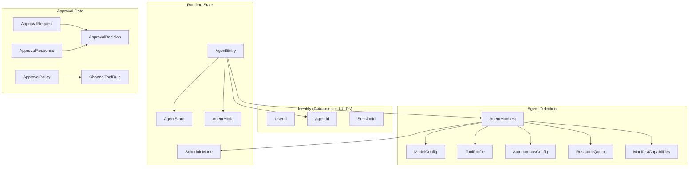
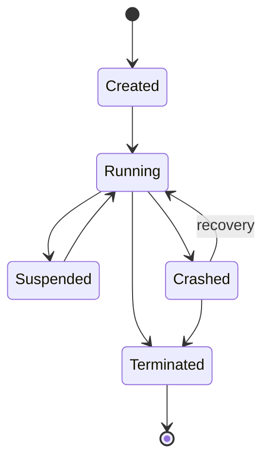

# Shared Types

# Shared Types (`librefang-types`)

The `librefang-types` crate defines the canonical data structures shared across every layer of LibreFang — the kernel, the runtime, LLM drivers, channel adapters, the dashboard, and the CLI. Because every component agrees on these types, serialized data (JSON, TOML, MessagePack) passes between processes and over the network without ad-hoc translation.

The crate has two primary concerns exposed in the files covered here:

- **Agent types** (`agent.rs`) — identity, manifests, lifecycle, scheduling, and per-agent configuration.
- **Approval types** (`approval.rs`) — the human-in-the-loop gate for dangerous tool calls.

---

## Architecture Overview



---

## Deterministic Identity

Several ID types use **UUID v5** (SHA-1 + namespace) so the same logical inputs always produce the same UUID. This is critical for:

- **Audit log continuity** across daemon restarts — a user named "Alice" always maps to the same `UserId`.
- **Session history preservation** — re-deploying an agent with the same name re-attaches to its existing sessions.
- **Debugging** — you can re-derive an ID from log entries without looking up a database.

### `UserId`

```rust
pub struct UserId(pub Uuid);
```

| Constructor | Behavior |
|---|---|
| `UserId::new()` | Random UUID v4. Changes every restart — avoid for config-sourced users. |
| `UserId::from_name(name)` | UUID v5 from `LIBREFANG_USER_NAMESPACE`. Deterministic, case-sensitive. |

The namespace constant `LIBREFANG_USER_NAMESPACE` is frozen and must never change — doing so would rotate every `UserId` in the fleet and break cross-restart audit correlation.

### `AgentId`

```rust
pub struct AgentId(pub Uuid);
```

All deterministic derivation shares a single namespace (`AgentId::NAMESPACE`) with typed string prefixes to avoid collisions:

| Constructor | Input format | Use case |
|---|---|---|
| `AgentId::new()` | Random v4 | Ephemeral agents |
| `AgentId::from_name(name)` | `"agent:{name}"` | TOML-defined single agents |
| `AgentId::from_hand_id(hand_id)` | `"{hand_id}"` (bare, backward compat) | Hand-level ID |
| `AgentId::from_hand_agent(hand_id, role, instance_id)` | `"{hand_id}:{role}"` or `"{hand_id}:{role}:{instance_id}"` | Per-role agent in multi-agent hands |

**Backward compatibility note**: `from_hand_agent` with `instance_id: None` uses the legacy format (no instance suffix) so existing single-instance hands keep their original IDs — orphaned cron jobs and memory keys are avoided.

### `SessionId`

```rust
pub struct SessionId(pub Uuid);
```

Sessions are scoped to (agent, route). Three derivation methods serve different routing needs:

| Method | Scope | Namespace |
|---|---|---|
| `SessionId::new()` | Random, one-shot | — |
| `SessionId::for_channel(agent_id, channel)` | Persistent per (agent, channel) | `CHANNEL_SESSION_NAMESPACE` |
| `SessionId::for_cron_run(agent_id, run_key)` | Isolated per cron fire | `CRON_RUN_SESSION_NAMESPACE` (disjoint from channel) |
| `SessionId::from_route_key(agent_id, channel, account, conversation)` | Multi-tenant routing | Legacy-compat or `v2:` prefix |

**Backward compatibility in `from_route_key`**: When `account` is empty, the result is identical to `for_channel` — existing sessions without an account dimension are preserved. When `account` is non-empty, a `v2:` byte prefix ensures no collision with legacy keys.

All inputs are lowercased before hashing for case-insensitive stability.

---

## Agent Manifest

`AgentManifest` is the central configuration type — the complete declaration of what an agent is, how it runs, and what it's allowed to do. It's typically loaded from `agent.toml` files or constructed programmatically by the Hand system.

### Key Field Groups

**Identity & scheduling:**

| Field | Type | Default | Purpose |
|---|---|---|---|
| `name` | `String` | `"unnamed"` | Human-readable name, used for ID derivation |
| `schedule` | `ScheduleMode` | `Reactive` | How the agent wakes up |
| `session_mode` | `SessionMode` | `Persistent` | Whether automated invocations reuse sessions |
| `enabled` | `bool` | `true` | Disabled agents are not spawned on startup |

**LLM configuration:**

| Field | Type | Purpose |
|---|---|---|
| `model` | `ModelConfig` | Primary LLM provider/model/temperature/prompt |
| `fallback_models` | `Vec<FallbackModel>` | Chain tried in order on primary failure |
| `routing` | `Option<ModelRoutingConfig>` | Auto-select cheap/mid/expensive by complexity |
| `pinned_model` | `Option<String>` | Override for Stable mode |
| `thinking` | `Option<ThinkingConfig>` | Per-agent extended thinking (overrides global) |
| `response_format` | `Option<ResponseFormat>` | Structured output mode |

**Tooling & capabilities:**

| Field | Type | Purpose |
|---|---|---|---|
| `profile` | `Option<ToolProfile>` | Named preset expanding to tool list + capabilities |
| `capabilities` | `ManifestCapabilities` | Fine-grained grants (network, shell, memory scopes) |
| `tool_allowlist` | `Vec<String>` | Only these tools available (empty = all) |
| `tool_blocklist` | `Vec<String>` | Excluded tools (applied after allowlist) |
| `tools_disabled` | `bool` | Nuclear option — disable all tools |
| `exec_policy` | `Option<ExecPolicy>` | Per-agent shell execution policy override |
| `allowed_plugins` | `Vec<String>` | Plugin allowlist (empty = all) |

**Autonomous & heartbeat:**

| Field | Type | Purpose |
|---|---|---|
| `autonomous` | `Option<AutonomousConfig>` | Guardrails for 24/7 agents |
| `max_concurrent_invocations` | `Option<u32>` | Trigger-dispatch concurrency cap |
| `max_history_messages` | `Option<usize>` | Per-agent history trim override |

**Workspaces:**

| Field | Type | Purpose |
|---|---|---|
| `workspace` | `Option<PathBuf>` | Private workspace, auto-created on spawn |
| `workspaces` | `HashMap<String, WorkspaceDecl>` | Named shared workspaces |
| `generate_identity_files` | `bool` | Whether to create `SOUL.md`, `USER.md`, etc. |

**Behavior flags:**

| Field | Default | Purpose |
|---|---|---|
| `inherit_parent_context` | `true` | Subagents receive parent workflow context |
| `show_progress` | `true` | Surface `🔧 tool_name` progress in channel replies |
| `auto_evolve` | `true` | Run skill evolution review after each turn |
| `auto_dream_enabled` | `false` | Participate in background memory consolidation |
| `cache_context` | `false` | Read `context.md` once vs. before every turn |
| `web_search_augmentation` | `Auto` | Inject web search results for non-tool models |

### ModelConfig

```rust
pub struct ModelConfig {
    pub provider: String,
    pub model: String,          // aliases: "name" in TOML
    pub max_tokens: u32,
    pub temperature: f32,
    pub system_prompt: String,
    pub api_key_env: Option<String>,
    pub base_url: Option<String>,
    pub context_window: Option<u64>,
    pub max_output_tokens: Option<u64>,
    pub extra_params: HashMap<String, serde_json::Value>,  // flattened into API body
}
```

The `extra_params` field uses `#[serde(flatten)]` to merge provider-specific keys directly into the API request body. For example, Qwen's `enable_memory` parameter. Conflicting keys in `extra_params` take precedence over standard fields.

### ScheduleMode

| Variant | Behavior |
|---|---|
| `Reactive` | Wakes on incoming messages/events (default) |
| `Periodic { cron }` | Wakes on a cron schedule |
| `Proactive { conditions }` | Wakes when monitored conditions are met |
| `Continuous { check_interval_secs }` | Persistent loop, default 300s |

### ToolProfile

Named presets that expand to tool lists and derive `ManifestCapabilities`:

| Profile | Tools included |
|---|---|
| `Minimal` | `file_read`, `file_list` |
| `Coding` | `file_read`, `file_write`, `file_list`, `shell_exec`, `web_fetch` |
| `Research` | `web_fetch`, `web_search`, `file_read`, `file_write` |
| `Messaging` | `agent_send`, `agent_list`, `channel_send`, `memory_store`, `memory_list`, `memory_recall` |
| `Automation` | All of the above combined |
| `Full` / `Custom` | `["*"]` (all tools) |

The `implied_capabilities()` method derives network, shell, agent, and memory permissions from the tool list.

### WorkspaceDecl

Shared workspace declarations support two mutually exclusive modes:

- **`path`** — relative to `workspaces_dir`, auto-created by the kernel.
- **`mount`** — absolute host path (e.g. an Obsidian vault), must be whitelisted in `config.toml: allowed_mount_roots`.

Both support `ReadWrite` or `ReadOnly` modes. Multiple agents sharing the same path don't collide on identity files because those live in the agent's private `.identity/` directory.

---

## Agent Entry (Runtime State)

`AgentEntry` is the kernel's runtime representation of a live agent — everything the system needs to track beyond the static manifest:

```rust
pub struct AgentEntry {
    pub id: AgentId,
    pub name: String,
    pub manifest: AgentManifest,
    pub state: AgentState,
    pub mode: AgentMode,
    pub session_id: SessionId,
    pub parent: Option<AgentId>,
    pub children: Vec<AgentId>,
    pub identity: AgentIdentity,
    pub force_session_wipe: bool,
    pub resume_pending: bool,
    pub has_processed_message: bool,
    // ... timestamps, tags, flags
}
```

### AgentState (Lifecycle)



### AgentMode (Permission Level)

| Mode | Effect |
|---|---|
| `Observe` | No tools at all — agent can only reason |
| `Assist` | Read-only tools only (`file_read`, `file_list`, `memory_list`, `memory_recall`, `web_fetch`, `web_search`, `agent_list`) |
| `Full` | All granted tools (default) |

`AgentMode::filter_tools()` enforces these restrictions on a `Vec<ToolDefinition>` at dispatch time.

### Session Reset Flags

`AgentEntry` carries two session-reset flags that are critical for crash recovery:

- **`force_session_wipe`** — next LLM call clears message history but keeps the `session_id`. Set by operator action or stuck-loop recovery. Takes priority over `resume_pending`.
- **`resume_pending`** — agent was interrupted by restart/shutdown; recovery is expected on the same transcript. Cleared after the next successful turn.

The **`has_processed_message`** flag distinguishes agents that have genuinely processed at least one message from agents that were spawned but never received work. The heartbeat monitor uses this to avoid pushing never-used agents into a crash-recover loop.

---

## Approval System

When an agent attempts a dangerous operation, the kernel creates an `ApprovalRequest`, pauses the agent, and waits for a human operator to respond with an `ApprovalResponse`. The `ApprovalPolicy` controls which tools are gated, timeouts, TOTP requirements, and notification routing.

### ApprovalPolicy

```rust
pub struct ApprovalPolicy {
    pub require_approval: Vec<String>,     // tool names / globs
    pub timeout_secs: u64,                 // 10..=300
    pub auto_approve_autonomous: bool,
    pub auto_approve: bool,                // shorthand: clears require list
    pub trusted_senders: Vec<String>,      // bypass approval gate
    pub channel_rules: Vec<ChannelToolRule>,
    pub timeout_fallback: TimeoutFallback,
    pub routing: Vec<ApprovalRoutingRule>,
    pub second_factor: SecondFactor,
    pub totp_tools: Vec<String>,           // glob patterns
    pub totp_grace_period_secs: u64,
    // ...
}
```

**Default gated tools**: `shell_exec`, `file_write`, `file_delete`, `apply_patch`, `skill_evolve_*`.

The `require_approval` field accepts either a list of tool names/globs or a boolean shorthand:
- `require_approval = false` → no tools gated
- `require_approval = true` → the default mutation set

### ApprovalDecision

```rust
pub enum ApprovalDecision {
    Approved,
    Denied,
    TimedOut,
    ModifyAndRetry { feedback: String },
    Skipped,
}
```

Custom serialization: simple variants become plain strings (`"approved"`), while `ModifyAndRetry` becomes `{"type": "modify_and_retry", "feedback": "..."}`. This allows operators to request the agent modify its approach and retry with human feedback.

### TimeoutFallback

| Variant | Behavior |
|---|---|
| `Deny` | Default — auto-deny on timeout |
| `Skip` | Skip the tool, agent continues without it |
| `Escalate { extra_timeout_secs }` | Re-notify with extended timeout |

### Channel-Level Rules

`ChannelToolRule` provides per-channel tool authorization. Rules are evaluated in order; deny always wins over allow:

```toml
[[approval.channel_rules]]
channel = "telegram"
allowed_tools = ["file_read", "web_search"]
denied_tools = ["shell_exec"]
```

Wildcard patterns are supported — `file_*` matches `file_read`, `file_write`, etc.

### Second Factor (TOTP)

`SecondFactor` controls where TOTP verification is enforced:

| Variant | Login | Approvals |
|---|---|---|
| `None` | ✗ | ✗ |
| `Totp` | ✗ | ✓ |
| `Login` | ✓ | ✗ |
| `Both` | ✓ | ✓ |

`totp_tools` scopes TOTP to specific tool patterns. When empty, all tools in `require_approval` need TOTP. The `totp_grace_period_secs` (max 3600) lets operators skip re-verification for repeated approvals within a time window.

### Notification Routing

`ApprovalRoutingRule` maps tool patterns to notification targets:

```rust
pub struct ApprovalRoutingRule {
    pub tool_pattern: String,           // e.g. "shell_*"
    pub route_to: Vec<NotificationTarget>,
}
```

`NotificationTarget` specifies a channel type (telegram, slack, email), recipient, and optional thread/topic ID.

### Validation

Both `ApprovalRequest` and `ApprovalPolicy` implement `validate()` methods that enforce length limits, character restrictions, and range checks. Tool names accept alphanumeric characters, underscores, and a single `*` wildcard. All validation is defensive — the kernel calls these before persisting or dispatching.

---

## Serialization Notes

### Lenient Deserialization

Many collection fields use custom deserializers from `crate::serde_compat` (e.g., `vec_lenient`, `map_lenient`) that coerce `null` and malformed values into empty collections rather than failing. This makes hot-reload robust to partial TOML updates.

### Default Booleans

Fields like `generate_identity_files`, `enabled`, `show_progress`, `auto_evolve`, and `inherit_parent_context` use `default_true()` — they opt out via explicit `false` rather than opting in. This matches the principle of least surprise for new agents.

### Stable Prefix Mode

The constant `STABLE_PREFIX_MODE_METADATA_KEY` (`"stable_prefix_mode"`) is a metadata key used to flag agents running in deterministic-prefix mode. Checked in the kernel's agent-loop routing logic.