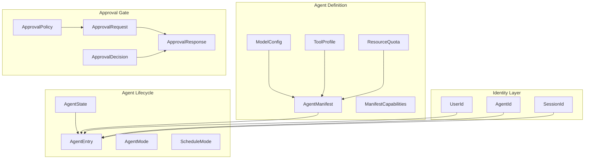

# Shared Types

# Shared Types (`librefang-types`)

Core data structures shared across the LibreFang agent OS — kernel, runtime, API layer, and channel adapters all depend on this crate. Every fundamental type that crosses a process boundary or is persisted to disk lives here.

## Architecture



## Deterministic Identity

A core design principle: identities must survive daemon restarts. Random UUIDs would change on every boot, breaking audit-log correlation and session continuity. Instead, the crate uses **UUID v5** (SHA-1 name-based) derivation so the same logical input always produces the same identifier.

### `UserId`

```rust
UserId::from_name("Alice")  // → deterministic UUID v5
UserId::new()               // → random UUID v4 (avoid for config-sourced users)
```

Derived from `LIBREFANG_USER_NAMESPACE` — a frozen constant. **Changing this namespace breaks every existing user identity across the fleet.** Use `from_name` for all users that originate from configuration files; the random constructor exists only for transient/anonymous contexts.

### `AgentId`

Three derivation paths, all using a single namespace with typed prefixes to avoid collisions:

| Method | Input format | Use case |
|---|---|---|
| `from_name(name)` | `"agent:{name}"` | Top-level named agents |
| `from_hand_id(hand_id)` | `"{hand_id}"` (bare, backward compat) | Multi-agent hand instances |
| `from_hand_agent(hand_id, role, instance_id)` | `"{hand_id}:{role}"` or `"{hand_id}:{role}:{instance_id}"` | Specific role within a hand |

The `instance_id` parameter controls backward compatibility: `None` preserves the legacy single-instance hash format; `Some(uuid)` produces unique IDs per hand instance.

### `SessionId`

Three derivation strategies with disjoint UUID namespaces to prevent collisions:

```rust
// Persistent channel session — same (agent, channel) always → same session
SessionId::for_channel(agent_id, "telegram")

// Isolated per-fire cron session — each cron run gets its own session
SessionId::for_cron_run(agent_id, "job-uuid:2026-04-25T10:00:00Z")

// Structured routing key with optional account dimension
SessionId::from_route_key(agent_id, "telegram", "alice", "conv-123")
```

**Backward compatibility in `from_route_key`:** when `account` is empty, the result is identical to `for_channel` — existing sessions that never carried an account dimension are preserved. When `account` is non-empty, a `v2:` prefix is mixed into the hash space to avoid collisions with legacy keys.

The cron-run namespace is intentionally disjoint from the channel namespace, so a `for_cron_run(agent, "cron")` ID never collides with `for_channel(agent, "cron")`.

## Agent Manifest (`AgentManifest`)

The complete declarative specification of an agent — what it can do, how it runs, and where its limits are. Parsed from `agent.toml` files or constructed programmatically.

### Key Fields by Category

**Identity & Metadata**
- `name`, `version`, `description`, `author`, `tags` — human-readable identification
- `enabled` — disabled agents are not spawned on startup
- `is_hand` — marks agents spawned by a Hand workflow

**Model Configuration**
- `model` — primary LLM config (`ModelConfig` with provider, model name, temperature, system prompt, context window overrides, and provider-specific `extra_params`)
- `fallback_models` — ordered chain of `FallbackModel` entries tried on primary failure
- `routing` — optional `ModelRoutingConfig` for auto-selecting models by query complexity
- `pinned_model` — freeze model selection (Stable mode)
- `response_format` — structured output constraint
- `thinking` — per-agent extended thinking budget override

**Scheduling & Sessions**
- `schedule` — `Reactive` (event-driven, default), `Periodic { cron }`, `Proactive { conditions }`, or `Continuous { check_interval_secs }`
- `session_mode` — `Persistent` (reuse session) or `New` (fresh session per invocation)
- `max_concurrent_invocations` — cap on parallel trigger-dispatch fires (requires `session_mode = "new"` for caps > 1)
- `max_history_messages` — per-agent override on message-history trim cap

**Capabilities & Tools**
- `capabilities` — `ManifestCapabilities` granting network, shell, memory, agent-spawn, and OFP permissions
- `profile` — named `ToolProfile` (`Minimal`, `Coding`, `Research`, `Messaging`, `Automation`, `Full`, `Custom`) that expands to a tool list and derives capabilities
- `tool_allowlist` / `tool_blocklist` — fine-grained tool filtering applied after profile expansion
- `tools_disabled` — nuclear option to disable all tools
- `exec_policy` — per-agent shell execution policy override

**Workspaces**
- `workspace` — private agent directory (auto-created on spawn)
- `workspaces` — map of named `WorkspaceDecl` entries for shared directories
- `generate_identity_files` — whether to create `SOUL.md`, `USER.md`, etc.

**Resource Limits** (`ResourceQuota`)
- `max_memory_bytes` (256 MB default), `max_cpu_time_ms` (30s default)
- `max_tool_calls_per_minute` (60), `max_llm_tokens_per_hour` (inherits global default)
- `max_cost_per_hour_usd`, `max_cost_per_day_usd`, `max_cost_per_month_usd` — cost controls (0.0 = unlimited)

**Autonomous Operation** (`AutonomousConfig`)
- `max_iterations` — LLM loop cap per invocation (default: 50)
- `max_restarts` — crash recovery limit
- `heartbeat_interval_secs`, `heartbeat_timeout_secs` — liveness monitoring
- `quiet_hours` — cron expression for downtime windows

**Advanced Features**
- `auto_dream_enabled`, `auto_dream_min_hours`, `auto_dream_min_sessions` — background memory consolidation
- `auto_evolve` — post-turn skill evolution review
- `web_search_augmentation` — automatic web search injection for non-tool-calling models (`Off`, `Auto`, `Always`)
- `show_progress` — surface tool execution markers in channel replies
- `cache_context` — read `context.md` once vs. every turn

### `ModelConfig` Notes

The `model` field accepts both `model` and `name` as TOML keys (via `#[serde(alias = "name")]`) for backward compatibility. Provider-specific parameters go in `extra_params`, which is flattened into the API request body:

```toml
[model]
provider = "qwen"
model = "qwen3.6"
enable_memory = true           # → extra_params
memory_max_window = 50         # → extra_params
```

### `ToolProfile` Expansion

Each profile expands to a concrete tool list and derives implied capabilities:

| Profile | Tools | Network | Shell | Agent Spawn |
|---|---|---|---|---|
| `Minimal` | `file_read`, `file_list` | ✗ | ✗ | ✗ |
| `Coding` | `file_read/write`, `file_list`, `shell_exec`, `web_fetch` | ✓ | ✓ | ✗ |
| `Research` | `web_fetch`, `web_search`, `file_read/write` | ✓ | ✗ | ✗ |
| `Messaging` | `agent_send/list`, `channel_send`, `memory_*` | ✗ | ✗ | ✓ |
| `Automation` | All of Coding + Messaging | ✓ | ✓ | ✓ |
| `Full` / `Custom` | `["*"]` (all tools) | ✓ | ✓ | ✓ |

### Workspace Declarations (`WorkspaceDecl`)

Two mutually exclusive modes (enforced at kernel boot, not schema level, to allow dashboard hot-reload editing):

- **`path`** — relative to `workspaces_dir`, kernel creates if missing
- **`mount`** — absolute host path, must be whitelisted in `config.toml: allowed_mount_roots`

Both support `mode` = `ReadWrite` (default) or `ReadOnly`.

## Agent Entry (`AgentEntry`)

Runtime snapshot of a registered agent — combines the manifest with lifecycle state:

- `state` — `Created`, `Running`, `Suspended`, `Terminated`, `Crashed`
- `mode` — `Observe` (no tools), `Assist` (read-only tools only), `Full` (all granted tools)
- `session_id` — currently active session
- `force_session_wipe` — next invocation clears message history (operator action or stuck-loop recovery)
- `resume_pending` — agent interrupted by restart, continues on same transcript
- `has_processed_message` — sticky flag set on first real inbound message; prevents heartbeat monitor from flagging never-worked agents as unresponsive

`AgentMode::filter_tools()` enforces the permission boundary at runtime:
- `Observe` → empty list
- `Assist` → only `file_read`, `file_list`, `memory_list`, `memory_recall`, `web_fetch`, `web_search`, `agent_list`
- `Full` → all tools pass through

## Approval System

Controls human-in-the-loop gating for dangerous agent operations.

### Flow

1. Agent attempts a tool call (e.g., `shell_exec`)
2. Kernel checks `ApprovalPolicy.require_approval` — if matched, creates an `ApprovalRequest` and pauses the agent
3. Request routes to notification targets (configurable per tool pattern, per channel)
4. Human operator responds with an `ApprovalResponse` containing an `ApprovalDecision`
5. If `Approved`, the tool executes. If `Denied`/`TimedOut`/`Skipped`, the tool is not executed.

### `ApprovalDecision`

```
Approved           → proceed
Denied             → block
TimedOut           → auto-denied after timeout
Skipped            → skip tool, agent continues
ModifyAndRetry     → agent retries with human feedback
```

Custom serialization: simple variants are plain strings; `ModifyAndRetry` is `{"type": "modify_and_retry", "feedback": "..."}`.

### `ApprovalPolicy`

Key configuration:

| Field | Default | Purpose |
|---|---|---|
| `require_approval` | `["shell_exec", "file_write", "file_delete", "apply_patch", "skill_evolve_*"]` | Tools requiring human approval |
| `timeout_secs` | 60 | Auto-deny window (10–300 range) |
| `auto_approve` | `false` | Shorthand: clears require list |
| `timeout_fallback` | `Deny` | Behavior on timeout: `Deny`, `Skip`, or `Escalate` |
| `trusted_senders` | `[]` | User IDs that bypass approval |
| `channel_rules` | `[]` | Per-channel allow/deny tool lists |
| `second_factor` | `None` | TOTP enforcement scope |
| `totp_tools` | `[]` | Tools requiring TOTP (empty = all approved tools) |
| `audit_retention_days` | 90 | Approval audit log pruning |

The `require_approval` field accepts both a string list and a boolean shorthand in TOML:

```toml
require_approval = false          # → empty list (no tools gated)
require_approval = true           # → default mutation set
require_approval = ["shell_exec"] # → explicit list
```

### `ChannelToolRule`

Per-channel tool authorization with deny-wins semantics:

```toml
[[channel_rules]]
channel = "telegram"
allowed_tools = ["file_read", "web_search"]
denied_tools = ["shell_exec"]
```

Tool names support glob patterns (`"file_*"`, `"*_read"`, `"*"`). `denied_tools` takes precedence over `allowed_tools`.

### `TimeoutFallback`

- `Deny` — reject on timeout (default)
- `Skip` — skip the tool, agent continues without it
- `Escalate { extra_timeout_secs }` — extend timeout and re-notify (up to 3 escalation cycles)

### Second Factor (`SecondFactor`)

| Value | Login TOTP | Approval TOTP |
|---|---|---|
| `None` | ✗ | ✗ |
| `Totp` | ✗ | ✓ |
| `Login` | ✓ | ✗ |
| `Both` | ✓ | ✓ |

A grace period (`totp_grace_period_secs`, default 300s, max 3600s) allows subsequent approvals within the window to skip TOTP re-verification.

### Notification Routing

`ApprovalRoutingRule` maps tool patterns to specific notification targets:

```toml
[[routing]]
tool_pattern = "shell_*"
route_to = [{ channel_type = "telegram", recipient = "-1001234567890" }]
```

`AgentNotificationRule` provides per-agent-name-pattern overrides with event type filtering.

### Validation

Both `ApprovalRequest` and `ApprovalPolicy` expose `validate()` methods that enforce length limits, character constraints, and range bounds. Call these at deserialization boundaries to reject malformed input early.

## Serialization Compatibility

The crate uses several custom serde helpers from `crate::serde_compat`:

- `vec_lenient` — accepts both arrays and missing fields (defaults to empty vec)
- `map_lenient` — same for maps
- `exec_policy_lenient` — accepts string shorthand or full table for exec policy

All enum variants use `#[serde(rename_all = "snake_case")]` for consistent wire format.

## Constants That Must Never Change

| Constant | Location | Reason |
|---|---|---|
| `LIBREFANG_USER_NAMESPACE` | `agent.rs` | Rotates every `UserId`, breaks audit correlation |
| `AgentId::NAMESPACE` | `agent.rs` | Rotates every `AgentId`, breaks session/cron associations |
| `CHANNEL_SESSION_NAMESPACE` | `agent.rs` | Rotates channel session IDs |
| `CRON_RUN_SESSION_NAMESPACE` | `agent.rs` | Rotates per-fire cron session IDs |