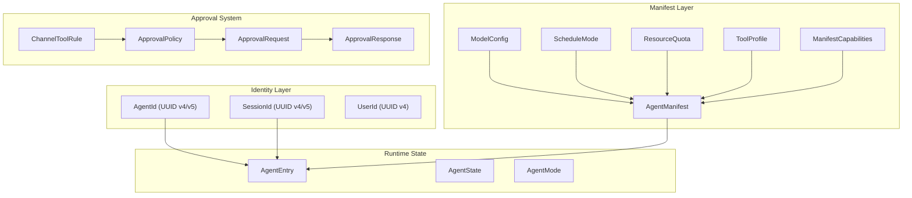

# Shared Types

# Shared Types (`librefang-types`)

The `librefang-types` crate defines the canonical data structures shared across the LibreFang agent OS. Every other crate — the kernel, runtime, channels, API server, memory store, and skills engine — depends on these types. They are serialization-stable (TOML + JSON via Serde) and must never pull in async runtimes or heavy dependencies.

## Architecture



---

## Identifiers

All identifiers are newtype wrappers around `uuid::Uuid`, providing type safety at compile time and consistent serialization.

### `AgentId`

The primary identifier for an agent instance. Supports two generation modes:

- **Random** (`AgentId::new()`) — UUID v4 for unique runtime instances.
- **Deterministic** — UUID v5 (SHA-1) derived from a fixed namespace, guaranteeing the same input always produces the same ID across daemon restarts. This preserves session history associations and prevents orphaned cron jobs.

Three deterministic constructors exist:

| Method | Input Format | Use Case |
|---|---|---|
| `from_name(name)` | `"agent:{name}"` | Named agents with stable identity |
| `from_hand_id(hand_id)` | Bare `hand_id` (backward compat) | Multi-agent hand instances |
| `from_hand_agent(hand_id, role, instance_id)` | `"{hand_id}:{role}"` or `"{hand_id}:{role}:{instance_id}"` | Specific role within a hand |

**Backward compatibility note:** `from_hand_agent` with `instance_id: None` uses the legacy format `"{hand_id}:{role}"` (no instance component). Only when `instance_id` is `Some(uuid)` does the three-part format activate. This ensures existing single-instance hands retain their original agent IDs.

### `SessionId`

Identifies a conversation session. Like `AgentId`, supports both random and deterministic generation:

- `SessionId::new()` — random UUID v4.
- `SessionId::for_channel(agent_id, channel)` — deterministic UUID v5 derived from the agent ID and lowercase channel name. The same `(agent, channel)` pair always maps to the same session, even across restarts.

The channel session namespace UUID is a fixed, randomly-generated constant (not an RFC 4122 well-known namespace) to avoid collisions with other UUID v5 consumers.

### `UserId`

Simple random UUID v4 wrapper with no deterministic derivation. Used for tracking which human initiated a request.

---

## Agent Manifest (`AgentManifest`)

The manifest is the complete declarative definition of an agent — everything the kernel needs to spawn and run it. It is typically loaded from a TOML file on disk but can also be constructed programmatically.

### Key Fields

**Identity & Discovery:**
- `name`, `version`, `description`, `author`, `tags` — human-readable metadata for catalog and dashboard display.
- `enabled` — when `false`, the agent is not spawned on startup. Default: `true`.
- `is_hand` — set by the kernel when the agent is spawned by a Hand. Persisted so it survives restarts without tag-based detection.

**Execution Model:**
- `module` — path to the agent module (`"builtin:chat"`, a `.wasm` file, or a Python file).
- `schedule` — `ScheduleMode` controlling when the agent wakes up:
  - `Reactive` (default) — on incoming messages/events.
  - `Periodic { cron }` — on a cron schedule.
  - `Proactive { conditions }` — when monitored conditions are met.
  - `Continuous { check_interval_secs }` — persistent loop (default interval: 300s).
- `session_mode` — `SessionMode` for automated (non-channel) invocations:
  - `Persistent` (default) — reuse the agent's session across invocations.
  - `New` — fresh session each time.
- `priority` — `Priority` level (`Low`, `Normal`, `High`, `Critical`) for scheduler ordering.

**Model Configuration:**
- `model` — primary `ModelConfig` (provider, model name, temperature, system prompt, etc.).
- `fallback_models` — ordered list of `FallbackModel` entries tried if the primary model fails.
- `routing` — optional `ModelRoutingConfig` for complexity-based auto-selection between cheap/mid/expensive models.
- `pinned_model` — model override used in Stable mode.
- `response_format` — optional structured output format for the LLM.
- `thinking` — per-agent extended thinking configuration (overrides global `[thinking]` config).
- `web_search_augmentation` — `WebSearchAugmentationMode` for models without tool support:
  - `Off` — disabled.
  - `Auto` (default) — augment only when model reports `supports_tools == false`.
  - `Always` — search before every LLM call.

**ModelConfig specifics:**
- `model` field accepts `#[serde(alias = "name")]` so TOML configs can use either `model = "..."` or `name = "..."`.
- `extra_params` is a `HashMap<String, serde_json::Value>` with `#[serde(flatten)]`, merging provider-specific parameters (e.g., Qwen's `enable_memory`) directly into the API request body. Conflicting keys override standard fields.
- `system_prompt` supports TOML multi-line basic strings (`"""`) for complex prompts with newlines, quotes, and code blocks.

**Tool Configuration:**
- `profile` — optional `ToolProfile` that expands to a tool list and derived capabilities:
  - `Minimal` — `file_read`, `file_list`
  - `Coding` — adds `file_write`, `shell_exec`, `web_fetch`
  - `Research` — `web_fetch`, `web_search`, `file_read`, `file_write`
  - `Messaging` — `agent_send`, `agent_list`, `channel_send`, memory tools
  - `Automation` — full set of 12 tools
  - `Full` / `Custom` — `"*"` (all tools)
- `tool_allowlist` — only these tools are available (empty = all).
- `tool_blocklist` — these tools are excluded (applied after allowlist).
- `tools_disabled` — hard override that disables all tools regardless of other settings.
- `tools` — `HashMap<String, ToolConfig>` for per-tool configuration parameters.

**Capability Grants (`ManifestCapabilities`):**
- `network` — allowed hosts (e.g., `["api.anthropic.com:443"]`).
- `shell` — allowed shell commands.
- `memory_read` / `memory_write` — memory scopes.
- `agent_spawn` — whether the agent can create sub-agents.
- `agent_message` — agent messaging patterns.
- `ofp_discover` / `ofp_connect` — Open Federation Protocol capabilities.

**Resource Limits (`ResourceQuota`):**
| Field | Default | Description |
|---|---|---|
| `max_memory_bytes` | 256 MB | WASM memory limit |
| `max_cpu_time_ms` | 30,000 (30s) | CPU time per invocation |
| `max_tool_calls_per_minute` | 60 | Tool call rate limit |
| `max_llm_tokens_per_hour` | `None` (inherit global) | Token budget; `Some(0)` = unlimited |
| `max_network_bytes_per_hour` | 100 MB | Network I/O limit |
| `max_cost_per_hour_usd` | 0.0 (unlimited) | Hourly cost cap |
| `max_cost_per_day_usd` | 0.0 (unlimited) | Daily cost cap |
| `max_cost_per_month_usd` | 0.0 (unlimited) | Monthly cost cap |

Use `effective_token_limit()` to resolve `max_llm_tokens_per_hour`: both `None` and `Some(0)` yield `0` (unlimited), `Some(n)` yields `n`. Enforcement code should skip when the result is `0`.

**Autonomous Configuration (`AutonomousConfig`):**
For 24/7 agents that run without human supervision:
- `quiet_hours` — cron expression for downtime periods.
- `max_iterations` — per-invocation loop cap (default: 50).
- `max_restarts` — crash recovery limit before permanent stop (default: 10).
- `heartbeat_interval_secs` — health check interval (default: 30s).
- `heartbeat_timeout_secs` — override for unresponsive detection (default: `heartbeat_interval_secs * 2`).
- `heartbeat_keep_recent` — how many heartbeat `NO_REPLY` messages to keep during context pruning.
- `heartbeat_channel` — where to send heartbeat status (e.g., `"telegram"`).

**Behavioral Controls:**
- `show_progress` — surface `🔧 tool_name` progress markers in channel replies (default: `true`). Set `false` for agents whose output feeds downstream parsers.
- `auto_evolve` — run background skill evolution review after each turn (default: `true`). Set `false` for latency-sensitive A2A workers.
- `auto_dream_enabled` — opt-in to background memory consolidation (costs tokens).
- `auto_dream_min_hours` / `auto_dream_min_sessions` — per-agent overrides for consolidation time/session gates.
- `inherit_parent_context` — whether subagents receive parent workflow context (default: `true`).

---

## Runtime State

### `AgentEntry`

The kernel's registry record for a live agent. Wraps the manifest with runtime state:

- `state` — `AgentState` lifecycle: `Created` → `Running` → (`Suspended` | `Crashed` | `Terminated`).
- `mode` — `AgentMode` permission level:
  - `Observe` — no tool calls allowed.
  - `Assist` — read-only tools only (`file_read`, `file_list`, `memory_list`, `memory_recall`, `web_fetch`, `web_search`, `agent_list`).
  - `Full` (default) — all granted tools.
- `session_id` — active session.
- `parent` / `children` — agent hierarchy for spawned sub-agents.
- `identity` — `AgentIdentity` (emoji, avatar, color, archetype, vibe, greeting_style).
- `onboarding_completed` / `onboarding_completed_at` — bootstrap state tracking.
- `force_session_wipe` — when `true`, the next LLM execution clears message history but preserves the `session_id`. Takes priority over `resume_pending`.
- `resume_pending` — agent was interrupted by restart/shutdown; recovery expected on same transcript.
- `reset_reason` — why the most recent automatic session reset occurred.

### `AgentMode::filter_tools`

Applies permission filtering to a `Vec<ToolDefinition>`:
- `Observe` returns an empty vector.
- `Assist` filters to the hardcoded read-only set.
- `Full` passes through unchanged.

---

## Approval System

The approval system gates dangerous agent operations behind human review. When an agent attempts a restricted tool, the kernel creates an `ApprovalRequest`, pauses the agent, and waits for an `ApprovalResponse`.

### `ApprovalPolicy`

Configures which tools require approval and how the flow behaves:

| Field | Default | Purpose |
|---|---|---|
| `require_approval` | `["shell_exec", "file_write", "file_delete", "apply_patch", "skill_evolve_*"]` | Tools requiring human approval. Supports glob patterns. |
| `timeout_secs` | 60 | Auto-deny window (range: 10–300). |
| `timeout_fallback` | `Deny` | Behavior on timeout: `Deny`, `Skip`, or `Escalate`. |
| `auto_approve` | `false` | Shorthand: if `true`, clears the require list entirely. |
| `auto_approve_autonomous` | `false` | Auto-approve for agents in autonomous mode. |
| `trusted_senders` | `[]` | User IDs that bypass approval entirely. |
| `channel_rules` | `[]` | Per-channel tool authorization rules. |
| `routing` | `[]` | Route approval requests to specific notification targets. |
| `second_factor` | `None` | TOTP verification: `None`, `Totp`, `Login`, or `Both`. |
| `totp_tools` | `[]` | Tools requiring TOTP (empty = all in `require_approval`). |

**Serialization quirk:** `require_approval` accepts either a list of strings or a boolean via custom deserialization. `false` → empty list, `true` → default mutation set. This supports the TOML shorthand `require_approval = false`.

### `ApprovalDecision`

Custom serde implementation handles backward compatibility:
- Simple variants (`Approved`, `Denied`, `TimedOut`, `Skipped`) serialize as plain strings: `"approved"`, `"denied"`, etc.
- `ModifyAndRetry { feedback }` serializes as an object: `{"type": "modify_and_retry", "feedback": "..."}`.

Both the string form and object form are accepted on deserialization.

### `ChannelToolRule`

Per-channel allow/deny lists with wildcard support:

```
ChannelToolRule {
    channel: "telegram",
    allowed_tools: ["file_read", "file_*"],
    denied_tools: ["shell_exec"],
}
```

Evaluation order: **deny wins**. If a tool matches any denied pattern, it is always blocked regardless of the allow list. The `check_tool()` method uses `glob_matches` for pattern matching (single `*` wildcard supported).

### `SecondFactor`

Controls TOTP enforcement scope:
- `None` — no second factor (default).
- `Totp` — TOTP required for tool approvals only.
- `Login` — TOTP required for dashboard login only.
- `Both` — TOTP required for approvals and login.

Helper methods `requires_login_totp()` and `requires_approval_totp()` simplify conditional checks. A configurable grace period (`totp_grace_period_secs`, default 300s, max 3600s) allows subsequent approvals to skip TOTP re-verification within the window.

### `ApprovalRequest` Validation

Requests are validated before processing with strict bounds:

| Field | Constraint |
|---|---|
| `tool_name` | 1–64 chars, alphanumeric + underscore only |
| `description` | ≤ 1024 chars |
| `action_summary` | ≤ 512 chars |
| `timeout_secs` | 10–300 range |

Tool names in policy lists also accept `*` wildcards (at most one per name) for glob matching.

---

## A/B Experiment Types

The manifest module includes types for prompt experimentation:

- `PromptVersion` — a stored system prompt version with content hash, tool list, and activation state.
- `PromptExperiment` — an A/B test with traffic split percentages, success criteria, and variant list.
- `ExperimentVariant` — a named variant pointing to a specific prompt version.
- `SuccessCriteria` — pass/fail rules (`require_user_helpful`, `require_no_tool_errors`, `require_non_empty`, optional `custom_min_score`).
- `ExperimentStatus` — lifecycle: `Draft` → `Running` → (`Paused` | `Completed`).
- `ExperimentVariantMetrics` — aggregated results per variant (success rate, latency, cost).

---

## Session Labels (`SessionLabel`)

Validated string wrapper for human-readable session names (e.g., "support inbox", "research"). Rules:
- 1–128 characters after trimming.
- Only alphanumeric, spaces, hyphens, and underscores.
- Constructed via `SessionLabel::new(label)` which returns `Result<Self, LibreFangError>`.

---

## Hook Events (`HookEvent`)

Interceptable lifecycle events for agent extensions:

| Event | When it fires |
|---|---|
| `BeforeToolCall` | Before a tool executes; handler can block the call |
| `AfterToolCall` | After a tool completes |
| `BeforePromptBuild` | Before the system prompt is constructed |
| `AgentLoopEnd` | After the agent loop finishes a turn |

---

## Constants

- `STABLE_PREFIX_MODE_METADATA_KEY` — metadata key `"stable_prefix_mode"` used in the manifest's metadata map.
- `VERSION` (from crate root) — default manifest version string.

---

## Integration Points

The types in this crate are consumed by:

- **Kernel** — spawns agents from `AgentManifest`, tracks them as `AgentEntry` records, enforces `ResourceQuota` and `AgentMode` filtering.
- **API server** — exposes CRUD endpoints for manifests, serves `AgentEntry` data to the dashboard, processes `ApprovalRequest`/`ApprovalResponse` flows.
- **Runtime (WASM)** — uses `ManifestCapabilities` for capability checks via `check_capability`, serializes `ToolDefinition` for the WASM boundary.
- **Channel adapters** — receive `AgentIdentity` for visual branding, use `SessionId::for_channel` for session isolation per channel.
- **Memory store** — uses `SessionId` and `AgentId` as keys for session and memory operations.
- **Skills engine** — reads `skills` and `skills_disabled` from manifests, calls `ToolProfile::implied_capabilities()` for permission derivation.
- **MCP runtime** — uses `ApprovalPolicy` for gating tool calls, `ChannelToolRule` for per-channel restrictions.
- **Dashboard** — renders `AgentIdentity` (emoji, color, avatar), displays `AgentState` lifecycle badges, manages `PromptExperiment` A/B tests.
- **Taint checker** — uses capability types and tool definitions for security analysis at sinks.
- **Migration tools** — deserialize manifests from OpenClaw/OpenFang formats into the standard `AgentManifest` structure.